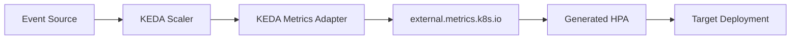

# Azure Kubernetes Service Deep Dive (6/6): KEDA 내부 — ScaledObject가 HPA를 만드는 방식

이벤트 기반 스케일링을 처음 접하면 KEDA가 HPA를 완전히 대체하는 또 하나의 autoscaler처럼 보이기 쉽습니다.
하지만 내부 구조를 따라가 보면 더 정확한 그림이 나옵니다.
KEDA는 HPA를 없애는 대신 그 위에 올라타 external metric 경로를 채우고, 특히 `0 ↔ 1` 경계에서만 직접 replica를 다루는 쪽에 가깝습니다.

이 차이를 이해하지 못하면 KEDA를 과장해서 보게 됩니다.
어떤 팀은 KEDA가 “HPA 없이도 다 알아서 하는 시스템”이라고 생각하고, 어떤 팀은 반대로 “결국 HPA니까 볼 게 없다”고 여깁니다.
둘 다 반쯤만 맞습니다.
KEDA의 진짜 가치는 event source를 HPA가 읽을 수 있는 구조로 연결하고, scale-to-zero 경계를 별도 책임으로 가져간다는 데 있습니다.

이 글은 Azure AKS Deep Dive 시리즈의 마지막 글입니다.

이번 글의 목적은 ScaledObject가 generated HPA로 이어지는 경로, metrics adapter가 들어가는 위치, 그리고 KEDA가 왜 `0 ↔ 1` 경계를 직접 맡는지 구조적으로 설명하는 것입니다.
이제 HPA 위에 얹힌 KEDA의 실제 역할을 차분하게 따라가 보겠습니다.

## 먼저 던지는 질문

- KEDA는 ScaledObject를 어떻게 generated HPA로 바꾸고, 그 과정에서 무엇을 보장할까요?
- metrics adapter는 external metrics 경로에서 어디까지를 책임질까요?
- scaler 인터페이스는 이벤트 소스에 어떤 질문을 던질까요?

## 큰 그림


*Azure Kubernetes Service Deep Dive 6장 흐름 개요*

이 그림에서는 KEDA 내부 — ScaledObject가 HPA를 만드는 방식를 운영 흐름 안에서 어디에 배치해야 하는지 봅니다. 핵심은 개념을 따로 외우는 것이 아니라 입력, 처리, 검증, 운영 신호가 어떤 경계로 이어지는지 확인하는 데 있습니다.

> KEDA 내부 — ScaledObject가 HPA를 만드는 방식의 핵심은 기능 이름이 아니라, 어떤 경계에서 무엇을 검증하고 어떤 신호를 남길지 정하는 데 있습니다.

## 왜 이 글이 중요한가

event-driven autoscaling은 운영에서 매우 매력적으로 보입니다.
트래픽이 없을 때는 거의 0에 가깝게 줄이고, 이벤트가 오면 자동으로 깨어나기 때문입니다.
하지만 이 편리함 뒤에 어떤 제어 루프가 있는지 모르면, scale-to-zero 지연, external metric 이상, generated HPA 동작을 모두 “KEDA가 가끔 이상하다”는 식의 막연한 표현으로만 다루게 됩니다.

또한 KEDA는 HPA와 별개인 마법 시스템이 아닙니다.
HPA를 이해하지 못한 상태에서 KEDA만 따로 보면 generated HPA가 왜 생기는지, metrics adapter가 왜 필요한지, activation과 actual scaling이 왜 서로 다른 단계인지 설명이 흐려집니다.
즉 KEDA를 정확히 보려면 먼저 HPA 위에 얹힌 계층이라는 사실부터 고정해야 합니다.

마지막으로 이 글은 시리즈 전체를 닫는 역할도 합니다.
1화에서 control plane 지도를 잡고, 2화와 3화에서 node 실행과 네트워크를 보고, 4화에서 placement를, 5화에서 autoscaling 두 루프를 분리했다면, 이제 KEDA를 그 위의 event bridge로 정확히 놓을 수 있습니다.

## 핵심 관점

이 주제를 가장 잘 요약하는 문장은 이것입니다.
**KEDA는 HPA를 대체하지 않습니다. KEDA는 event source를 HPA가 읽을 수 있는 metric 경로로 연결하고, HPA가 자연스럽게 다루지 못하는 `0 ↔ 1` 경계를 직접 관리합니다.**
이 문장을 기준으로 보면 KEDA의 위치가 훨씬 정확해집니다.

이 관점이 중요한 이유는 KEDA가 실제로 두 가지 다른 책임을 갖기 때문입니다.
하나는 operator로서 ScaledObject와 ScaledJob을 reconcile하고 generated HPA를 만드는 일입니다.
다른 하나는 metrics adapter와 scaler를 통해 external metrics API 경로를 채우는 일입니다.

그리고 여기에 한 가지가 더 붙습니다.
HPA가 기본적으로 잘 다루지 못하는 `minReplicas` 아래, 즉 `0 ↔ 1` 구간은 KEDA가 직접 `/scale`을 갱신하며 책임집니다.
이 경계가 KEDA를 “단순 HPA 템플릿 생성기”보다 더 흥미로운 시스템으로 만듭니다.

> KEDA의 핵심은 새 autoscaler를 하나 더 만든 것이 아니라, 이벤트 소스를 HPA가 이해할 수 있는 형식으로 번역하고 scale-to-zero 경계를 별도 제어 루프로 분리한 데 있습니다.

## 핵심 개념

### KEDA의 큰 구조를 먼저 한 장으로 봐야 합니다

아래 그림은 이벤트 소스, scaler, metrics adapter, generated HPA, target workload의 관계를 한 화면에 보여 줍니다.
이 관계를 먼저 잡으면 operator와 adapter의 책임 분리가 선명해집니다.
특히 HPA가 여전히 가운데 중요한 자리를 차지하고 있다는 점을 눈으로 확인할 수 있습니다.

이 그림에서 핵심은 세 가지입니다.
ScaledObject는 선언입니다.
Generated HPA는 Kubernetes 안의 실제 autoscaling 산출물입니다.
그리고 event source 값은 metrics adapter와 scaler 계층을 거쳐 HPA가 읽을 수 있는 형태로 들어갑니다.

### operator는 ScaledObject를 보고 generated HPA를 만듭니다

`scaledobject_controller.go`는 대상 리소스가 `/scale` subresource를 노출하는지 확인하고, 필요한 라벨을 보장하고, HPA를 만들거나 갱신합니다.
즉 ScaledObject는 의도를 적는 선언이고, 실제 Kubernetes autoscaling 객체는 generated HPA입니다.
이 점이 KEDA를 HPA 위의 계층으로 보는 가장 직접적인 근거입니다.

운영적으로도 이 구조는 중요합니다.
문제를 볼 때 “ScaledObject가 맞는가”와 “generated HPA가 기대대로 만들어졌는가”를 별도 단계로 점검할 수 있기 때문입니다.

### scaler 인터페이스는 이벤트 소스에 세 가지 질문을 던집니다

upstream `pkg/scalers/scaler.go`는 각 이벤트 소스가 구현할 인터페이스를 정의합니다.
실무적으로 보면 질문은 세 가지로 요약할 수 있습니다.
이 소스가 active 상태인가, HPA에 어떤 metric spec을 줘야 하는가, adapter가 어떤 metric 값을 반환해야 하는가입니다.

즉 scaler는 단순한 숫자 반환기가 아닙니다.
activation 판단과 metric 생산을 함께 책임지는 번역 계층입니다.
Service Bus, Kafka 같은 각 이벤트 소스가 KEDA에 통합되는 방식도 결국 이 인터페이스를 통해 정리됩니다.

### external metrics 경로는 adapter가 열어 줍니다

`api_service.yaml`은 `v1beta1.external.metrics.k8s.io`를 등록합니다.
`provider.go`는 adapter가 `scaledobject.keda.sh/name` selector를 읽고 metrics service에 gRPC로 질의하는 경로를 보여 줍니다.
즉 HPA는 external metric을 그냥 “어디선가 magically 나타나는 값”으로 받는 것이 아니라, adapter가 열어 놓은 API 표면을 통해 읽습니다.


*이벤트 메트릭이 HPA로 전달되는 경로*

이 경로를 이해하면 metric 이상 징후를 더 잘 분해할 수 있습니다.
ScaledObject 선언 문제인지, adapter 응답 문제인지, scaler 구현 문제인지, generated HPA 해석 문제인지를 단계별로 나눌 수 있기 때문입니다.

### KEDA가 특별한 이유는 `0 ↔ 1` 경계를 직접 다루기 때문입니다

`scale_scaledobjects.go`에는 `scaleToZeroOrIdle()`과 `scaleFromZeroOrIdle()` 경로가 따로 있습니다.
이 구조가 존재하는 이유는 HPA가 기본적으로 `minReplicas` 아래 경계를 자연스럽게 다루지 못하기 때문입니다.
따라서 `1 ↔ N`은 generated HPA가 맡고, `0 ↔ 1`은 KEDA가 직접 `/scale`을 업데이트합니다.


*KEDA와 HPA가 나뉘는 0↔1 확장 경계*

운영에서 이 구분은 매우 중요합니다.
이벤트가 갑자기 들어왔는데 0에서 1로 깨어나는 첫 구간의 체감이 1에서 5로 늘어나는 steady-state scaling과 다른 이유가 바로 여기 있습니다.

### ScaledObject와 ScaledJob은 의도가 다릅니다

KEDA는 ScaledObject만 보는 시스템이 아닙니다.
ScaledJob도 함께 다루며, 둘은 워크로드 의도가 다릅니다.
ScaledObject는 보통 long-running workload와 HPA형 scaling에 가깝고, ScaledJob은 event-driven batch 성격을 더 직접적으로 다룹니다.

따라서 팀은 “KEDA를 쓴다”라는 한 문장으로 끝내면 안 됩니다.
어떤 이벤트 소스에 어떤 워크로드 형태를 붙일지, 그리고 ScaledObject와 ScaledJob 중 무엇이 더 맞는지를 운영 정책으로 정리할 필요가 있습니다.

### 여러 trigger는 여러 activation path로 보는 편이 자연스럽습니다

하나의 ScaledObject에 여러 trigger가 붙을 수 있습니다.
이때 중요한 것은 여러 trigger를 거대한 평균치처럼 상상하지 않는 것입니다.
오히려 여러 event source가 같은 workload를 깨울 수 있는 여러 activation path로 보는 편이 더 정확합니다.

이 관점은 5화의 multi-loop 감각과도 닿아 있습니다.
입력은 여러 개일 수 있지만, 최종 replica 변화는 하나의 target workload에서 관찰됩니다.
따라서 어떤 trigger가 실제로 workload를 깨웠는지를 모니터링할 수 있어야 합니다.

### generated HPA와 actual replica 변화를 함께 봐야 합니다

KEDA 상태를 볼 때는 ScaledObject만 보면 부족합니다.
generated HPA가 실제로 만들어졌는지, external metric이 기대대로 공급되는지, replica 수가 그 결과와 일치하는지를 같이 봐야 합니다.
이 세 단계를 분리해야 KEDA 문제를 막연한 “스케일링 이상”이 아니라 구체적 고장 지점으로 바꿀 수 있습니다.

```bash
kubectl get scaledobjects -A
kubectl describe scaledobject my-app -n my-ns | tail -40

kubectl -n kube-system logs -l app=keda-operator --tail=80
kubectl get hpa -n my-ns | grep keda
```

## 흔히 헷갈리는 지점

## ScaledObject 선언을 운영 가능한 템플릿으로 만들기

KEDA를 안정적으로 쓰려면 샘플 YAML을 그대로 복사하는 수준을 넘어서야 합니다.
trigger 임계치, polling 간격, cooldown을 워크로드 특성에 맞게 명시해야 `0 ↔ 1` 체감이 예측 가능해집니다.

```yaml
apiVersion: keda.sh/v1alpha1
kind: ScaledObject
metadata:
  name: orders-worker
  namespace: prod
spec:
  scaleTargetRef:
    name: orders-worker
  pollingInterval: 15
  cooldownPeriod: 120
  minReplicaCount: 0
  maxReplicaCount: 25
  triggers:
    - type: azure-servicebus
      metadata:
        namespace: my-bus
        queueName: orders
        messageCount: "50"
      authenticationRef:
        name: sb-auth
```

이 선언이 적용되면 generated HPA가 자동 생성됩니다.
따라서 ScaledObject 상태와 HPA 상태를 반드시 같이 확인해야 합니다.

## generated HPA를 반드시 함께 검증하기

KEDA 문제를 빠르게 분리하려면 아래 두 단계를 세트로 실행합니다.

```bash
kubectl get scaledobject orders-worker -n prod -o yaml
kubectl get hpa -n prod | grep keda
kubectl describe hpa keda-hpa-orders-worker -n prod | tail -40
```

예시 출력:

```text
NAME                     REFERENCE                  TARGETS    MINPODS   MAXPODS   REPLICAS
keda-hpa-orders-worker   Deployment/orders-worker   120/50     1         25        8
```

ScaledObject는 정상인데 generated HPA가 없거나 갱신되지 않으면 operator reconcile 단계 문제를 먼저 의심해야 합니다.

## external metrics 경로를 다이어그램으로 고정하기

metrics adapter를 블랙박스로 두면 장애 시점에 어디서 막혔는지 설명이 어렵습니다.
아래처럼 경로를 팀 공통 다이어그램으로 두는 편이 좋습니다.



이 구조를 기준으로 보면 문제를 다섯 구간으로 분해할 수 있습니다.
이벤트 수집, scaler 해석, adapter 응답, HPA 계산, Deployment 반영.

## Helm values로 KEDA 파라미터 표준화하기

여러 팀이 KEDA를 쓰는 클러스터에서는 chart 값으로 공통 정책을 묶어 두는 편이 안전합니다.

```yaml
keda:
  enabled: true
  pollingInterval: 15
  cooldownPeriod: 120
  minReplicaCount: 0
  maxReplicaCount: 25
  trigger:
    type: azure-servicebus
    messageCount: 50
```

템플릿에서 이 값을 ScaledObject로 렌더링하면 서비스마다 임계치가 제각각 되는 문제를 줄일 수 있습니다.
특히 운영 기준을 변경할 때 일괄 적용이 쉽다는 장점이 있습니다.

## 인증/권한 경계를 RBAC와 TriggerAuthentication으로 분리하기

KEDA는 외부 시스템에 접근해야 하므로 권한 경계가 중요합니다.
서비스 계정 RBAC과 external credential 관리를 분리해 두면 보안 감사가 쉬워집니다.

```yaml
apiVersion: keda.sh/v1alpha1
kind: TriggerAuthentication
metadata:
  name: sb-auth
  namespace: prod
spec:
  podIdentity:
    provider: azure-workload
```

그리고 KEDA operator 권한은 최소 범위 RBAC으로 관리합니다.
운영팀은 `get/list/watch` 중심의 진단 Role을 따로 두고, 변경 권한은 배포 파이프라인으로 제한하는 편이 좋습니다.

## 관측 구성: 0→1 지연과 1→N 지연을 분리해서 측정하기

KEDA 운영에서 가장 중요한 지표는 “확장이 일어났다”가 아니라 “어느 경계에서 얼마나 지연됐는가”입니다.
그래서 최소한 다음 항목을 분리 측정해야 합니다.

- 이벤트 발생 시각 → 첫 Pod Ready 시각(0→1)
- 첫 Pod Ready 이후 목표 replica 도달 시각(1→N)
- external metric 수집 실패율

Grafana에서 이 세 지표를 한 패널 그룹으로 묶으면, KEDA 튜닝이 필요한지 HPA 튜닝이 필요한지 바로 구분할 수 있습니다.

## 트러블슈팅 시나리오: 큐 메시지는 쌓이는데 scale-from-zero가 늦는 경우

실전에서 자주 보는 패턴입니다.
아래 순서로 확인하면 원인 분리가 빠릅니다.

1) 이벤트 소스 큐 길이가 실제로 증가하는지 확인
2) ScaledObject 상태에서 trigger active 여부 확인
3) KEDA operator 로그에서 인증 오류/timeout 확인
4) generated HPA 생성 여부 확인
5) 첫 Pod가 Ready 된 뒤 애플리케이션 초기화 시간 확인

명령 예시:

```bash
kubectl describe scaledobject orders-worker -n prod | tail -50
kubectl -n kube-system logs -l app=keda-operator --tail=120
kubectl -n kube-system logs -l app=keda-operator-metrics-apiserver --tail=120
kubectl get hpa -n prod | grep orders-worker
kubectl get pods -n prod -l app=orders-worker -w
```

이 순서는 KEDA를 막연한 “이벤트 스케일러”가 아니라, 검증 가능한 다중 경계 시스템으로 다루게 만듭니다.

- **KEDA는 HPA를 없애지 않습니다.** generated HPA를 만들고 그 위에 external metric 경로를 얹습니다.
- **ScaledObject가 곧 실제 autoscaling 객체는 아닙니다.** Kubernetes 안에서 concrete artifact는 HPA입니다.
- **metrics adapter는 부가 기능이 아닙니다.** external metrics 경로를 열어 주는 핵심 컴포넌트입니다.
- **`0 ↔ 1`과 `1 ↔ N`은 같은 방식으로 동작하지 않습니다.** 전자는 KEDA가 직접, 후자는 HPA가 주로 맡습니다.
- **여러 trigger를 평균치 하나로 생각하면 안 됩니다.** 여러 activation path로 보는 편이 더 정확합니다.

## 운영 체크리스트

## 이벤트 소스별 trigger 설계 기준

KEDA 도입 초기에 가장 흔한 실수는 서로 다른 이벤트 소스에 같은 임계치를 복붙하는 것입니다.
큐 길이, lag, 메시지 처리 시간은 소스마다 분포가 다르므로 trigger 기준도 다르게 잡아야 합니다.

예시 기준:

- Service Bus queue: 처리 지연 SLO 기준으로 `messageCount` 설정
- Kafka lag: 파티션 수와 컨슈머 동시성 고려
- HTTP scaler: 요청 burst 길이와 cold start 시간 반영

이 기준을 문서화하면 KEDA 튜닝이 개인 경험이 아니라 팀 지식으로 축적됩니다.

## Scale-to-zero가 부적합한 워크로드를 미리 분리하기

모든 서비스를 0까지 내리는 것은 비용상 매력적이지만, 인증 캐시 워밍이 길거나 초기 연결 비용이 큰 서비스에는 오히려 역효과가 날 수 있습니다.
아래 체크포인트를 통과한 서비스만 `minReplicaCount: 0`으로 두는 편이 안전합니다.

- 첫 요청 응답 지연 허용 범위가 넓은가
- 초기화 시 외부 의존성 재연결 비용이 낮은가
- 0→1 지연이 비즈니스 SLA를 깨지 않는가

조건을 충족하지 못하면 `minReplicaCount: 1` 이상으로 유지해 사용자 체감 지연을 줄이는 편이 낫습니다.

## KEDA 장애 대비 fallback 런북

operator 또는 metrics adapter 장애 시에도 서비스가 완전히 멈추지 않도록 fallback 절차를 준비해야 합니다.
대표적인 대응은 임시 HPA 전환 또는 고정 replica 전환입니다.

```bash
# 임시로 고정 replica 유지
kubectl scale deploy/orders-worker -n prod --replicas=3

# ScaledObject 일시 중단(운영 정책에 맞게 적용)
kubectl annotate scaledobject orders-worker -n prod autoscaling.keda.sh/paused=true
```

이 절차를 런북에 넣어 두면 KEDA 계층 장애가 곧바로 사용자 장애로 번지는 위험을 줄일 수 있습니다.

- [ ] trigger별 polling interval과 cooldown을 워크로드 스파이크 특성에 맞게 검토했습니다.
- [ ] KEDA operator 장애 시 fallback 동작과 알림 기준을 정했습니다.
- [ ] ScaledObject와 ScaledJob 중 무엇을 선택할지 팀 기준을 문서화했습니다.
- [ ] external scaler 인증 방식을 managed identity와 secret 관점에서 정리했습니다.
- [ ] KEDA metric과 실제 replica 변화의 일관성을 모니터링하도록 설정했습니다.

## 정리

## 운영 팀이 자주 묻는 질문 두 가지

첫째, “KEDA를 쓰면 HPA 튜닝이 필요 없나요?”라는 질문이 많습니다.
답은 아니오입니다.
KEDA는 입력 경로와 0↔1 경계를 개선하지만, 1↔N 구간의 안정성은 여전히 HPA 정책 품질에 크게 의존합니다.

둘째, “모든 이벤트 워크로드를 ScaledJob으로 바꿔야 하나요?”라는 질문도 자주 나옵니다.
이 역시 아닙니다.
장시간 실행 서비스이면 ScaledObject가 더 자연스럽고, 배치성 단발 처리라면 ScaledJob이 더 맞습니다.
핵심은 KEDA 도입 자체가 아니라 워크로드 성격에 맞는 리소스 타입 선택입니다.

KEDA는 HPA를 대체하는 별도 autoscaler라기보다, event source를 HPA가 사용할 수 있는 external metric 경로로 번역하고 scale-to-zero 경계를 별도 책임으로 가져가는 계층입니다.
ScaledObject는 선언이고, generated HPA는 실제 autoscaling 산출물이며, metrics adapter와 scaler는 그 사이를 연결하는 번역 경로입니다.

이 글에서 가장 중요하게 기억할 문장은 두 개입니다.
KEDA는 HPA 위에 올라타 있습니다.
그리고 `0 ↔ 1` 경계는 generated HPA가 아니라 KEDA가 직접 책임집니다.
이 두 문장이 잡히면 event-driven autoscaling의 거의 모든 현상이 더 설명 가능해집니다.

이로써 시리즈의 여섯 개 조각이 하나로 연결됩니다.
control plane 지도, node 실행 경로, Pod 네트워킹, scheduler의 placement, HPA와 CA의 두 루프, 그리고 마지막으로 KEDA의 event bridge를 함께 보면 AKS를 관리형 Kubernetes라는 한 문장보다 훨씬 정밀한 구조로 읽을 수 있게 됩니다.

## 처음 질문으로 돌아가기

- **KEDA는 ScaledObject를 어떻게 generated HPA로 바꾸고, 그 과정에서 무엇을 보장할까요?**
  - 본문의 기준은 KEDA 내부 — ScaledObject가 HPA를 만드는 방식를 한 덩어리 개념으로 보지 않고 입력, 처리, 검증, 운영 신호가 만나는 경계로 나누어 확인하는 것입니다.
- **metrics adapter는 external metrics 경로에서 어디까지를 책임질까요?**
  - 예제와 그림에서는 어떤 값이 들어오고, 어느 단계에서 바뀌며, 어떤 기준으로 통과 또는 실패하는지를 먼저 확인해야 합니다.
- **scaler 인터페이스는 이벤트 소스에 어떤 질문을 던질까요?**
  - 운영에서는 이 판단을 체크리스트, 로그, 테스트로 남겨 다음 변경에서도 같은 실패가 반복되지 않게 막아야 합니다.

<!-- toc:begin -->
## 시리즈 목차

- [Azure Kubernetes Service Deep Dive (1/6): Control Plane 해부 — AKS가 사용자에게서 가린 것](./01-control-plane-anatomy.md)
- [Azure Kubernetes Service Deep Dive (2/6): kubelet과 containerd — 노드 위에서 컨테이너가 뜨기까지](./02-kubelet-and-containerd.md)
- [Azure Kubernetes Service Deep Dive (3/6): CNI와 Azure CNI Overlay — Pod IP가 어디서 오는가](./03-cni-and-azure-cni-overlay.md)
- [Azure Kubernetes Service Deep Dive (4/6): Scheduler와 Pod 배치 — 어느 노드로 갈지 누가 정하는가](./04-scheduler-and-pod-placement.md)
- [Azure Kubernetes Service Deep Dive (5/6): HPA와 Cluster Autoscaler 내부 — 두 컨트롤 루프](./05-hpa-and-cluster-autoscaler-internals.md)
- **Azure Kubernetes Service Deep Dive (6/6): KEDA 내부 — ScaledObject가 HPA를 만드는 방식 (현재 글)**

<!-- toc:end -->

## 참고 자료

### 공식 문서
- [KEDA scaling deployments and custom resources](https://keda.sh/docs/2.14/concepts/scaling-deployments/)
- [Horizontal Pod Autoscaling](https://kubernetes.io/docs/tasks/run-application/horizontal-pod-autoscale/)

### 업스트림 코드
- [`scaledobject_controller.go` @ `v2.14.0`](https://github.com/kedacore/keda/blob/v2.14.0/controllers/keda/scaledobject_controller.go)
- [`scaler.go` @ `v2.14.0`](https://github.com/kedacore/keda/blob/v2.14.0/pkg/scalers/scaler.go)
- [`provider.go` @ `v2.14.0`](https://github.com/kedacore/keda/blob/v2.14.0/pkg/provider/provider.go)
- [`scale_scaledobjects.go` @ `v2.14.0`](https://github.com/kedacore/keda/blob/v2.14.0/pkg/scaling/executor/scale_scaledobjects.go)
- [`api_service.yaml` @ `v2.14.0`](https://github.com/kedacore/keda/blob/v2.14.0/config/metrics-server/api_service.yaml)

### 관련 시리즈
- [Azure AKS 101](../../azure-aks-101/ko/)
- [Azure Functions Deep Dive 5화 — 컨트롤 루프 읽기](../../azure-functions-deep-dive/ko/05-scaling-internals.md)

- [이 글의 예제 코드 (book-examples)](https://github.com/yeongseon-books/book-examples/tree/main/azure-aks-deep-dive/ko/06-keda-internals)

Tags: AKS, Kubernetes, Distributed Systems, Containers
