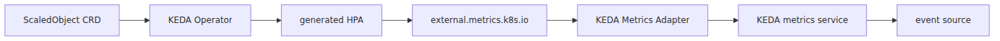
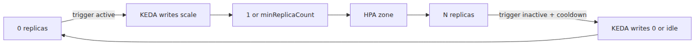

# KEDA 내부 — ScaledObject가 HPA를 만드는 방식

## Source Version

이 글의 외부 인용은 다음 upstream 버전을 기준으로 합니다.
- Kubernetes: v1.30.x (https://github.com/kubernetes/kubernetes)
- containerd: v1.7.x (https://github.com/containerd/containerd)
- KEDA: v2.14.0 (https://github.com/kedacore/keda/tree/v2.14.0)

AKS의 control plane은 Microsoft가 관리하므로, 여기서 보는 upstream 코드는 실제 서비스 내부 바이너리 단정이 아니라 동작 모델 비교 기준입니다.

> Azure Kubernetes Service Deep Dive 시리즈 (6/6)

KEDA는 HPA를 대체하지 않습니다.
KEDA는 ScaledObject를 보고 HPA를 만들고,
external metrics 경로를 채우고,
scale-to-zero 경계에서는 HPA 바깥에서 직접 replica를 0으로 씁니다.
KEDA는 크게 두 컴포넌트로 설치됩니다. **operator**는 `ScaledObject`와 `ScaledJob` CRD를 감시하면서 HPA 생성과 활성/비활성 재조정을 맡고, **metrics adapter**는 Kubernetes external-metrics API를 구현해 HPA가 scaler 값을 읽게 합니다. 그리고 **scaler**는 각 이벤트 소스가 구현하는 Go 인터페이스입니다.

---

## KEDA의 큰 구조



*이벤트 소스와 HPA를 잇는 KEDA 구조*
---

## ScaledObjectReconciler와 generated HPA

`scaledobject_controller.go`는 대상 리소스가 `/scale` subresource를 노출하는지 확인하고,
라벨을 보장하고,
HPA를 만들거나 갱신합니다.
즉 ScaledObject는 선언이고,
실제 Kubernetes autoscaling 산출물은 HPA입니다.

scaler 계층에서는 upstream `pkg/scalers/scaler.go`가 각 이벤트 소스가 구현할 인터페이스를 정의합니다. 실무적으로는 "이 소스가 active 상태인가", "HPA에 어떤 metric spec을 줄 것인가", "adapter가 어떤 metric 값을 반환할 것인가"를 각 scaler가 답한다고 보면 됩니다.

---

## external metrics 경로

`api_service.yaml`은 `v1beta1.external.metrics.k8s.io`를 등록합니다.
`provider.go`는 adapter가 `scaledobject.keda.sh/name` selector를 읽고 metrics service에 gRPC로 metric을 질의하는 경로를 보여 줍니다.


*이벤트 메트릭이 HPA로 전달되는 경로*
---

## scale-to-zero 경계

`scale_scaledobjects.go`를 보면 `scaleToZeroOrIdle()`과 `scaleFromZeroOrIdle()` 경로가 별도로 있습니다.
이유는 HPA가 `minReplicas` 아래로 자연스럽게 내려가지 못하기 때문입니다.
따라서 0↔1 구간은 KEDA가 직접 `/scale`을 업데이트하고,
1↔N 구간은 generated HPA가 담당합니다.



*KEDA와 HPA가 나뉘는 0↔1 확장 경계*
---

## 이번 화의 요점

> KEDA는 HPA를 대체하지 않습니다. operator는 ScaledObject와 ScaledJob을 감시해 HPA를 만들고 활성 상태를 재조정합니다. metrics adapter는 `external.metrics.k8s.io`를 제공하고, 각 scaler는 Service Bus나 Kafka 같은 이벤트 소스별로 activity와 metric 값을 계산합니다. HPA는 그 metric을 사용해 1 이상 구간을 스케일하고, scale-to-zero 경계는 KEDA가 직접 처리합니다.

---

## 시리즈 안에서의 위치

이 글은 Azure Kubernetes Service Deep Dive 시리즈 마지막 6화입니다.
5화에서 HPA와 Cluster Autoscaler를 분리해 두었기 때문에, 이번 화에서는 KEDA가 그 위에 정확히 어떤 층으로 올라타는지 더 분명하게 볼 수 있습니다.

---

## Call Path Summary

- `ScaledObject` / `ScaledJob` → KEDA operator reconcile
- operator → generated HPA 생성 또는 갱신
- HPA → external metrics 질의
- KEDA metrics adapter → scaler 구현 호출
- scaler가 activity와 metric 값 반환
- KEDA가 `/scale`로 `0 ↔ 1` 구간 직접 제어

### KEDA 상태와 ScaledObject 디버깅

```bash
kubectl get scaledobjects -A
kubectl describe scaledobject my-app -n my-ns | tail -40

kubectl -n kube-system logs -l app=keda-operator --tail=80
kubectl get hpa -n my-ns | grep keda
```

## 운영 체크리스트

- [ ] trigger 별 polling interval과 cooldown을 워크로드 spike에 맞게 설정했다
- [ ] KEDA operator 장애 시 fallback 동작과 알림을 정의했다
- [ ] ScaledJob과 ScaledObject 선택 기준을 가이드로 정리했다
- [ ] external scaler 인증(Managed Identity, secret) 정책을 정했다
- [ ] KEDA 메트릭과 실제 replica 수의 정합성 모니터링을 켰다

<!-- toc:begin -->
## 시리즈 목차

- [Control Plane 해부 — AKS가 사용자에게서 가린 것](./01-control-plane-anatomy.md)
- [kubelet과 containerd — 노드 위에서 컨테이너가 뜨기까지](./02-kubelet-and-containerd.md)
- [CNI와 Azure CNI Overlay — Pod IP가 어디서 오는가](./03-cni-and-azure-cni-overlay.md)
- [Scheduler와 Pod 배치 — 어느 노드로 갈지 누가 정하는가](./04-scheduler-and-pod-placement.md)
- [HPA와 Cluster Autoscaler 내부 — 두 컨트롤 루프](./05-hpa-and-cluster-autoscaler-internals.md)
- **KEDA 내부 — ScaledObject가 HPA를 만드는 방식 (현재 글)**

<!-- toc:end -->

---

## 참고 자료

### 1차 출처
- [`scaledobject_controller.go` @ `v2.14.0`](https://github.com/kedacore/keda/blob/v2.14.0/controllers/keda/scaledobject_controller.go)
- [`scaler.go` @ `v2.14.0`](https://github.com/kedacore/keda/blob/v2.14.0/pkg/scalers/scaler.go)
- [`provider.go` @ `v2.14.0`](https://github.com/kedacore/keda/blob/v2.14.0/pkg/provider/provider.go)
- [`scale_scaledobjects.go` @ `v2.14.0`](https://github.com/kedacore/keda/blob/v2.14.0/pkg/scaling/executor/scale_scaledobjects.go)
- [`api_service.yaml` @ `v2.14.0`](https://github.com/kedacore/keda/blob/v2.14.0/config/metrics-server/api_service.yaml)

### 2차 출처
- [KEDA scaling deployments and custom resources](https://keda.sh/docs/2.14/concepts/scaling-deployments/)
- [Horizontal Pod Autoscaling](https://kubernetes.io/docs/tasks/run-application/horizontal-pod-autoscale/)

### 관련 시리즈
- [Azure AKS 101](../../azure-aks-101/ko/)
- [Azure Functions Deep Dive 5화 — control loop 읽는 법](../../azure-functions-deep-dive/ko/05-scaling-internals.md)

Tags: AKS, Kubernetes, Distributed Systems, Containers
