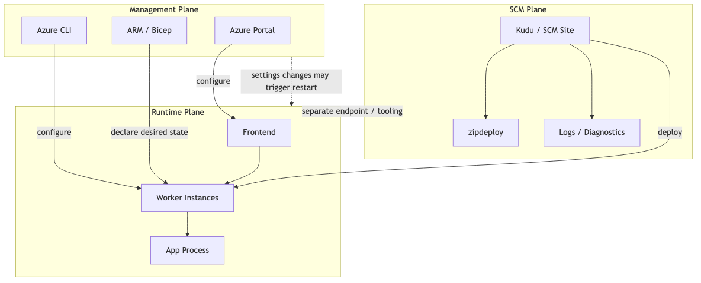
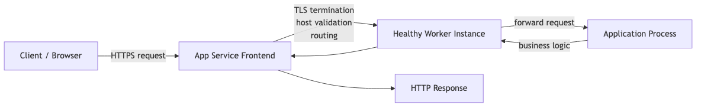
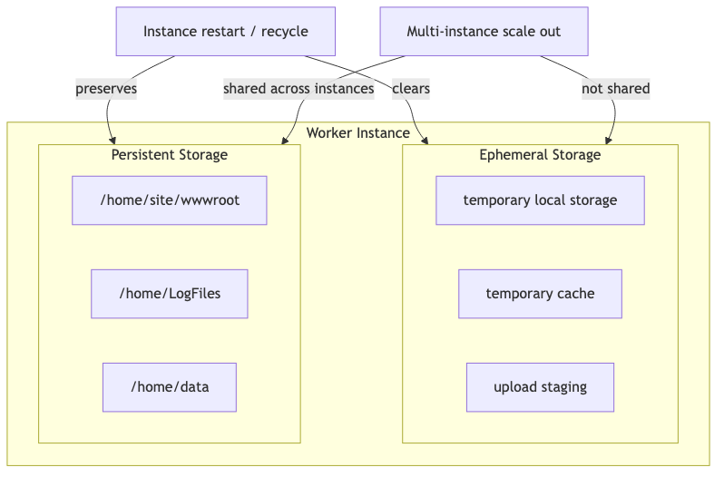

# What is Azure App Service? - Understanding the Platform Architecture

When deploying a web application to Azure, **Azure App Service** is often the first service you encounter. It's a PaaS (Platform as a Service) where you just deploy your code without managing VMs. To use this service effectively, understanding its internals is crucial.

In this post, we'll explore how the platform works, focusing on the **3-Plane Architecture**.

---

## What is App Service?

Azure App Service is a **fully managed platform** for hosting web apps, REST APIs, and mobile backends.

You focus on your application code, while Microsoft handles:

- Server infrastructure management and patching
- Load balancing and traffic routing
- Auto-scaling
- Deployment pipeline integration

---

## 3-Plane Architecture: The Core Mental Model

The most important concept for understanding App Service is the **three Planes**.

| Plane | Role | Key Tools |
|-------|------|-----------|
| **Management Plane** | Configuration and settings | Azure Portal, CLI, ARM/Bicep |
| **Runtime Plane** | Actual request processing | Frontend + Worker instances |
| **SCM Plane** | Deployment and diagnostics | Kudu (`.scm.azurewebsites.net`) |

### Why Does This Matter?

Each Plane has **independent APIs and failure modes**. For example:

- Changing App Settings in the Management Plane → May restart the Runtime Plane
- SCM (Kudu) site being inaccessible → App itself may still work fine



---

## Management Plane: The Configuration Hub

The Management Plane is where you declare your **Desired State**.

### Key Configuration Items

- **App Service Plan**: SKU, instance count
- **App Settings**: Environment variables
- **Deployment Slots**: Staging environments
- **Custom Domains**: Domain bindings
- **Managed Identity**: Secure authentication

### Configuration changes can restart the app

Many settings are applied at process startup, so changing them restarts your app.

**Settings that trigger restarts:**
- App Settings changes
- Startup Command changes
- Runtime Stack changes
- Slot Swap

```bash
# Check current app state
az webapp show \
 --resource-group $RG \
 --name $APP_NAME \
 --query "{state:state, hostNames:hostNames, httpsOnly:httpsOnly}" \
 --output json
```

---

## Runtime Plane: Where Requests Are Processed

The Runtime Plane is where actual user requests are handled.

### Request Flow



```
Client → App Service Frontend → Worker Instance → App Process
```

1. **Frontend**: TLS termination, host validation, routing
2. **Worker**: Selects healthy instance, forwards request
3. **App**: Executes business logic, returns response

### Instance Lifecycle

Worker instances are recycled in these situations:

- Platform maintenance
- Scale Out/In
- Restarts due to configuration changes

**Design Principles:**
- Store state externally (Redis, DB)
- Make startup logic idempotent
- Implement graceful shutdown
- Never store important data in local files

---

## SCM Plane (Kudu): Deployment and Debugging

The SCM site is a management tool accessible at `<app-name>.scm.azurewebsites.net`.

### Features Provided by Kudu

| Feature | Endpoint |
|---------|----------|
| ZIP Deploy | `/api/zipdeploy` |
| Deployment History | `/api/deployments` |
| Environment Info | `/api/environment` |
| Log Stream | `/api/logstream` |
| File Browser | `/api/vfs/` |

### SCM is not the app container

When using Linux custom containers, the SCM site runs in a **separate container**.

- Cannot directly view app container's filesystem/processes from SCM
- Use app container SSH or logs for debugging

```bash
# Check SCM access restrictions
az webapp config access-restriction show \
 --resource-group $RG \
 --name $APP_NAME \
 --output json
```

---

## Differences by Hosting Mode

App Service supports multiple hosting modes, each with different behaviors.

| Aspect | Windows Code | Linux Built-in | Linux Custom Container |
|--------|-------------|----------------|------------------------|
| **Startup** | IIS/platform starts | Built-in image + command | Image pull then start |
| **Port** | Platform managed | `PORT` env variable | `WEBSITES_PORT` setting |
| **Storage** | Persistent | `/home` persistent | Depends on config |
| **Diagnostics** | Rich Kudu | Rich Kudu | SSH is primary |

### Port Binding Rules

```python
# Python (Flask) example - correct port binding
import os
port = int(os.environ.get("PORT", 8000))
app.run(host="0.0.0.0", port=port)
```

---

## Filesystem: Ephemeral vs Persistent

Understanding storage behavior is key to preventing production issues.



### Ephemeral Storage

- Fast local I/O
- **Deleted** on instance restart
- **Not shared** between instances

**Good for:** Temporary cache, upload staging, intermediate processing files

### Persistent Storage (`/home`)

- Network-based, slower
- **Persists** after restarts
- **Shared** across all instances

| Path | Purpose |
|------|---------|
| `/home/site/wwwroot` | Deployed app code |
| `/home/LogFiles` | App/platform logs |
| `/home/data` | App data |

### Anti-pattern: SQLite on `/home`?

Since `/home` is a network filesystem:
- Lock contention possible
- Latency variability
- Data corruption risk with multiple instances

**→ Use managed databases like Azure SQL, PostgreSQL in production**

---

## Health Check: Verifying App Status

Health Check isn't just monitoring—it's **core to traffic routing**.

### How It Works

1. Platform periodically requests the Health endpoint
2. `200 OK` → Instance healthy, receives traffic
3. Failure/timeout → Instance excluded, recovery attempted

### Health Endpoint Design Principles

```python
@app.route('/health')
def health():
    # Keep it lightweight
    # Check only critical dependencies
    # Avoid heavy DB queries
    return {"status": "healthy"}, 200
```

**Notes:**
- `302 Redirect` doesn't count as success
- 1-minute timeout = unhealthy
- Most effective with 2+ instances

---

## Operations Checklist

Before production deployment, verify at minimum:

### Reliability

- [ ] Health endpoint implemented and tested
- [ ] Health Check setting enabled
- [ ] 2+ instances (for availability)
- [ ] Startup time measured and optimized

### Deployment Safety

- [ ] CI/CD producing immutable artifacts
- [ ] Rollback procedure documented and tested
- [ ] Deployment credentials minimized

### Observability

- [ ] Structured logging enabled
- [ ] Log retention/export configured
- [ ] Alerts for error rate, restarts, latency

### Configuration

- [ ] Port binding verified (per hosting mode)
- [ ] Storage behavior confirmed
- [ ] Secrets stored in Key Vault

---

## Summary

Understanding App Service's 3-Plane model helps you:

- **Management Plane**: Understand why config changes trigger restarts
- **Runtime Plane**: Grasp request flow and instance behavior
- **SCM Plane**: Leverage deployment and debugging tools

---

<!-- toc:begin -->
## In this series

- **What is Azure App Service? - Understanding the Platform Architecture (current)**
- Request Lifecycle: How Requests Reach Your App (upcoming)
- Hosting Models: Which Plan Should You Choose? (upcoming)
- First Deployment: From Local to Azure (Python/Flask) (upcoming)
- Mastering Configuration: App Settings & Environment Variables (upcoming)
- Logging and Monitoring Basics (upcoming)
- Scaling 101: When to Scale Up vs Scale Out? (upcoming)

<!-- toc:end -->

---

## References

### Official Docs
- [Azure App Service overview (Microsoft Learn)](https://learn.microsoft.com/azure/app-service/overview)
- [Kudu service overview (Microsoft Learn)](https://learn.microsoft.com/azure/app-service/resources-kudu)
- [Monitor App Service instances by using Health Check (Microsoft Learn)](https://learn.microsoft.com/azure/app-service/monitor-instances-health-check)

### Related Series
- [Azure Functions 101](../../azure-functions-101/en/)

---

Tags: Azure, App Service, Cloud, Web Apps
