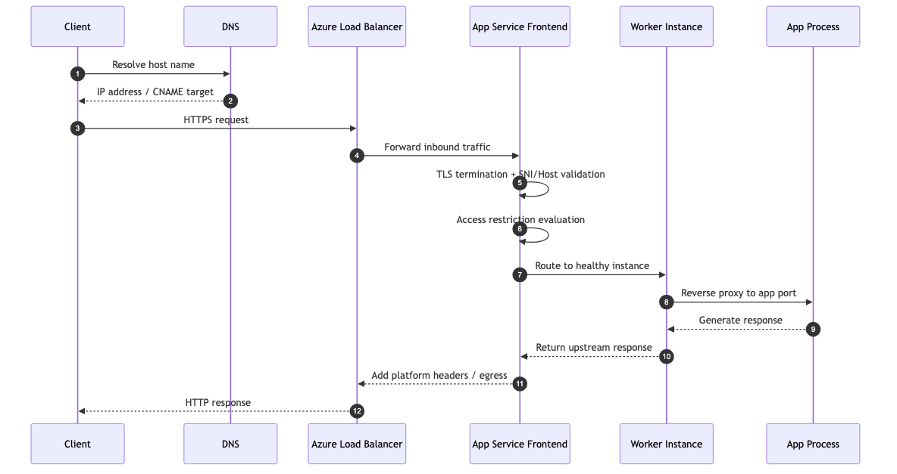
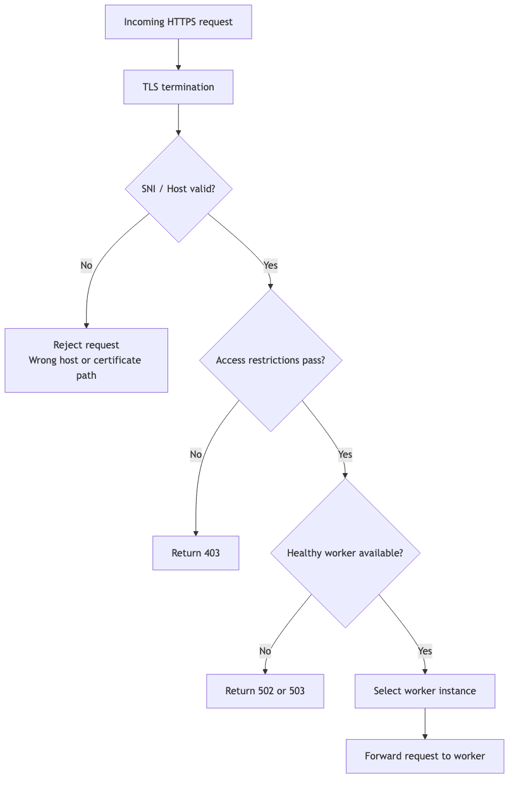
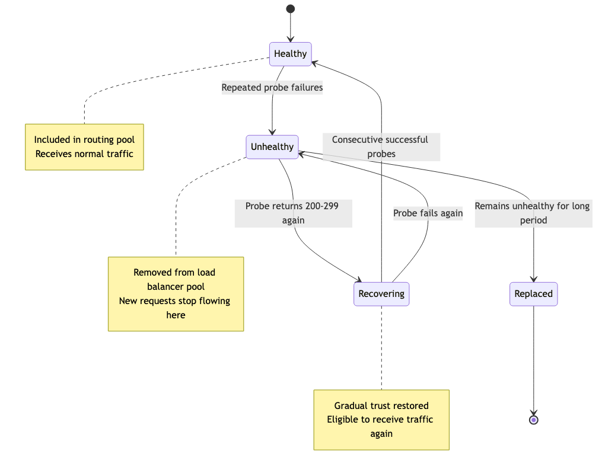
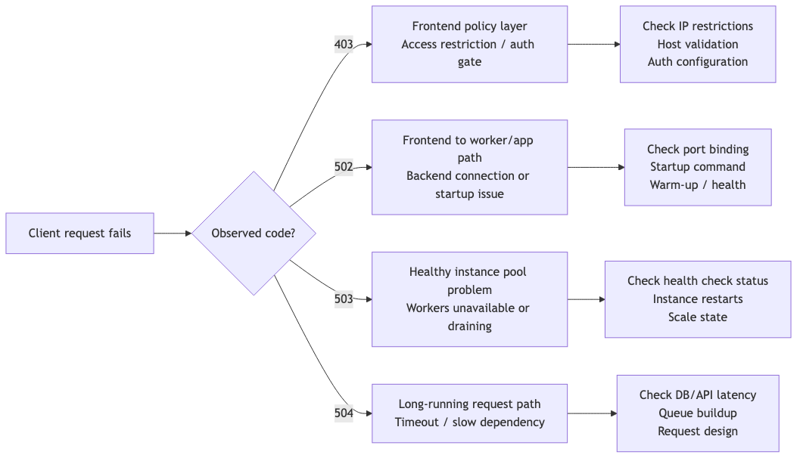

# Request Lifecycle: How Requests Reach Your App

"Why is my app returning a 502 error?" "Response times suddenly increased—what's the cause?"

To answer these questions, you need to understand the **complete journey of a request reaching your app**. In this post, we'll walk through the Azure App Service Request Lifecycle step by step.

---

## Overall Request Flow

A user's HTTP request passes through these layers before reaching your app:

```
Client → DNS → Azure Load Balancer → App Service Frontend → Worker Instance → App Process
```

Issues can occur at each stage, resulting in different error messages.



---

## Stage 1: DNS and Global Entry

### DNS Resolution

The request starts with DNS resolution of the app hostname.

- **Default domain:** `<app-name>.azurewebsites.net`
- **Custom domain:** `www.myapp.com` (with CNAME configured)

### TLS Handshake

After DNS resolution:
1. TLS handshake occurs
2. SNI (Server Name Indication) identifies the app
3. Host header routes to the correct app

```bash
# Verify DNS resolution
nslookup myapp.azurewebsites.net

# Check TLS certificate
openssl s_client -connect myapp.azurewebsites.net:443 -servername myapp.azurewebsites.net
```

---

## Stage 2: Frontend Routing

The App Service Frontend performs these roles:

| Role | Description |
|------|-------------|
| TLS Termination | Decrypts HTTPS |
| Host Validation | Verifies request goes to correct app |
| Access Restriction Evaluation | IP restrictions, auth checks |
| Instance Selection | Routes to healthy Worker |



### When the frontend is the failure point

If no healthy backend exists, requests fail **before your app code even runs**.

| Error Code | Meaning |
|------------|---------|
| `403` | Blocked by access restrictions |
| `502` | Backend connection failed |
| `503` | Service unavailable |

```bash
# Check access restriction settings
az webapp config access-restriction show \
 --resource-group $RG \
 --name $APP_NAME \
 --output json
```

**Example output:**
```json
{
 "ipSecurityRestrictions": [
 {
 "action": "Allow",
 "ipAddress": "203.0.113.0/24",
 "name": "corp-office",
 "priority": 100
 }
 ]
}
```

---

## Stage 3: Worker Reverse Proxy

Inside the Worker instance, a local reverse proxy forwards requests to the app process.

### Port Contract

**Key point:** Your app must bind to the **port provided by the platform**.

```python
# Hardcoded local port
app.run(host="0.0.0.0", port=5000)

# Read the port from the environment
import os
port = int(os.environ.get("PORT", 8000))
app.run(host="0.0.0.0", port=port)
```

**Common mistakes:**
- Works locally but fails after deployment
- Starts successfully but requests fail

---

## Stage 4: Application Execution

Finally, the request reaches your app code!

### Factors Affecting Performance

| Factor | Description |
|--------|-------------|
| CPU/Memory usage | Instance resource saturation |
| External dependencies | DB, API call latency |
| Threads/Event loop | Concurrency limits |
| Connection pools | Outbound connection management |

### Response Return Path

Responses travel back in reverse order:

```
App → Worker → Frontend → Load Balancer → Client
```

Headers added by the platform:
- Compression-related headers
- Security headers
- Reverse proxy metadata

---

## Timeouts and Connection Behavior

### Platform Timeouts

App Service has multiple levels of timeouts:

| Timeout | Impact |
|---------|--------|
| Frontend request timeout | Long-running requests → 504 Gateway Timeout |
| Idle connection timeout | Idle sockets closed |
| Slow dependencies | Queue buildup, tail latency increase |

### Design Guidelines

```python
# Long-running work inside the request path
@app.route('/export')
def export():
 # 10-minute data processing...
 return huge_result # Timeout risk!

# Hand the long job off to async processing
@app.route('/export')
def export():
 job_id = queue_export_job()
 return {"status": "accepted", "jobId": job_id}, 202
```

**Principles:**
- Keep interactive requests short (< 30 seconds)
- Move long tasks to background
- Return `202 Accepted`, then poll/webhook

---

## Instance Selection and Session Affinity

### Default Behavior: Round Robin

Frontend distributes traffic across healthy instances by default.

### Session Affinity (ARR Affinity)

You can pin specific clients to the same instance:

```
Client A ─(Affinity Cookie)─→ Instance 2
Client B ─(Affinity Cookie)─→ Instance 1
```

**Trade-offs:**

| Pros | Cons |
|------|------|
| Supports legacy session code | Uneven load distribution |
| Utilizes in-memory cache | Vulnerable to instance failure |

**Recommendation:** Store sessions/state in **external storage** (Redis, DB)

```bash
# Disable ARR Affinity
az webapp update \
 --resource-group $RG \
 --name $APP_NAME \
 --client-affinity-enabled false
```

---

## Health Check and Traffic Eligibility

Health Check determines whether an instance is **eligible** to receive traffic.

### Behavior by State

| State | Traffic |
|-------|---------|
| Healthy | Included in the routing pool |
| Unhealthy | Removed from the routing pool |
| Recovering | Re-included after probes pass |



### Health Probe Design Principles

```python
@app.route('/health')
def health():
 # 1. Keep it lightweight
 # 2. Check only dependencies critical for traffic handling
 # 3. Avoid slow external calls
 
 try:
 # Simple check of critical dependencies
 db.execute("SELECT 1")
 return {"status": "healthy"}, 200
 except Exception as e:
 return {"status": "unhealthy", "reason": str(e)}, 503
```

---

## Impact of Deployment Slots

Deployment Slots help minimize user impact during deployments.

### Slot Swap Process

1. Deploy new version to Staging Slot
2. Staging completes warm-up
3. Production continues handling traffic
4. Slot Swap switches traffic

**Benefits:**
- Reduces cold start exposure
- Easy rollback of failed deployments

---

## Observability: Tracing the Entire Lifecycle

Connect each stage to diagnose issues:

### Correlation Signals

| Signal | Purpose |
|--------|---------|
| Request logs | Status code distribution |
| Frontend diagnostics | Platform-level errors |
| Instance restarts | Stability issues |
| Dependency timing | External call bottlenecks |
| Correlation ID | Per-request tracing |

### Log Configuration

```bash
# Enable HTTP logging
az webapp log config \
 --resource-group $RG \
 --name $APP_NAME \
 --application-logging filesystem \
 --detailed-error-messages true \
 --failed-request-tracing true \
 --web-server-logging filesystem

# Real-time log stream
az webapp log tail \
 --resource-group $RG \
 --name $APP_NAME
```

---

## Common Failure Patterns



| Symptom | Suspected Layer | First Check |
|---------|----------------|-------------|
| 403 (no app logs) | Frontend | Access restrictions, auth settings |
| 502/503 spike | Worker/app startup | Restart events, Health probe |
| 504 responses | Long request path | Dependency latency, request design |
| Intermittent timeouts | Outbound | SNAT, connection pools |

### Troubleshooting Workflow

1. **Check Frontend**: DNS/TLS/access restrictions
2. **Check Worker**: Health status, restart events
3. **Check App Process**: Ready state, port binding
4. **Check Dependencies**: External call latency, connection issues

---

## Summary

Understanding each stage of the Request Lifecycle helps you:

- **Quickly identify where issues occur**
- **Check the right logs/metrics**
- **Apply the correct solutions**

---

<!-- blog-only:start -->
Next: [Hosting Models: Which Plan Should You Choose?](./03-hosting-models.md)
<!-- blog-only:end -->

<!-- toc:begin -->
## In this series

- [What is Azure App Service? - Understanding the Platform Architecture](./01-what-is-app-service.md)
- **Request Lifecycle: How Requests Reach Your App (current)**
- Hosting Models: Which Plan Should You Choose? (upcoming)
- First Deployment: From Local to Azure (Python/Flask) (upcoming)
- Mastering Configuration: App Settings & Environment Variables (upcoming)
- Logging and Monitoring Basics (upcoming)
- Scaling 101: When to Scale Up vs Scale Out? (upcoming)

<!-- toc:end -->

---

## References

### Official Docs
- [Deployment Slots in App Service (Microsoft Learn)](https://learn.microsoft.com/azure/app-service/deploy-staging-slots)
- [Inbound and outbound IPs (Microsoft Learn)](https://learn.microsoft.com/azure/app-service/overview-inbound-outbound-ips)
- [Troubleshoot diagnostic logs (Microsoft Learn)](https://learn.microsoft.com/azure/app-service/troubleshoot-diagnostic-logs)

### Related Series
- [Azure Functions 101](../../azure-functions-101/en/)

---

Tags: Azure, App Service, Cloud, Web Apps
