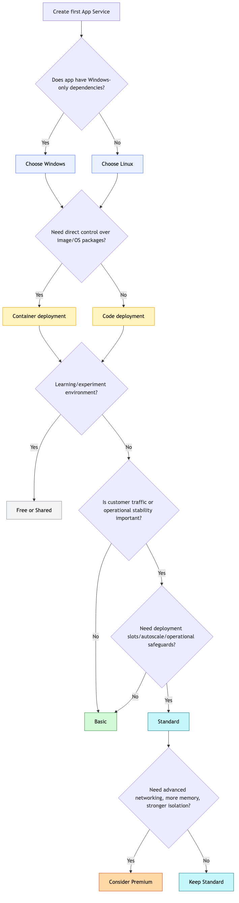
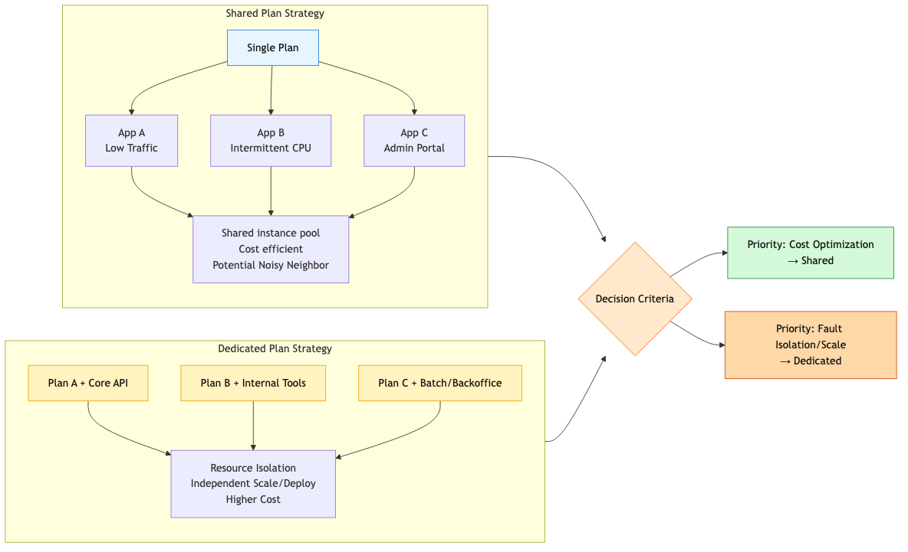
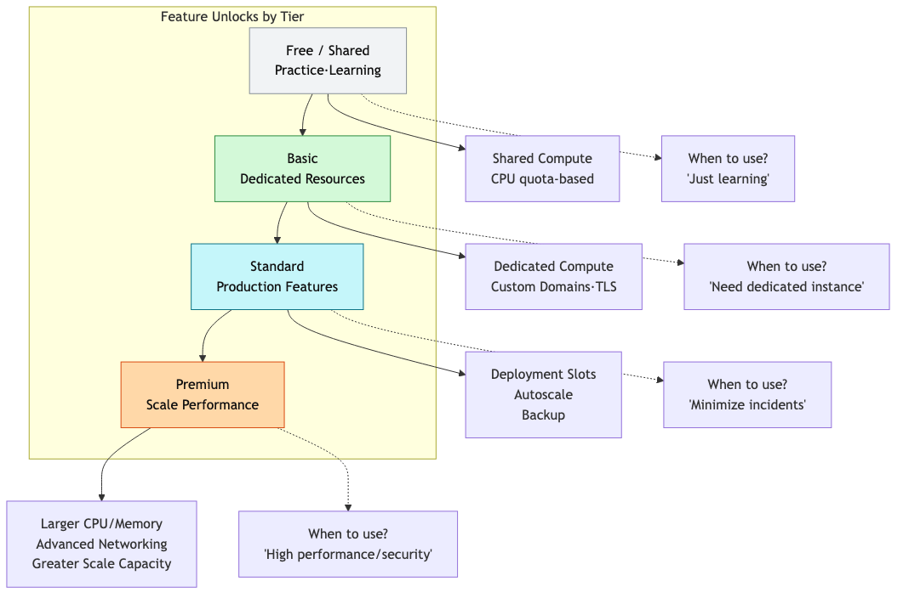

# Hosting Models: Which Plan Should You Choose?

When starting with App Service, the first question you face: **"Which plan should I choose?"**

Free? Basic? Standard? Premium? And Windows vs Linux? Code vs Container?

In this post, we'll cover the **key criteria for choosing your Hosting Model**.

---

<!-- ebook-only:start -->
## Where this chapter fits

This is chapter 3 of 7 in the series.
The previous chapter covered **Request Lifecycle: How Requests Reach Your App**.
After this chapter, the next one moves on to **First Deployment: From Local to Azure (Python/Flask)**.
<!-- ebook-only:end -->

## Decision Flowchart

The flow for deciding your App Service hosting strategy:

```
1. Choose OS (Linux / Windows)
 ↓
2. Choose Deployment Model (Code / Container)
 ↓
3. Choose Plan Tier (Dev → Production)
```



---

## What is an App Service Plan?

An App Service Plan is the **compute resource pool** where your app runs.

### What the Plan Defines

| Item | Description |
|------|-------------|
| CPU/Memory | Resources available per instance |
| Max Instance Count | Scale out limit |
| Feature Set | Autoscale, Slots, VNet, etc. |
| Pricing & SLA | Cost and availability guarantees |

### Key Point: One Plan = Multiple Apps

Deploying multiple apps to the same Plan means they **share compute resources**.

```
[App Service Plan: Standard S1]
├── Web App A
├── Web App B 
└── API App C ← All share the same VM pool
```

---

## Plan Tier Comparison

### Features by Tier

| Tier | Use Case | Key Limitations |
|------|----------|-----------------|
| **Free/Shared** | Learning, experiments | Shared resources, limited features |
| **Basic** | Low traffic | Limited operational features |
| **Standard** | Basic production | Medium scale limits |
| **Premium** | High performance, networking | Higher cost |
| **Isolated** | Compliance, network isolation | Highest cost, complexity |

### Feature Requirements by Tier

| Feature | Minimum Tier |
|---------|-------------|
| Custom Domain | Shared |
| SSL Certificate | Basic |
| Deployment Slots | Standard |
| Autoscale | Standard |
| VNet Integration | Standard |
| Private Endpoint | Premium |
| Zone Redundancy | Premium |

### Practical Advice

> "Start with Standard minimum for production. Operating without Autoscale and Deployment Slots is asking for trouble."

---

## OS Selection: Linux vs Windows

### Which OS to Choose?

| Consideration | Description |
|---------------|-------------|
| Existing standards | Environment your team knows |
| Dependency compatibility | Specific library requirements |
| Compliance | Enterprise security policies |
| Tooling/Observability | Debugging workflows |

### Practical Differences

| Aspect | Linux | Windows |
|--------|-------|---------|
| Startup speed | Generally faster | Slightly slower |
| Container support | Native | Limited |
| Kudu/SCM | Limited features | Rich features |
| Cost | Same per tier | Same |

**Recommendation:** Choose **Linux** unless you have specific reasons otherwise (better for modern stacks)

```bash
# Create Linux Plan
az appservice plan create \
 --resource-group $RG \
 --name $PLAN_NAME \
 --location koreacentral \
 --sku S1 \
 --is-linux
```

---

## Deployment Model: Code vs Container

### Code-based Deployment

Platform provides the runtime; you just deploy code.

**Pros:**
- Fast onboarding
- container management overhead
- Strong platform integration

**Cons:**
- Limited control over the base image
- Runtime updates follow platform policy

```bash
# Create code-based web app
az webapp create \
 --resource-group $RG \
 --plan $PLAN_NAME \
 --name $APP_NAME \
 --runtime "PYTHON|3.11"
```

### Container-based Deployment

Build and deploy your own OCI images.

**Pros:**
- Full control over runtime stack
- Local-cloud environment consistency
- OS-level dependency freedom

**Cons:**
- Manage patching cycles yourself
- Registry governance required
- Image quality directly impacts startup performance

```bash
# Create container-based web app
az webapp create \
 --resource-group $RG \
 --plan $PLAN_NAME \
 --name $APP_NAME \
 --deployment-container-image-name myregistry.azurecr.io/myapp:latest
```

---

## Shared Plan vs Dedicated Plan



### Shared Plan Strategy

Place multiple apps on one Plan:

**Pros:**
- Cost efficient
- Apps with different traffic patterns complement each other

**Cons:**
- Resource competition between apps (Noisy Neighbor)
- One app's issues affect others

### Dedicated Plan Strategy

Separate Plan for each critical app:

**Pros:**
- Resource isolation
- Easier capacity prediction
- Limited blast radius

**Cons:**
- Increased cost

### Recommended Approach

```
Business-critical apps → Dedicated Plan
Internal tools, low traffic apps → Shared Plan
```

---

## Feature Mapping

Which features depend on Plan vs Deployment Model:



| Feature | Plan Dependent | Deployment Model Dependent |
|---------|----------------|---------------------------|
| Autoscale | Yes | No |
| Deployment Slots | Yes | No |
| Private Endpoint | Yes | No |
| VNet Integration | Yes | No |
| Custom Startup Image | No | Yes (Container) |
| Platform Build | No | Yes (Code) |

---

## Cost and Capacity Planning

### Capacity Planning Considerations

| Item | Question |
|------|----------|
| Traffic | Peak vs average request rate? |
| Resources | CPU-intensive vs IO-intensive? |
| Memory | Memory per request, background workers? |
| Startup time | Cold start frequency? |

### Practical Patterns

```
1. Start with production-ready tier (Standard or higher)
2. Load test with actual traffic patterns
3. Configure Autoscale thresholds and cooldowns
4. Re-evaluate Plan size monthly
```

### Check Plan Info with CLI

```bash
az appservice plan show \
 --resource-group $RG \
 --name $PLAN_NAME \
 --query "{sku:sku, workers:numberOfWorkers, reserved:reserved}" \
 --output json
```

**Example output:**
```json
{
 "sku": {
 "name": "S1",
 "tier": "Standard",
 "capacity": 2
 },
 "workers": 2,
 "reserved": true
}
```

---

## Right-Sizing Checklist

Verify before choosing a Plan:

| Question | Check |
|----------|-------|
| Does it support required networking features? | |
| Does it support required deployment patterns? (Slots) | |
| Will Autoscale react before saturation? | |
| Is memory per instance sufficient at peak? | |
| Can dependent services handle increased load? | |

---

## Summary

Key points for Hosting Model selection:

- **OS**: Linux unless you have specific reasons
- **Deployment Model**: Start with Code, Container when control is needed
- **Tier**: Standard or higher for production
- **Plan Strategy**: Dedicated for critical apps, shared for the rest

---

<!-- blog-only:start -->
Next: [First Deployment: From Local to Azure (Python/Flask)](./04-first-deploy.md)
<!-- blog-only:end -->

<!-- toc:begin -->
## In this series

- [What is Azure App Service? - Understanding the Platform Architecture](./01-what-is-app-service.md)
- [Request Lifecycle: How Requests Reach Your App](./02-request-lifecycle.md)
- **Hosting Models: Which Plan Should You Choose? (current)**
- First Deployment: From Local to Azure (Python/Flask) (upcoming)
- Mastering Configuration: App Settings & Environment Variables (upcoming)
- Logging and Monitoring Basics (upcoming)
- Scaling 101: When to Scale Up vs Scale Out? (upcoming)

<!-- toc:end -->

---

## References

### Official Docs
- [App Service plan overview (Microsoft Learn)](https://learn.microsoft.com/azure/app-service/overview-hosting-plans)
- [Custom container in App Service (Microsoft Learn)](https://learn.microsoft.com/azure/app-service/tutorial-custom-container)
- [App Service pricing (Azure)](https://azure.microsoft.com/pricing/details/app-service/)

### Related Series
- [Azure Functions 101](../../azure-functions-101/en/)

---

Tags: Azure, App Service, Cloud, Web Apps
