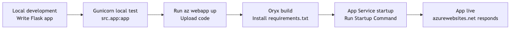
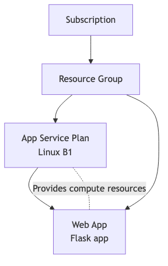
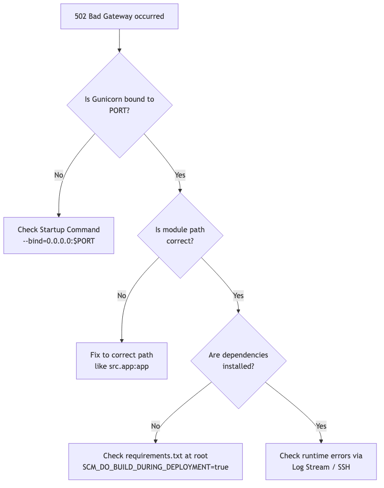

# First Deployment: From Local to Azure (Python/Flask)

This is where the series turns into a real deployment. We will deploy a Flask app to Azure App Service and verify the full runtime path.

This post covers the entire process from local development environment setup to Azure deployment and verifying everything works.

---

## Goals

By the end, you will have a Flask app running locally, an App Service app in Azure, and a repeatable deployment path you can verify with logs and a health endpoint.



---

## Prerequisites

| Item | Version/Requirement |
|------|---------------------|
| Python | 3.11 or higher |
| Azure CLI | Latest version, logged in |
| Azure Subscription | Active subscription |

```bash
# Check Azure CLI version and login
az --version
az login
```

---

## Step 1: Prepare Project Structure

### Minimal Flask App Structure

```
my-flask-app/
├── src/
│ └── app.py
├── requirements.txt
└── README.md
```

### app.py

```python
# src/app.py
import os
from flask import Flask, jsonify

app = Flask(__name__)

@app.route('/')
def home():
 return jsonify({
 "message": "Hello from Azure App Service!",
 "environment": os.environ.get("APP_ENV", "development")
 })

@app.route('/health')
def health():
 return jsonify({"status": "healthy"}), 200

if __name__ == '__main__':
 port = int(os.environ.get("PORT", 8000))
 app.run(host="0.0.0.0", port=port)
```

### requirements.txt

```
Flask==3.0.0
gunicorn==21.2.0
```

---

## Step 2: Run Locally (Development Mode)

### Create and Activate Virtual Environment

```bash
cd my-flask-app
python -m venv .venv
source .venv/bin/activate # Windows: .venv\Scripts\activate
```

### Install Dependencies

```bash
pip install --upgrade pip
pip install -r requirements.txt
```

### Run Flask Development Server

```bash
export FLASK_APP=src.app:app
export FLASK_DEBUG=1
flask run --port 8000
```

### Test

```bash
curl http://localhost:8000/
curl http://localhost:8000/health
```

**Expected output:**
```json
{"message": "Hello from Azure App Service!", "environment": "development"}
{"status": "healthy"}
```

---

## Step 3: Run Locally (Production Mode)

Azure App Service runs Python apps with **Gunicorn**. Test the same setup locally before deploying.

```bash
export PORT=8000
gunicorn --bind=0.0.0.0:$PORT src.app:app
```

### Test with Workers and Timeout Settings

```bash
gunicorn --bind=0.0.0.0:$PORT --workers 2 --timeout 120 src.app:app
```

```bash
curl http://localhost:8000/health
```

**Why is this important?**
- Flask dev server and Gunicorn behave differently
- Concurrency varies with timeout and worker count
- Prevents "works locally but not in Azure" issues

---

## Step 4: Create Azure Resources



### Set Variables

```bash
RG="rg-flask-tutorial"
APP_NAME="app-flask-demo-$(openssl rand -hex 4)" # Unique name
PLAN_NAME="plan-flask-tutorial"
LOCATION="koreacentral"

echo "App Name: $APP_NAME"
```

### Create Resource Group

```bash
az group create \
 --name $RG \
 --location $LOCATION
```

### Create App Service Plan

```bash
az appservice plan create \
 --resource-group $RG \
 --name $PLAN_NAME \
 --is-linux \
 --sku B1
```

### Create Web App

```bash
az webapp create \
 --resource-group $RG \
 --plan $PLAN_NAME \
 --name $APP_NAME \
 --runtime "PYTHON|3.11"
```

---

## Step 5: Configure Deployment

### Enable Oryx Build

Enable App Service's Oryx build system to detect `requirements.txt` and automatically install dependencies.

```bash
az webapp config appsettings set \
 --resource-group $RG \
 --name $APP_NAME \
 --settings SCM_DO_BUILD_DURING_DEPLOYMENT=true
```

### Set Startup Command

```bash
az webapp config set \
 --resource-group $RG \
 --name $APP_NAME \
 --startup-file "gunicorn --bind=0.0.0.0:\$PORT src.app:app"
```

> `$PORT` is an environment variable automatically injected by App Service. Escape it with backslash.

---

## Step 6: Deploy Source Code

### Using az webapp up (Simplest Method)

```bash
az webapp up \
 --resource-group $RG \
 --name $APP_NAME \
 --runtime "PYTHON|3.11"
```

This command:
1. Packages current directory as ZIP
2. Uploads to App Service
3. Oryx runs build (pip install)
4. Restarts app

### Verify Deployment Completion

```bash
az webapp show \
 --resource-group $RG \
 --name $APP_NAME \
 --query "state" \
 --output tsv
```

**Output:** `Running`

---

## Step 7: Verify Deployment

### Get App URL

```bash
APP_URL="https://$(az webapp show \
 --resource-group $RG \
 --name $APP_NAME \
 --query defaultHostName \
 --output tsv)"

echo "App URL: $APP_URL"
```

### Health Check

```bash
curl $APP_URL/health
```

**Expected output:**
```json
{"status": "healthy"}
```

### Check Main Page

```bash
curl $APP_URL/
```

**Expected output:**
```json
{"message": "Hello from Azure App Service!", "environment": "development"}
```

---

## Step 8: Check Logs

### Enable Logging

```bash
az webapp log config \
 --resource-group $RG \
 --name $APP_NAME \
 --application-logging filesystem \
 --level information
```

### Real-time Log Stream

```bash
az webapp log tail \
 --resource-group $RG \
 --name $APP_NAME
```

Send a request and logs appear in real-time.

---

## Step 9: Verify in Azure Portal

### Deployment Center

View deployment history and status.

**Path:** App Service → Deployment Center

### Kudu (SCM) Site

Advanced diagnostics and file browser:

```
https://<app-name>.scm.azurewebsites.net
```

**Key features:**
- File browser: Check `/home/site/wwwroot`
- Bash console: Run commands inside container
- Environment variables

---

## Troubleshooting

### 502 Bad Gateway



| Cause | Solution |
|-------|----------|
| Port binding error | Verify `$PORT` environment variable usage |
| Startup command error | Check path and module name |
| Dependency install failed | Check deployment logs for pip errors |

### Check Logs

```bash
# Deployment logs
az webapp log deployment list \
 --resource-group $RG \
 --name $APP_NAME \
 --output table

# App logs
az webapp log tail --resource-group $RG --name $APP_NAME
```

### Direct Check via Kudu SSH

```bash
az webapp ssh --resource-group $RG --name $APP_NAME
# Inside container:
ls /home/site/wwwroot
cat /home/LogFiles/*docker*.log
```

---

## Clean Up (Optional)

Delete resources to save costs after testing:

```bash
az group delete --name $RG --yes --no-wait
```

---

## Summary

What you learned in this tutorial:

1. **Local Development**: Production parity with Flask + Gunicorn
2. **Azure Resources**: Resource Group → Plan → Web App creation flow
3. **Deployment**: Simple deployment with `az webapp up`
4. **Verification**: Status check via Health endpoint and logs

---

<!-- toc:begin -->
## In this series

- [What is Azure App Service? - Understanding the Platform Architecture](./01-what-is-app-service.md)
- [Request Lifecycle: How Requests Reach Your App](./02-request-lifecycle.md)
- [Hosting Models: Which Plan Should You Choose?](./03-hosting-models.md)
- **First Deployment: From Local to Azure (Python/Flask) (current)**
- Mastering Configuration: App Settings & Environment Variables (upcoming)
- Logging and Monitoring Basics (upcoming)
- Scaling 101: When to Scale Up vs Scale Out? (upcoming)

<!-- toc:end -->

---

## References

### Official Docs
- [Quickstart: Deploy a Python web app (Microsoft Learn)](https://learn.microsoft.com/azure/app-service/quickstart-python)
- [Configure a Linux Python app (Microsoft Learn)](https://learn.microsoft.com/azure/app-service/configure-language-python)
- [Kudu service overview (Microsoft Learn)](https://learn.microsoft.com/azure/app-service/resources-kudu)

### Related Series
- [Azure Functions 101](../../azure-functions-101/en/)

---

Tags: Azure, App Service, Cloud, Web Apps
