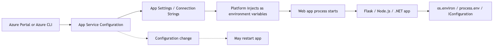
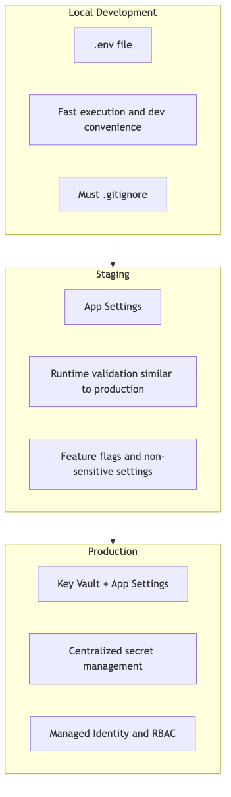
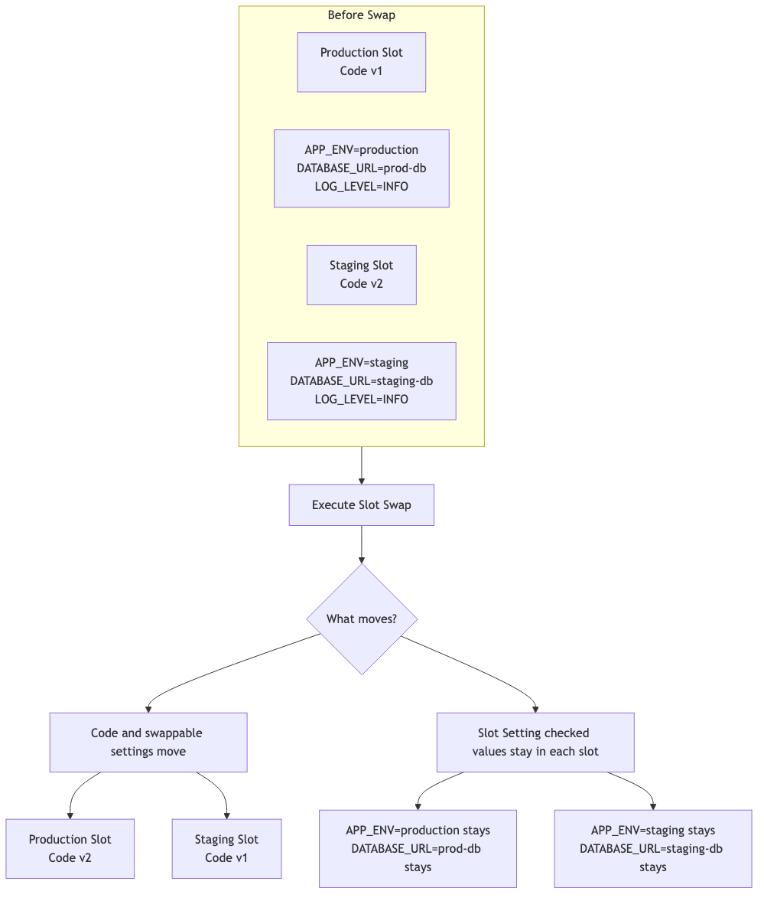
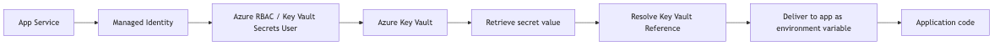

# Mastering Configuration: App Settings & Environment Variables

Your app is deployed. Now, **how do you manage environment-specific settings?**

Different environments need different connection strings, API keys, and log levels. This post shows how to manage those settings without turning deployment into guesswork.

---

## Why Configuration Matters

### The Twelve-Factor App Principle

> "Separate configuration from code"

- Settings hardcoded in code
- Different code branches per environment
- Settings injected via environment variables
- Same code, different settings

### App Service's Approach

App Service injects environment variables through **App Settings**:



```
[Azure Portal/CLI] → App Settings → [Environment Variables] → [App Process]
```

---

## App Settings Basics

### Setting App Settings

**Azure CLI:**
```bash
az webapp config appsettings set \
 --resource-group $RG \
 --name $APP_NAME \
 --settings FLASK_DEBUG=0 APP_ENV=production LOG_LEVEL=INFO
```

**Azure Portal:**
1. App Service → Configuration
2. Application settings tab
3. Click "+ New application setting"

### Reading in Your App

```python
import os

# Access directly as environment variables
FLASK_DEBUG = os.environ.get("FLASK_DEBUG", "0")
APP_ENV = os.environ.get("APP_ENV", "production")
LOG_LEVEL = os.environ.get("LOG_LEVEL", "INFO")
DB_HOST = os.environ.get("DB_HOST", "localhost")
```

### Verify Current Settings

```bash
az webapp config appsettings list \
 --resource-group $RG \
 --name $APP_NAME \
 --output table
```

**Example output:**
```
Name Value
----------------------------- -----------------
FLASK_DEBUG 0
APP_ENV production
LOG_LEVEL INFO
SCM_DO_BUILD_DURING_DEPLOYMENT true
```

---

## Local vs Production Strategy

### Environment Separation Pattern



```python
# config.py
import os

class Config:
 """Base configuration"""
 SECRET_KEY = os.environ.get("SECRET_KEY", "dev-secret-key")
 LOG_LEVEL = os.environ.get("LOG_LEVEL", "INFO")

class DevelopmentConfig(Config):
 """Local development"""
 DEBUG = True
 DATABASE_URL = os.environ.get("DATABASE_URL", "sqlite:///dev.db")

class ProductionConfig(Config):
 """Azure App Service"""
 DEBUG = False
 DATABASE_URL = os.environ.get("DATABASE_URL") # Required

# Select based on environment
config = {
 "development": DevelopmentConfig,
 "production": ProductionConfig,
}

def get_config():
 env = os.environ.get("APP_ENV", "development")
 return config.get(env, DevelopmentConfig)
```

### Local Development: .env File

Flask 2.3 and 3.x no longer use `FLASK_ENV`, so keep environment selection in your own app setting such as `APP_ENV` and enable the debugger explicitly with `FLASK_DEBUG=1` only for local development.

```bash
# .env (local only, add to .gitignore!)
FLASK_DEBUG=1
APP_ENV=development
LOG_LEVEL=DEBUG
DATABASE_URL=postgresql://localhost:5432/myapp
SECRET_KEY=local-dev-key
```

```python
# Using python-dotenv
from dotenv import load_dotenv
load_dotenv() # Load .env file
```

```bash
pip install python-dotenv
```

### .gitignore is required

```gitignore
# .gitignore
.env
.env.local
*.env
```

---

## Connection Strings

Database connection strings are managed in a separate section.

### Setting Connection Strings

```bash
az webapp config connection-string set \
 --resource-group $RG \
 --name $APP_NAME \
 --connection-string-type PostgreSQL \
 --settings "DATABASE=Server=myserver.postgres.database.azure.com;Database=mydb;..."
```

### App Settings vs Connection Strings

| Item | App Settings | Connection Strings |
|------|-------------|-------------------|
| Purpose | General settings | DB connections only |
| Format | `KEY=VALUE` | Type can be specified |
| App Access | `os.environ["KEY"]` | `os.environ["SQLAZURECONNSTR_NAME"]` |

> **Practical Tip:** App Settings alone are sufficient for most cases.

---

## Slot Settings (Sticky Settings)

When using Deployment Slots, some settings should be **sticky to the slot**.

### When Slot Settings Are Needed

| Setting | Sticky? | Reason |
|---------|---------|--------|
| `APP_ENV` | Yes | Staging is staging, production is production |
| `DATABASE_URL` | Yes | Different DB per environment |
| `LOG_LEVEL` | No | Usually the same |
| `FEATURE_FLAG_X` | Depends | Sticky when testing per slot |



### Configuring Slot Settings

```bash
az webapp config appsettings set \
 --resource-group $RG \
 --name $APP_NAME \
 --slot-settings APP_ENV=production
```

`--slot-settings` uses the same `KEY=VALUE` form as `--settings`. Any setting passed there is marked sticky for the slot and keeps its value during swaps.

**Azure Portal:**
1. Configuration → Application settings
2. Check "Deployment slot setting" checkbox next to setting

---

## Key Vault References: Secrets Done Right

Store sensitive values like passwords and API keys in **Key Vault** and reference them.



### Why Key Vault?

| Direct App Settings | Key Vault Reference |
|--------------------|---------------------|
| Values visible in Portal | Values hidden |
| No version control | Automatic versioning |
| No audit logs | Access audit logs |
| Hard to share | Reference from multiple apps |

### Step 1: Create Key Vault

```bash
KEYVAULT_NAME="kv-myapp-$(openssl rand -hex 4)"

az keyvault create \
 --resource-group $RG \
 --name $KEYVAULT_NAME \
 --location $LOCATION
```

### Step 2: Store Secret

```bash
az keyvault secret set \
 --vault-name $KEYVAULT_NAME \
 --name "DbPassword" \
 --value "super-secret-password"
```

### Step 3: Enable Managed Identity

```bash
az webapp identity assign \
 --resource-group $RG \
 --name $APP_NAME
```

### Step 4: Grant Key Vault Access (RBAC)

```bash
PRINCIPAL_ID=$(az webapp identity show \
 --resource-group $RG \
 --name $APP_NAME \
 --query principalId \
 --output tsv)

KEYVAULT_ID=$(az keyvault show \
 --name $KEYVAULT_NAME \
 --query id \
 --output tsv)

az role assignment create \
 --role "Key Vault Secrets User" \
 --assignee $PRINCIPAL_ID \
 --scope $KEYVAULT_ID
```

### Step 5: Configure Key Vault Reference

```bash
az webapp config appsettings set \
 --resource-group $RG \
 --name $APP_NAME \
 --settings "DB_PASSWORD=@Microsoft.KeyVault(SecretUri=https://$KEYVAULT_NAME.vault.azure.net/secrets/DbPassword/)"
```

### Using in Your App

```python
# Key Vault Reference accessed like regular environment variable
DB_PASSWORD = os.environ.get("DB_PASSWORD")
# Value automatically injected!
```

---

## Impact of Configuration Changes

### Configuration changes are runtime events

Changing App Settings **restarts your app**.

**Impact:**
- In-flight requests may be interrupted
- Cold start occurs
- Cache cleared

### Minimizing Change Impact

1. **Batch Updates**: Change multiple settings at once
2. **Deployment Slots**: Test in staging first
3. **Maintenance Window**: Change during low traffic

```bash
# Change multiple settings at once (single restart)
az webapp config appsettings set \
 --resource-group $RG \
 --name $APP_NAME \
 --settings KEY1=value1 KEY2=value2 KEY3=value3
```

---

## Verifying Configuration

### Check Current Settings

```bash
# List all settings
az webapp config appsettings list \
 --resource-group $RG \
 --name $APP_NAME \
 --output json

# Check specific setting
az webapp config appsettings list \
 --resource-group $RG \
 --name $APP_NAME \
 --query "[?name=='LOG_LEVEL']"
```

### Verify Inside App (Debugging)

```python
@app.route('/debug/config')
def debug_config():
 # Disable in production!
 if os.environ.get("APP_ENV") != "development":
 return {"error": "Not allowed"}, 403
 
 return {
 "APP_ENV": os.environ.get("APP_ENV"),
 "LOG_LEVEL": os.environ.get("LOG_LEVEL"),
 # Mask sensitive values
 "DB_PASSWORD": "***" if os.environ.get("DB_PASSWORD") else None
 }
```

---

## Best Practices Checklist

### DO

- [ ] Store sensitive values in Key Vault
- [ ] Use Slot Settings for environment-specific config
- [ ] Add .env files to .gitignore
- [ ] Batch configuration changes
- [ ] Validate required settings at app startup

### DON'T

- [ ] Hardcode secrets in code
- [ ] Commit .env files to Git
- [ ] Expose debug endpoints in production
- [ ] Change settings one at a time

---

## Summary

Configuration management essentials:

- **App Settings**: Injected as environment variables, restart on change
- **Environment Separation**: .env (local) + App Settings (Azure)
- **Slot Settings**: Settings that must be sticky per environment
- **Key Vault**: Sensitive values must go here

---

<!-- toc:begin -->
## In this series

- [What is Azure App Service? - Understanding the Platform Architecture](./01-what-is-app-service.md)
- [Request Lifecycle: How Requests Reach Your App](./02-request-lifecycle.md)
- [Hosting Models: Which Plan Should You Choose?](./03-hosting-models.md)
- [First Deployment: From Local to Azure (Python/Flask)](./04-first-deploy.md)
- **Mastering Configuration: App Settings & Environment Variables (current)**
- Logging and Monitoring Basics (upcoming)
- Scaling 101: When to Scale Up vs Scale Out? (upcoming)

<!-- toc:end -->

---

## References

### Official Docs
- [Configure an App Service app (Microsoft Learn)](https://learn.microsoft.com/azure/app-service/configure-common)
- [Use Key Vault references (Microsoft Learn)](https://learn.microsoft.com/azure/app-service/app-service-key-vault-references)
- [The Twelve-Factor App - Config](https://12factor.net/config)

### Related Series
- [Azure Functions 101](../../azure-functions-101/en/)

---

Tags: Azure, App Service, Cloud, Web Apps
