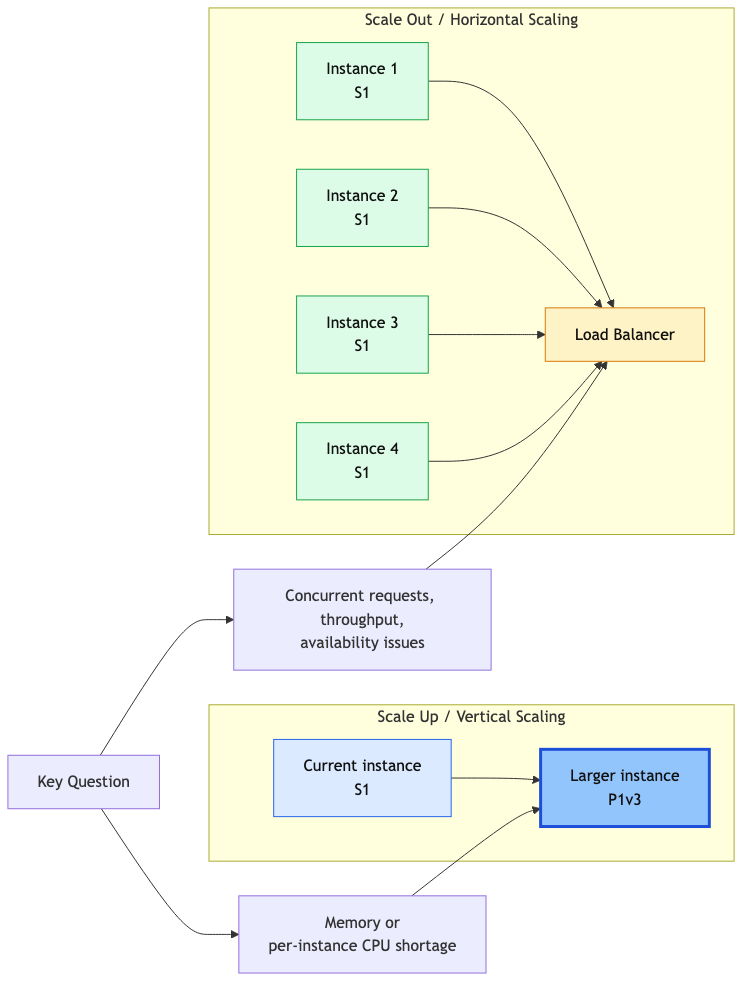
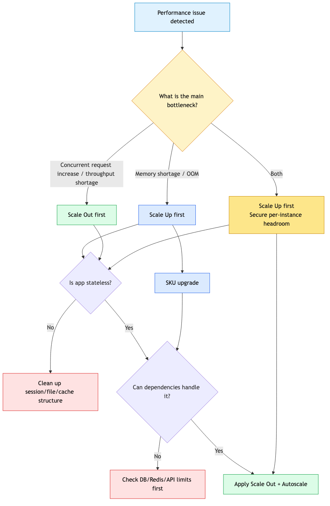
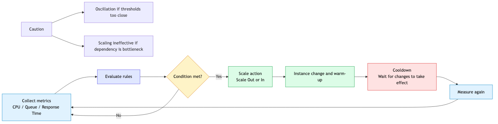
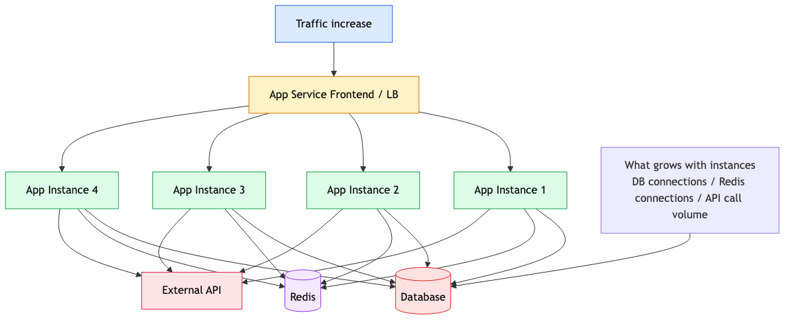

# Scaling 101: When to Scale Up vs Scale Out?

"Traffic increased and the app is slow." "Want to reduce costs but maintain performance."

**Scaling** is the key strategy for solving these problems. In this post, we'll cover the difference between Scale Up and Scale Out, when to choose each, and how to configure Autoscale.

---

> Scale rules without cost ceilings are how a single bad release becomes a five-figure invoice.

## Questions this chapter answers

- What signals and costs differ between vertical scale (scale up) and horizontal scale (scale out)?
- Which metrics (CPU, queue, custom) drive auto-scale rules?
- What happens to ARR Affinity sessions when an instance scales in?
- How much cold start does Premium's always-ready erase?
- How do you guard both the scale ceiling and the cost ceiling at once?

## Two Directions of Scaling

```
 ┌─────────────┐
 │ Larger │ ← Scale Up (Vertical)
 │ Instance │
 └─────────────┘
 ↑
┌───┐ ┌───┐ ┌───┐ ┌───┐
│ S │ │ S │ │ S │ ... │ S │ ← Scale Out (Horizontal)
└───┘ └───┘ └───┘ └───┘
 ↑
More instances
```

| Direction | Name | Description |
|-----------|------|-------------|
| **Vertical** | Scale Up/Down | Change instance size |
| **Horizontal** | Scale Out/In | Change instance count |



---

## Scale Up (Vertical Scaling)

### When to Use?

- When you need **more memory** per instance
- When **CPU is saturated** and Scale Out won't help
- When you need **features from higher tiers** (VNet, Slots, etc.)

### Trade-offs

| Pros | Cons |
|------|------|
| Simple configuration | Triggers restart |
| Feature upgrade | Cost can spike |
| - | Upper limit exists |

### Scale Up with CLI

```bash
# Upgrade S1 → P1v3
az appservice plan update \
 --resource-group $RG \
 --name $PLAN_NAME \
 --sku P1v3
```

### Check Current SKU

```bash
az appservice plan show \
 --resource-group $RG \
 --name $PLAN_NAME \
 --query "sku" \
 --output json
```

**Output:**
```json
{
 "name": "P1v3",
 "tier": "PremiumV3",
 "capacity": 2
}
```

---

## Scale Out (Horizontal Scaling)

### When to Use?

- **Traffic increase** requiring more throughput
- Need multiple instances for **high availability**
- App is designed to be **stateless**



### Prerequisite: Stateless Design

For Scale Out to work, your app must **store state externally**.

| Stateless Pattern | Stateful Anti-pattern |
|---------------------|-------------------------|
| Store sessions in Redis | Store sessions in memory |
| Store state in DB | Store state in local files |
| Use distributed cache | Per-instance cache |

```python
# Stateful example that breaks scale-out
user_sessions = {} # Stored in memory

@app.route('/login')
def login():
 user_sessions[user_id] = session_data

# Stateless version backed by Redis
import json
import os
import redis
from flask import request

r = redis.Redis(host=os.environ["REDIS_HOST"])

@app.route('/login')
def login():
  user_id = request.json.get("user_id")
  session_data = {
   "logged_in": True,
   "roles": request.json.get("roles", []),
  }
  r.set(f"session:{user_id}", json.dumps(session_data))
```

### Scale Out with CLI

```bash
# Manually scale to 3 instances
az appservice plan update \
 --resource-group $RG \
 --name $PLAN_NAME \
 --number-of-workers 3
```

---

## Autoscale: Automatic Scaling

**Automatically** increase or decrease instances based on traffic.



### Autoscale Flow

```
Collect Metrics → Evaluate Rules → Scale Action → Cooldown → Re-evaluate
```

### Basic Autoscale Configuration

```bash
# Create Autoscale profile
az monitor autoscale create \
 --resource-group $RG \
 --resource $PLAN_NAME \
 --resource-type "Microsoft.Web/serverfarms" \
 --name "autoscale-rule" \
 --min-count 2 \
 --max-count 10 \
 --count 2
```

### Add Scale Out Rule

```bash
# Add 1 instance when CPU > 70%
az monitor autoscale rule create \
 --resource-group $RG \
 --autoscale-name "autoscale-rule" \
 --condition "Percentage CPU > 70 avg 10m" \
 --scale out 1
```

### Add Scale In Rule

```bash
# Remove 1 instance when CPU < 35%
az monitor autoscale rule create \
 --resource-group $RG \
 --autoscale-name "autoscale-rule" \
 --condition "Percentage CPU < 35 avg 20m" \
 --scale in 1
```

### Verify Autoscale Configuration

```bash
az monitor autoscale show \
 --resource-group $RG \
 --name "autoscale-rule" \
 --output json
```

**Example output:**
```json
{
 "enabled": true,
 "profiles": [{
 "capacity": {
 "default": "2",
 "maximum": "10",
 "minimum": "2"
 },
 "rules": [
 {"metricTrigger": {"metricName": "Percentage CPU", "operator": "GreaterThan", "threshold": 70}},
 {"metricTrigger": {"metricName": "Percentage CPU", "operator": "LessThan", "threshold": 35}}
 ]
 }]
}
```

---

## Autoscale Design Best Practices

### 1. Separate Scale Out/In Thresholds

```
Scale Out: CPU > 70%
Scale In: CPU < 35% ← Gap prevents oscillation
```

**Oscillation**: If thresholds are too close, constant scaling up/down occurs

### 2. Set Cooldown Period

```bash
# Wait 5 minutes after Scale Out
--cooldown 5
```

### 3. Set Minimum/Maximum Instances

```
Minimum: 2 ← Ensures availability (Health Check needs this)
Maximum: 10 ← Cost control
```

### 4. Combine Multiple Metrics

```bash
# CPU + Memory combination
az monitor autoscale rule create \
 --condition "Memory Percentage > 80 avg 5m" \
 --scale out 2
```

---

## Consider Dependencies

### Side Effects of Scale Out

When instances increase, **load on external dependencies also increases**.



```
2 instances → 20 DB connections
10 instances → 100 DB connections (!)
```

### Checklist

| Dependency | Check |
|------------|-------|
| Database | Connection pool limit, max connections |
| External API | Rate limit |
| Cache (Redis) | Throughput limit |
| Outbound | SNAT port exhaustion |

### Connection Pool Configuration Example

```python
from sqlalchemy import create_engine

engine = create_engine(
 DATABASE_URL,
 pool_size=5, # Connections per instance
 max_overflow=10, # Additional allowed
 pool_timeout=30,
 pool_recycle=1800
)
```

---

## Monitoring and Alerts

### Key Metrics

| Metric | Purpose | Example Alert Threshold |
|--------|---------|------------------------|
| CPU Percentage | Compute load | > 80% for 5min |
| Memory Percentage | Memory pressure | > 85% for 5min |
| HTTP Queue Length | Request backlog | > 100 |
| Response Time | User experience | p95 > 2s |
| Instance Count | Cost | > 8 |

### Configure Alerts

```bash
az monitor metrics alert create \
 --resource-group $RG \
 --name "High CPU Alert" \
 --scopes "/subscriptions/$SUB/resourceGroups/$RG/providers/Microsoft.Web/serverfarms/$PLAN_NAME" \
 --condition "avg Percentage CPU > 80" \
 --window-size 5m
```

---

## Cost Optimization

### Schedule-based Scaling

Maintain higher instances only during business hours:

```bash
# Business hours: minimum 4
# Off-hours: minimum 2
```

Azure Portal → Scale out → Add a scale condition → Schedule

### Aggressive Scale In

```bash
# Generous Scale In rule
--condition "Percentage CPU < 30 avg 30m"
```

### Choose the Right Tier

| Situation | Recommended Approach |
|-----------|---------------------|
| Memory shortage | Consider Scale Up |
| Traffic increase | Scale Out first |
| Both | Scale Up then Scale Out |

---

## Scaling Playbook

### Traffic Spike Response

1. Immediate: Manually increase instances
2. Check Autoscale trigger delay
3. Check dependency bottlenecks
4. Revert after event ends

```bash
# Emergency Scale Out
az appservice plan update \
 --resource-group $RG \
 --name $PLAN_NAME \
 --number-of-workers 8
```

### Memory Pressure Response

1. Identify memory increase pattern (gradual vs sudden)
2. Gradual: Suspect memory leak → Review app code
3. Sudden: Traffic-based → Scale Up or Scale Out

### Cost Reduction

1. Set Scale In schedule for nights/weekends
2. Review Maximum instance limit
3. Monthly instance usage review

---

## Summary

Scaling strategy essentials:

| Situation | Strategy |
|-----------|----------|
| Memory shortage | Scale Up |
| Traffic increase | Scale Out |
| Availability | Minimum 2 instances |
| Cost control | Maximum setting + Schedule |
| Automation | Autoscale + Alerts |

**Remember:**
- Scale Out requires **Stateless design**
- Review dependency limits together
- Prevent Autoscale **oscillation** (threshold gaps)

---

## Where this fits in the series

This closing post ties the rest of the series together by turning deployment, configuration, and telemetry into scaling decisions. Read back through the sequence and the through-line is clear: App Service works best when you treat it as an operating platform, not just a place to push code.

---

## Operational checklist

- [ ] Decided vertical-vs-horizontal scaling criteria per workload
- [ ] Calibrated auto-scale metrics and thresholds against measurements
- [ ] Verified the scale-in impact on sticky sessions
- [ ] Decided the always-ready instance count vs. cost tradeoff
- [ ] Capped runaway cost with max-instance count and alerts

<!-- toc:begin -->
## In this series

- [What is Azure App Service? - Understanding the Platform Architecture](./01-what-is-app-service.md)
- [Request Lifecycle: How Requests Reach Your App](./02-request-lifecycle.md)
- [Hosting Models: Which Plan Should You Choose?](./03-hosting-models.md)
- [First Deployment: From Local to Azure (Python/Flask)](./04-first-deploy.md)
- [Mastering Configuration: App Settings & Environment Variables](./05-configuration.md)
- [Logging and Monitoring Basics](./06-logging-monitoring.md)
- **Scaling 101: When to Scale Up vs Scale Out? (current)**

<!-- toc:end -->

---

## References

### Official Docs
- [Scale up an app in Azure App Service (Microsoft Learn)](https://learn.microsoft.com/azure/app-service/manage-scale-up)
- [Get started with autoscale (Microsoft Learn)](https://learn.microsoft.com/azure/azure-monitor/autoscale/autoscale-get-started)
- [Best practices for Azure App Service (Microsoft Learn)](https://learn.microsoft.com/azure/app-service/app-service-best-practices)

### Related Series
- [Azure Functions 101](../../azure-functions-101/en/)

---

Tags: Azure, App Service, Cloud, Web Apps
