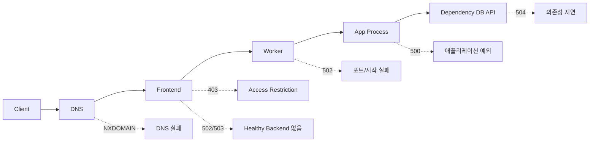

# Request Lifecycle: 3am에 터진 502를 어디서부터 봐야 할까

새벽 3시에 `502` 알람이 울리면, 가장 먼저 해야 할 일은 로그를 많이 여는 것이 아닙니다. 요청이 앱 코드까지 오기 전에 어디에서 멈췄는지부터 구간을 나눠 보는 일입니다.

이 글은 Azure App Service 101 시리즈의 2번째 글입니다.

App Service의 요청 경로는 한 번에 보이지 않지만, DNS부터 Frontend, Worker, 앱 프로세스까지 단계를 나눠 보면 장애 대응 속도가 크게 빨라집니다. 여기서는 요청이 앱에 도달하기까지 어떤 홉을 지나고, 각 단계에서 어떤 실패 신호가 나타나는지 운영자 관점으로 따라가 보겠습니다.

---

> App Service의 요청 수명 주기는 안정적인 홉이 이어진 체인입니다. 체감 지연은 대개 가운데 warm-up 단계에서 생깁니다.

## 이 글에서 다룰 문제

- 요청이 앱에 도달하기 전에 Front End, ARR, Worker 같은 Azure 구성 요소를 어떤 순서로 거칠까요?
- ARR Affinity 쿠키는 무엇을 위해 존재하고, 언제 끄는 편이 맞을까요?
- Worker가 idle 상태에서 깨어날 때 warm-up 단계는 어느 정도 지연을 만들까요?
- 어떤 신호가 Worker 종료나 재시작을 유발하고, 그 영향이 사용자 요청에 어떻게 나타날까요?
- sticky routing은 수평 확장(horizontal scaling)과 어디에서 충돌할까요?

## 전체 요청 흐름

사용자 HTTP 요청은 앱에 도달하기 전에 아래 레이어를 지납니다.

```text
Client → DNS → Azure Load Balancer → App Service Frontend → Worker Instance → App Process
```

각 단계마다 다른 문제가 생길 수 있고, 그 결과로 보이는 에러 코드도 달라집니다.


*클라이언트에서 앱까지 이어지는 요청 경로*

---

## Stage 1: DNS와 글로벌 진입점

### DNS Resolution

요청은 앱 호스트 이름의 DNS 해석부터 시작합니다.

- **기본 도메인:** `<app-name>.azurewebsites.net`
- **커스텀 도메인:** `www.myapp.com` (`CNAME` 구성)

### TLS Handshake

DNS 해석이 끝나면 다음 순서가 이어집니다.

1. TLS handshake 수행
2. SNI(Server Name Indication)로 앱 식별
3. Host header로 올바른 앱에 라우팅

```bash
# Verify DNS resolution
nslookup myapp.azurewebsites.net

# Check TLS certificate
openssl s_client -connect myapp.azurewebsites.net:443 -servername myapp.azurewebsites.net
```

---

## Stage 2: Frontend Routing

App Service Frontend는 아래 역할을 맡습니다.

| 역할 | 설명 |
|------|-------------|
| TLS Termination | HTTPS 복호화 |
| Host Validation | 요청이 올바른 앱으로 향하는지 검증 |
| Access Restriction Evaluation | IP 제한, 인증 검사 |
| Instance Selection | 정상 Worker로 라우팅 |


*Frontend의 라우팅과 차단 검사*

### Frontend가 실패 지점일 때

정상 backend가 하나도 없으면 요청은 **앱 코드가 실행되기 전에** 실패합니다.

| Error Code | Meaning |
|------------|---------|
| `403` | 접근 제한에 의해 차단 |
| `502` | backend 연결 실패 |
| `503` | 서비스 사용 불가 |

```bash
# Check access restriction settings
az webapp config access-restriction show \
 --resource-group $RG \
 --name $APP_NAME \
 --output json
```

**예시 출력:**
```json
{
 "ipSecurityRestrictions": [
 {
 "action": "Allow",
 "ipAddress": "203.0.113.0/24",
 "name": "corp-office",
 "priority": 100
 }
 ]
}
```

앱 로그가 비어 있는데 `403`만 보인다면, 애플리케이션보다 Frontend 정책을 먼저 확인해야 합니다.

---

## Stage 3: Worker Reverse Proxy

Worker 인스턴스 안에서는 로컬 reverse proxy가 요청을 앱 프로세스로 전달합니다.

### Port Contract

핵심은 하나입니다. 앱은 반드시 **플랫폼이 제공한 포트에 바인딩**해야 합니다.

```python
# Hardcoded local port
app.run(host="0.0.0.0", port=5000)

# Read the port from the environment
import os
port = int(os.environ.get("PORT", 8000))
app.run(host="0.0.0.0", port=port)
```

**자주 하는 실수:**
- 로컬에서는 되는데 배포 후 실패함
- 프로세스는 떠 있지만 요청은 실패함

이 문제는 결국 “프로세스가 실행 중인가”가 아니라 “플랫폼과 실행 계약을 맞췄는가”의 문제입니다.

---

## Stage 4: Application Execution

이제 요청이 앱 코드에 도달합니다.

### 성능에 영향을 주는 요소

| Factor | Description |
|--------|-------------|
| CPU/Memory usage | 인스턴스 리소스 포화 |
| External dependencies | DB, API 호출 지연 |
| Threads/Event loop | 동시성 한계 |
| Connection pools | outbound 연결 관리 |

### 응답 반환 경로

응답은 반대 순서로 돌아갑니다.

```text
App → Worker → Frontend → Load Balancer → Client
```

플랫폼은 이 경로에서 다음 헤더를 추가할 수 있습니다.

- 압축 관련 헤더
- 보안 헤더
- reverse proxy 메타데이터

---

## Timeouts and Connection Behavior

### Platform Timeouts

App Service에는 여러 층의 timeout이 있습니다.

| Timeout | Impact |
|---------|--------|
| Frontend request timeout | 긴 요청이 `504 Gateway Timeout`으로 끝남 |
| Idle connection timeout | idle 소켓 종료 |
| Slow dependencies | 큐 적체, tail latency 증가 |

### 설계 가이드라인

```python
# Long-running work inside the request path
@app.route('/export')
def export():
 # 10-minute data processing...
 return huge_result # Timeout risk!

# Hand the long job off to async processing
@app.route('/export')
def export():
 job_id = queue_export_job()
 return {"status": "accepted", "jobId": job_id}, 202
```

**원칙:**
- 대화형 요청은 짧게 유지합니다 (`< 30`초 권장).
- 긴 작업은 background로 넘깁니다.
- `202 Accepted`를 반환하고 poll 또는 webhook으로 이어갑니다.

---

## Instance Selection and Session Affinity

### 기본 동작: Round Robin

Frontend는 기본적으로 정상 인스턴스들 사이에 트래픽을 분산합니다.

### Session Affinity (ARR Affinity)

특정 클라이언트를 같은 인스턴스에 고정할 수도 있습니다.

```text
Client A ─(Affinity Cookie)─→ Instance 2
Client B ─(Affinity Cookie)─→ Instance 1
```

**트레이드오프:**

| Pros | Cons |
|------|------|
| 레거시 세션 코드 지원 | 부하 분산 불균형 |
| 인메모리 캐시 활용 | 인스턴스 장애에 취약 |

**권장:** 세션과 상태는 **외부 저장소**(Redis, DB)에 둡니다.

```bash
# Disable ARR Affinity
az webapp update \
 --resource-group $RG \
 --name $APP_NAME \
 --client-affinity-enabled false
```

---

## Health Check and Traffic Eligibility

Health Check는 인스턴스가 트래픽을 받을 자격이 있는지 판단합니다.

### 상태별 동작

| State | Traffic |
|-------|---------|
| Healthy | 라우팅 풀에 포함 |
| Unhealthy | 라우팅 풀에서 제거 |
| Recovering | probe 통과 후 다시 포함 |


*Health Check에 따른 인스턴스 상태 변화*

### Health Probe 설계 원칙

```python
@app.route('/health')
def health():
    # 1. Keep it lightweight
    # 2. Check only dependencies critical for traffic handling
    # 3. Avoid slow external calls

    try:
        # Simple check of critical dependencies
        db.execute("SELECT 1")
        return {"status": "healthy"}, 200
    except Exception as e:
        return {"status": "unhealthy", "reason": str(e)}, 503
```

Health endpoint는 진단 보고서가 아니라 라우팅 신호입니다. 무거운 외부 호출을 몰아넣으면 정상 인스턴스도 unhealthy 판정을 받을 수 있습니다.

---

## Impact of Deployment Slots

Deployment Slot은 배포 중 사용자 영향도를 줄이는 데 도움이 됩니다.

### Slot Swap Process

1. 새 버전을 Staging Slot에 배포
2. Staging에서 warm-up 완료
3. Production은 계속 트래픽 처리
4. Slot Swap으로 트래픽 전환

**장점:**
- cold start 노출 감소
- 실패한 배포를 쉽게 rollback 가능

---

## Observability: Tracing the Entire Lifecycle

문제를 진단하려면 각 단계를 관측 신호와 연결해야 합니다.

### Correlation Signals

| Signal | Purpose |
|--------|---------|
| Request logs | 상태 코드 분포 파악 |
| Frontend diagnostics | 플랫폼 레벨 오류 파악 |
| Instance restarts | 안정성 문제 파악 |
| Dependency timing | 외부 호출 병목 파악 |
| Correlation ID | 요청 단위 추적 |

### Log Configuration

```bash
# Enable HTTP logging
az webapp log config \
 --resource-group $RG \
 --name $APP_NAME \
 --application-logging filesystem \
 --detailed-error-messages true \
 --failed-request-tracing true \
 --web-server-logging filesystem

# Real-time log stream
az webapp log tail \
 --resource-group $RG \
 --name $APP_NAME
```

---

## Common Failure Patterns


*상태 코드와 실패 레이어의 대응 관계*

| Symptom | Suspected Layer | First Check |
|---------|----------------|-------------|
| 403 (no app logs) | Frontend | 접근 제한, 인증 설정 |
| 502/503 spike | Worker/app startup | 재시작 이벤트, Health probe |
| 504 responses | Long request path | 의존성 지연, 요청 설계 |
| Intermittent timeouts | Outbound | SNAT, connection pool |

### Troubleshooting Workflow

1. **Check Frontend**: DNS/TLS/access restrictions
2. **Check Worker**: Health status, restart events
3. **Check App Process**: Ready state, port binding
4. **Check Dependencies**: External call latency, connection issues

---

## 운영 체크리스트

---

## Portal 기준 진단 순서: 502를 10분 안에 좁히는 루틴

CLI만으로도 충분하지만, 온콜 상황에서는 Portal 화면을 동시에 열어 두는 편이 빠릅니다. 아래 순서는 실제로 502/503 알람이 왔을 때 자주 쓰는 흐름입니다.

1. **Overview에서 증상 확인**: 최근 5분 요청 수, 5xx 비율, 응답 시간 급증 여부를 먼저 봅니다.
2. **Diagnose and solve problems**: `Availability and Performance`에서 플랫폼 추천 이슈를 확인합니다.
3. **Metrics**: `Http 5xx`, `Response Time`, `Requests`를 같은 시간축으로 겹쳐 원인 후보를 줄입니다.
4. **Log stream**: 앱 로그가 전혀 없는 502인지, 앱 예외가 쏟아지는 502인지 분기합니다.
5. **Health check**: 인스턴스별 healthy/unhealthy 전환 시점을 확인합니다.

### Portal에서 반드시 같이 보는 두 화면

- `App Service -> Monitoring -> Metrics`
- `App Service -> Diagnose and solve problems`

두 화면을 동시에 보면, "요청 자체가 앱까지 안 왔다"와 "앱까지 왔지만 실패했다"를 빠르게 분리할 수 있습니다.

---

## Mermaid로 보는 실패 지점 분해

아래 다이어그램은 요청이 지나가는 단계와 대표 실패 코드를 한 장으로 묶은 것입니다.



이 그림의 핵심은 간단합니다. `502`라도 Frontend, Worker, 앱 시작 실패가 모두 가능하므로 단일 원인으로 단정하면 안 됩니다.

---

## 실제 오류 메시지와 1차 진단 포인트

운영에서 자주 보는 오류 문자열은 아래와 같습니다.

```text
502 Bad Gateway
The specified CGI application encountered an error and the server terminated the process.

Container didn't respond to HTTP pings on port: 8000, failing site start.

HTTP Error 403.503 - Forbidden
The service is unavailable.
```

각 메시지를 보면 우선 확인 지점이 다릅니다.

| 오류 메시지 | 가장 먼저 볼 위치 | 의미 |
|---|---|---|
| `Container didn't respond to HTTP pings on port ...` | Startup command, `PORT` 바인딩 | 앱이 플랫폼 계약 포트를 열지 못함 |
| `HTTP Error 403.503` | Access restriction, 인증/인가 정책 | 앱 코드 이전 단계에서 차단 |
| `502 Bad Gateway` + 앱 로그 없음 | Frontend/Worker 상태 | 앱까지 요청이 안 내려감 |
| `500` + 앱 스택트레이스 | 앱 로그, 의존성 로그 | 코드 또는 외부 의존성 오류 |

---

## Before/After: 라우팅 감각이 없는 팀 vs 있는 팀

### Before

- 알람이 울리면 바로 앱 코드부터 디버깅합니다.
- 403, 502, 504를 동일한 장애로 취급합니다.
- 로그를 많이 열어도 어떤 로그가 기준인지 합의가 없습니다.

### After

- 상태 코드를 레이어별로 분류하고 진입점부터 확인합니다.
- 10분 안에 `Frontend/Worker/App/Dependency` 중 한 레이어로 범위를 좁힙니다.
- 대응 로그가 표준화되어 온콜 교대 시 정보 손실이 줄어듭니다.

운영 품질 차이는 대개 도구 수보다 분해 순서에서 나옵니다.

---

## 요청 실패를 HTTP 레벨에서 재현하는 실습

온콜 대응력을 높이려면 실패를 의도적으로 만들어 보고, 어떤 계층에서 어떤 응답이 나오는지 몸으로 익히는 과정이 필요합니다. 아래 예시는 `curl` 하나로 요청 레이어를 분해하는 방법입니다.

```bash
# 1) DNS 확인
nslookup "$APP_NAME.azurewebsites.net"

# 2) TLS/SNI 확인
openssl s_client -connect "$APP_NAME.azurewebsites.net:443" -servername "$APP_NAME.azurewebsites.net" </dev/null

# 3) Host 헤더를 강제로 바꿔 404/400 계층 확인
curl -i "https://$APP_NAME.azurewebsites.net/" -H "Host: invalid.example.com"

# 4) 정상 Host에서 health 확인
curl -i "https://$APP_NAME.azurewebsites.net/health"
```

`Host`를 잘못 넣었을 때 앱 로그가 비어 있고 즉시 오류가 반환되면, 요청이 앱 프로세스까지 내려가지 않았다는 신호입니다. 반대로 앱 스택트레이스가 남으면 런타임 이후 레이어를 봐야 합니다.

## ARM/Bicep 관점에서 보는 접근 제한 정책

운영 환경에서는 포털 수동 변경보다 선언형 구성이 안전합니다. 접근 제한을 템플릿으로 정의하면 변경 이력이 남고 리뷰가 쉬워집니다.

```json
{
  "$schema": "https://schema.management.azure.com/schemas/2019-04-01/deploymentTemplate.json#",
  "contentVersion": "1.0.0.0",
  "resources": [
    {
      "type": "Microsoft.Web/sites/config",
      "apiVersion": "2023-12-01",
      "name": "[concat(parameters('appName'), '/web')]",
      "properties": {
        "ipSecurityRestrictions": [
          {
            "ipAddress": "203.0.113.0/24",
            "action": "Allow",
            "priority": 100,
            "name": "corp-office"
          },
          {
            "ipAddress": "0.0.0.0/0",
            "action": "Deny",
            "priority": 200,
            "name": "deny-all"
          }
        ]
      }
    }
  ]
}
```

정책을 코드로 관리하면 `403` 이슈가 발생했을 때 "누가 언제 어떤 CIDR을 추가했는가"를 바로 추적할 수 있습니다.

## 요청/응답 예시로 보는 진단 분기

아래처럼 응답 헤더와 본문 패턴을 같이 보면 1차 분기가 빨라집니다.

```text
GET /health HTTP/1.1
Host: app-demo.azurewebsites.net

HTTP/1.1 200 OK
Content-Type: application/json
X-Correlation-ID: 2f1f...
{"status":"healthy"}
```

```text
GET /api/orders HTTP/1.1
Host: app-demo.azurewebsites.net

HTTP/1.1 502 Bad Gateway
Content-Type: text/html
```

첫 번째처럼 JSON 응답이 나오면 앱까지 도달했을 가능성이 큽니다. 두 번째처럼 앱 표준 응답 형식이 전혀 없으면 Frontend-Worker 구간을 먼저 확인하는 편이 빠릅니다.

---

## Azure CLI 재현 시나리오: 403과 502를 의도적으로 만들어 보기

장애를 잘 다루려면 정상 시점에 재현 연습이 필요합니다.

### 시나리오 A: 접근 제한으로 403 만들기

```bash
# 현재 공인 IP 확인
MY_IP=$(curl -s https://ifconfig.me)

# 내 IP만 허용, 나머지 차단
az webapp config access-restriction add \
  --resource-group $RG \
  --name $APP_NAME \
  --rule-name allow-my-ip \
  --action Allow \
  --ip-address "$MY_IP/32" \
  --priority 100

az webapp config access-restriction add \
  --resource-group $RG \
  --name $APP_NAME \
  --rule-name deny-all \
  --action Deny \
  --ip-address "0.0.0.0/0" \
  --priority 200
```

**예상 관찰:** 허용되지 않은 네트워크에서 접근 시 `403`이 나오고 앱 로그는 비어 있습니다.

### 시나리오 B: 포트 바인딩 오류로 502 만들기

```bash
# 잘못된 startup command로 고의 실패
az webapp config set \
  --resource-group $RG \
  --name $APP_NAME \
  --startup-file "gunicorn --bind=0.0.0.0:9999 src.app:app"

az webapp restart --resource-group $RG --name $APP_NAME
```

**예상 관찰:** 플랫폼 로그에 `Container didn't respond to HTTP pings on port` 패턴이 나타나고 외부 요청은 502/503으로 실패합니다.

복구는 즉시 원래 startup command로 되돌린 뒤 재시작합니다.

---

## 타임아웃 설계: 요청 경로에서 오래 잡지 않기

요청 경로에서 60초 이상 걸리는 작업이 누적되면, 앱이 정상이라도 플랫폼 타임아웃과 큐 적체로 장애처럼 보일 수 있습니다.

```yaml
# 비동기 작업 전환 예시(개념)
request_path:
  endpoint: /reports/export
  behavior: returns-202
  handoff: queue
worker_path:
  trigger: queue-message
  action: generate-report
  output: blob-storage
```

실무에서는 `요청-응답`과 `백그라운드 처리`를 분리해 tail latency를 안정화합니다.

---

## 처음 질문으로 돌아가기

- Front End, ARR, Worker를 어떤 순서로 거치는가? -> DNS -> Frontend -> Worker -> App 순서로 보며, 각 단계마다 실패 코드를 다르게 해석해야 합니다.
- ARR Affinity를 언제 끄는가? -> 세션 상태를 외부화했다면 기본은 끄고 균등 분산을 우선합니다.
- warm-up 지연은 어디서 생기는가? -> Worker 기동과 앱 초기화 구간에서 주로 발생하므로 startup 로그와 Health Check를 함께 봐야 합니다.
- Worker 재시작 신호는 어떻게 나타나는가? -> 5xx 스파이크, Health 상태 변화, startup 로그 패턴이 동시에 나타납니다.
- sticky routing은 scale과 어디서 충돌하는가? -> 인스턴스 편향과 scale-in 시 세션 손실에서 충돌합니다.

---

## 실전 트러블슈팅 워크북

### 케이스 1: 사용자 제보는 502인데 앱 로그가 비어 있는 경우

```bash
# 1) 앱 상태와 호스트 확인
az webapp show --resource-group $RG --name $APP_NAME --query "{state:state, host:defaultHostName}" --output json

# 2) 접근 제한 확인
az webapp config access-restriction show --resource-group $RG --name $APP_NAME --output json

# 3) 인스턴스 헬스와 재시작 이벤트 확인(Portal Metrics/Activity Log 병행)
```

이 경우는 앱 코드가 아니라 Frontend 정책 또는 Worker 준비 상태 문제일 가능성이 높습니다.

### 케이스 2: 배포 직후 503이 3~5분 지속되는 경우

- startup command가 잘못됐는지 확인합니다.
- 의존성 초기화가 과도하게 길어지는지 확인합니다.
- Health endpoint가 외부 의존성까지 무겁게 검사하는지 점검합니다.

```python
@app.route('/health')
def health():
    # 가벼운 준비 상태 확인만 수행
    return {"status": "healthy"}, 200
```

### 케이스 3: 같은 시간대에 504와 dependency timeout이 함께 증가하는 경우

- App Service 자체보다 외부 DB/API 지연을 우선 확인합니다.
- 요청-응답 경로에서 장시간 작업을 분리합니다.
- 큐 기반 비동기 처리로 전환합니다.

### 케이스 4: 특정 사용자만 간헐적으로 실패하는 경우

- 공통점이 쿠키/세션인지 확인합니다.
- ARR Affinity가 켜져 있다면 특정 인스턴스 편향을 의심합니다.
- 인스턴스별 실패율을 분리해 봅니다.

```kql
AppRequests
| where TimeGenerated > ago(1h)
| summarize total=count(), fail=countif(Success == false) by CloudRoleInstance
| extend failRate = fail * 100.0 / total
| order by failRate desc
```

---

## 명령어 북: 요청 경로 점검용

```bash
# 호스트와 상태 확인
az webapp show --resource-group $RG --name $APP_NAME --query "{state:state, host:defaultHostName}" --output json

# 접근 제한 규칙 확인
az webapp config access-restriction show --resource-group $RG --name $APP_NAME --output json

# 로그 스트림 연결
az webapp log tail --resource-group $RG --name $APP_NAME

# 앱 설정 중 포트/시작 관련 키 확인
az webapp config appsettings list --resource-group $RG --name $APP_NAME \
  --query "[?name=='WEBSITES_PORT' || name=='PORT' || name=='WEBSITE_RUN_FROM_PACKAGE']" --output table
```

온콜 상황에서는 명령 자체보다 명령 실행 순서가 중요합니다. 위 순서를 팀 표준으로 고정하면 대응 품질이 안정됩니다.

- [ ] Front End -> ARR -> Worker 경로를 타이밍 예산과 함께 다이어그램으로 남겼다
- [ ] ARR Affinity를 유지할 조건과 끌 조건을 문서화했다
- [ ] 대표 앱에서 cold-start와 warm-instance latency를 직접 측정했다
- [ ] Worker recycle 이벤트에 대한 알림을 연결했다
- [ ] sticky routing이 scale에 미치는 영향을 용량 계획에 반영했다

---

## 정리

Request Lifecycle을 단계별로 이해하면 장애 대응의 출발점이 분명해집니다.

- **문제가 난 레이어를 빠르게 좁힐 수 있습니다.**
- **어떤 로그와 메트릭을 먼저 봐야 할지 정해집니다.**
- **증상에 맞는 해결책을 더 빨리 적용할 수 있습니다.**

`502` 하나만 봐도 DNS, Frontend, Worker, 앱 프로세스, 외부 의존성 중 어디를 먼저 봐야 할지 감이 생기면 절반은 끝난 셈입니다.

<!-- toc:begin -->
## 시리즈 목차

- [Azure App Service란? - 플랫폼 아키텍처 이해하기](./01-what-is-app-service.md)
- **Request Lifecycle: 3am에 터진 502를 어디서부터 봐야 할까 (현재 글)**
- Hosting Models: 어떤 플랜을 선택해야 할까? (예정)
- 첫 번째 배포: 로컬에서 Azure까지 (Python/Flask) (예정)
- Configuration 마스터하기: App Settings & 환경변수 (예정)
- 로그와 모니터링 기초: “앱이 느려요”에 답할 수 있는 상태 만들기 (예정)
- Scaling 101: 언제 Scale Up vs Scale Out? (예정)

<!-- toc:end -->

---

## 참고 자료

### 공식 문서
- [Deployment Slots in App Service (Microsoft Learn)](https://learn.microsoft.com/azure/app-service/deploy-staging-slots)
- [Inbound and outbound IPs (Microsoft Learn)](https://learn.microsoft.com/azure/app-service/overview-inbound-outbound-ips)
- [Troubleshoot diagnostic logs (Microsoft Learn)](https://learn.microsoft.com/azure/app-service/troubleshoot-diagnostic-logs)

### 관련 시리즈
- [Azure Functions 101](../../azure-functions-101/ko/)

---

- [이 글의 예제 코드 (book-examples)](https://github.com/yeongseon-books/book-examples/tree/main/azure-app-service-101/ko/02-request-lifecycle)

Tags: Azure, App Service, Cloud, Web Apps
