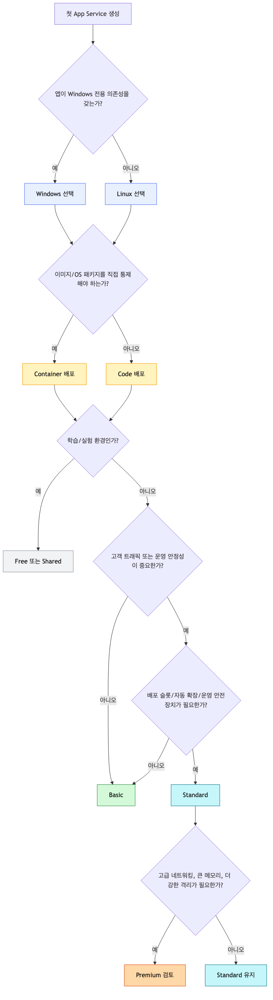
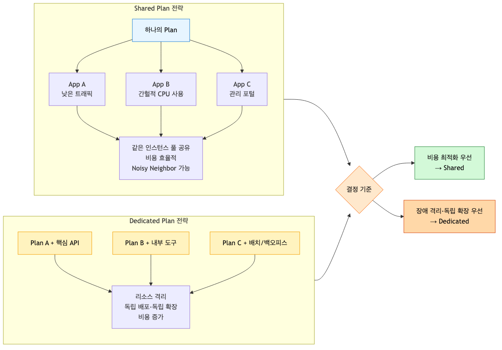
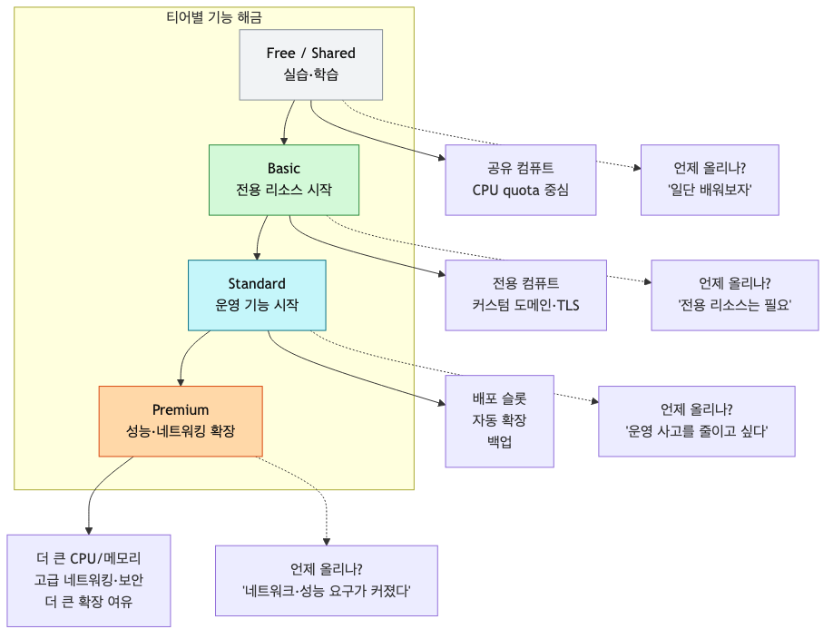

# Hosting Models: 어떤 플랜을 선택해야 할까?

처음 App Service를 만들 때 헷갈리는 이유는, 선택지가 많아서가 아니라 **선택 기준이 안 보이기 때문**입니다. 포털은 OS, 배포 방식, 요금제 티어를 한 번에 물어보지만, 실제로는 이 세 가지를 따로따로 고민하면 됩니다.

이 글은 기능 카탈로그가 아니라 **의사결정 가이드**입니다. 끝까지 읽고 나면 다음 세 가지를 스스로 결정할 수 있어야 합니다.

- 내 앱은 **Linux vs Windows** 중 무엇이 맞는가?
- 이번 배포는 **Code vs Container** 중 무엇으로 시작해야 하는가?
- 내 예산과 운영 요구사항에 맞는 티어는 **Free/Basic/Standard/Premium 중 어디**인가?

---

## 먼저 결론: 대부분의 첫 선택은 이 조합이다

대부분의 팀에게 첫 App Service 조합은 아래에서 크게 벗어나지 않습니다.

- **OS**: 특별한 이유가 없으면 **Linux**
- **배포 모델**: 특별한 이미지 제어가 필요 없으면 **Code**
- **티어**:
  - 학습/데모: **Free (Linux/Windows 모두 지원)**
  - 개인 프로젝트/아주 작은 내부 앱: **Basic**
  - 팀이 실제 운영하는 서비스: **Standard 이상**
  - 네트워킹, 성능 여유, 조직 표준이 중요: **Premium 검토**

왜 이런 결론이 나오는지는 아래에서 차근차근 보겠습니다.

---

## 선택 순서: OS → 배포 모델 → 티어

호스팅 모델을 고를 때 순서를 거꾸로 잡으면 자꾸 과소설계하거나 과금이 튑니다. 가장 실용적인 순서는 아래입니다.

1. **OS를 고른다** — 앱이 요구하는 런타임과 운영 습관을 맞춘다.
2. **배포 모델을 고른다** — 플랫폼에 맡길지, 이미지를 직접 관리할지 정한다.
3. **티어를 고른다** — 필요한 기능과 예산을 맞춘다.

여기서 봐야 할 점은 하나입니다. **티어는 마지막에 고르는 게 맞습니다.** 먼저 Linux/Windows, Code/Container를 정해야 어떤 제약이 생기는지 보입니다.

---

## App Service Plan은 “앱 하나의 가격표”가 아니라 “리소스 풀”이다

초보자가 가장 많이 오해하는 지점이 여기입니다.

App Service Plan은 웹앱 하나를 의미하지 않습니다. **앱들이 올라가는 컴퓨팅 묶음**입니다. 같은 Plan 안에 여러 앱을 넣을 수 있고, 그 앱들은 같은 VM 인스턴스 집합을 함께 씁니다.

즉, 과금도 보통 **앱 수 기준이 아니라 Plan의 인스턴스 기준**으로 이해해야 합니다.

### Plan이 실제로 결정하는 것

| 항목 | 의미 |
|---|---|
| OS | Windows인지 Linux인지 |
| Region | 리소스가 어느 리전에 생성되는지 |
| VM 크기 | CPU/메모리 여유 |
| 인스턴스 수 | Scale out 가능한 개수 |
| 티어 기능 | Slots, Autoscale, 고급 네트워킹 등 |
| 비용 구조 | 무료/공유/전용/격리 여부 |

### 비용 관점에서 꼭 기억할 사실

- **Free**는 무료지만 프로덕션용이 아닙니다.
- **Shared**는 **Windows 전용**이며, 앱별 CPU quota 기반 사고방식입니다.
- **Basic 이상**은 대체로 **Plan 인스턴스당 과금**입니다.
- 같은 Plan에 앱 1개를 넣든 3개를 넣든, **Plan 크기와 인스턴스 수가 같으면 비용은 거의 같습니다.**
- 반대로 앱을 Plan 둘로 나누면 격리는 좋아지지만, **비용도 거의 두 배 방향**으로 갑니다.

이 한 문장으로 요약할 수 있습니다.

> App Service는 “앱을 몇 개 올렸느냐”보다 “어떤 Plan을 몇 대 돌리느냐”가 비용을 좌우합니다.

---

## 공유 리소스냐, 전용 리소스냐: 여기서 비용과 안정성이 갈린다

App Service의 티어를 이해하는 가장 쉬운 방법은 **shared vs dedicated**로 나누는 것입니다.

### Shared Compute: Free / Shared (Shared는 Windows 전용)

"클라우드에서 App Service를 익히는 단계"에 가깝습니다.

- 다른 고객의 앱과도 같은 기반 리소스를 공유할 수 있음
- CPU quota 기반, Scale out 불가, SLA 기대치 낮음

**좋은 선택**: 강의/스터디 실습, 포털 익히기, 하루에 몇 번만 접근하는 샘플 앱

**나쁜 선택**: 고객이 쓰는 서비스, 성능 분석이 필요한 환경, 운영 기능(커스텀 도메인, 슬롯, 자동 확장)이 필요한 경우

### Dedicated Compute: Basic / Standard / Premium

이 구간부터는 리소스가 **내 Plan에 전용으로 배정**됩니다. 다만 전용이라고 해도 **앱별 전용이 아니라 Plan별 전용**입니다. 같은 Plan에 앱 4개를 넣으면 그 4개는 여전히 서로 경쟁합니다.

운영에서 핵심 질문:

> 이 앱을 다른 앱과 같은 Plan에 태워도 되는가, 아니면 독립된 Plan이 필요한가?

### Isolated

규정 준수, 강한 네트워크 격리, 조직 단위의 엄격한 요구사항이 있는 경우의 영역입니다. App Service 입문 글에서 기본 선택지로 권할 티어는 아닙니다.

---

## 티어는 기능보다 “운영 사고 예방 비용”으로 봐야 한다

많은 비교표가 티어별 기능만 나열하지만, 실제로는 아래처럼 해석해야 합니다.

### Free / Shared

**돈은 거의 안 들지만, 운영 판단을 내릴 수 있는 환경도 아닙니다.**

- 비용 실험용
- 프로덕션 판단 기준으로 쓰기 어려움
- “잘 돌아간다”보다 “일단 올려봤다”에 가까움

### Basic

**전용 리소스를 가장 싸게 사는 구간**입니다.

좋은 점:

- 같은 VM을 남과 공유하지 않음
- 커스텀 도메인과 TLS 같은 기본 운영 요구에 접근 가능
- 작은 내부 도구나 트래픽이 낮은 서비스에는 현실적 출발점

제약:

- 자동 확장과 배포 슬롯 같은 운영 안전장치가 아쉬움
- “배포 실패 시 안전하게 되돌리기”나 “피크 대응”을 티어가 도와주지 않음

즉, Basic은 **싸게 시작하는 전용 플랜**이지, **안심하고 운영하는 프로덕션 플랜**은 아닙니다.

### Standard

많은 팀에게 Standard는 첫 번째 “운영 가능한” 티어입니다.

이유는 성능 때문만이 아니라 **운영 기능** 때문입니다.

- **Deployment Slots**: 배포를 바로 프로덕션에 꽂지 않아도 됨
- **Autoscale**: 수동 대응이 아니라 조건 기반 대응 가능
- **Backups 등 운영 기능**: 실서비스 운영 습관과 맞아짐

프로덕션에서 Standard가 자주 추천되는 이유는 “더 빠르다”보다 **사고를 줄인다**에 있습니다.

### Premium

Premium은 단순히 “더 비싼 Standard”가 아닙니다. 보통 아래 상황에서 의미가 커집니다.

- 더 큰 CPU/메모리 헤드룸이 필요함
- 인스턴스 밀도와 확장성이 중요함
- 고급 네트워킹/보안 요구가 강함
- 조직 표준상 스테이징, 네트워크 연결, 격리 요건이 더 엄격함

특히 **VNet 통합, 프라이빗 접근, 더 공격적인 확장 전략**을 실무에서 고민하기 시작하면 Premium 검토가 빨라집니다.

---

## 어떤 기능이 어느 시점에 열리는가

아래 그림은 “기능표”라기보다 **업그레이드 트리거 표**로 보는 편이 낫습니다.

실무적으로는 이렇게 기억하면 충분합니다.

- **Free/Shared**: 실습용
- **Basic**: 전용 리소스 시작점, 기본 운영만
- **Standard**: 배포 슬롯/자동 확장 등 운영 필수품 시작점
- **Premium**: 더 큰 성능 여유와 고급 네트워킹/보안 요구 대응

### 업그레이드가 필요한 전형적인 순간

- “스테이징 슬롯 없이 바로 배포하는 게 무섭다” → **Standard 이상**
- “트래픽이 튈 때 수동 대응하고 싶지 않다” → **Standard 이상**
- “사내 네트워크와 붙이거나 더 강한 격리가 필요하다” → **Premium 검토**
- “실습이 아니라 고객 트래픽이 들어온다” → **Free/Shared 제외**

---

## Linux vs Windows: 기술보다 의존성의 문제다

이 선택은 감성 문제가 아닙니다. **내 앱이 어떤 런타임과 운영 전제를 갖고 있느냐**의 문제입니다.

### Linux를 기본값으로 두면 좋은 경우

- Python, Node.js, Go, Java 같은 모던 스택
- 컨테이너 기반 운영을 염두에 둠
- 팀이 POSIX 환경에 익숙함
- 특별한 Windows 전용 구성요소가 없음

Linux가 무난한 이유:

- App Service에서 현대적인 웹 워크로드와 잘 맞음
- Code → Container 전환 사고방식이 자연스러움
- 팀이 Docker/OCI 이미지를 다룰 가능성이 높다면 더 일관적임

### Windows를 먼저 고려해야 하는 경우

- .NET Framework 같은 **Windows 의존 워크로드**
- IIS/Windows 컴포넌트 전제를 가진 레거시 앱
- 특정 네이티브 라이브러리나 설치 방식이 Windows에 묶여 있음
- 운영팀의 진단/배포 습관이 Windows 기준임

### 현실적인 권장안

| 상황 | 권장 |
|---|---|
| 새 Python/Flask, FastAPI, Django 앱 | **Linux + Code**부터 시작 |
| 새 Node/Express, Next.js 백엔드 | **Linux + Code** 우선 검토 |
| .NET Framework 레거시 웹앱 | **Windows** 검토 |
| 이미지/패키지 의존성이 복잡한 앱 | **Linux + Container** 검토 |

### 실전 시나리오

**Python 중심 팀이라면**

대부분은 **Linux + Code + Standard**가 가장 무난합니다. 운영팀이 컨테이너 레지스트리와 베이스 이미지 패치까지 관리할 준비가 아직 없다면, 처음부터 Container로 갈 이유가 약합니다.

**레거시 ASP.NET on .NET Framework를 운영 중이라면**

거의 자동으로 **Windows** 쪽으로 기웁니다. “요즘은 다 Linux”라는 말보다 현재 앱의 의존성이 더 중요합니다.

**나중에 컨테이너 표준화를 할 계획이라면**

처음부터 Linux를 고르면 이후 전환이 매끄럽습니다.

---

## Code vs Container: 제어권이 필요할 때만 Container로 간다

이 선택도 많이 과하게 고민합니다. 기준은 의외로 단순합니다.

> **플랫폼에 맡겨도 되면 Code, 이미지를 직접 통제해야 하면 Container**

### Code 기반 배포

Code 기반은 App Service가 언어 런타임과 플랫폼 통합을 최대한 맡아주는 방식입니다.

좋은 점:

- 시작이 빠름
- 플랫폼이 배포 경험을 단순화함
- 첫 번째 배포와 트러블슈팅이 쉬움

아쉬운 점:

- 베이스 OS/이미지 구성이 완전히 내 뜻대로 되진 않음
- 런타임 제어 범위가 컨테이너보다 좁음

**이런 팀에 맞습니다**

- 빠르게 첫 배포를 끝내야 하는 팀
- 애플리케이션 로직에 집중하고 싶은 팀
- Python/Node/.NET 최신 런타임을 비교적 표준적으로 사용하는 팀

### Container 기반 배포

Container는 자유도가 높습니다. 대신 자유도의 대부분은 **운영 책임**으로 돌아옵니다.

좋은 점:

- 베이스 이미지와 시스템 패키지를 직접 통제 가능
- 로컬, CI, 운영 환경의 일관성이 높아짐
- 복잡한 네이티브 의존성 대응이 쉬움

아쉬운 점:

- 이미지 취약점 패치 책임이 팀에 있음
- ACR/Dockerfile/빌드 파이프라인까지 관리 범위가 넓어짐
- 느린 이미지 풀/부팅이 시작 시간에 직접 영향을 줌

**이런 팀에 맞습니다**

- OS 레벨 패키지가 필요한 팀
- 로컬과 클라우드 환경을 최대한 동일하게 맞춰야 하는 팀
- 이미 컨테이너 운영 체계가 있는 팀

### 실전 시나리오

**앱이 requirements.txt 기반의 일반적인 Flask 앱이라면**

대부분은 **Code**가 낫습니다. 시리즈 04에서 바로 배포를 해볼 예정이므로, 여기서도 그 경로를 기본값으로 잡겠습니다.

**앱에 ffmpeg, wkhtmltopdf, 커스텀 시스템 라이브러리, 정확한 OS 패키지가 필요하다면**

그때는 **Container**가 더 현실적입니다. “될 수도 있겠지”가 아니라 “이미지 안에서 확실히 재현된다”가 중요하기 때문입니다.

**플랫폼 팀이 이미 ACR, 이미지 스캐닝, 베이스 이미지 패치 정책을 갖추고 있다면**

Container 운영 비용이 상대적으로 낮아집니다. 이 경우 Container의 장점이 살아납니다.

---

## 공유 Plan vs 전용 Plan: 비용 절감 포인트이자 장애 전파 포인트

같은 Plan에 여러 앱을 올리는 전략은 비용 최적화에 강합니다. 하지만 리스크도 명확합니다.

### 같은 Plan에 여러 앱을 넣는 게 좋은 경우

- 내부 도구 여러 개가 모두 저트래픽임
- 트래픽 피크 시간이 서로 다름
- 운영팀이 앱별 격리보다 비용 최적화를 우선함

예를 들어 사내 어드민, 배치 상태 조회 API, 작은 사내용 포털을 **하나의 Standard Plan**에 묶으면 비용 효율이 좋습니다.

### 분리된 Plan이 필요한 경우

- 한 앱의 CPU/메모리 사용량이 출렁임
- 배포/확장 주기를 앱별로 따로 가져가야 함
- 장애 영향 범위를 줄여야 함
- 팀/환경 경계를 명확히 나눠야 함

즉, 아래 상황이라면 Plan 분리를 먼저 검토하세요.

- 고객 트래픽을 직접 받는 핵심 API
- 배포 슬롯과 확장 정책을 독립적으로 가져가야 하는 서비스
- “이 앱 하나가 문제 나도 나머지는 멀쩡해야 한다”가 중요한 경우

---

## 비용을 숫자가 아니라 구조로 이해하자

Azure 가격은 리전, 통화, 계약, 예약 여부에 따라 달라집니다. 그래서 블로그에 특정 숫자를 박아두면 금방 낡습니다. 대신 **비용 구조**를 이해하면 판단이 오래 갑니다.

### 비용 구조에서 중요한 네 가지

1. **Free를 제외하면 보통 컴퓨트는 계속 과금된다**
   - 앱을 stop 해도 Plan이 살아 있으면 비용이 계속 발생할 수 있습니다.
2. **Basic 이상은 앱 수보다 인스턴스 수가 중요하다**
   - 앱 1개냐 3개냐보다 B1 한 대냐 S1 두 대냐가 더 큰 차이를 만듭니다.
3. **Slots 자체가 따로 과금되는 게 아니라, 그 기능을 쓰기 위해 상위 티어를 산다**
   - “슬롯 하나 추가했더니 요금이 붙었다”가 아니라 “슬롯이 가능한 티어로 올렸더니 월비용이 커졌다”에 가깝습니다.
4. **고급 네트워킹은 거의 항상 더 비싼 선택으로 이어진다**
   - VNet 통합, 프라이빗 액세스, 강한 격리는 기능 비용이 아니라 **상위 티어 유도 비용**입니다.

### 현실적인 비용 비교 프레임

숫자 대신 아래처럼 비교하는 게 실무적입니다.

#### 시나리오 A: 작은 팀의 첫 운영 서비스

- 선택 1: **Basic 1개**
- 선택 2: **Standard 1개**

Basic이 당장 싸더라도, 배포 슬롯과 자동 확장이 없으면 배포 리스크와 수동 운영 비용이 커집니다. **운영 인건비까지 포함하면 Standard가 더 싼 경우가 자주 있습니다.**

#### 시나리오 B: 내부 앱 3개

- 선택 1: **Standard Plan 1개에 3개 앱 공유**
- 선택 2: **Basic Plan 3개로 분리**

겉보기엔 Basic 3개도 싸 보이지만, 합치면 생각보다 금액이 커집니다. 반대로 Standard 1개 공유는 비용 효율이 좋지만 noisy neighbor 리스크가 있습니다. 여기서 결정 기준은 **격리 필요성**입니다.

#### 시나리오 C: VNet 통합이 필요한 API

- 선택 1: Basic/Standard에서 버티기
- 선택 2: Premium 기준으로 설계

이 경우는 “최저가”보다 **요구사항 충족 여부**가 먼저입니다. 네트워킹 요구가 강하면 티어 업그레이드는 선택이 아니라 조건이 됩니다.

### 비용 때문에 오버엔지니어링하지 말아야 할 것

- 하루 만에 끝날 실험인데 Premium부터 올리는 것
- 아직 이미지 제어가 필요 없는데 Container부터 도입하는 것
- 작은 내부 앱인데 앱마다 Plan을 분리하는 것

### 비용 때문에 언더엔지니어링하지 말아야 할 것

- 고객 서비스인데 Free/Shared로 시작하는 것
- 프로덕션인데 슬롯 없이 바로 배포하는 것
- 핵심 앱을 여러 잡다한 앱과 같은 Plan에 태우는 것

---

## 빠른 추천: 어떤 팀이면 무엇을 고를까

### 1) 혼자 배우는 중이다

- **Linux + Code + Free**
- 목표: 구조 이해, 포털 익히기, 첫 배포 경험

### 2) 작은 사내 도구를 올린다

- **Linux + Code + Basic**
- 단, 배포 안정성이 중요하면 처음부터 **Standard**

### 3) 고객이 쓰는 첫 웹 API다

- **Linux + Code + Standard**
- 가장 무난한 출발점

### 4) Python 팀인데 시스템 패키지 의존성이 많다

- **Linux + Container + Standard 이상**
- 필요시 Premium 검토

### 5) Windows 의존 레거시 앱이다

- **Windows + Code 또는 Windows 친화적 배포 모델**
- 티어는 운영 요구에 맞춰 Basic/Standard/Premium 결정

### 6) 사내 네트워크와 안전하게 붙어야 한다

- **Premium 검토를 먼저**
- 네트워킹/보안 요구를 티어보다 먼저 확인

---

## 최종 체크리스트: 지금 내 선택이 과한가, 부족한가

배포 전에 아래 질문에 답해보세요.

| 질문 | 예 / 아니오 |
|---|---|
| 앱이 Windows 전용 의존성을 갖고 있는가? | 미확인 |
| 컨테이너 이미지 수준의 제어가 정말 필요한가? | 미확인 |
| 고객 트래픽을 받는데도 Free/Shared를 고르고 있진 않은가? | 미확인 |
| 배포 슬롯 없이 운영하려는가? 그렇다면 감당 가능한가? | 미확인 |
| 이 앱을 다른 앱과 같은 Plan에 넣어도 되는가? | 미확인 |
| 사내망 연결, 프라이빗 접근, 강한 격리가 필요한가? | 미확인 |
| 비용을 앱 개수가 아니라 Plan 인스턴스 기준으로 보고 있는가? | 미확인 |

체크하다 보면 대부분의 선택은 자연스럽게 좁혀집니다.

---

## 정리

App Service 호스팅 모델은 복잡해 보이지만, 실제 판단 기준은 몇 개 안 됩니다.

- **Linux vs Windows**: 유행보다 의존성
- **Code vs Container**: 제어권이 필요하냐 아니냐
- **Free/Basic/Standard/Premium**: 성능보다 운영 기능과 리스크 허용치
- **공유 vs 전용 Plan**: 비용 최적화와 장애 격리의 균형

가장 흔한 좋은 출발점은 여전히 이 조합입니다.

> **Linux + Code + Standard**

이 조합은 과하지 않으면서도, 실서비스 운영에 필요한 안전장치를 갖추기 쉽습니다.

다음 글에서는 여기서 내린 결정을 실제 리소스로 바꿉니다. 즉, **Python Flask 앱을 App Service에 처음 배포하는 과정**을 단계별로 진행합니다. 이번 글이 “무엇을 고를까”였다면, 다음 글은 “이제 정말 올려보자”입니다.

---

## 이 시리즈에서의 위치

이번 글은 App Service의 OS, 배포 모델, 플랜 티어를 어떤 기준으로 고를지 정리하는 의사결정 편입니다. 다음 글에서는 여기서 고른 Linux Code 기반 구성을 실제 Flask 앱 배포로 연결합니다.

---

<!-- toc:begin -->
## 시리즈 목차

- [Azure App Service란? - 플랫폼 아키텍처 이해하기](./01-what-is-app-service.md)
- [Request Lifecycle: 3am에 터진 502를 어디서부터 봐야 할까](./02-request-lifecycle.md)
- **Hosting Models: 어떤 플랜을 선택해야 할까? (현재 글)**
- 첫 번째 배포: 로컬에서 Azure까지 (Python/Flask) (예정)
- Configuration 마스터하기: App Settings & 환경변수 (예정)
- 로그와 모니터링 기초: “앱이 느려요”에 답할 수 있는 상태 만들기 (예정)
- Scaling 101: 언제 Scale Up vs Scale Out? (예정)

<!-- toc:end -->

---

## 참고 자료

### 공식 문서
- [App Service plan overview (Microsoft Learn)](https://learn.microsoft.com/azure/app-service/overview-hosting-plans)
- [Set up staging environments in Azure App Service (Microsoft Learn)](https://learn.microsoft.com/azure/app-service/deploy-staging-slots)
- [Custom container in App Service (Microsoft Learn)](https://learn.microsoft.com/azure/app-service/tutorial-custom-container)
- [App Service pricing (Azure)](https://azure.microsoft.com/pricing/details/app-service/)

### 관련 시리즈
- [Azure Functions 101](../../azure-functions-101/ko/)

---

**Tags:** `Azure` `App Service` `Cloud` `Pricing` `DevOps`

Tags: Azure, App Service, Cloud, Web Apps
