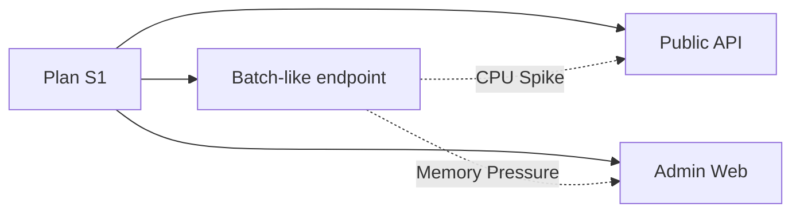

# Hosting Models: 어떤 플랜을 선택해야 할까?

App Service를 처음 만들 때 가장 먼저 부딪히는 질문은 “어떤 플랜을 골라야 하지?”입니다. Free, Basic, Standard, Premium에 Linux와 Windows, Code와 Container까지 한 번에 나오면 선택지가 많아 보여도 기준은 잘 보이지 않습니다.

이 글은 Azure App Service 101 시리즈의 3번째 글입니다.

여기서는 App Service 옵션 목록을 외우는 대신, OS, 배포 모델, 가격 티어를 어떤 순서와 기준으로 고르면 되는지 실무 의사결정 프레임으로 정리하겠습니다.

---

## 이 글에서 다룰 문제

- 같은 App Service에서도 코드 배포, 기본 제공 컨테이너(built-in container), 커스텀 컨테이너(custom container)는 무엇이 다를까요?
- Linux App Service에서 Docker 이미지를 실행할 때 startup command는 어떤 순서로 결정될까요?
- Windows 컨테이너는 왜 특정 SKU에서만 실행될까요?
- ZIP 배포와 컨테이너 배포는 롤백 전략이 어떻게 달라질까요?
- 같은 앱을 여러 호스팅 모델로 함께 운영하는 것이 실제로 가치 있는 시점은 언제일까요?

## Decision Flowchart

App Service 호스팅 전략을 고르는 흐름은 아래와 같습니다.

```text
1. Choose OS (Linux / Windows)
 ↓
2. Choose Deployment Model (Code / Container)
 ↓
3. Choose Plan Tier (Dev → Production)
```


*OS와 배포 모델을 거친 뒤의 플랜 선택 흐름*

> 티어를 먼저 고르기보다, OS와 배포 모델을 먼저 고르면 실제 제약이 보입니다. App Service 선택은 기능 표 읽기가 아니라 제약을 먼저 고르는 일에 가깝습니다.

---

## What is an App Service Plan?

App Service Plan은 앱이 실행되는 **컴퓨팅 리소스 풀**입니다.

### What the Plan Defines

| Item | Description |
|------|-------------|
| CPU/Memory | 인스턴스당 사용할 수 있는 리소스 |
| Max Instance Count | scale out 한도 |
| Feature Set | Autoscale, Slots, VNet 등 |
| Pricing & SLA | 비용과 가용성 보장 |

### Key Point: One Plan = Multiple Apps

여러 앱을 같은 Plan에 배포하면 **같은 컴퓨팅 리소스**를 공유합니다.

```text
[App Service Plan: Standard S1]
├── Web App A
├── Web App B 
└── API App C ← All share the same VM pool
```

즉 App Service Plan은 “앱 하나의 가격표”가 아니라 “앱 여러 개가 올라가는 리소스 묶음”으로 보는 편이 맞습니다.

---

## Plan Tier Comparison

### Features by Tier

| Tier | Use Case | Key Limitations |
|------|----------|-----------------|
| **Free/Shared** | 학습, 실험 | 공유 리소스, 제한된 기능 |
| **Basic** | 낮은 트래픽 | 운영 기능 제한 |
| **Standard** | 기본 프로덕션 | 중간 수준의 scale 한계 |
| **Premium** | 고성능, 네트워킹 | 더 높은 비용 |
| **Isolated** | 규정 준수, 네트워크 격리 | 최고 비용, 높은 복잡성 |

### Feature Requirements by Tier

| Feature | Minimum Tier |
|---------|-------------|
| Custom Domain | Shared |
| SSL Certificate | Basic |
| Deployment Slots | Standard |
| Autoscale | Standard |
| VNet Integration | Basic |
| Private Endpoint | Basic |
| Zone Redundancy | Premium |

### Practical Advice

> 프로덕션은 최소 Standard부터 시작하는 편이 안전합니다. Autoscale과 Deployment Slot 없이 운영하면 결국 사람이 직접 사고를 막아야 합니다.

VNet Integration과 Private Endpoint 자체는 Basic부터 사용할 수 있지만, 실제 프로덕션 시작선은 여전히 Autoscale과 Deployment Slot이 열리는 Standard로 보는 편이 맞습니다.

---

## OS Selection: Linux vs Windows

### Which OS to Choose?

| Consideration | Description |
|---------------|-------------|
| Existing standards | 팀이 익숙한 환경 |
| Dependency compatibility | 특정 라이브러리 요구사항 |
| Compliance | 엔터프라이즈 보안 정책 |
| Tooling/Observability | 디버깅 워크플로 |

### Practical Differences

| Aspect | Linux | Windows |
|--------|-------|---------|
| Startup speed | 대체로 더 빠름 | 약간 더 느림 |
| Container support | Native | 제한적 |
| Kudu/SCM | 기능이 제한적 | 기능이 더 풍부함 |
| Cost | 티어별 동일 | 동일 |

**권장:** 특별한 이유가 없다면 **Linux**를 먼저 검토합니다. 현대적인 스택과 더 잘 맞기 때문입니다.

```bash
# Create Linux Plan
az appservice plan create \
 --resource-group $RG \
 --name $PLAN_NAME \
 --location koreacentral \
 --sku S1 \
 --is-linux
```

---

## Deployment Model: Code vs Container

### Code-based Deployment

플랫폼이 런타임을 제공하고, 여러분은 코드만 배포합니다.

**Pros:**
- 빠른 온보딩
- container 관리 오버헤드 감소
- 강한 플랫폼 통합

**Cons:**
- base image 제어 범위가 제한됨
- 런타임 업데이트가 플랫폼 정책을 따름

```bash
# Create code-based web app
az webapp create \
 --resource-group $RG \
 --plan $PLAN_NAME \
 --name $APP_NAME \
 --runtime "PYTHON|3.11"
```

### Container-based Deployment

직접 만든 OCI 이미지를 빌드하고 배포합니다.

**Pros:**
- 런타임 스택 전체 제어 가능
- 로컬과 클라우드 환경 일관성
- OS 레벨 의존성 자유도

**Cons:**
- 패치 주기를 직접 관리해야 함
- 레지스트리 거버넌스 필요
- 이미지 품질이 startup 성능에 직접 영향

```bash
# Create container-based web app
az webapp create \
 --resource-group $RG \
 --plan $PLAN_NAME \
 --name $APP_NAME \
 --deployment-container-image-name myregistry.azurecr.io/myapp:latest
```

---

## Shared Plan vs Dedicated Plan


*공유 Plan과 전용 Plan의 트레이드오프*

### Shared Plan Strategy

여러 앱을 하나의 Plan에 올리는 방식입니다.

**Pros:**
- 비용 효율적임
- 트래픽 패턴이 다른 앱끼리 상호 보완 가능

**Cons:**
- 앱 사이 리소스 경쟁 발생(Noisy Neighbor)
- 한 앱의 문제가 다른 앱에 영향

### Dedicated Plan Strategy

중요한 앱마다 별도 Plan을 두는 방식입니다.

**Pros:**
- 리소스 격리
- 용량 예측이 쉬움
- blast radius 제한

**Cons:**
- 비용 증가

### Recommended Approach

```text
Business-critical apps → Dedicated Plan
Internal tools, low traffic apps → Shared Plan
```

운영에서는 “같은 Plan에 묶어도 되는가”가 비용과 안정성을 함께 가르는 질문이 됩니다.

---

## Feature Mapping

어떤 기능이 Plan에 의존하고, 어떤 기능이 배포 모델에 의존하는지 정리하면 아래와 같습니다.


*플랜 티어별 기능 가용성*

| Feature | Plan Dependent | Deployment Model Dependent |
|---------|----------------|---------------------------|
| Autoscale | Yes | No |
| Deployment Slots | Yes | No |
| Private Endpoint | Yes | No |
| VNet Integration | Yes | No |
| Custom Startup Image | No | Yes (Container) |
| Platform Build | No | Yes (Code) |

---

## Cost and Capacity Planning

### Capacity Planning Considerations

| Item | Question |
|------|----------|
| Traffic | Peak vs average request rate? |
| Resources | CPU-intensive vs IO-intensive? |
| Memory | Memory per request, background workers? |
| Startup time | Cold start frequency? |

### Practical Patterns

```text
1. Start with production-ready tier (Standard or higher)
2. Load test with actual traffic patterns
3. Configure Autoscale thresholds and cooldowns
4. Re-evaluate Plan size monthly
```

### Check Plan Info with CLI

```bash
az appservice plan show \
 --resource-group $RG \
 --name $PLAN_NAME \
 --query "{sku:sku, workers:numberOfWorkers, reserved:reserved}" \
 --output json
```

**예시 출력:**
```json
{
 "sku": {
 "name": "S1",
 "tier": "Standard",
 "capacity": 2
 },
 "workers": 2,
 "reserved": true
}
```

### Plan 티어를 고를 때 최소 검증 명령을 함께 실행합니다

표만 보고 티어를 고르면 실제 구독 제한이나 리전 제약 때문에 계획이 어긋날 수 있습니다. 후보 SKU를 정한 뒤에는 즉시 App Service 리소스 정보를 확인하는 루틴을 권장합니다.

```bash
# 현재 앱의 Plan SKU와 Linux 여부 확인
az webapp show \
  --resource-group $RG \
  --name $APP_NAME \
  --query "{name:name, state:state, reserved:reserved, serverFarmId:serverFarmId}" \
  --output json

# 현재 Plan의 SKU/worker 수 확인
az appservice plan show \
  --resource-group $RG \
  --name $PLAN_NAME \
  --query "{sku:sku.name, tier:sku.tier, workers:numberOfWorkers, maxWorkers:maximumNumberOfWorkers}" \
  --output json
```

이 과정을 배포 전 점검에 포함하면, "예상은 Standard였는데 실제는 Basic" 같은 설정 불일치를 조기에 잡을 수 있습니다. 특히 여러 팀이 같은 구독을 공유하는 환경에서는 IaC와 실제 리소스 상태가 어긋나는 경우가 자주 발생합니다.

### Scale 설정은 용량뿐 아니라 응답 지연 기준으로 함께 설계합니다

App Service에서 Scale Out은 인스턴스 수를 늘리는 기능이지만, 트리거를 CPU 하나에만 묶으면 I/O 병목을 놓칠 수 있습니다. 실무에서는 CPU와 HTTP queue, 응답 시간 경보를 함께 설계합니다.

```bash
# Autoscale 설정 예시 (기본 프로필)
az monitor autoscale create \
  --resource-group $RG \
  --resource $PLAN_NAME \
  --resource-type Microsoft.Web/serverfarms \
  --name autoscale-$PLAN_NAME \
  --min-count 2 \
  --max-count 6 \
  --count 2

# CPU 70% 이상 10분 지속 시 +1
az monitor autoscale rule create \
  --resource-group $RG \
  --autoscale-name autoscale-$PLAN_NAME \
  --condition "Percentage CPU > 70 avg 10m" \
  --scale out 1

# CPU 35% 이하 15분 지속 시 -1
az monitor autoscale rule create \
  --resource-group $RG \
  --autoscale-name autoscale-$PLAN_NAME \
  --condition "Percentage CPU < 35 avg 15m" \
  --scale in 1
```

운영에서 중요한 지점은 "최대 인스턴스"보다 "scale이 늦게 반응하지 않는가"입니다. 부하 테스트에서 P95 지연시간이 먼저 급증한다면 CPU 임계값만으로는 부족할 수 있으므로, 경보 조건을 재설계해야 합니다.

---

## Right-Sizing Checklist

Plan을 고르기 전에 아래를 점검합니다.

| Question | Check |
|----------|-------|
| Does it support required networking features? | |
| Does it support required deployment patterns? (Slots) | |
| Will Autoscale react before saturation? | |
| Is memory per instance sufficient at peak? | |
| Can dependent services handle increased load? | |

---

## 운영 체크리스트

---

## 호스팅 모델별 시작 실패 패턴

호스팅 모델은 선택 시점에만 중요한 것이 아니라, 장애 패턴을 결정합니다. 아래는 운영에서 자주 만나는 실패 유형입니다.

| 모델 | 대표 실패 메시지 | 첫 진단 포인트 |
|---|---|---|
| Linux Code | `ModuleNotFoundError` | Oryx 빌드 로그, `requirements.txt` |
| Linux Code | `Container didn't respond to HTTP pings on port` | startup command, `PORT` 바인딩 |
| Linux Custom Container | `Image pull failed` | ACR 인증, 태그 존재 여부 |
| Windows Code | `HTTP Error 500.30` | 프로세스 시작 로그, 런타임 버전 |

모델이 다르면 "같은 502"라도 확인해야 할 출발점이 달라집니다.

---

## 배포 방식별 롤백 전략

ZIP/Oryx와 컨테이너 배포는 롤백 단위가 다릅니다.

### ZIP/Oryx 배포

- 롤백 단위: 이전 배포 아티팩트 또는 slot swap
- 핵심 로그: Kudu deployment log, Oryx build log
- 복구 속도: staging slot이 있으면 빠름

```bash
# 최근 배포 이력 확인
az webapp log deployment list \
  --resource-group $RG \
  --name $APP_NAME \
  --output table

# staging 슬롯과 swap
az webapp deployment slot swap \
  --resource-group $RG \
  --name $APP_NAME \
  --slot staging \
  --target-slot production
```

### 컨테이너 배포

- 롤백 단위: 이미지 태그 또는 digest
- 핵심 로그: image pull, container startup log
- 복구 속도: 태그 관리 품질에 좌우

```bash
# 이전 안정 태그로 되돌리기
az webapp config container set \
  --resource-group $RG \
  --name $APP_NAME \
  --container-image-name myregistry.azurecr.io/myapp:2026-05-10-stable
```

운영에서 중요한 원칙은 `latest` 단일 태그를 피하고, 재현 가능한 버전 태그를 강제하는 것입니다.

---

## Portal 의사결정 체크: 만들기 전에 막는 실수

Portal에서 App Service를 생성할 때 아래 세 항목에서 실수가 많이 납니다.

1. **Publish**: `Code`와 `Docker Container`를 혼동
2. **Operating System**: 팀 표준과 다르게 선택
3. **Pricing Plan**: 프로덕션인데 Basic으로 시작

### 실수 A: Code 앱에 컨테이너 명령어를 넣는 경우

```text
Startup command: gunicorn ...
App stack: Node.js
```

이 조합은 실행 계약이 맞지 않아 시작 실패로 이어집니다. 런타임 스택과 startup command를 항상 같이 검증해야 합니다.

### 실수 B: 같은 Plan에 성격이 다른 앱을 과도하게 묶는 경우

관리 페이지와 API, 배치성 앱을 한 Plan에 몰아넣으면 노이즈 네이버가 쉽게 발생합니다.



업무 중요도와 트래픽 패턴이 크게 다르면 Plan 분리를 먼저 검토하는 편이 안전합니다.

---

## Linux Custom Container 운영 최소 설정

컨테이너를 택했다면 아래 설정이 기본선입니다.

```bash
# ACR pull 권한을 위한 관리 ID 활성화
az webapp identity assign \
  --resource-group $RG \
  --name $APP_NAME

# App Service storage 유지(필요 시)
az webapp config appsettings set \
  --resource-group $RG \
  --name $APP_NAME \
  --settings WEBSITES_ENABLE_APP_SERVICE_STORAGE=true

# 앱 포트 명시
az webapp config appsettings set \
  --resource-group $RG \
  --name $APP_NAME \
  --settings WEBSITES_PORT=8000
```

**예상 오류 메시지 예시**

```text
ERROR - Image pull failed. Verify docker image configuration and credentials.
ERROR - Container myapp_0 for site myapp did not start within expected time limit.
```

첫 번째는 인증/이미지 참조 문제, 두 번째는 startup/포트/앱 초기화 문제로 보는 것이 일반적입니다.

---

## Before/After: 티어 중심 선택에서 제약 중심 선택으로

### Before

- 비용표만 보고 S1/B1를 먼저 고릅니다.
- 나중에 슬롯, autoscale, 네트워킹 제약을 발견합니다.

### After

- OS/배포 모델/필수 기능을 먼저 확정합니다.
- 그 제약을 만족하는 최소 티어를 고릅니다.
- 생성 직후 CLI로 실제 SKU와 worker 수를 검증합니다.

```bash
az appservice plan show \
  --resource-group $RG \
  --name $PLAN_NAME \
  --query "{tier:sku.tier, sku:sku.name, workers:numberOfWorkers, max:maximumNumberOfWorkers}" \
  --output json
```

이 흐름으로 바꾸면 "생성은 됐는데 필수 기능이 없다"는 사고를 대부분 예방할 수 있습니다.

---

## IaC로 호스팅 모델을 고정하는 예시

호스팅 모델 결정이 문서에만 있으면 다음 분기 배포에서 쉽게 흐려집니다. Bicep으로 OS, 런타임, 플랜 SKU를 함께 고정하면 선택 실수를 줄일 수 있습니다.

```bicep
param location string = 'koreacentral'
param planName string
param appName string

resource plan 'Microsoft.Web/serverfarms@2023-12-01' = {
  name: planName
  location: location
  sku: {
    name: 'S1'
    tier: 'Standard'
    capacity: 2
  }
  properties: {
    reserved: true
  }
}

resource app 'Microsoft.Web/sites@2023-12-01' = {
  name: appName
  location: location
  properties: {
    serverFarmId: plan.id
    siteConfig: {
      linuxFxVersion: 'PYTHON|3.11'
      appCommandLine: 'gunicorn --bind=0.0.0.0:$PORT src.app:app'
    }
  }
}
```

`reserved: true`는 Linux Plan을 의미합니다. 이 한 줄이 빠지면 동일한 템플릿이라도 다른 실행 모델로 만들어질 수 있습니다.

## 코드 배포와 컨테이너 배포의 운영 로그 비교

두 모델을 동시에 다루는 팀에서는 "어떤 로그를 먼저 봐야 하는가"를 표준화해 두는 편이 좋습니다.

| 상황 | Code 배포 우선 로그 | Container 배포 우선 로그 |
|---|---|---|
| 배포 직후 502 | Oryx build log, startup command | image pull log, container startup log |
| 특정 모듈 import 실패 | `requirements.txt`, 런타임 버전 | 이미지 내부 패키지 버전, Dockerfile 레이어 |
| rollback 필요 | 슬롯 swap, 이전 ZIP 아티팩트 | 이전 태그 또는 digest 재지정 |

운영 비용은 장애 빈도보다 진단 시작점의 일관성에서 크게 줄어듭니다.

## 실제 배포 로그 패턴 예시

```text
Running oryx build...
Detected platform: python 3.11
Installing dependencies from requirements.txt
Collecting flask==3.1.3
Successfully installed flask-3.1.3 gunicorn-25.3.0
```

```text
Pulling image: myregistry.azurecr.io/myapp:2026-05-12
Image pull succeeded
Starting container for site
Container didn't respond to HTTP pings on port: 8000
```

앞 로그는 빌드/의존성 계층, 뒤 로그는 기동/포트 계층 문제입니다. 같은 `502`라도 장애 레이어가 다릅니다.

---

## 처음 질문으로 돌아가기

- 코드 배포, 빌트인 컨테이너, 커스텀 컨테이너 차이는 무엇인가? -> 제어권과 운영 책임 경계가 다르며 롤백 단위까지 달라집니다.
- Linux 컨테이너 startup command는 어떻게 결정되는가? -> 이미지 기본 CMD/ENTRYPOINT와 App Service 설정이 결합되어 최종 명령이 확정됩니다.
- Windows 컨테이너가 왜 제한적인가? -> 지원 SKU와 런타임 조합 제약이 크므로 사전 검증이 필수입니다.
- ZIP 배포와 컨테이너 배포 롤백 차이는? -> ZIP은 배포 아티팩트/slot 기준, 컨테이너는 이미지 태그/digest 기준입니다.
- 혼합 운영이 가치 있는 시점은? -> 핵심 서비스 격리와 팀별 표준이 충돌할 때, Plan/모델 분리가 운영 리스크를 줄입니다.

---

## 모델 선택 실습: 세 가지 가상 서비스

### 서비스 A: 내부 백오피스(낮은 트래픽)

- 권장: Linux Code + Basic/Standard
- 이유: 단순 배포, 운영 비용 최소화

### 서비스 B: 외부 공개 API(트래픽 변동 큼)

- 권장: Linux Code + Standard 이상 + Autoscale
- 이유: 슬롯/오토스케일/알림이 필수

### 서비스 C: OS 패키지 의존성이 강한 앱

- 권장: Linux Custom Container + Premium 계열 검토
- 이유: 런타임 제어권 필요, 이미지 거버넌스 필요

```text
의사결정 원칙
1) 기능 제약(슬롯/네트워크) 확인
2) 운영 책임 범위(Code vs Container) 확정
3) 비용 상한과 확장 계획 설정
```

---

## 실전 실패 복기 템플릿

호스팅 모델 관련 장애를 반복하지 않으려면 아래 항목을 남깁니다.

```yaml
incident_template:
  symptom: "예: 배포 후 502"
  hosting_model: "linux-code | linux-container | windows-code"
  first_signal: "deployment log | startup log | metric"
  root_cause: "예: PORT 바인딩 불일치"
  corrective_action: "startup command 수정"
  prevention: "배포 전 smoke test 자동화"
```

모델마다 실패 지점이 달라서, 복기 템플릿도 모델 정보를 포함해야 재사용성이 높습니다.

---

## 비용 추정 감각: Plan 공유와 분리

정확한 가격은 공식 계산기를 따르되, 운영 의사결정에서는 아래 구조를 먼저 봅니다.

```text
공유 Plan
- 장점: 초기 고정비 절감
- 단점: 장애 전파 범위 확대

분리 Plan
- 장점: 장애 격리, 예측 가능성 향상
- 단점: 고정비 증가
```

### 분리 기준 예시

- 외부 고객 트래픽을 받는 서비스
- SLA가 명확한 서비스
- 릴리즈 주기가 매우 다른 서비스

---

## 운영 질문에 답하는 체크 Q&A

Q. Linux Code에서 시작해서 나중에 컨테이너로 옮겨도 되는가?

A. 가능합니다. 다만 startup 계약, 로깅 경로, 배포/롤백 단위가 바뀌므로 전환 체크리스트를 분리해야 합니다.

Q. Standard와 Premium 경계는 어디에서 체감되는가?

A. 스케일 한도, 네트워킹, 성능 여유에서 체감됩니다. 트래픽 피크에서 P95가 흔들리면 Premium 전환 검토 시점입니다.

Q. 같은 Plan에 몇 개 앱까지 올려도 되는가?

A. 고정 숫자보다 CPU/메모리/배포 빈도 충돌을 기준으로 판단합니다. 임계치 근처라면 앱 수가 적어도 분리하는 편이 안전합니다.

추가로, 같은 Plan에 올릴 앱은 "동시 피크가 겹치는가"를 반드시 확인해야 합니다. 피크가 겹치면 비용 절감보다 장애 위험이 먼저 커집니다.

- [ ] 선택한 hosting model을 왜 골랐는지 기록했다
- [ ] startup command와 env var의 단일 출처(IaC)를 정했다
- [ ] Managed Identity로 registry 인증을 구성했다
- [ ] hosting model별 rollback 절차를 문서화하고 연습했다
- [ ] hosting model이 바뀔 때 어떤 모니터링 필드가 달라지는지 정리했다

---

## 정리

Hosting Model 선택에서 기억할 핵심은 네 가지입니다.

- **OS**: 특별한 이유가 없으면 Linux를 먼저 봅니다.
- **Deployment Model**: 기본은 Code로 시작하고, 제어가 더 필요할 때 Container로 갑니다.
- **Tier**: 프로덕션은 Standard 이상이 현실적인 출발점입니다.
- **Plan Strategy**: 핵심 앱은 Dedicated, 나머지는 Shared가 일반적인 패턴입니다.

결국 App Service 선택은 옵션을 많이 아는 것보다, 어떤 제약을 받아들이고 어떤 운영 비용을 줄일지 먼저 정하는 일이 더 중요합니다.

<!-- toc:begin -->
## 시리즈 목차

- [Azure App Service란? - 플랫폼 아키텍처 이해하기](./01-what-is-app-service.md)
- [Request Lifecycle: 3am에 터진 502를 어디서부터 봐야 할까](./02-request-lifecycle.md)
- **Hosting Models: 어떤 플랜을 선택해야 할까? (현재 글)**
- 첫 번째 배포: 로컬에서 Azure까지 (Python/Flask) (예정)
- Configuration 마스터하기: App Settings & 환경변수 (예정)
- 로그와 모니터링 기초: “앱이 느려요”에 답할 수 있는 상태 만들기 (예정)
- Scaling 101: 언제 Scale Up vs Scale Out? (예정)

<!-- toc:end -->

---

## 참고 자료

### 공식 문서
- [App Service plan overview (Microsoft Learn)](https://learn.microsoft.com/azure/app-service/overview-hosting-plans)
- [Custom container in App Service (Microsoft Learn)](https://learn.microsoft.com/azure/app-service/tutorial-custom-container)
- [App Service pricing (Azure)](https://azure.microsoft.com/pricing/details/app-service/)

### 관련 시리즈
- [Azure Functions 101](../../azure-functions-101/ko/)

---

- [이 글의 예제 코드 (book-examples)](https://github.com/yeongseon-books/book-examples/tree/main/azure-app-service-101/ko/03-hosting-models)

Tags: Azure, App Service, Cloud, Web Apps
