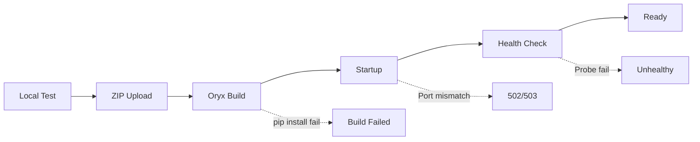

# 첫 번째 배포: 로컬에서 Azure까지 (Python/Flask)

이제 시리즈를 실제 배포로 연결할 차례입니다. 로컬에서 잘 돌던 Flask 앱을 App Service에 올리고, 런타임 경로가 제대로 열렸는지 직접 확인해 보겠습니다.

여기서는 로컬 개발 환경 준비부터 Azure 리소스 생성, 첫 배포, 상태 검증, 로그 확인까지 한 번에 따라가겠습니다. 목표는 “배포가 됐다”에서 끝나지 않고, 왜 이 설정이 필요한지까지 이해하는 것입니다.

---

## 이 글에서 다룰 문제

- 첫 번째 App Service 배포 전에 반드시 확정해 두어야 할 파라미터는 무엇일까요?
- run-from-package 방식은 content deploy 방식과 무엇이 다를까요?
- dev/stage/prod 환경에서 deployment slot 전략은 어디서부터 시작하는 것이 좋을까요?
- 첫 배포 직후 health check가 자동으로 돌게 하려면 무엇을 켜 두어야 할까요?
- 첫 배포에서 가장 자주 부딪히는 인증(auth)·권한(permission) 실패는 어떤 것들일까요?

## Goals

이 글을 마치면 Flask 앱을 로컬에서 실행하고, Azure App Service에 배포하고, 로그와 health endpoint로 배포가 정상인지 반복 가능하게 검증할 수 있습니다.


*로컬 개발에서 Azure 배포까지 이어지는 흐름*

> 첫 배포의 핵심은 “코드를 올리는 것”이 아니라 “로컬에서 확인한 실행 계약을 Azure에서도 그대로 재현하는 것”입니다.

---

## Prerequisites

| Item | Version/Requirement |
|------|---------------------|
| Python | 3.11 or higher |
| Azure CLI | Latest version, logged in |
| Azure Subscription | Active subscription |

```bash
# Check Azure CLI version and login
az --version
az login
```

---

## Step 1: Prepare Project Structure

### Minimal Flask App Structure

```text
my-flask-app/
├── src/
│ └── app.py
├── requirements.txt
└── README.md
```

### app.py

```python
# src/app.py
import os
from flask import Flask, jsonify

app = Flask(__name__)

@app.route('/')
def home():
 return jsonify({
 "message": "Hello from Azure App Service!",
 "environment": os.environ.get("APP_ENV", "development")
 })

@app.route('/health')
def health():
 return jsonify({"status": "healthy"}), 200

if __name__ == '__main__':
 port = int(os.environ.get("PORT", 8000))
 app.run(host="0.0.0.0", port=port)
```

### requirements.txt

```text
Flask==3.1.3
gunicorn==25.3.0
```

---

## Step 2: Run Locally (Development Mode)

### Create and Activate Virtual Environment

```bash
cd my-flask-app
python -m venv .venv
source .venv/bin/activate # Windows: .venv\Scripts\activate
```

### Install Dependencies

```bash
pip install --upgrade pip
pip install -r requirements.txt
```

### Run Flask Development Server

```bash
export FLASK_APP=src.app:app
export FLASK_DEBUG=1
flask run --port 8000
```

### Test

```bash
curl http://localhost:8000/
curl http://localhost:8000/health
```

**Expected output:**
```json
{"message": "Hello from Azure App Service!", "environment": "development"}
{"status": "healthy"}
```

---

## Step 3: Run Locally (Production Mode)

Azure App Service는 Python 앱을 **Gunicorn**으로 실행합니다. 배포 전에 같은 구성을 로컬에서도 확인해야 합니다.

```bash
export PORT=8000
gunicorn --bind=0.0.0.0:$PORT src.app:app
```

### Test with Workers and Timeout Settings

```bash
gunicorn --bind=0.0.0.0:$PORT --workers 2 --timeout 120 src.app:app
```

```bash
curl http://localhost:8000/health
```

**Why is this important?**
- Flask dev server and Gunicorn behave differently
- Concurrency varies with timeout and worker count
- Prevents "works locally but not in Azure" issues

---

## Step 4: Create Azure Resources


*구독에서 web app까지 이어지는 Azure 리소스 계층*

### Set Variables

```bash
RG="rg-flask-tutorial"
APP_NAME="app-flask-demo-$(openssl rand -hex 4)" # Unique name
PLAN_NAME="plan-flask-tutorial"
LOCATION="koreacentral"

echo "App Name: $APP_NAME"
```

### Create Resource Group

```bash
az group create \
 --name $RG \
 --location $LOCATION
```

### Create App Service Plan

```bash
az appservice plan create \
 --resource-group $RG \
 --name $PLAN_NAME \
 --is-linux \
 --sku B1
```

### Create Web App

```bash
az webapp create \
 --resource-group $RG \
 --plan $PLAN_NAME \
 --name $APP_NAME \
 --runtime "PYTHON|3.11"
```

---

## Step 5: Configure Deployment

### Enable Oryx Build

App Service의 Oryx build 시스템을 켜서 `requirements.txt`를 감지하고 의존성을 자동으로 설치하게 합니다.

```bash
az webapp config appsettings set \
 --resource-group $RG \
 --name $APP_NAME \
 --settings SCM_DO_BUILD_DURING_DEPLOYMENT=true
```

### Set Startup Command

```bash
az webapp config set \
 --resource-group $RG \
 --name $APP_NAME \
 --startup-file "gunicorn --bind=0.0.0.0:\$PORT src.app:app"
```

> `$PORT`는 App Service가 자동으로 주입하는 환경 변수입니다. 백슬래시로 escape해야 합니다.

---

## Step 6: Deploy Source Code

### Using az webapp up (Simplest Method)

```bash
az webapp up \
 --resource-group $RG \
 --name $APP_NAME \
 --runtime "PYTHON|3.11"
```

이 명령은 다음을 수행합니다.

1. 현재 디렉터리를 ZIP으로 패키징
2. App Service에 업로드
3. Oryx가 build 실행 (`pip install`)
4. 앱 재시작

### Verify Deployment Completion

```bash
az webapp show \
 --resource-group $RG \
 --name $APP_NAME \
 --query "state" \
 --output tsv
```

**Output:** `Running`

---

## Step 7: Verify Deployment

### Get App URL

```bash
APP_URL="https://$(az webapp show \
 --resource-group $RG \
 --name $APP_NAME \
 --query defaultHostName \
 --output tsv)"

echo "App URL: $APP_URL"
```

### Health Check

```bash
curl $APP_URL/health
```

**Expected output:**
```json
{"status": "healthy"}
```

### Check Main Page

```bash
curl $APP_URL/
```

**Expected output:**
```json
{"message": "Hello from Azure App Service!", "environment": "development"}
```

---

## Step 8: Check Logs

### Enable Logging

```bash
az webapp log config \
 --resource-group $RG \
 --name $APP_NAME \
 --docker-container-logging filesystem
```

### Real-time Log Stream

```bash
az webapp log tail \
 --resource-group $RG \
 --name $APP_NAME
```

요청을 보내면 로그가 실시간으로 보입니다.

---

## Step 9: Verify in Azure Portal

### Deployment Center

배포 이력과 상태를 확인합니다.

**Path:** App Service → Deployment Center

### Kudu (SCM) Site

고급 진단과 파일 브라우저는 여기서 봅니다.

```text
https://<app-name>.scm.azurewebsites.net
```

**Key features:**
- File browser: Check `/home/site/wwwroot`
- Bash console: Run commands inside container
- Environment variables

---

## Troubleshooting

### 502 Bad Gateway


*502 원인을 단계별로 좁혀 가는 흐름*

| Cause | Solution |
|-------|----------|
| Port binding error | Verify `$PORT` environment variable usage |
| Startup command error | Check path and module name |
| Dependency install failed | Check deployment logs for pip errors |

### Check Logs

```bash
# Deployment logs
az webapp log deployment list \
 --resource-group $RG \
 --name $APP_NAME \
 --output table

# App logs
az webapp log tail --resource-group $RG --name $APP_NAME
```

### Direct Check via Kudu SSH

```bash
az webapp ssh --resource-group $RG --name $APP_NAME
# Inside container:
ls /home/site/wwwroot
cat /home/LogFiles/*docker*.log
```

### 배포 방식별 검증 포인트를 분리해 두면 복구 속도가 빨라집니다

첫 배포 이후에는 ZIP 기반 배포와 컨테이너 배포를 혼용하는 경우가 많습니다. 이때 "배포가 실패했다"는 같은 증상이라도 확인해야 할 로그 경로가 다릅니다.

| 배포 방식 | 우선 확인 | 대표 실패 신호 | 1차 대응 |
| --- | --- | --- | --- |
| ZIP + Oryx | Deployment logs, Oryx build output | `pip install` 실패, 모듈 import 오류 | `requirements.txt`와 Python 버전 재확인 |
| Container(ACR) | Container startup logs, image pull 상태 | image pull 인증 실패, startup command 실패 | Managed Identity/ACR 권한과 태그 확인 |

아래 명령을 배포 직후 체크리스트에 넣어 두면 어떤 레이어에서 실패했는지 빠르게 좁힐 수 있습니다.

```bash
# 최근 배포 이력 확인
az webapp log deployment list \
  --resource-group $RG \
  --name $APP_NAME \
  --output table

# 앱 설정에서 startup command, build 플래그 확인
az webapp config show \
  --resource-group $RG \
  --name $APP_NAME \
  --query "{linuxFxVersion:linuxFxVersion, appCommandLine:appCommandLine}" \
  --output json

az webapp config appsettings list \
  --resource-group $RG \
  --name $APP_NAME \
  --query "[?name=='SCM_DO_BUILD_DURING_DEPLOYMENT' || name=='WEBSITE_RUN_FROM_PACKAGE'].[name,value]" \
  --output table
```

### 첫 배포부터 slot 기반 검증 루틴을 준비하면 이후 운영이 쉬워집니다

초기에는 단일 슬롯으로 시작해도 되지만, staging 슬롯을 일찍 도입하면 배포 검증과 롤백이 단순해집니다. 특히 트래픽이 생기기 시작한 시점부터는 slot swap 전략이 장애 시간을 크게 줄여 줍니다.

```bash
# staging 슬롯 생성
az webapp deployment slot create \
  --resource-group $RG \
  --name $APP_NAME \
  --slot staging

# staging에만 환경변수 주입
az webapp config appsettings set \
  --resource-group $RG \
  --name $APP_NAME \
  --slot staging \
  --settings APP_ENV=staging

# 슬롯 URL 확인 후 health 체크
STAGING_URL="https://$(az webapp show \
  --resource-group $RG \
  --name $APP_NAME \
  --slot staging \
  --query defaultHostName \
  --output tsv)"

curl "$STAGING_URL/health"
```

staging에서 헬스체크와 기본 API smoke test를 통과한 뒤 swap하면, 프로덕션 슬롯에서 바로 실패를 발견하는 위험을 줄일 수 있습니다. 첫 배포 단계에서 이 루틴을 습관화해 두면 이후 CI/CD로 확장할 때도 구조를 거의 그대로 재사용할 수 있습니다.

---

## Clean Up (Optional)

---

## 배포 직후 15분 검증 시나리오

첫 배포는 성공 메시지보다 검증 루틴이 중요합니다. 아래 시나리오는 배포 직후 15분 안에 실행하는 최소 점검입니다.

### 1) 상태 확인

```bash
az webapp show \
  --resource-group $RG \
  --name $APP_NAME \
  --query "{state:state, host:defaultHostName, enabledHostNames:enabledHostNames}" \
  --output json
```

**예상 결과:** `state`가 `Running`이고 기본 호스트가 노출됩니다.

### 2) 헬스 엔드포인트 확인

```bash
curl -i "$APP_URL/health"
```

**예상 결과:** `HTTP/1.1 200 OK`와 JSON body가 반환됩니다.

### 3) 앱 설정 확인

```bash
az webapp config appsettings list \
  --resource-group $RG \
  --name $APP_NAME \
  --query "[?name=='SCM_DO_BUILD_DURING_DEPLOYMENT' || name=='APP_ENV'].[name,value]" \
  --output table
```

**예상 결과:** `SCM_DO_BUILD_DURING_DEPLOYMENT`가 `true`인지 확인합니다.

---

## Portal 단계별 확인 포인트

Portal에서 무엇을 봐야 하는지 모르면 배포 상태를 오해하기 쉽습니다.

1. **Overview**: Running 상태, URL, 최근 5xx
2. **Deployment Center**: 마지막 배포 결과와 시간
3. **Configuration**: startup command, 앱 설정
4. **Log stream**: 요청 시 로그 유입 여부
5. **Diagnose and solve problems**: 플랫폼 감지 이슈

### 흔한 오해

- Deployment Center가 성공이어도 앱이 정상 기동하지 않을 수 있습니다.
- 앱이 Running이어도 `/health`가 실패하면 트래픽 처리 준비가 끝난 상태가 아닙니다.

---

## Mermaid 배포 흐름(오류 분기 포함)



이 다이어그램의 핵심은 배포 실패와 런타임 실패를 분리하는 것입니다. 업로드 성공은 시작점일 뿐입니다.

---

## 실제 오류 메시지와 해석

```text
ERROR: Could not find a version that satisfies the requirement flask==99.0.0

ModuleNotFoundError: No module named 'src.app'

Container didn't respond to HTTP pings on port: 8000, failing site start.
```

| 메시지 | 의미 | 우선 조치 |
|---|---|---|
| `Could not find a version ...` | requirements.txt 버전 문제 | 의존성 버전 수정 후 재배포 |
| `ModuleNotFoundError` | startup command 경로/모듈 오타 | `src.app:app` 경로 재검증 |
| `didn't respond to HTTP pings` | 포트 바인딩/시작 지연 | `PORT` 사용, startup time 점검 |

---

## 배포 직후 응답 계약 확인 예시

```text
GET /health -> 200 + {"status":"healthy"}
GET / -> 200 + JSON 본문
GET /not-found -> 404
```

세 응답을 함께 확인하면 기본 라우팅, 앱 기동, 오류 처리 경로를 한 번에 검증할 수 있습니다.

---

## 구성 파일 예시: GitHub Actions 기반 배포

`az webapp up`는 첫 배포에 좋지만, 팀 운영 단계에서는 CI/CD가 필요합니다.

```yaml
name: deploy-flask-appservice

on:
  push:
    branches: [ main ]

jobs:
  deploy:
    runs-on: ubuntu-latest
    steps:
      - uses: actions/checkout@v4
      - uses: azure/login@v2
        with:
          client-id: ${{ secrets.AZURE_CLIENT_ID }}
          tenant-id: ${{ secrets.AZURE_TENANT_ID }}
          subscription-id: ${{ secrets.AZURE_SUBSCRIPTION_ID }}
      - uses: azure/webapps-deploy@v3
        with:
          app-name: my-flask-app-prod
          package: .
```

이 워크플로는 배포 재현성을 높이고, 누가 언제 무엇을 배포했는지 이력을 남깁니다.

---

## Before/After: 수동 배포에서 운영 가능한 배포로

### Before

- 개발자 로컬에서 직접 `az webapp up`만 실행합니다.
- 배포 성공 기준이 "명령 종료"에 머뭅니다.
- 실패 시 누구도 같은 조건으로 재현하기 어렵습니다.

### After

- 배포 파라미터(`RG`, `PLAN`, `RUNTIME`, `STARTUP`)를 명시적으로 고정합니다.
- 배포 후 `/health`, 로그, 설정 검증을 체크리스트로 강제합니다.
- CI/CD로 승격해 배포 기록과 롤백 기준을 표준화합니다.

---

## run-from-package와 content deploy 비교

첫 배포 이후 안정성을 높이려면 아티팩트 불변성 관점에서 배포 방식을 다시 선택해야 합니다.

| 항목 | run-from-package | content deploy |
|---|---|---|
| 배포 단위 | ZIP 아티팩트 단일 파일 | 파일 단위 복사 |
| 런타임 파일 변경 | 읽기 전용에 가까움 | 런타임 중 일부 변경 가능 |
| 재현성 | 높음 | 상대적으로 낮음 |
| 롤백 | 이전 패키지 URL로 빠르게 복구 | 파일 상태에 따라 편차 큼 |

```bash
# run-from-package 활성화
az webapp config appsettings set \
  --resource-group $RG \
  --name $APP_NAME \
  --settings WEBSITE_RUN_FROM_PACKAGE=1
```

운영에서 배포 실패 복구 시간이 중요하다면 run-from-package를 우선 검토하는 편이 안전합니다.

## ARM 템플릿으로 첫 배포 리소스 정의

수동 명령을 반복하기보다 템플릿을 두면 신규 환경 생성이 쉬워집니다.

```json
{
  "$schema": "https://schema.management.azure.com/schemas/2019-04-01/deploymentTemplate.json#",
  "contentVersion": "1.0.0.0",
  "resources": [
    {
      "type": "Microsoft.Web/serverfarms",
      "apiVersion": "2023-12-01",
      "name": "plan-flask-tutorial",
      "location": "koreacentral",
      "sku": { "name": "S1", "tier": "Standard", "capacity": 2 },
      "properties": { "reserved": true }
    },
    {
      "type": "Microsoft.Web/sites",
      "apiVersion": "2023-12-01",
      "name": "app-flask-demo-prod",
      "location": "koreacentral",
      "properties": {
        "serverFarmId": "[resourceId('Microsoft.Web/serverfarms', 'plan-flask-tutorial')]",
        "siteConfig": {
          "linuxFxVersion": "PYTHON|3.11",
          "appCommandLine": "gunicorn --bind=0.0.0.0:$PORT src.app:app"
        }
      }
    }
  ]
}
```

## 배포 로그에서 자주 보는 실패-복구 페어

```text
ERROR: Could not build wheels for psycopg2
```

```text
조치: psycopg2-binary 버전 점검 또는 시스템 의존성이 포함된 이미지 전략으로 전환
```

```text
ModuleNotFoundError: No module named 'src.app'
```

```text
조치: startup command의 모듈 경로 재검증 (src.app:app)
```

```text
Container didn't respond to HTTP pings on port: 8000
```

```text
조치: PORT 바인딩 코드 확인, startup time 최적화, health endpoint 경량화
```

---

## 처음 질문으로 돌아가기

- 첫 배포 전에 확정할 파라미터는? -> 리전, Plan SKU, 런타임, startup command, health path입니다.
- run-from-package와 content deploy 차이는? -> 배포 아티팩트 불변성과 롤백 단위가 다릅니다.
- dev/stage/prod slot 전략 시작점은? -> staging 슬롯 1개부터 시작해 swap 검증 루틴을 고정합니다.
- 첫 배포 직후 health check 자동화는? -> `/health` 구현과 플랫폼 헬스 설정을 동시에 맞춥니다.
- 자주 부딪히는 auth/permission 실패는? -> ACR pull 권한, managed identity, 배포 자격 증명 설정에서 발생합니다.

---

## 첫 배포 체크 스크립트(반복 실행용)

아래 스크립트는 배포 직후 핵심 점검을 자동으로 수행하는 예시입니다.

```bash
#!/usr/bin/env bash
set -euo pipefail

RG=${RG:?}
APP_NAME=${APP_NAME:?}

HOST=$(az webapp show --resource-group "$RG" --name "$APP_NAME" --query defaultHostName --output tsv)
URL="https://$HOST"

echo "[1] state"
az webapp show --resource-group "$RG" --name "$APP_NAME" --query state --output tsv

echo "[2] health"
curl -fsS "$URL/health"

echo "[3] startup command"
az webapp config show --resource-group "$RG" --name "$APP_NAME" --query appCommandLine --output tsv

echo "[4] deployment history"
az webapp log deployment list --resource-group "$RG" --name "$APP_NAME" --output table
```

이 스크립트를 CI 파이프라인 후반에 붙이면 "배포 성공"의 기준이 명확해집니다.

---

## 포털 기준 실패 분기표

| 증상 | 먼저 보는 메뉴 | 해석 |
|---|---|---|
| URL 접속 불가 | Overview, Metrics | 앱 중지/플랫폼 오류/네트워크 제한 |
| 배포 성공인데 502 | Deployment Center + Log stream | startup 실패, 포트/모듈 경로 오류 |
| 간헐적 timeout | Metrics + App Insights | 의존성 지연, queue 적체 |

포털 기준 분기표를 미리 정해 두면 온콜 시 점검 순서가 흔들리지 않습니다.

---

## 배포 전후 비교표: 무엇이 바뀌었는지 추적하기

배포 실패를 줄이려면 변경량을 눈으로 확인해야 합니다.

| 구간 | 배포 전 | 배포 후 |
|---|---|---|
| App Settings | 기준값 스냅샷 | 변경 키 목록 |
| Startup Command | 이전 값 기록 | 신규 값 검증 |
| Deployment Log | 이전 성공 패턴 | 이번 실행 로그 비교 |
| Health Endpoint | 응답 샘플 저장 | 응답 형태 동일성 확인 |

```bash
# startup command 확인
az webapp config show \
  --resource-group $RG \
  --name $APP_NAME \
  --query "{appCommandLine:appCommandLine, linuxFxVersion:linuxFxVersion}" \
  --output json
```

---

## 첫 배포에서 자주 빠뜨리는 항목

1. `requirements.txt` 고정 버전 누락
2. health endpoint 미구현
3. slot 없는 직접 배포
4. 로그 활성화 누락
5. 운영용 환경 변수 기준 미정

위 다섯 항목만 체크해도 초기 장애의 상당수를 예방할 수 있습니다.

---

## 배포 검증 리포트 예시

팀 단위 운영에서는 "배포 완료" 메시지보다 검증 리포트가 더 중요합니다. 아래 형식으로 남기면 다음 배포 품질이 안정됩니다.

```text
Deployment Report
- timestamp: 2026-05-21T10:15:00Z
- app: app-flask-demo
- commit: abc1234
- runtime: PYTHON|3.11
- startup: gunicorn --bind=0.0.0.0:$PORT src.app:app

Checks
- state: Running
- health: 200 OK
- homepage: 200 OK
- deployment log: success
- errors in log tail (5m): 0
```

### 리포트 자동화 포인트

- 상태값(`Running`)은 CLI 결과를 그대로 저장
- health 응답코드와 응답시간을 함께 기록
- 배포 로그 마지막 항목 상태를 표준화

이 리포트를 PR 코멘트나 배포 채널에 남기면, 온콜 인수인계가 훨씬 명확해집니다.

추가로, 리포트에 `배포 전후 응답시간(p50/p95)`을 남기면 성능 회귀를 조기에 발견할 수 있습니다.

이 지표는 다음 배포 승인 기준으로 바로 재사용할 수 있습니다.

테스트 후 비용을 줄이려면 리소스를 삭제합니다.

```bash
az group delete --name $RG --yes --no-wait
```

---

## 운영 체크리스트

- [ ] region, SKU, runtime version을 처음부터 확정했다
- [ ] deploy method(zip, ACR, GitHub Actions)를 명시적으로 골랐다
- [ ] Managed Identity와 Key Vault 접근을 구성했다
- [ ] health-check 경로와 timeout 기준을 정했다
- [ ] 운영 전 slot-swap rollback을 한 번 연습했다

---

## 정리

이 튜토리얼에서 가져가야 할 핵심은 네 가지입니다.

1. **Local Development**: Flask와 Gunicorn으로 production parity를 미리 확인합니다.
2. **Azure Resources**: Resource Group → Plan → Web App 순서로 리소스를 만듭니다.
3. **Deployment**: `az webapp up`으로 가장 단순한 첫 배포를 수행합니다.
4. **Verification**: Health endpoint와 로그로 실제 실행 상태를 검증합니다.

첫 배포는 성공 메시지보다 검증 루틴이 더 중요합니다. 상태 확인과 로그 확인까지 습관으로 만들면 다음 배포부터 훨씬 안정적으로 움직일 수 있습니다.

<!-- toc:begin -->
## 시리즈 목차

- [Azure App Service란? - 플랫폼 아키텍처 이해하기](./01-what-is-app-service.md)
- [Request Lifecycle: 3am에 터진 502를 어디서부터 봐야 할까](./02-request-lifecycle.md)
- [Hosting Models: 어떤 플랜을 선택해야 할까?](./03-hosting-models.md)
- **첫 번째 배포: 로컬에서 Azure까지 (Python/Flask) (현재 글)**
- Configuration 마스터하기: App Settings & 환경변수 (예정)
- 로그와 모니터링 기초: “앱이 느려요”에 답할 수 있는 상태 만들기 (예정)
- Scaling 101: 언제 Scale Up vs Scale Out? (예정)

<!-- toc:end -->

---

## 참고 자료

### 공식 문서
- [Quickstart: Deploy a Python web app (Microsoft Learn)](https://learn.microsoft.com/azure/app-service/quickstart-python)
- [Configure a Linux Python app (Microsoft Learn)](https://learn.microsoft.com/azure/app-service/configure-language-python)
- [Kudu service overview (Microsoft Learn)](https://learn.microsoft.com/azure/app-service/resources-kudu)

### 관련 시리즈
- [Azure Functions 101](../../azure-functions-101/ko/)

---

- [이 글의 예제 코드 (book-examples)](https://github.com/yeongseon-books/book-examples/tree/main/azure-app-service-101/ko/04-first-deploy)

Tags: Azure, App Service, Cloud, Web Apps
