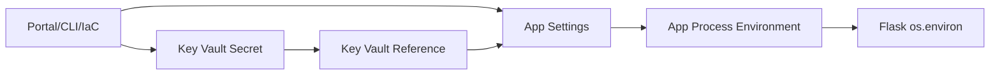

# Configuration 마스터하기: App Settings & 환경변수

앱 배포가 끝나면 바로 다음 문제가 시작됩니다. 환경마다 다른 연결 문자열, API 키, 로그 레벨을 어떻게 관리할지 정하지 않으면 배포는 끝나도 운영은 계속 흔들립니다.

이 글은 Azure App Service 101 시리즈의 5번째 글입니다.

여기서는 개발, 스테이징, 프로덕션을 가로질러 설정 변경을 예측 가능하고 안전하게 만드는 방법을 다룹니다. 핵심은 코드와 설정을 분리하고, 민감 정보와 환경별 값을 같은 바구니에 넣지 않는 것입니다.

---

## 이 글에서 다룰 문제

- app setting, connection string, 환경 변수(env var)는 런타임(runtime)에서 어떤 방식으로 노출될까요?
- slot-sticky 설정은 실제로 어떤 상황에서 도움이 될까요?
- Key Vault reference는 일반 app setting과 무엇이 다르고, 권한(permission)은 어떤 흐름으로 연결될까요?
- 어떤 설정 변경은 앱을 자동으로 재시작시키고, 어떤 변경은 그렇지 않을까요?
- App Settings가 저장 시 암호화(encrypted at rest)되더라도, 왜 진짜 비밀 정보(secret)는 여기에 두면 안 될까요?

## Why Configuration Matters

### The Twelve-Factor App Principle

> "Separate configuration from code"

- Settings hardcoded in code
- Different code branches per environment
- Settings injected via environment variables
- Same code, different settings

### App Service's Approach

App Service는 **App Settings**를 통해 환경 변수를 주입합니다.


*설정이 앱 환경 변수로 주입되는 흐름*

```text
[Azure Portal/CLI] → App Settings → [Environment Variables] → [App Process]
```

> 설정은 값 저장소가 아니라 런타임 이벤트입니다. App Service에서 설정을 바꾸는 순간, 그 변경은 곧 프로세스 재시작과 동작 변화로 이어질 수 있습니다.

---

## App Settings Basics

### Setting App Settings

**Azure CLI:**
```bash
az webapp config appsettings set \
 --resource-group $RG \
 --name $APP_NAME \
 --settings FLASK_DEBUG=0 APP_ENV=production LOG_LEVEL=INFO
```

**Azure Portal:**
1. App Service → Configuration
2. Application settings tab
3. Click "+ New application setting"

### Reading in Your App

```python
import os

# Access directly as environment variables
FLASK_DEBUG = os.environ.get("FLASK_DEBUG", "0")
APP_ENV = os.environ.get("APP_ENV", "production")
LOG_LEVEL = os.environ.get("LOG_LEVEL", "INFO")
DB_HOST = os.environ.get("DB_HOST", "localhost")
```

### Verify Current Settings

```bash
az webapp config appsettings list \
 --resource-group $RG \
 --name $APP_NAME \
 --output table
```

**Example output:**
```text
Name Value
----------------------------- -----------------
FLASK_DEBUG 0
APP_ENV production
LOG_LEVEL INFO
SCM_DO_BUILD_DURING_DEPLOYMENT true
```

---

## Local vs Production Strategy

### Environment Separation Pattern


*환경 단계별 설정 전략*

```python
# config.py
import os

class Config:
 """Base configuration"""
 SECRET_KEY = os.environ.get("SECRET_KEY", "dev-secret-key")
 LOG_LEVEL = os.environ.get("LOG_LEVEL", "INFO")

class DevelopmentConfig(Config):
 """Local development"""
 DEBUG = True
 DATABASE_URL = os.environ.get("DATABASE_URL", "sqlite:///dev.db")

class ProductionConfig(Config):
 """Azure App Service"""
 DEBUG = False
 DATABASE_URL = os.environ.get("DATABASE_URL") # Required

# Select based on environment
config = {
 "development": DevelopmentConfig,
 "production": ProductionConfig,
}

def get_config():
 env = os.environ.get("APP_ENV", "development")
 return config.get(env, DevelopmentConfig)
```

### Local Development: .env File

Flask 2.3과 3.x는 더 이상 `FLASK_ENV`를 쓰지 않으므로, 환경 선택은 `APP_ENV` 같은 자체 설정으로 유지하고 debugger는 로컬에서만 `FLASK_DEBUG=1`로 명시적으로 켭니다.

```bash
# .env (local only, add to .gitignore!)
FLASK_DEBUG=1
APP_ENV=development
LOG_LEVEL=DEBUG
DATABASE_URL=postgresql://localhost:5432/myapp
SECRET_KEY=local-dev-key
```

```python
# Using python-dotenv
from dotenv import load_dotenv
load_dotenv() # Load .env file
```

```bash
pip install python-dotenv
```

### .gitignore is required

```gitignore
# .gitignore
.env
.env.local
*.env
```

---

## Connection Strings

데이터베이스 연결 문자열은 별도 섹션으로 관리할 수 있습니다.

### Setting Connection Strings

```bash
az webapp config connection-string set \
 --resource-group $RG \
 --name $APP_NAME \
 --connection-string-type PostgreSQL \
 --settings "DATABASE=Server=myserver.postgres.database.azure.com;Database=mydb;..."
```

### App Settings vs Connection Strings

| Item | App Settings | Connection Strings |
|------|-------------|-------------------|
| Purpose | General settings | DB connections only |
| Format | `KEY=VALUE` | Type can be specified |
| App Access | `os.environ["KEY"]` | `os.environ["SQLAZURECONNSTR_NAME"]` |

> **실무 팁:** 대부분의 경우 App Settings만으로도 충분합니다.

---

## Slot Settings (Sticky Settings)

Deployment Slot을 쓰는 경우, 어떤 설정은 **slot에 고정**되어야 합니다.

### When Slot Settings Are Needed

| Setting | Sticky? | Reason |
|---------|---------|--------|
| `APP_ENV` | Yes | Staging은 staging, production은 production이어야 함 |
| `DATABASE_URL` | Yes | 환경별 DB가 달라야 함 |
| `LOG_LEVEL` | No | 대개 동일함 |
| `FEATURE_FLAG_X` | Depends | slot별 테스트면 sticky 필요 |


*slot swap 중에도 유지되는 설정*

### Configuring Slot Settings

```bash
az webapp config appsettings set \
 --resource-group $RG \
 --name $APP_NAME \
 --slot-settings APP_ENV=production
```

`--slot-settings`는 `--settings`와 같은 `KEY=VALUE` 형식을 씁니다. 여기에 넘긴 값은 slot에 sticky로 표시되어 swap 후에도 그 slot에 남습니다.

**Azure Portal:**
1. Configuration → Application settings
2. Check "Deployment slot setting" checkbox next to setting

---

## Key Vault References: Secrets Done Right

비밀번호와 API 키 같은 민감 값은 **Key Vault**에 저장하고 참조합니다.


*Key Vault에서 앱으로 흘러가는 secret 참조 흐름*

### Why Key Vault?

| Direct App Settings | Key Vault Reference |
|--------------------|---------------------|
| Values visible in Portal | Values hidden |
| No version control | Automatic versioning |
| No audit logs | Access audit logs |
| Hard to share | Reference from multiple apps |

### Step 1: Create Key Vault

```bash
KEYVAULT_NAME="kv-myapp-$(openssl rand -hex 4)"

az keyvault create \
 --resource-group $RG \
 --name $KEYVAULT_NAME \
 --location $LOCATION
```

### Step 2: Store Secret

```bash
az keyvault secret set \
 --vault-name $KEYVAULT_NAME \
 --name "DbPassword" \
 --value "super-secret-password"
```

### Step 3: Enable Managed Identity

```bash
az webapp identity assign \
 --resource-group $RG \
 --name $APP_NAME
```

### Step 4: Grant Key Vault Access (RBAC)

```bash
PRINCIPAL_ID=$(az webapp identity show \
 --resource-group $RG \
 --name $APP_NAME \
 --query principalId \
 --output tsv)

KEYVAULT_ID=$(az keyvault show \
 --name $KEYVAULT_NAME \
 --query id \
 --output tsv)

az role assignment create \
 --role "Key Vault Secrets User" \
 --assignee $PRINCIPAL_ID \
 --scope $KEYVAULT_ID
```

### Step 5: Configure Key Vault Reference

```bash
az webapp config appsettings set \
 --resource-group $RG \
 --name $APP_NAME \
 --settings "DB_PASSWORD=@Microsoft.KeyVault(SecretUri=https://$KEYVAULT_NAME.vault.azure.net/secrets/DbPassword/)"
```

### Using in Your App

```python
# Key Vault Reference accessed like regular environment variable
DB_PASSWORD = os.environ.get("DB_PASSWORD")
# Value automatically injected!
```

---

## Impact of Configuration Changes

### Configuration changes are runtime events

App Settings를 바꾸면 **앱이 재시작**됩니다.

**Impact:**
- 진행 중인 요청이 끊길 수 있음
- cold start 발생
- cache 초기화

### Minimizing Change Impact

1. **Batch Updates**: 여러 설정을 한 번에 변경
2. **Deployment Slots**: staging에서 먼저 테스트
3. **Maintenance Window**: 트래픽이 낮을 때 변경

```bash
# Change multiple settings at once (single restart)
az webapp config appsettings set \
 --resource-group $RG \
 --name $APP_NAME \
 --settings KEY1=value1 KEY2=value2 KEY3=value3
```

---

## Verifying Configuration

### Check Current Settings

```bash
# List all settings
az webapp config appsettings list \
 --resource-group $RG \
 --name $APP_NAME \
 --output json

# Check specific setting
az webapp config appsettings list \
 --resource-group $RG \
 --name $APP_NAME \
 --query "[?name=='LOG_LEVEL']"
```

### Verify Inside App (Debugging)

```python
@app.route('/debug/config')
def debug_config():
    # Disable in production!
    if os.environ.get("APP_ENV") != "development":
        return {"error": "Not allowed"}, 403

    return {
        "APP_ENV": os.environ.get("APP_ENV"),
        "LOG_LEVEL": os.environ.get("LOG_LEVEL"),
        # Mask sensitive values
        "DB_PASSWORD": "***" if os.environ.get("DB_PASSWORD") else None
    }
```

---

## Best Practices Checklist

---

## 설정 변경의 위험 구간과 배포 창 관리

App Service에서 설정 저장은 단순 메타데이터 변경이 아니라 런타임 이벤트입니다. 특히 트래픽이 높은 시간대에는 설정 하나가 가용성에 직접 영향을 줄 수 있습니다.

### 위험이 큰 변경

- 데이터베이스 연결 문자열 교체
- 인증 관련 시크릿 교체
- startup command 관련 설정 변경
- feature flag의 기본값 전환

### 운영 절차 권장안

1. staging 슬롯에 먼저 적용
2. smoke test 수행
3. 프로덕션 반영(또는 swap)
4. 15분간 오류율/지연시간 관찰

```bash
# staging 슬롯에만 적용
az webapp config appsettings set \
  --resource-group $RG \
  --name $APP_NAME \
  --slot staging \
  --settings LOG_LEVEL=INFO FEATURE_X=true

# staging에서 값 확인
az webapp config appsettings list \
  --resource-group $RG \
  --name $APP_NAME \
  --slot staging \
  --query "[?name=='FEATURE_X']"
```

---

## Key Vault 참조 장애 시나리오

Key Vault reference를 도입하면 보안은 좋아지지만, 권한과 네트워크 제약으로 새 장애 유형이 생깁니다.

### 대표 오류 메시지

```text
KeyVaultReferenceException: Unable to resolve secret reference.

Access denied to Key Vault.

SecretNotFound: A secret with (name/id) was not found in this key vault.
```

### 1차 점검 순서

1. App Service 관리 ID 활성화 여부
2. `Key Vault Secrets User` 권한 부여 여부
3. Secret URI 오타/버전 만료 여부
4. Key Vault 네트워크 제한(Private endpoint, firewall)

```bash
az webapp identity show --resource-group $RG --name $APP_NAME --output json
az role assignment list --assignee $PRINCIPAL_ID --scope $KEYVAULT_ID --output table
az keyvault secret show --vault-name $KEYVAULT_NAME --name DbPassword --output json
```

---

## 설정 스냅샷 백업과 복원

운영 중에는 설정 실수보다 복구 지연이 더 큰 비용을 만듭니다. 배포 전에 설정 스냅샷을 남겨 두면 복구 시간이 줄어듭니다.

### 스냅샷 저장

```bash
az webapp config appsettings list \
  --resource-group $RG \
  --name $APP_NAME \
  --output json > appsettings-backup.json
```

### 필요한 키만 복원

```bash
az webapp config appsettings set \
  --resource-group $RG \
  --name $APP_NAME \
  --settings APP_ENV=production LOG_LEVEL=INFO
```

대규모 환경에서는 이 과정을 IaC 파이프라인으로 자동화하는 편이 안전합니다.

---

## JSON 기반 설정 정책 예시

설정 소스를 코드와 분리하되, 비밀 값은 파일에 직접 두지 않는 패턴입니다.

```json
{
  "environment": "production",
  "required_settings": [
    "APP_ENV",
    "DATABASE_URL",
    "LOG_LEVEL",
    "APPLICATIONINSIGHTS_CONNECTION_STRING"
  ],
  "secret_settings": [
    "DB_PASSWORD",
    "JWT_SIGNING_KEY",
    "PAYMENT_API_KEY"
  ],
  "slot_sticky": [
    "APP_ENV",
    "DATABASE_URL",
    "FEATURE_X"
  ]
}
```

이 정책 파일은 문서와 점검 스크립트의 기준점으로 활용할 수 있습니다.

---

## Before/After: 설정이 코드에 섞인 팀 vs 분리된 팀

### Before

- 코드 내부 상수로 API 키와 URL을 관리합니다.
- 환경별 분기 코드가 늘어나고, PR 리뷰가 어려워집니다.
- 장애 시 어떤 값이 실제로 적용됐는지 확인이 늦습니다.

### After

- 코드와 설정의 책임이 분리됩니다.
- 민감 값은 Key Vault, 일반 값은 App Settings로 분류됩니다.
- 슬롯 sticky 설정으로 swap 후에도 환경 경계가 유지됩니다.

결국 설정 품질은 보안뿐 아니라 배포 안정성과 직결됩니다.

---

## Mermaid로 보는 설정 주입 경로



설정 입력 경로를 분리해서 보면, 어느 지점에서 장애가 생겼는지 빠르게 좁힐 수 있습니다.

---

## 설정 스키마 검증 자동화 예시

앱 시작 전 검사와 별개로, 배포 파이프라인 단계에서 설정 정책과 실제 App Settings를 비교하면 휴먼 에러를 크게 줄일 수 있습니다.

```python
import os
import sys

required = {"APP_ENV", "DATABASE_URL", "LOG_LEVEL"}
secrets = {"DB_PASSWORD", "JWT_SIGNING_KEY", "PAYMENT_API_KEY"}

actual = set(os.environ.keys())
missing = sorted(required - actual)
plain_secret = sorted([k for k in secrets if os.environ.get(k, "").startswith("plain-")])

if missing:
    print(f"Missing required settings: {', '.join(missing)}")
    sys.exit(1)

if plain_secret:
    print(f"Potential plain-text secret values: {', '.join(plain_secret)}")
    sys.exit(1)

print("Configuration validation passed")
```

## Key Vault reference 운영 체크 포인트

```bash
az webapp identity show --resource-group $RG --name $APP_NAME --query "{principalId:principalId,tenantId:tenantId}" --output json

az keyvault secret show --vault-name $KEYVAULT_NAME --name DbPassword --query "{id:id,attributes:attributes}" --output json

az webapp config appsettings list \
  --resource-group $RG \
  --name $APP_NAME \
  --query "[?name=='DB_PASSWORD'].[name,value]" \
  --output table
```

참조 문자열이 맞는데도 값 해석이 실패하면 RBAC 역할 범위와 Key Vault 네트워크 제한을 함께 확인해야 합니다.

## slot swap 전후 설정 차이 리뷰 템플릿

```yaml
config_change_review:
  change_id: CFG-2026-05-12-01
  target_slot: production
  restart_expected: true
  changed_keys:
    - LOG_LEVEL
    - FEATURE_X
  sticky_keys_checked:
    - APP_ENV
    - DATABASE_URL
  rollback_plan:
    method: appsettings-backup-restore
  verification:
    - health_endpoint_200
    - error_rate_stable_15m
```

설정 변경을 코드 변경처럼 리뷰하면 운영 중 가장 흔한 설정 사고를 구조적으로 줄일 수 있습니다.

---

## 설정 키 네이밍 규칙 예시

```text
APP_ENV, LOG_LEVEL, FEATURE_X_ENABLED
DATABASE_URL, REDIS_HOST
PAYMENT_API_KEY (Key Vault reference)
```

키 이름 규칙을 고정하면 팀 간 전달 시 오타와 의미 충돌을 줄일 수 있습니다.

---

## 처음 질문으로 돌아가기

- app setting, connection string, env var는 어떻게 노출되는가? -> 최종적으로 앱 프로세스의 환경 변수로 주입됩니다.
- slot-sticky는 언제 도움이 되는가? -> staging과 production이 다른 값을 유지해야 할 때 필수입니다.
- Key Vault reference와 일반 setting 차이는? -> 값 저장 위치와 접근 권한, 감사 추적 가능성이 다릅니다.
- 어떤 변경이 재시작을 유발하는가? -> 대부분의 App Settings 변경은 재시작을 동반하므로 변경 배치를 권장합니다.
- 저장 시 암호화돼도 왜 secret를 직접 두지 않는가? -> 권한 관리, 감사, 회전 주기 측면에서 Key Vault가 운영에 더 안전합니다.

---

## 설정 유효성 검사 코드를 앱 시작 시점에 넣기

운영 장애를 줄이려면 필수 설정 누락을 트래픽 수신 전에 막아야 합니다.

```python
import os

REQUIRED_SETTINGS = [
    "APP_ENV",
    "DATABASE_URL",
    "LOG_LEVEL",
]

def validate_settings() -> None:
    missing = [k for k in REQUIRED_SETTINGS if not os.environ.get(k)]
    if missing:
        raise RuntimeError(f"Missing required settings: {', '.join(missing)}")

validate_settings()
```

이 패턴을 쓰면 "배포는 성공했지만 런타임에서만 실패"하는 유형을 조기에 차단할 수 있습니다.

---

## 환경별 설정 표준 예시

```yaml
environment_profiles:
  development:
    APP_ENV: development
    LOG_LEVEL: DEBUG
    FEATURE_X: "false"
  staging:
    APP_ENV: staging
    LOG_LEVEL: INFO
    FEATURE_X: "true"
  production:
    APP_ENV: production
    LOG_LEVEL: INFO
    FEATURE_X: "true"
```

여기서 민감 값은 제외하고 Key Vault reference로 분리합니다.

---

## 흔한 설정 사고 3가지

1. **slot-sticky 누락**
   - staging DB 설정이 swap 후 production에 노출되는 사고
2. **키 이름 불일치**
   - `DB_URL`과 `DATABASE_URL` 혼용으로 런타임 실패
3. **단건 변경 반복**
   - 여러 번 재시작이 연쇄적으로 발생

```bash
# 단건 반복 대신 배치 변경
az webapp config appsettings set \
  --resource-group $RG \
  --name $APP_NAME \
  --settings APP_ENV=production LOG_LEVEL=INFO FEATURE_X=true
```

설정 변경 단위를 줄이는 것만으로도 재시작 리스크를 크게 낮출 수 있습니다.

---

## Portal 작업 순서: 사람 실수를 줄이는 방법

1. Configuration 화면에서 변경 전 현재 값 스크린샷/내보내기
2. 변경 키를 한 번에 입력
3. slot setting 여부 재확인
4. Save 후 재시작 이벤트 시점 기록
5. health endpoint와 핵심 API smoke test

### 확인 질문

- 이 값이 slot별로 달라야 하는가?
- 민감 정보인가, 일반 설정인가?
- rollback 시 원복 값이 준비되어 있는가?

운영 중에는 기술 오류보다 절차 오류가 더 자주 발생합니다. 작업 순서를 문서화하면 복구 시간이 짧아집니다.

---

## 진단용 엔드포인트 운용 원칙

설정 검증을 위해 debug endpoint를 쓰더라도, 노출 통제를 반드시 적용해야 합니다.

```python
@app.route('/internal/config-check')
def internal_config_check():
    if os.environ.get("APP_ENV") == "production":
        return {"error": "forbidden"}, 403
    return {
        "APP_ENV": os.environ.get("APP_ENV"),
        "LOG_LEVEL": os.environ.get("LOG_LEVEL"),
        "DATABASE_URL_PRESENT": bool(os.environ.get("DATABASE_URL"))
    }
```

프로덕션에서는 endpoint 자체를 제거하거나 접근 제한(IP allowlist)을 함께 적용합니다.

---

## 설정 변경 승인 체크리스트

설정은 코드 변경보다 작은 작업처럼 보이지만, 실제 장애 비중은 결코 작지 않습니다. 변경 승인 전에 아래를 확인합니다.

1. 변경 키 목록과 목적이 문서화되었는가
2. slot-sticky 여부가 명시되었는가
3. 민감 값이 Key Vault reference인지 확인했는가
4. 롤백 값과 복구 절차가 준비되었는가
5. 변경 후 관찰할 메트릭이 정의되었는가

```yaml
config_change_request:
  app: myapp-prod
  keys:
    - LOG_LEVEL
    - FEATURE_X
  slot_sticky:
    - FEATURE_X
  rollback:
    LOG_LEVEL: INFO
    FEATURE_X: "false"
  observe:
    - Http5xx
    - ResponseTimeP95
```

이 형식은 변경 승인과 회고를 동시에 단순화합니다.

---

## Key Vault secret 회전 시나리오

secret 회전은 보안 작업이지만, 잘못하면 즉시 장애로 이어집니다.

### 안전한 순서

1. Key Vault에 새 secret 버전 생성
2. staging 슬롯에서 참조/연결 테스트
3. production에 적용
4. 일정 시간 모니터링 후 구버전 폐기

```bash
# 새 버전 저장
az keyvault secret set --vault-name $KEYVAULT_NAME --name DbPassword --value "new-password-2026-05"

# 앱 재시작 전후 동작 확인
az webapp restart --resource-group $RG --name $APP_NAME
```

회전 후에는 인증 실패율과 DB 연결 오류를 반드시 확인합니다.

### 회전 검증 체크

- 앱 재시작 후 첫 5분 오류율
- 로그인/결제/주요 API 인증 성공률
- 이전 secret 버전 제거 전 fallback 테스트 여부

이 체크를 생략하면 회전 직후에는 정상처럼 보여도, 일정 시간 뒤 인증 실패가 누적될 수 있습니다.

### DO

- [ ] Store sensitive values in Key Vault
- [ ] Use Slot Settings for environment-specific config
- [ ] Add .env files to .gitignore
- [ ] Batch configuration changes
- [ ] Validate required settings at app startup

### DON'T

- [ ] Hardcode secrets in code
- [ ] Commit .env files to Git
- [ ] Expose debug endpoints in production
- [ ] Change settings one at a time

---

## 정리

Configuration 관리에서 기억할 기본 원칙은 아래와 같습니다.

- **App Settings**: 환경 변수로 주입되며, 변경 시 앱이 재시작됩니다.
- **Environment Separation**: 로컬은 `.env`, Azure는 App Settings로 나눕니다.
- **Slot Settings**: 환경별로 고정되어야 하는 값은 sticky로 둡니다.
- **Key Vault**: 진짜 민감 값은 여기로 보냅니다.

설정은 배포 부가 기능이 아니라 운영 안정성과 보안의 중심입니다. 같은 코드를 여러 환경에 올리더라도, 무엇이 바뀌고 무엇이 그대로여야 하는지 명확하면 운영이 훨씬 예측 가능해집니다.

<!-- toc:begin -->
## 시리즈 목차

- [Azure App Service란? - 플랫폼 아키텍처 이해하기](./01-what-is-app-service.md)
- [Request Lifecycle: 3am에 터진 502를 어디서부터 봐야 할까](./02-request-lifecycle.md)
- [Hosting Models: 어떤 플랜을 선택해야 할까?](./03-hosting-models.md)
- [첫 번째 배포: 로컬에서 Azure까지 (Python/Flask)](./04-first-deploy.md)
- **Configuration 마스터하기: App Settings & 환경변수 (현재 글)**
- 로그와 모니터링 기초: “앱이 느려요”에 답할 수 있는 상태 만들기 (예정)
- Scaling 101: 언제 Scale Up vs Scale Out? (예정)

<!-- toc:end -->

---

## 참고 자료

### 공식 문서
- [Configure an App Service app (Microsoft Learn)](https://learn.microsoft.com/azure/app-service/configure-common)
- [Use Key Vault references (Microsoft Learn)](https://learn.microsoft.com/azure/app-service/app-service-key-vault-references)
- [The Twelve-Factor App - Config](https://12factor.net/config)

### 관련 시리즈
- [Azure Functions 101](../../azure-functions-101/ko/)

---

- [이 글의 예제 코드 (book-examples)](https://github.com/yeongseon-books/book-examples/tree/main/azure-app-service-101/ko/05-configuration)

Tags: Azure, App Service, Cloud, Web Apps
