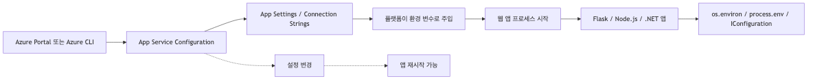
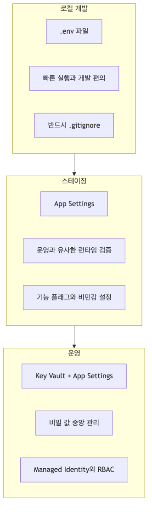
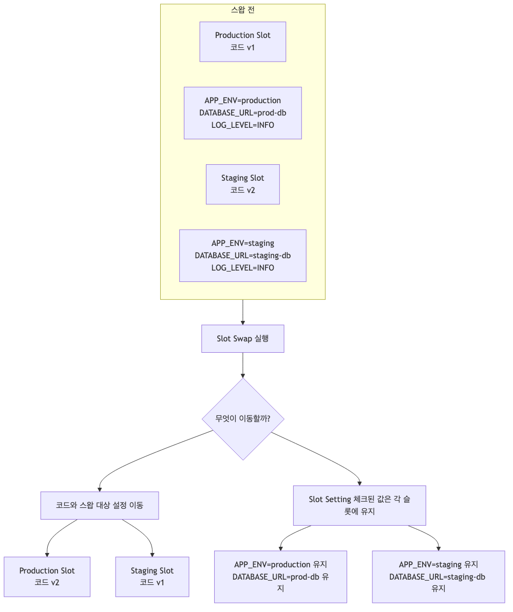

# Configuration 마스터하기: App Settings & 환경변수

배포는 끝났습니다. 이제 진짜 운영이 시작됩니다.

애플리케이션은 바로 다음 질문을 던집니다. **데이터베이스 연결 문자열은 어디에 둘까? 외부 API 키는? 개발 환경에서는 DEBUG, 운영에서는 INFO 로그 레벨로 바꾸려면?** 많은 팀이 이 지점에서 처음으로 “배포”와 “운영”이 다르다는 걸 체감합니다.

이 글은 Azure App Service에서 설정(configuration)을 다루는 실전 가이드입니다. 단순히 메뉴 위치를 소개하는 대신, **어떤 값은 App Settings에 두고, 어떤 값은 Key Vault로 보내야 하며, 슬롯 스왑 시 무엇이 바뀌고 무엇이 고정되어야 하는지** 운영 시나리오 중심으로 정리합니다.

---

## 이 글에서 다룰 문제

- app setting, connection string, 환경 변수(env var)는 런타임(runtime)에서 어떤 방식으로 노출될까요?
- slot-sticky 설정은 실제로 어떤 상황에서 도움이 될까요?
- Key Vault reference는 일반 app setting과 무엇이 다르고, 권한(permission)은 어떤 흐름으로 연결될까요?
- 어떤 설정 변경은 앱을 자동으로 재시작시키고, 어떤 변경은 그렇지 않을까요?
- App Settings가 저장 시 암호화(encrypted at rest)되더라도, 왜 진짜 비밀 정보(secret)는 여기에 두면 안 될까요?

## 왜 설정이 배포보다 더 오래 문제를 만들까?

처음 배포할 때는 앱이 뜨는지만 봅니다. 그런데 운영에서는 다음 문제가 더 자주 터집니다.

- 스테이징은 붙는데 운영 DB에는 접속이 안 됨
- 개발자가 로컬 `.env` 값에 의존해서 “내 컴퓨터에서는 됨” 상태가 됨
- API 키를 코드에 넣었다가 저장소 히스토리에 영구히 남음
- 슬롯 스왑 후 운영이 스테이징 데이터베이스를 바라봄
- 설정 하나만 바꿨는데 앱이 재시작되어 순간 장애가 남

예전에 한 팀이 **운영 DB 자격 증명이 들어 있는 `.env` 파일을 그대로 Git에 커밋**한 걸 본 적이 있습니다. 배포는 성공했지만, 그 순간부터 문제는 애플리케이션이 아니라 민감 정보 유출 대응이 되어 버렸습니다. 설정은 기능이 아니라 **운영 안정성과 보안의 경계선**입니다.

12-Factor App에서는 설정을 코드에서 분리하라고 말합니다. 이 원칙이 중요한 이유는 철학 때문이 아니라 현실 때문입니다. **같은 코드를 서로 다른 환경에 배포하되, 달라져야 하는 것은 설정뿐**이어야 운영이 단순해집니다.

---

## App Service에서 설정은 어떻게 앱으로 들어갈까?

Azure App Service에서 가장 기본이 되는 메커니즘은 **App Settings = 환경 변수 주입**입니다.

운영자가 Portal이나 CLI에서 값을 넣으면, App Service가 이를 앱 프로세스가 읽을 수 있는 환경 변수로 제공합니다.



*설정 값이 앱 환경 변수로 들어가는 흐름*

이 구조가 중요한 이유는 단순합니다.

- 애플리케이션 코드는 민감 정보 값을 몰라도 됨
- 환경마다 같은 아티팩트를 재사용할 수 있음
- 재배포 없이 설정만 바꿔 동작을 제어할 수 있음
- 다만, **설정 변경은 보통 앱 재시작을 유발**하므로 운영 타이밍을 신경 써야 함

예를 들어 Flask 앱은 아주 평범하게 값을 읽습니다.

```python
import os

APP_ENV = os.environ.get("APP_ENV", "development")
LOG_LEVEL = os.environ.get("LOG_LEVEL", "INFO")
DATABASE_URL = os.environ.get("DATABASE_URL")
PAYMENTS_API_KEY = os.environ.get("PAYMENTS_API_KEY")
```

여기서 봐야 할 점은 코드가 Azure 전용 API를 직접 호출하지 않는다는 점입니다. 앱은 그저 환경 변수를 읽고, App Service가 그 값을 공급합니다.

---

## 가장 먼저 가져가야 할 운영 원칙

설정을 어디에 둘지 고민될 때는 아래 기준으로 판단하면 실수가 크게 줄어듭니다.

### 1) 코드와 설정을 분리한다

`if production: ...` 식으로 코드 내부에서 환경별 값을 박아 넣기 시작하면, 결국 릴리스와 운영 설정이 얽힙니다. 코드는 동작 방식을, 설정은 실행 환경의 차이를 표현해야 합니다.

### 2) 민감 정보 값은 “저장 위치”부터 구분한다

로그 레벨과 DB 자격 증명은 둘 다 설정이지만, 같은 방식으로 다루면 안 됩니다. 사람이 봐도 되는 값과 보면 안 되는 값을 구분해야 합니다.

### 3) 앱 시작 시 필수 설정을 검증한다

운영에서 `DATABASE_URL`이 비어 있으면 요청을 받은 뒤 실패하는 것보다 **시작 단계에서 명확히 죽는 편이 낫습니다.**

```python
import os

def require_env(name: str) -> str:
    value = os.environ.get(name)
    if not value:
        raise RuntimeError(f"Required environment variable is missing: {name}")
    return value

DATABASE_URL = require_env("DATABASE_URL")
APP_ENV = os.environ.get("APP_ENV", "development")
LOG_LEVEL = os.environ.get("LOG_LEVEL", "INFO")
```

### 4) 로컬 편의성과 운영 보안을 같은 도구로 해결하려 하지 않는다

로컬 개발에는 `.env`가 편합니다. 하지만 운영에서는 App Settings 또는 Key Vault가 기준이 되어야 합니다.

---

## 로컬, 스테이징, 운영은 같은 방식으로 관리하지 않는다

환경별 전략을 나눠야 하는 이유는 “기능”이 아니라 “통제 수준”이 다르기 때문입니다.



*환경별 설정 저장 방식의 분리 전략*

### 로컬 개발: `.env`

개발자는 빠르게 실행해야 하므로 `.env`가 가장 실용적입니다.

```bash
# .env
APP_ENV=development
LOG_LEVEL=DEBUG
DATABASE_URL=postgresql://localhost:5432/myapp
PAYMENTS_API_KEY=dev-only-key
```

```python
from dotenv import load_dotenv

load_dotenv()
```

> `python-dotenv` 패키지가 필요합니다. `pip install python-dotenv`로 설치하고 `requirements.txt`에 추가하세요. 단, 이 패키지는 **로컬 개발 편의용**이며 App Service 런타임에서는 사용하지 않아도 됩니다.

여기서 중요한 건 편의성보다 **경계 설정**입니다.

```gitignore
.env
.env.local
*.env
```

`.env`는 로컬 개발용 임시 입력 장치일 뿐, 배포 방식이 아닙니다.

### 스테이징: App Settings

스테이징은 실제 App Service 런타임과 가장 비슷한 조건에서 검증해야 하므로, `.env`보다 **App Settings를 직접 사용하는 편이 낫습니다.** 그래야 “운영에서는 환경 변수로 들어오는데 스테이징만 다른 방식” 같은 불필요한 차이를 만들지 않습니다.

```bash
az webapp config appsettings set \
    --resource-group $RG \
    --name $APP_NAME \
    --slot staging \
    --settings APP_ENV=staging LOG_LEVEL=INFO FEATURE_CHECKOUT_V2=true
```

### 운영: App Settings + Key Vault

운영은 “작동”보다 “노출 최소화”가 더 중요합니다. 일반 설정은 App Settings에 두고, **자격 증명·토큰·연결 문자열 같은 민감 값은 Key Vault를 통해 주입**하는 구성이 기본값이 되어야 합니다.

---

## App Settings: 가장 많이 쓰고, 가장 자주 오해하는 기능

App Settings는 App Service에서 가장 흔하게 사용하는 설정 저장소입니다. Portal에서도 쉽게 보이고, CLI로도 바로 넣을 수 있습니다.

```bash
az webapp config appsettings set \
    --resource-group $RG \
    --name $APP_NAME \
    --settings APP_ENV=production LOG_LEVEL=INFO SCM_DO_BUILD_DURING_DEPLOYMENT=true
```

현재 값을 확인할 때는 다음 명령이 기본입니다.

```bash
az webapp config appsettings list \
    --resource-group $RG \
    --name $APP_NAME \
    --output table
```

운영에서 자주 나오는 오해는 두 가지입니다.

### 오해 1) App Settings는 보안 저장소다

아닙니다. App Settings는 편리한 설정 주입 메커니즘이지, 민감 정보 값의 최종 보관소로 보기엔 부족합니다. 민감도가 낮은 값은 괜찮지만, **회전(rotation), 접근 감사, 중앙 집중 관리가 필요한 민감 정보는 Key Vault가 더 적합**합니다.

### 오해 2) 설정은 언제든 안전하게 바꿀 수 있다

App Settings를 바꾸면 일반적으로 앱이 재시작됩니다. 따라서 트래픽이 있는 시간에 값을 하나씩 여러 번 바꾸는 습관은 좋지 않습니다.

```bash
# 여러 변경을 한 번에 반영해 재시작 횟수를 줄인다.
az webapp config appsettings set \
    --resource-group $RG \
    --name $APP_NAME \
    --settings LOG_LEVEL=WARNING FEATURE_X=true CACHE_TTL_SECONDS=60
```

---

## Connection Strings: “별도 섹션”은 있지만, 원리는 같다

Portal에는 **Connection strings**라는 별도 탭이 있습니다. 이름 때문에 많은 분이 “DB 관련 값은 무조건 여기에 넣어야 하나?”라고 생각합니다.

정답은 **반드시 그렇지는 않다**입니다.

App Service는 Connection Strings에 넣은 값을 환경 변수로 노출합니다. 다만 일반 App Settings와 달리 **접두사가 붙은 이름**으로 전달됩니다.

- SQL Server: `SQLCONNSTR_<name>`
- MySQL: `MYSQLCONNSTR_<name>`
- PostgreSQL: `POSTGRESQLCONNSTR_<name>`
- Azure SQL: `SQLAZURECONNSTR_<name>`
- Custom: `CUSTOMCONNSTR_<name>`

예를 들어 PostgreSQL 연결 문자열을 넣었다면 앱에서는 이런 식으로 읽게 됩니다.

```python
import os

DATABASE_URL = os.environ.get("POSTGRESQLCONNSTR_DATABASE")
```

CLI 예시는 다음과 같습니다.

```bash
az webapp config connection-string set \
    --resource-group $RG \
    --name $APP_NAME \
    --connection-string-type PostgreSQL \
    --settings DATABASE="Host=myserver.postgres.database.azure.com;Database=mydb;Port=5432;Ssl Mode=Require;"
```

실무에서는 두 방식 중 하나를 팀 표준으로 정해 일관되게 가는 편이 좋습니다.

| 항목 | App Settings | Connection Strings |
|------|--------------|-------------------|
| 대표 용도 | 일반 설정, 기능 플래그, 비민감 구성 | DB 연결 값 분류용 |
| 앱에서 읽는 방식 | `os.environ["KEY"]` | 접두사 포함 이름으로 읽음 |
| 팀 관점 | 단순하고 일관적 | 플랫폼 분류가 명확 |

개인적으로는 **일반 설정은 App Settings, 고보안 민감 정보는 Key Vault Reference** 조합이 가장 관리하기 쉽습니다. Connection Strings 기능은 기존 운영 표준이 있거나 포털에서 DB 연결 값을 분리해 보고 싶을 때 유용합니다.

---

## Key Vault References: 운영 민감 정보를 App Service에 직접 들고 있지 않기

운영에서 가장 중요한 질문은 “값을 어떻게 읽느냐”보다 **“민감 정보를 어디에 저장하느냐”** 입니다.

Key Vault Reference를 쓰면 App Service가 Key Vault의 민감 정보 값을 대신 참조해 주고, 앱은 일반 환경 변수처럼 읽기만 하면 됩니다.


*Key Vault 비밀 값이 앱으로 들어오는 흐름*

이 방식을 쓰면 얻는 이점이 분명합니다.

- 민감 정보의 원본 저장소를 Key Vault로 일원화
- 앱 코드 변경 없이 민감 정보 값 회전 가능
- 접근 권한을 Managed Identity와 RBAC로 통제 가능
- 누가 어떤 민감 정보에 접근했는지 감사 추적 가능

### 1) Key Vault 생성

```bash
KEYVAULT_NAME="kv-myapp-$(openssl rand -hex 4)"

az keyvault create \
    --resource-group $RG \
    --name $KEYVAULT_NAME \
    --location $LOCATION
```

### 2) 민감 정보 저장

```bash
az keyvault secret set \
    --vault-name $KEYVAULT_NAME \
    --name "DbPassword" \
    --value "super-secret-password"
```

### 3) App Service의 Managed Identity 활성화

```bash
az webapp identity assign \
    --resource-group $RG \
    --name $APP_NAME
```

### 4) Key Vault 접근 권한 부여

```bash
PRINCIPAL_ID=$(az webapp identity show \
    --resource-group $RG \
    --name $APP_NAME \
    --query principalId \
    --output tsv)

KEYVAULT_ID=$(az keyvault show \
    --name $KEYVAULT_NAME \
    --query id \
    --output tsv)

az role assignment create \
    --role "Key Vault Secrets User" \
    --assignee $PRINCIPAL_ID \
    --scope $KEYVAULT_ID
```

### 5) App Settings에 Key Vault Reference 추가

```bash
az webapp config appsettings set \
    --resource-group $RG \
    --name $APP_NAME \
    --settings "DB_PASSWORD=@Microsoft.KeyVault(SecretUri=https://$KEYVAULT_NAME.vault.azure.net/secrets/DbPassword/)"
```

앱에서는 그대로 읽으면 됩니다.

```python
import os

DB_PASSWORD = os.environ.get("DB_PASSWORD")
```

여기서 중요한 건 **애플리케이션이 Key Vault SDK를 직접 몰라도 된다**는 점입니다. 런타임에서 직접 민감 정보를 조회하는 패턴도 가능하지만, 단순한 구성 주입이 목적이라면 Key Vault Reference가 운영 복잡도를 훨씬 낮춰 줍니다.

> **캐시 타이밍 참고**: Key Vault Reference 값은 앱 시작 시점에 가져오며, 이후 약 24시간 주기로 갱신됩니다. Key Vault에서 민감 정보를 회전한 뒤 즉시 반영하려면 앱을 재시작하거나, 새 버전의 Secret URI를 명시하는 방법이 있습니다.

---

## Slot Settings: 스왑할 것과 스왑하면 안 될 것을 구분하기

Deployment Slot을 쓰기 시작하면 설정 관리가 한 단계 더 중요해집니다. 특히 스테이징 슬롯에서 검증 후 운영 슬롯으로 스왑하는 흐름에서는, **어떤 값은 따라 움직이면 안 됩니다.**

대표적으로 아래 값은 슬롯 고정이 필요할 가능성이 큽니다.

- `APP_ENV`: staging / production 값이 달라야 함
- `DATABASE_URL`: 환경별 DB가 분리되어야 함
- `REDIS_CONNECTION`: 환경별 캐시가 다를 수 있음
- 외부 API 엔드포인트: 테스트용과 운영용이 다를 수 있음

반면 아래 값은 팀 정책에 따라 스왑 대상이어도 됩니다.

- `LOG_LEVEL`
- 일부 기능 플래그
- 캐시 TTL 같은 비민감 운영 파라미터



*슬롯 스왑 때 설정이 유지되는 조건*

CLI로 슬롯 고정 설정을 줄 때는 `--slot-settings`를 사용합니다.

```bash
# 먼저 슬롯에 설정값을 지정합니다
az webapp config appsettings set \
    --resource-group $RG \
    --name $APP_NAME \
    --slot staging \
    --settings APP_ENV=staging DATABASE_URL=$STAGING_DATABASE_URL

# 그 다음, 해당 키를 슬롯 고정(slot setting)으로 표시합니다
az webapp config appsettings set \
    --resource-group $RG \
    --name $APP_NAME \
    --settings APP_ENV=production DATABASE_URL=$PROD_DATABASE_URL \
    --slot-settings APP_ENV=production DATABASE_URL=$PROD_DATABASE_URL
```

운영 사고 중 꽤 많은 수가 “스왑은 잘 됐는데 설정이 같이 움직여서” 발생합니다. 슬롯을 쓴다면 **코드 배포 전략만이 아니라 설정 이동 전략도 함께 설계**해야 합니다.

---

## 설정 변경의 영향: 단순 수정처럼 보여도 운영 이벤트다

App Service에서 설정 변경은 대개 앱 재시작으로 이어집니다. 즉, Portal에서 값 하나 바꾸는 행동도 운영 관점에서는 **배포에 준하는 이벤트**입니다.

영향은 보통 다음과 같습니다.

- 진행 중 요청 일부에 영향 가능
- 워커 재기동
- 메모리 캐시 초기화
- 짧은 구간의 응답 지연 또는 cold start

그래서 설정 변경은 다음 원칙으로 다루는 편이 좋습니다.

1. **한 번에 묶어서 변경한다**
2. **가능하면 스테이징 슬롯에서 먼저 검증한다**
3. **변경 직후 로그를 바로 확인한다**
4. **필수 설정 누락 시 즉시 실패하도록 앱을 만든다**

설정을 “운영자가 UI에서 즉흥적으로 고치는 값”으로 취급하면 재현성과 감사 가능성이 급격히 떨어집니다. 코드가 Git으로 관리되듯, 설정도 최소한 **변경 기준과 검증 절차**를 가져야 합니다.

---

## 실제로는 어떻게 검증할까?

설정은 “저장했다”가 아니라 “앱이 기대한 값으로 실행 중이다”까지 확인해야 끝입니다.

### 1) CLI에서 현재 설정 확인

```bash
az webapp config appsettings list \
    --resource-group $RG \
    --name $APP_NAME \
    --query "[?name=='LOG_LEVEL' || name=='APP_ENV']"
```

### 2) Kudu / 환경 정보로 런타임 확인

App Service의 Kudu 환경에서는 앱 프로세스에 전달된 환경 정보를 확인할 수 있습니다. 값 자체를 노출하기보다, **존재 여부와 기대한 이름으로 들어왔는지**를 보는 용도로 활용하는 편이 안전합니다.

### 3) 앱 시작 로그에서 필수 설정 검증 결과 남기기

민감한 값은 절대 출력하지 말고, 다음처럼 “존재 여부”만 남깁니다.

```python
import logging
import os

logger = logging.getLogger(__name__)

logger.info("Configuration loaded", extra={
    "app_env": os.environ.get("APP_ENV", "unknown"),
    "database_url_present": bool(os.environ.get("DATABASE_URL")),
    "db_password_present": bool(os.environ.get("DB_PASSWORD")),
})
```

### 4) 디버그 엔드포인트는 운영에서 막는다

운영에서 `/debug/config` 같은 엔드포인트를 열어 두는 건 매우 위험합니다. 꼭 필요하다면 개발 환경에서만 제한적으로 쓰고, 운영에서는 비활성화하세요.

---

## 실무 체크리스트

### 이렇게 하면 좋다

- 민감하지 않은 일반 설정은 App Settings로 관리한다
- 민감한 값은 Key Vault + Managed Identity 조합을 기본값으로 삼는다
- `.env`는 로컬 개발 전용으로만 사용하고 반드시 `.gitignore`에 포함한다
- 슬롯 스왑을 쓴다면 환경별 값은 Slot Setting으로 고정한다
- 필수 환경 변수는 앱 시작 시 검증한다
- 설정 변경 후에는 바로 로그와 상태 확인을 한다

### 이건 피하자

- 코드에 민감 정보 값을 하드코딩한다
- 운영 민감 정보이 든 `.env` 파일을 저장소에 커밋한다
- 설정을 하나씩 여러 번 바꿔 재시작을 반복한다
- 슬롯 스왑 전에 어떤 값이 따라 움직이는지 확인하지 않는다
- 디버그용 설정 출력 API를 운영에 노출한다

---

## 정리

배포 이후의 App Service 운영에서 설정은 단순한 부가 작업이 아닙니다. **환경 변수는 앱의 실행 조건이고, 민감 정보 관리는 보안의 시작점이며, 슬롯 설정은 배포 안정성의 일부**입니다.

이 글에서 기억할 내용은 네 가지입니다.

- **App Settings**는 App Service가 환경 변수를 주입하는 기본 도구다
- **로컬 `.env` / 스테이징 App Settings / 운영 Key Vault**처럼 환경별 통제 수준에 맞춰 전략을 나눈다
- **민감한 값은 Key Vault Reference**로 다루는 습관이 장기적으로 안전하다
- **설정 변경은 앱 재시작을 유발할 수 있으므로** 운영 이벤트처럼 검증해야 한다

이번 글은 배포 뒤에 더 오래 남는 문제인 설정, 민감 정보, 슬롯별 값 관리를 다룹니다. `LOG_LEVEL`, Application Insights 연결 문자열, 구조화된 로그 필드처럼 여기서 정한 기준이 이후의 로그·메트릭·추적 품질을 직접 좌우합니다.

---

## 운영 체크리스트

- [ ] 비밀은 모두 Key Vault reference 또는 Managed Identity 경유로 주입했다
- [ ] slot-sticky 설정 항목을 명시적으로 표시했다
- [ ] configuration drift 감지를 IaC로 자동화했다
- [ ] 설정 변경 후 자동 재시작 영향 범위를 문서화했다
- [ ] 환경별 설정 차이(dev/stage/prod)를 단일 매트릭스로 정리했다

<!-- toc:begin -->
## 시리즈 목차

- [Azure App Service란? - 플랫폼 아키텍처 이해하기](./01-what-is-app-service.md)
- [Request Lifecycle: 3am에 터진 502를 어디서부터 봐야 할까](./02-request-lifecycle.md)
- [Hosting Models: 어떤 플랜을 선택해야 할까?](./03-hosting-models.md)
- [첫 번째 배포: 로컬에서 Azure까지 (Python/Flask)](./04-first-deploy.md)
- **Configuration 마스터하기: App Settings & 환경변수 (현재 글)**
- 로그와 모니터링 기초: “앱이 느려요”에 답할 수 있는 상태 만들기 (예정)
- Scaling 101: 언제 Scale Up vs Scale Out? (예정)

<!-- toc:end -->

---

## 참고 자료

### 공식 문서
- [Configure an App Service app (Microsoft Learn)](https://learn.microsoft.com/azure/app-service/configure-common)
- [Use Key Vault references for App Service and Azure Functions (Microsoft Learn)](https://learn.microsoft.com/azure/app-service/app-service-key-vault-references)
- [The Twelve-Factor App - Config](https://12factor.net/config)

### 관련 시리즈
- [Azure Functions 101](../../azure-functions-101/ko/)

---

Tags: Azure, App Service, Cloud, Web Apps
