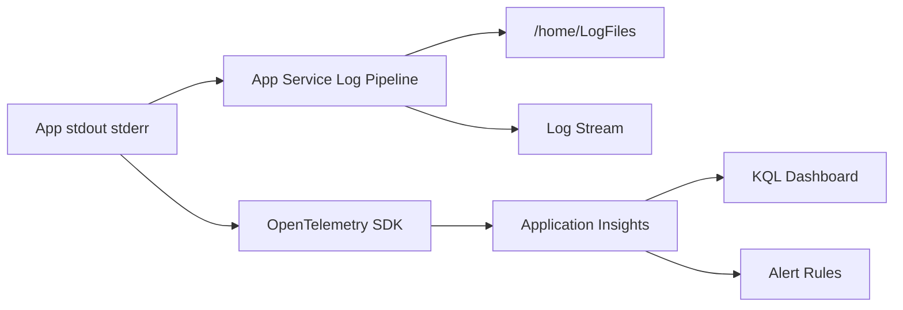

# 로그와 모니터링 기초: “앱이 느려요”에 답할 수 있는 상태 만들기

“앱이 느려요.” “에러가 나요.” “언제부터 시작된 거죠?” 이런 질문에 답하지 못하면 App Service는 관리형 플랫폼이 아니라 보이지 않는 상자처럼 느껴집니다.

이 글은 Azure App Service 101 시리즈의 6번째 글입니다.

여기서는 App Service를 로그와 메트릭, 추적 정보로 읽을 수 있는 시스템으로 바꾸는 방법을 다룹니다. 핵심은 로그가 어디로 가는지, 실시간 디버깅과 장기 분석을 어떻게 나눌지, 어떤 알림 기준이 실제로 유용한지 정리하는 것입니다.

---

## 이 글에서 다룰 문제

- App Service diagnostic log(HTTP, application, container)는 실제로 어디에 쌓일까요?
- Application Insights, Log Analytics, Diagnostic Settings는 책임을 어떻게 나눌까요?
- live tail 또는 log streaming은 언제 도움이 되고, 어디서 한계가 있을까요?
- memory, HTTP 5xx, response time 알림은 어떤 기준부터 유용할까요?
- disk quota나 dependency failure는 어떤 신호가 가장 먼저 경고할까요?

## Where Do Logs Go?

App Service에서 로그 흐름을 이해하는 것이 첫 단계입니다.


*앱 로그가 파일시스템과 모니터링으로 흘러가는 구조*

```text
Flask App (logger.info) → stdout/stderr → App Service Runtime
 ↓
 ┌─────────────────┴─────────────────┐
 ↓ ↓
 /home/LogFiles Application Insights
 (Filesystem) (Long-term analysis)
```

| Destination | Retention | Purpose |
|-------------|-----------|---------|
| `/home/LogFiles/*_docker.log` | ~35MB rolling | Container crashes, startup errors |
| `/home/LogFiles/Application/` | Max 100MB/7 days | Short-term log archive |
| Application Insights | 90 days default | Long-term analysis, alerts, KQL |


*로그에서 tracing으로 가는 observability 성숙도 단계*

> 실시간 로그 스트림은 지금 무슨 일이 벌어지는지 보여 주고, Application Insights는 왜 그런 일이 반복되는지 보여 줍니다. 둘은 대체재가 아니라 역할이 다릅니다.

---

## Step 1: Enable Filesystem Logging

App Service는 filesystem logging을 켠 뒤에야 application stdout/stderr를 `/home/LogFiles/`에 기록합니다. 그전까지는 application log pipeline이 꺼져 있으므로 `az webapp log tail`도 application log를 스트리밍할 수 없습니다.

### Configure Logging

```bash
az webapp log config \
 --resource-group $RG \
 --name $APP_NAME \
 --application-logging filesystem \
 --level verbose \
 --web-server-logging filesystem
```

### Verify Configuration

```bash
az webapp log show \
 --resource-group $RG \
 --name $APP_NAME \
 --output json
```

**Example output:**
```json
{
 "applicationLogs": {
 "fileSystem": {
 "level": "Verbose"
 }
 },
 "httpLogs": {
 "fileSystem": {
 "enabled": true,
 "retentionInDays": 7,
 "retentionInMb": 100
 }
 }
}
```

---

## Step 2: Real-time Log Stream

**실시간 로그**는 배포 직후나 장애가 발생했을 때 특히 유용합니다.

### Stream via CLI

```bash
az webapp log tail \
 --resource-group $RG \
 --name $APP_NAME
```

요청을 보내면 로그가 바로 나타납니다.

```text
2025-04-07T10:30:15.123Z {"level": "info", "message": "Request processed", "userId": "user-123"}
2025-04-07T10:30:15.456Z {"level": "error", "message": "Database connection failed", "error": "timeout"}
```

### Filter JSON Logs Only

```bash
az webapp log tail \
 --resource-group $RG \
 --name $APP_NAME \
 | grep --line-buffered '"level"'
```

---

## Step 3: Structured Logging (JSON)

문자열 로그보다 **JSON 로그**가 분석에 훨씬 유리합니다.

### Python Configuration

```python
import logging
import json
from datetime import datetime

class JsonFormatter(logging.Formatter):
    def format(self, record):
        log_obj = {
            "timestamp": datetime.utcnow().isoformat() + "Z",
            "level": record.levelname.lower(),
            "message": record.getMessage(),
            "logger": record.name,
        }
        # Merge additional fields
        if hasattr(record, "custom_dimensions"):
            log_obj.update(record.custom_dimensions)
        return json.dumps(log_obj)

# Handler setup
handler = logging.StreamHandler()
handler.setFormatter(JsonFormatter())

logger = logging.getLogger(__name__)
logger.addHandler(handler)
logger.setLevel(logging.INFO)
```

### Usage Example

```python
logger.info("Order created", extra={"custom_dimensions": {
    "orderId": "ORD-12345",
    "userId": "user-789",
    "totalAmount": 150.00
}})
```

**Output:**
```json
{"timestamp": "2025-04-07T10:30:15.123Z", "level": "info", "message": "Order created", "orderId": "ORD-12345", "userId": "user-789", "totalAmount": 150.0}
```

---

## Step 4: Request Tracing with Correlation ID

하나의 요청에서 나온 모든 로그를 묶으려면 **Correlation ID**가 필요합니다.


*하나의 요청을 따라가는 Correlation ID 흐름*

### Middleware Implementation

```python
import uuid
from flask import Flask, request, g, has_request_context

app = Flask(__name__)

@app.before_request
def set_correlation_id():
 # Get from header or generate new
 g.correlation_id = request.headers.get(
 "X-Correlation-ID", 
 str(uuid.uuid4())
 )

@app.after_request
def add_correlation_header(response):
 response.headers["X-Correlation-ID"] = g.correlation_id
 return response
```

### Auto-include in Logging

```python
class CorrelationFilter(logging.Filter):
 def filter(self, record):
  if has_request_context():
   record.correlation_id = g.get('correlation_id', '-')
  else:
   record.correlation_id = '-'
  return True

logger.addFilter(CorrelationFilter())
```

### Usage

사용자가 오류를 제보하면 `X-Correlation-ID` header 값을 받아 그 요청의 로그를 한 번에 찾습니다.

```bash
# Filter logs by specific Correlation ID
az webapp log tail --resource-group $RG --name $APP_NAME \
 | grep --line-buffered "a1b2c3d4"
```

---

## Step 5: Application Insights Integration

장기 분석과 알림을 위해 **Application Insights**를 연결합니다.

### Create Application Insights

```bash
az monitor app-insights component create \
 --resource-group $RG \
 --app $APP_NAME-insights \
 --location $LOCATION \
 --kind web
```

### Get Connection String

```bash
APPINSIGHTS_CS=$(az monitor app-insights component show \
 --resource-group $RG \
 --app $APP_NAME-insights \
 --query connectionString \
 --output tsv)
```

### Add to App Settings

```bash
az webapp config appsettings set \
 --resource-group $RG \
 --name $APP_NAME \
 --settings APPLICATIONINSIGHTS_CONNECTION_STRING=$APPINSIGHTS_CS
```

### Install Python SDK

```bash
pip install azure-monitor-opentelemetry
```

### Initialize in App

```python
from azure.monitor.opentelemetry import configure_azure_monitor
import os

if os.environ.get("APPLICATIONINSIGHTS_CONNECTION_STRING"):
 configure_azure_monitor(
 connection_string=os.environ["APPLICATIONINSIGHTS_CONNECTION_STRING"]
 )
```

---

## Step 6: Log Analysis with KQL

Application Insights에 저장된 로그는 **KQL (Kusto Query Language)** 로 분석합니다.

### Query Recent Errors

```kql
AppTraces
| where TimeGenerated > ago(1h)
| where SeverityLevel == 3 // Error
| project TimeGenerated, Message, Properties
| order by TimeGenerated desc
| take 20
```

### Error Rate Time Series

```kql
AppRequests
| where TimeGenerated > ago(6h)
| summarize 
 total = count(),
 failed = countif(Success == false)
 by bin(TimeGenerated, 5m)
| extend errorRate = (failed * 100.0) / total
| render timechart
```

### Top 10 Slowest Requests

```kql
AppRequests
| where TimeGenerated > ago(1h)
| top 10 by DurationMs desc
| project TimeGenerated, Name, DurationMs, ResultCode
```

### Trace by Correlation ID

```kql
AppTraces
| where TimeGenerated > ago(24h)
| extend correlationId = tostring(Properties["correlationId"])
| where correlationId == "a1b2c3d4-e5f6-7890-abcd-ef1234567890"
| project TimeGenerated, SeverityLevel, Message
| order by TimeGenerated asc
```

---

## Step 7: Configure Alerts

문제가 생겼을 때 자동으로 알림을 받도록 설정합니다.

### Error Rate Alert

```bash
az monitor metrics alert create \
 --resource-group $RG \
 --name "High Error Rate" \
 --scopes "/subscriptions/$SUBSCRIPTION_ID/resourceGroups/$RG/providers/Microsoft.Web/sites/$APP_NAME" \
 --condition "avg Http5xx > 10" \
 --window-size 5m \
 --evaluation-frequency 1m
```

### Configure in Azure Portal

1. App Service → Alerts → + Create alert rule
2. Condition: HTTP 5xx > 10
3. Action group: Email/SMS/Webhook

---

## Checking Logs in Filesystem

### Access via Kudu

```text
https://<app-name>.scm.azurewebsites.net
```

**Paths:**
```text
/home/LogFiles/
├── <hostname>_docker.log ← Container stdout
├── Application/
│ └── <date>_<hostname>_default_docker.log
└── kudu/
 └── deployment/ ← Deployment logs
```

### Access via SSH

```bash
az webapp ssh --resource-group $RG --name $APP_NAME

# Inside container
tail -f /home/LogFiles/*_docker.log
```

### Download Logs

```bash
az webapp log download \
 --resource-group $RG \
 --name $APP_NAME \
 --log-file ./logs.zip

unzip logs.zip -d ./logs
```

---

## Log Level Management

### Purpose by Level

| Level | Purpose | Recommended for Production |
|-------|---------|---------------------------|
| DEBUG | Detailed debugging | No |
| INFO | Normal operation info | Yes |
| WARNING | Potential issues | Yes |
| ERROR | Error occurred | Yes |
| CRITICAL | Severe failure | Yes |

### Dynamic Level Change

```bash
# Enable DEBUG during incident investigation
az webapp config appsettings set \
 --resource-group $RG \
 --name $APP_NAME \
 --settings LOG_LEVEL=DEBUG

# Revert after investigation
az webapp config appsettings set \
 --resource-group $RG \
 --name $APP_NAME \
 --settings LOG_LEVEL=INFO
```

> DEBUG level increases **costs** and risks **sensitive information exposure**, so always revert after investigation.

---

## Troubleshooting Scenarios

### "Logs aren't showing"

1. Verify logging is enabled: `az webapp log show`
2. Check if app outputs to stdout
3. Enable Log stream then trigger a request

### "No data in Application Insights"

1. Check `APPLICATIONINSIGHTS_CONNECTION_STRING` setting
2. Verify SDK initialization code
3. Wait 2-3 minutes (data collection delay)

### "Want to find specific errors"

```kql
// Trace by Correlation ID
AppTraces
| where Properties contains "correlation-id-here"

// Errors in specific time range
AppTraces
| where TimeGenerated between(datetime(2025-04-07 10:00)..datetime(2025-04-07 11:00))
| where SeverityLevel >= 3
```

---

## 운영 체크리스트

---

## 모니터링 아키텍처를 텍스트 다이어그램으로 고정하기

운영팀이 바뀌어도 같은 관측 모델을 쓰려면 로그/메트릭/트레이스 흐름을 명시적으로 남겨야 합니다.



이 구조를 문서화하면 "이 신호는 어디서 봐야 하는가"에 대한 팀 내 논쟁이 크게 줄어듭니다.

---

## 장애 초동 5분 체크리스트

"앱이 느리다"는 제보를 받았을 때 초동 5분 루틴을 고정합니다.

1. Metrics에서 `Http 5xx`, `Response time`, `Requests`를 같은 시간축으로 확인
2. Log stream으로 실시간 오류 패턴 파악
3. App Insights에서 같은 시간대 `AppRequests`, `AppDependencies` 조회
4. Health Check 상태와 인스턴스 수 변화 확인

```bash
az monitor metrics list \
  --resource "/subscriptions/$SUB/resourceGroups/$RG/providers/Microsoft.Web/sites/$APP_NAME" \
  --metric "Http5xx,HttpResponseTime,Requests" \
  --interval PT1M \
  --aggregation Average Total
```

---

## 대표 로그 패턴과 해석

```text
WARNING - Container cpu usage high: 92%
ERROR - Exception in dependency call: timeout
INFO - GET /health 200 3ms
ERROR - GET /api/orders 500 1834ms correlationId=ab12...
```

| 로그 패턴 | 해석 | 우선 대응 |
|---|---|---|
| `cpu usage high` 반복 | compute 포화 가능성 | scale out 검토, 느린 endpoint 확인 |
| `dependency timeout` 증가 | 외부 의존성 병목 | DB/API latency, retry 정책 점검 |
| `/health 200` 유지 + 사용자 오류 증가 | 부분 장애 가능성 | 핵심 endpoint 별도 모니터링 |
| `500` + 긴 duration | 앱/의존성 공통 원인 | correlationId 기반 추적 |

---

## KQL 심화 예시: 원인 후보를 좁히는 질의

### 1) 느린 요청 상위 endpoint

```kql
AppRequests
| where TimeGenerated > ago(30m)
| summarize p95=percentile(DurationMs, 95), count=count() by Name
| order by p95 desc
| take 10
```

### 2) 5xx와 의존성 실패의 상관

```kql
let req = AppRequests
| where TimeGenerated > ago(1h)
| summarize reqFailed=countif(Success == false) by bin(TimeGenerated, 5m);
let dep = AppDependencies
| where TimeGenerated > ago(1h)
| summarize depFailed=countif(Success == false) by bin(TimeGenerated, 5m);
req
| join kind=inner dep on TimeGenerated
| project TimeGenerated, reqFailed, depFailed
| order by TimeGenerated asc
```

### 3) 특정 인스턴스 편향 확인

```kql
AppRequests
| where TimeGenerated > ago(1h)
| summarize total=count(), failed=countif(Success == false) by CloudRoleInstance
| extend errorRate = failed * 100.0 / total
| order by errorRate desc
```

한 인스턴스만 실패율이 높으면 앱 코드보다 인스턴스 상태나 warm-up 이슈를 먼저 의심합니다.

---

## Portal 알림 설계: 너무 민감하지도 둔하지도 않게

### 권장 시작값

- `Http 5xx > 5` (5분 평균, 1분 평가)
- `Response Time p95 > 2000ms` (10분)
- `Memory Percentage > 85` (5분)
- `Instance Count > 비용 상한` (즉시)

### 잘못된 설정 예

- 1분 스파이크에도 즉시 P1 알람 발송
- 업무시간/야간 구분 없이 동일 임계치 사용
- 자동 scale과 알람 조건이 서로 충돌

알람은 "많이 울리는 것"보다 "행동 가능한 신호"가 중요합니다.

---

## Before/After: 로그는 있는데 답을 못하는 상태에서 벗어나기

### Before

- 텍스트 로그가 섞여 있어 검색이 어렵습니다.
- correlation id가 없어 사용자 제보와 로그를 연결하지 못합니다.
- 알람이 과도하거나 무의미해 피로도가 높습니다.

### After

- JSON 구조화 로그로 필터링과 집계가 쉬워집니다.
- 요청 단위 추적이 가능해 RCA 속도가 빨라집니다.
- App Insights/KQL 대시보드로 반복 장애 패턴을 설명할 수 있습니다.

---

## Diagnostic Settings로 중앙 수집 연결하기

App Service 단일 리소스에서 보는 로그만으로는 시리즈 운영이 길어질수록 한계가 생깁니다. 중앙 Log Analytics Workspace로 모아 두면 교차 분석이 쉬워집니다.

```bash
WORKSPACE_ID=$(az monitor log-analytics workspace show \
  --resource-group $RG \
  --workspace-name $LAW_NAME \
  --query id \
  --output tsv)

az monitor diagnostic-settings create \
  --name appservice-diag \
  --resource "/subscriptions/$SUB/resourceGroups/$RG/providers/Microsoft.Web/sites/$APP_NAME" \
  --workspace "$WORKSPACE_ID" \
  --logs '[{"category":"AppServiceHTTPLogs","enabled":true},{"category":"AppServiceConsoleLogs","enabled":true}]' \
  --metrics '[{"category":"AllMetrics","enabled":true}]'
```

이 구성을 해 두면 앱별 로그를 넘어서 리소스 그룹 단위 장애 상관관계를 볼 수 있습니다.

## 요청/의존성 상관 분석 예시

```kql
AppRequests
| where TimeGenerated > ago(30m)
| summarize req=count(), p95=percentile(DurationMs, 95), fail=countif(Success == false) by bin(TimeGenerated, 5m)
| extend failRate = fail * 100.0 / req
| join kind=leftouter (
    AppDependencies
    | where TimeGenerated > ago(30m)
    | summarize depFail=countif(Success == false) by bin(TimeGenerated, 5m)
) on TimeGenerated
| project TimeGenerated, req, p95, failRate, depFail
| order by TimeGenerated asc
```

요청 실패율과 dependency 실패율이 동시에 오르면 앱 코드보다 외부 의존성 병목을 먼저 보는 것이 일반적으로 빠릅니다.

## 로그 보존 정책을 운영 문서로 명시하기

```yaml
observability_policy:
  filesystem_logs:
    retention_days: 7
    retention_mb: 100
    purpose: short_term_debug
  app_insights:
    retention_days: 90
    purpose: trend_and_alert
  log_analytics:
    retention_days: 30
    purpose: cross_service_correlation
```

보존 정책이 문서화되어 있지 않으면 장애 복기 시점에 필요한 로그가 이미 사라져 있는 경우가 자주 발생합니다.

---

## 처음 질문으로 돌아가기

- App Service diagnostic log는 어디에 쌓이는가? -> `/home/LogFiles`와 모니터링 백엔드로 나뉘어 저장됩니다.
- App Insights, Log Analytics, Diagnostic Settings 책임은? -> 실시간 확인, 장기 분석, 중앙 수집의 역할이 분리됩니다.
- live tail의 한계는? -> 현재 상태 파악에는 강하지만 장기 추세 분석에는 약합니다.
- memory/5xx/response time 알림 기준은? -> 행동 가능한 임계치부터 시작해 트래픽 패턴에 맞게 보정합니다.
- disk quota/dependency failure 신호는? -> 파일시스템 사용량, dependency failure율, timeout 로그를 함께 봐야 합니다.

---

## 운영 대시보드 최소 구성

대시보드를 크게 시작하면 유지가 어렵습니다. App Service 입문 단계에서는 아래 6개 패널이 실용적입니다.

1. 요청 수(분당)
2. HTTP 5xx 비율
3. p95 응답 시간
4. 인스턴스 수 변화
5. dependency 실패율
6. 최근 20개 오류 로그

```kql
AppRequests
| where TimeGenerated > ago(15m)
| summarize req=count(), fail=countif(Success == false), p95=percentile(DurationMs,95) by bin(TimeGenerated, 1m)
| extend failRate = fail * 100.0 / req
| project TimeGenerated, req, failRate, p95
```

---

## 배포 직후 로그 검증 루틴

배포가 끝난 뒤에는 아래 순서로 로그 채널을 확인합니다.

```bash
# 1) 로그 설정 확인
az webapp log show --resource-group $RG --name $APP_NAME --output json

# 2) 실시간 스트림 연결
az webapp log tail --resource-group $RG --name $APP_NAME

# 3) 요청 발생(다른 터미널)
curl -sS "https://$APP_HOST/health"
```

로그가 보이지 않으면 앱 자체보다 먼저 로그 파이프라인 활성화 여부를 의심해야 합니다.

---

## 알림 잡음 줄이기 가이드

### 안티패턴

- 동일 조건의 알림을 여러 리소스에 중복 생성
- severity 구분 없이 모두 동일 채널로 전송
- 자동 스케일 이벤트와 장애 알림을 구분하지 않음

### 권장 패턴

- `정보성`, `주의`, `긴급` 액션 그룹 분리
- 야간에는 긴급 알림만 호출
- 동일 원인의 중복 알림을 suppression으로 정리

모니터링의 목적은 알람 수가 아니라 대응 품질입니다.

---

## 로그 보존 정책 예시

로그를 무기한 쌓으면 비용과 검색 성능이 함께 악화됩니다. 보존 기간은 목적별로 분리합니다.

| 로그 유형 | 보존 기간 예시 | 목적 |
|---|---|---|
| 실시간 파일시스템 로그 | 7일 | 배포 직후/장애 초동 |
| App Insights Trace | 30~90일 | 추세 분석, RCA |
| 감사/보안 로그 | 조직 정책 기준 | 규정 준수 |

### 운영 팁

- 장기 보관이 필요한 로그는 중앙 저장소(Log Analytics, Storage)로 내보냅니다.
- 개인정보가 포함될 수 있는 필드는 애플리케이션 레벨에서 마스킹합니다.

---

## 요청 한 건을 끝까지 추적하는 절차

1. 사용자에게 `X-Correlation-ID`를 받습니다.
2. App Insights에서 동일 ID의 trace/request/dependency를 조회합니다.
3. 실패 지점이 앱인지 의존성인지 분리합니다.
4. 동일 패턴이 다른 요청에서도 반복되는지 확인합니다.

```kql
let target = "a1b2c3d4-e5f6-7890-abcd-ef1234567890";
AppRequests
| where TimeGenerated > ago(24h)
| where tostring(Properties["correlationId"]) == target
| project TimeGenerated, Name, DurationMs, ResultCode
| order by TimeGenerated asc
```

요청 단위 추적이 가능해지면 "느리다"는 제보를 재현 가능한 데이터로 바꿀 수 있습니다.

---

## 장애 커뮤니케이션용 데이터 묶음

장애 대응 중에는 기술 분석과 동시에 커뮤니케이션 품질이 중요합니다. 아래 항목을 고정하면 업데이트가 빨라집니다.

| 항목 | 예시 |
|---|---|
| 영향 시간 | 10:02 ~ 10:19 KST |
| 영향 범위 | `/api/orders` 요청의 18% 실패 |
| 대표 오류 | dependency timeout |
| 현재 상태 | 복구 완료, 모니터링 중 |
| 다음 조치 | DB pool 상향, 알림 임계치 보정 |

### 추출 명령 예시

```kql
AppRequests
| where TimeGenerated between(datetime(2026-05-21 01:00:00)..datetime(2026-05-21 01:30:00))
| summarize total=count(), failed=countif(Success == false), p95=percentile(DurationMs,95) by Name
| extend failRate = failed * 100.0 / total
| order by failRate desc
```

이 데이터는 RCA 문서의 핵심 근거가 됩니다.

---

## 운영 단계별 관측 성숙도

```text
단계 1: 로그 수집만 함
단계 2: 구조화 로그 + correlation id
단계 3: App Insights + KQL 대시보드
단계 4: 알림 튜닝 + runbook 자동화
```

팀이 어느 단계에 있는지 명확히 정의하면, 다음 투자 우선순위가 선명해집니다.

---

## runbook 예시: 5xx 급증 대응

```text
Trigger: Http 5xx > 5 (5m)
Owner: On-call backend engineer

Step 1 (0-2분)
- Metrics에서 5xx/latency/requests 동시 확인

Step 2 (2-5분)
- Log stream으로 최근 오류 패턴 수집
- App Insights에서 dependency 실패율 조회

Step 3 (5-10분)
- 원인 후보를 Frontend/Worker/App/Dependency로 분류
- 임시 완화 조치(스케일 조정, 기능 플래그, 재시작) 실행

Step 4 (10분 이후)
- 영향 공지, RCA 초안 작성 시작
```

runbook이 있으면 대응 속도보다 대응 품질의 편차를 줄일 수 있습니다.

- [ ] App Service diagnostic log를 Log Analytics에 중앙화했다
- [ ] Application Insights를 켜고 sampling 정책을 정했다
- [ ] memory, 5xx, latency 알림 기준을 정했다
- [ ] disk quota와 dependency failure 알림을 연결했다
- [ ] 장애 runbook에 첫 5분 대응 절차를 문서화했다

---

## 정리

Logging과 monitoring에서 가져가야 할 핵심은 아래와 같습니다.

- **Filesystem Logs**: 즉시 디버깅용입니다.
- **Structured JSON Logs**: 분석과 필터링이 쉬워집니다.
- **Correlation ID**: 요청 단위 추적의 기본입니다.
- **Application Insights**: 장기 분석과 알림의 중심입니다.
- **KQL**: 운영 중 질문을 데이터로 바꾸는 질의 언어입니다.

App Service는 로그가 없으면 추측으로 운영하게 됩니다. 반대로 stdout, 파일시스템, Application Insights, 알림이 이어지면 “무슨 일이 있었나”를 압박 속에서도 훨씬 빠르게 설명할 수 있습니다.

<!-- toc:begin -->
## 시리즈 목차

- [Azure App Service란? - 플랫폼 아키텍처 이해하기](./01-what-is-app-service.md)
- [Request Lifecycle: 3am에 터진 502를 어디서부터 봐야 할까](./02-request-lifecycle.md)
- [Hosting Models: 어떤 플랜을 선택해야 할까?](./03-hosting-models.md)
- [첫 번째 배포: 로컬에서 Azure까지 (Python/Flask)](./04-first-deploy.md)
- [Configuration 마스터하기: App Settings & 환경변수](./05-configuration.md)
- **로그와 모니터링 기초: “앱이 느려요”에 답할 수 있는 상태 만들기 (현재 글)**
- Scaling 101: 언제 Scale Up vs Scale Out? (예정)

<!-- toc:end -->

---

## 참고 자료

### 공식 문서
- [Enable diagnostics logging (Microsoft Learn)](https://learn.microsoft.com/azure/app-service/troubleshoot-diagnostic-logs)
- [Azure Monitor OpenTelemetry for Python (Microsoft Learn)](https://learn.microsoft.com/azure/azure-monitor/app/opentelemetry-enable?tabs=python)
- [KQL Quick Reference](https://learn.microsoft.com/azure/data-explorer/kql-quick-reference)

### 관련 시리즈
- [Azure Functions 101](../../azure-functions-101/ko/)

---

- [이 글의 예제 코드 (book-examples)](https://github.com/yeongseon-books/book-examples/tree/main/azure-app-service-101/ko/06-logging-monitoring)

Tags: Azure, App Service, Cloud, Web Apps
