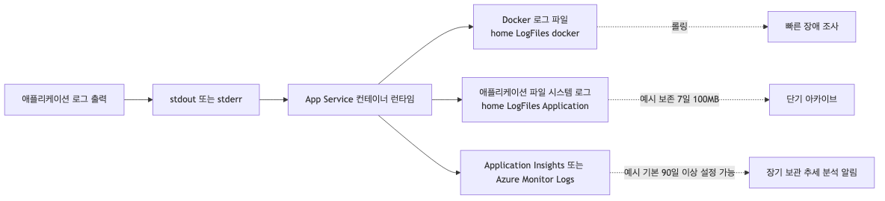
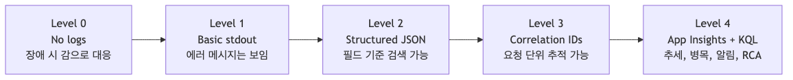
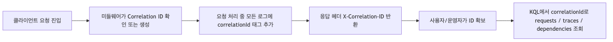

# 로그와 모니터링 기초: “앱이 느려요”에 답할 수 있는 상태 만들기

“앱이 느려요.” “에러가 나요.” “언제부터 시작된 거죠?” 이런 질문에 답하지 못하면 App Service는 관리형 플랫폼이 아니라 보이지 않는 상자처럼 느껴집니다.

이 글은 Azure App Service 101 시리즈의 6번째 글입니다.

여기서는 App Service를 로그와 메트릭, 추적 정보로 읽을 수 있는 시스템으로 바꾸는 방법을 다룹니다. 핵심은 로그가 어디로 가는지, 실시간 디버깅과 장기 분석을 어떻게 나눌지, 어떤 알림 기준이 실제로 유용한지 정리하는 것입니다.

---

## 이 글에서 다룰 문제

- App Service diagnostic log(HTTP, application, container)는 실제로 어디에 쌓일까요?
- Application Insights, Log Analytics, Diagnostic Settings는 책임을 어떻게 나눌까요?
- live tail 또는 log streaming은 언제 도움이 되고, 어디서 한계가 있을까요?
- memory, HTTP 5xx, response time 알림은 어떤 기준부터 유용할까요?
- disk quota나 dependency failure는 어떤 신호가 가장 먼저 경고할까요?

## Where Do Logs Go?

App Service에서 로그 흐름을 이해하는 것이 첫 단계입니다.



*앱 로그가 파일시스템과 모니터링으로 흘러가는 구조*

```text
Flask App (logger.info) → stdout/stderr → App Service Runtime
 ↓
 ┌─────────────────┴─────────────────┐
 ↓ ↓
 /home/LogFiles Application Insights
 (Filesystem) (Long-term analysis)
```

| Destination | Retention | Purpose |
|-------------|-----------|---------|
| `/home/LogFiles/*_docker.log` | ~35MB rolling | Container crashes, startup errors |
| `/home/LogFiles/Application/` | Max 100MB/7 days | Short-term log archive |
| Application Insights | 90 days default | Long-term analysis, alerts, KQL |



*로그에서 tracing으로 가는 observability 성숙도 단계*

> 실시간 로그 스트림은 지금 무슨 일이 벌어지는지 보여 주고, Application Insights는 왜 그런 일이 반복되는지 보여 줍니다. 둘은 대체재가 아니라 역할이 다릅니다.

---

## Step 1: Enable Filesystem Logging

App Service는 filesystem logging을 켠 뒤에야 application stdout/stderr를 `/home/LogFiles/`에 기록합니다. 그전까지는 application log pipeline이 꺼져 있으므로 `az webapp log tail`도 application log를 스트리밍할 수 없습니다.

### Configure Logging

```bash
az webapp log config \
 --resource-group $RG \
 --name $APP_NAME \
 --application-logging filesystem \
 --level verbose \
 --web-server-logging filesystem
```

### Verify Configuration

```bash
az webapp log show \
 --resource-group $RG \
 --name $APP_NAME \
 --output json
```

**Example output:**
```json
{
 "applicationLogs": {
 "fileSystem": {
 "level": "Verbose"
 }
 },
 "httpLogs": {
 "fileSystem": {
 "enabled": true,
 "retentionInDays": 7,
 "retentionInMb": 100
 }
 }
}
```

---

## Step 2: Real-time Log Stream

**실시간 로그**는 배포 직후나 장애가 발생했을 때 특히 유용합니다.

### Stream via CLI

```bash
az webapp log tail \
 --resource-group $RG \
 --name $APP_NAME
```

요청을 보내면 로그가 바로 나타납니다.

```text
2025-04-07T10:30:15.123Z {"level": "info", "message": "Request processed", "userId": "user-123"}
2025-04-07T10:30:15.456Z {"level": "error", "message": "Database connection failed", "error": "timeout"}
```

### Filter JSON Logs Only

```bash
az webapp log tail \
 --resource-group $RG \
 --name $APP_NAME \
 | grep --line-buffered '"level"'
```

---

## Step 3: Structured Logging (JSON)

문자열 로그보다 **JSON 로그**가 분석에 훨씬 유리합니다.

### Python Configuration

```python
import logging
import json
from datetime import datetime

class JsonFormatter(logging.Formatter):
 def format(self, record):
 log_obj = {
 "timestamp": datetime.utcnow().isoformat() + "Z",
 "level": record.levelname.lower(),
 "message": record.getMessage(),
 "logger": record.name,
 }
 # Merge additional fields
 if hasattr(record, "custom_dimensions"):
 log_obj.update(record.custom_dimensions)
 return json.dumps(log_obj)

# Handler setup
handler = logging.StreamHandler()
handler.setFormatter(JsonFormatter())

logger = logging.getLogger(__name__)
logger.addHandler(handler)
logger.setLevel(logging.INFO)
```

### Usage Example

```python
logger.info("Order created", extra={"custom_dimensions": {
 "orderId": "ORD-12345",
 "userId": "user-789",
 "totalAmount": 150.00
}})
```

**Output:**
```json
{"timestamp": "2025-04-07T10:30:15.123Z", "level": "info", "message": "Order created", "orderId": "ORD-12345", "userId": "user-789", "totalAmount": 150.0}
```

---

## Step 4: Request Tracing with Correlation ID

하나의 요청에서 나온 모든 로그를 묶으려면 **Correlation ID**가 필요합니다.



*하나의 요청을 따라가는 Correlation ID 흐름*

### Middleware Implementation

```python
import uuid
from flask import Flask, request, g, has_request_context

app = Flask(__name__)

@app.before_request
def set_correlation_id():
 # Get from header or generate new
 g.correlation_id = request.headers.get(
 "X-Correlation-ID", 
 str(uuid.uuid4())
 )

@app.after_request
def add_correlation_header(response):
 response.headers["X-Correlation-ID"] = g.correlation_id
 return response
```

### Auto-include in Logging

```python
class CorrelationFilter(logging.Filter):
 def filter(self, record):
  if has_request_context():
   record.correlation_id = g.get('correlation_id', '-')
  else:
   record.correlation_id = '-'
  return True

logger.addFilter(CorrelationFilter())
```

### Usage

사용자가 오류를 제보하면 `X-Correlation-ID` header 값을 받아 그 요청의 로그를 한 번에 찾습니다.

```bash
# Filter logs by specific Correlation ID
az webapp log tail --resource-group $RG --name $APP_NAME \
 | grep --line-buffered "a1b2c3d4"
```

---

## Step 5: Application Insights Integration

장기 분석과 알림을 위해 **Application Insights**를 연결합니다.

### Create Application Insights

```bash
az monitor app-insights component create \
 --resource-group $RG \
 --app $APP_NAME-insights \
 --location $LOCATION \
 --kind web
```

### Get Connection String

```bash
APPINSIGHTS_CS=$(az monitor app-insights component show \
 --resource-group $RG \
 --app $APP_NAME-insights \
 --query connectionString \
 --output tsv)
```

### Add to App Settings

```bash
az webapp config appsettings set \
 --resource-group $RG \
 --name $APP_NAME \
 --settings APPLICATIONINSIGHTS_CONNECTION_STRING=$APPINSIGHTS_CS
```

### Install Python SDK

```bash
pip install azure-monitor-opentelemetry
```

### Initialize in App

```python
from azure.monitor.opentelemetry import configure_azure_monitor
import os

if os.environ.get("APPLICATIONINSIGHTS_CONNECTION_STRING"):
 configure_azure_monitor(
 connection_string=os.environ["APPLICATIONINSIGHTS_CONNECTION_STRING"]
 )
```

---

## Step 6: Log Analysis with KQL

Application Insights에 저장된 로그는 **KQL (Kusto Query Language)** 로 분석합니다.

### Query Recent Errors

```kql
AppTraces
| where TimeGenerated > ago(1h)
| where SeverityLevel == 3 // Error
| project TimeGenerated, Message, Properties
| order by TimeGenerated desc
| take 20
```

### Error Rate Time Series

```kql
AppRequests
| where TimeGenerated > ago(6h)
| summarize 
 total = count(),
 failed = countif(Success == false)
 by bin(TimeGenerated, 5m)
| extend errorRate = (failed * 100.0) / total
| render timechart
```

### Top 10 Slowest Requests

```kql
AppRequests
| where TimeGenerated > ago(1h)
| top 10 by DurationMs desc
| project TimeGenerated, Name, DurationMs, ResultCode
```

### Trace by Correlation ID

```kql
AppTraces
| where TimeGenerated > ago(24h)
| extend correlationId = tostring(Properties["correlationId"])
| where correlationId == "a1b2c3d4-e5f6-7890-abcd-ef1234567890"
| project TimeGenerated, SeverityLevel, Message
| order by TimeGenerated asc
```

---

## Step 7: Configure Alerts

문제가 생겼을 때 자동으로 알림을 받도록 설정합니다.

### Error Rate Alert

```bash
az monitor metrics alert create \
 --resource-group $RG \
 --name "High Error Rate" \
 --scopes "/subscriptions/$SUBSCRIPTION_ID/resourceGroups/$RG/providers/Microsoft.Web/sites/$APP_NAME" \
 --condition "avg Http5xx > 10" \
 --window-size 5m \
 --evaluation-frequency 1m
```

### Configure in Azure Portal

1. App Service → Alerts → + Create alert rule
2. Condition: HTTP 5xx > 10
3. Action group: Email/SMS/Webhook

---

## Checking Logs in Filesystem

### Access via Kudu

```text
https://<app-name>.scm.azurewebsites.net
```

**Paths:**
```text
/home/LogFiles/
├── <hostname>_docker.log ← Container stdout
├── Application/
│ └── <date>_<hostname>_default_docker.log
└── kudu/
 └── deployment/ ← Deployment logs
```

### Access via SSH

```bash
az webapp ssh --resource-group $RG --name $APP_NAME

# Inside container
tail -f /home/LogFiles/*_docker.log
```

### Download Logs

```bash
az webapp log download \
 --resource-group $RG \
 --name $APP_NAME \
 --log-file ./logs.zip

unzip logs.zip -d ./logs
```

---

## Log Level Management

### Purpose by Level

| Level | Purpose | Recommended for Production |
|-------|---------|---------------------------|
| DEBUG | Detailed debugging | No |
| INFO | Normal operation info | Yes |
| WARNING | Potential issues | Yes |
| ERROR | Error occurred | Yes |
| CRITICAL | Severe failure | Yes |

### Dynamic Level Change

```bash
# Enable DEBUG during incident investigation
az webapp config appsettings set \
 --resource-group $RG \
 --name $APP_NAME \
 --settings LOG_LEVEL=DEBUG

# Revert after investigation
az webapp config appsettings set \
 --resource-group $RG \
 --name $APP_NAME \
 --settings LOG_LEVEL=INFO
```

> DEBUG level increases **costs** and risks **sensitive information exposure**, so always revert after investigation.

---

## Troubleshooting Scenarios

### "Logs aren't showing"

1. Verify logging is enabled: `az webapp log show`
2. Check if app outputs to stdout
3. Enable Log stream then trigger a request

### "No data in Application Insights"

1. Check `APPLICATIONINSIGHTS_CONNECTION_STRING` setting
2. Verify SDK initialization code
3. Wait 2-3 minutes (data collection delay)

### "Want to find specific errors"

```kql
// Trace by Correlation ID
AppTraces
| where Properties contains "correlation-id-here"

// Errors in specific time range
AppTraces
| where TimeGenerated between(datetime(2025-04-07 10:00)..datetime(2025-04-07 11:00))
| where SeverityLevel >= 3
```

---

## 운영 체크리스트

- [ ] App Service diagnostic log를 Log Analytics에 중앙화했다
- [ ] Application Insights를 켜고 sampling 정책을 정했다
- [ ] memory, 5xx, latency 알림 기준을 정했다
- [ ] disk quota와 dependency failure 알림을 연결했다
- [ ] 장애 runbook에 첫 5분 대응 절차를 문서화했다

---

## 정리

Logging과 monitoring에서 가져가야 할 핵심은 아래와 같습니다.

- **Filesystem Logs**: 즉시 디버깅용입니다.
- **Structured JSON Logs**: 분석과 필터링이 쉬워집니다.
- **Correlation ID**: 요청 단위 추적의 기본입니다.
- **Application Insights**: 장기 분석과 알림의 중심입니다.
- **KQL**: 운영 중 질문을 데이터로 바꾸는 질의 언어입니다.

App Service는 로그가 없으면 추측으로 운영하게 됩니다. 반대로 stdout, 파일시스템, Application Insights, 알림이 이어지면 “무슨 일이 있었나”를 압박 속에서도 훨씬 빠르게 설명할 수 있습니다.

<!-- toc:begin -->
## 시리즈 목차

- [Azure App Service란? - 플랫폼 아키텍처 이해하기](./01-what-is-app-service.md)
- [Request Lifecycle: 3am에 터진 502를 어디서부터 봐야 할까](./02-request-lifecycle.md)
- [Hosting Models: 어떤 플랜을 선택해야 할까?](./03-hosting-models.md)
- [첫 번째 배포: 로컬에서 Azure까지 (Python/Flask)](./04-first-deploy.md)
- [Configuration 마스터하기: App Settings & 환경변수](./05-configuration.md)
- **로그와 모니터링 기초: “앱이 느려요”에 답할 수 있는 상태 만들기 (현재 글)**
- Scaling 101: 언제 Scale Up vs Scale Out? (예정)

<!-- toc:end -->

---

## 참고 자료

### 공식 문서
- [Enable diagnostics logging (Microsoft Learn)](https://learn.microsoft.com/azure/app-service/troubleshoot-diagnostic-logs)
- [Azure Monitor OpenTelemetry for Python (Microsoft Learn)](https://learn.microsoft.com/azure/azure-monitor/app/opentelemetry-enable?tabs=python)
- [KQL Quick Reference](https://learn.microsoft.com/azure/data-explorer/kql-quick-reference)

### 관련 시리즈
- [Azure Functions 101](../../azure-functions-101/ko/)

---

Tags: Azure, App Service, Cloud, Web Apps
