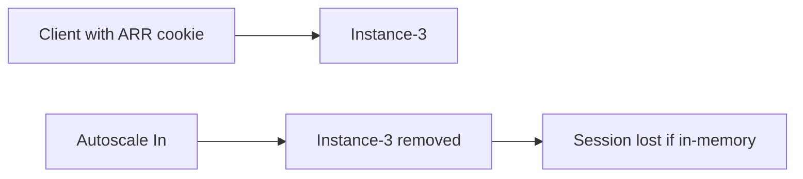

# Scaling 101: 언제 Scale Up vs Scale Out?

트래픽이 늘고 앱이 느려지기 시작하면, 다음 질문은 거의 항상 같습니다. 인스턴스를 더 크게 키워야 할까, 아니면 개수를 늘려야 할까. 비용을 줄이면서 성능을 지키려면 이 차이를 먼저 분명히 알아야 합니다.

앞에서 본 플랫폼 구조, 배포, 설정, 모니터링을 실제 scale 결정으로 연결해 보겠습니다. App Service 운영은 결국 “언제 어떤 방식으로 용량을 바꿀지”까지 설명할 수 있을 때 비로소 완성됩니다.

---

> 비용 상한이 없는 scale rule은, 한 번의 잘못된 배포가 순식간에 큰 청구서로 이어지는 가장 빠른 경로입니다.

## 이 글에서 다룰 문제

- 수직 확장(scale up)과 수평 확장(scale out)은 신호와 비용이 어떻게 다를까요?
- 어떤 메트릭(CPU, queue, custom)을 auto-scale rule에 써야 할까요?
- 인스턴스가 scale in 될 때 ARR Affinity 세션은 어떻게 될까요?
- Premium의 always-ready는 cold start를 얼마나 줄여 줄까요?
- scale ceiling과 cost ceiling을 동시에 어떻게 지킬 수 있을까요?

## Two Directions of Scaling

```text
 ┌─────────────┐
 │ Larger │ ← Scale Up (Vertical)
 │ Instance │
 └─────────────┘
 ↑
┌───┐ ┌───┐ ┌───┐ ┌───┐
│ S │ │ S │ │ S │ ... │ S │ ← Scale Out (Horizontal)
└───┘ └───┘ └───┘ └───┘
 ↑
More instances
```

| Direction | Name | Description |
|-----------|------|-------------|
| **Vertical** | Scale Up/Down | Change instance size |
| **Horizontal** | Scale Out/In | Change instance count |


*인스턴스를 키우는 방식과 개수를 늘리는 방식의 차이*

---

## Scale Up (Vertical Scaling)

### When to Use?

- 인스턴스당 **더 많은 메모리**가 필요할 때
- **CPU가 포화**되어 있고 Scale Out으로 해결되지 않을 때
- 상위 티어 기능(VNet, Slots 등)이 필요할 때

### Trade-offs

| Pros | Cons |
|------|------|
| Simple configuration | Triggers restart |
| Feature upgrade | Cost can spike |
| - | Upper limit exists |

### Scale Up with CLI

```bash
# Upgrade S1 → P1v3
az appservice plan update \
 --resource-group $RG \
 --name $PLAN_NAME \
 --sku P1v3
```

### Check Current SKU

```bash
az appservice plan show \
 --resource-group $RG \
 --name $PLAN_NAME \
 --query "sku" \
 --output json
```

**Output:**
```json
{
 "name": "P1v3",
 "tier": "PremiumV3",
 "capacity": 2
}
```

---

## Scale Out (Horizontal Scaling)

### When to Use?

- **트래픽 증가**로 더 많은 처리량이 필요할 때
- **고가용성**을 위해 여러 인스턴스가 필요할 때
- 앱이 **stateless**하게 설계되어 있을 때


*병목 유형에 따라 달라지는 scaling 선택*

### Prerequisite: Stateless Design

Scale Out이 제대로 동작하려면 앱 상태를 **외부 저장소**에 둬야 합니다.

| Stateless Pattern | Stateful Anti-pattern |
|---------------------|-------------------------|
| Store sessions in Redis | Store sessions in memory |
| Store state in DB | Store state in local files |
| Use distributed cache | Per-instance cache |

```python
# Stateful example that breaks scale-out
user_sessions = {} # Stored in memory

@app.route('/login')
def login():
 user_sessions[user_id] = session_data

# Stateless version backed by Redis
import json
import os
import redis
from flask import request

r = redis.Redis(host=os.environ["REDIS_HOST"])

@app.route('/login')
def login():
  user_id = request.json.get("user_id")
  session_data = {
   "logged_in": True,
   "roles": request.json.get("roles", []),
  }
  r.set(f"session:{user_id}", json.dumps(session_data))
```

### Scale Out with CLI

```bash
# Manually scale to 3 instances
az appservice plan update \
 --resource-group $RG \
 --name $PLAN_NAME \
 --number-of-workers 3
```

---

## Autoscale: Automatic Scaling

메트릭을 기준으로 인스턴스를 **자동으로** 늘리거나 줄일 수 있습니다.


*메트릭에서 액션으로 이어지는 Autoscale 피드백 루프*

### Autoscale Flow

```text
Collect Metrics → Evaluate Rules → Scale Action → Cooldown → Re-evaluate
```

### Basic Autoscale Configuration

```bash
# Create Autoscale profile
az monitor autoscale create \
 --resource-group $RG \
 --resource $PLAN_NAME \
 --resource-type "Microsoft.Web/serverfarms" \
 --name "autoscale-rule" \
 --min-count 2 \
 --max-count 10 \
 --count 2
```

### Add Scale Out Rule

```bash
# Add 1 instance when CPU > 70%
az monitor autoscale rule create \
 --resource-group $RG \
 --autoscale-name "autoscale-rule" \
 --condition "Percentage CPU > 70 avg 10m" \
 --scale out 1
```

### Add Scale In Rule

```bash
# Remove 1 instance when CPU < 35%
az monitor autoscale rule create \
 --resource-group $RG \
 --autoscale-name "autoscale-rule" \
 --condition "Percentage CPU < 35 avg 20m" \
 --scale in 1
```

### Verify Autoscale Configuration

```bash
az monitor autoscale show \
 --resource-group $RG \
 --name "autoscale-rule" \
 --output json
```

**Example output:**
```json
{
 "enabled": true,
 "profiles": [{
 "capacity": {
 "default": "2",
 "maximum": "10",
 "minimum": "2"
 },
 "rules": [
 {"metricTrigger": {"metricName": "Percentage CPU", "operator": "GreaterThan", "threshold": 70}},
 {"metricTrigger": {"metricName": "Percentage CPU", "operator": "LessThan", "threshold": 35}}
 ]
 }]
}
```

---

## Autoscale Design Best Practices

### 1. Separate Scale Out/In Thresholds

```text
Scale Out: CPU > 70%
Scale In: CPU < 35% ← Gap prevents oscillation
```

**Oscillation**: threshold가 너무 가까우면 scale up/down이 계속 반복됩니다.

### 2. Set Cooldown Period

```bash
# Wait 5 minutes after Scale Out
--cooldown 5
```

### 3. Set Minimum/Maximum Instances

```text
Minimum: 2 ← 가용성 기준선, 그리고 Health Check 효과를 온전히 활용하기 위한 권장값
Maximum: 10 ← Cost control
```

### 4. Combine Multiple Metrics

```bash
# CPU + Memory combination
az monitor autoscale rule create \
 --condition "Memory Percentage > 80 avg 5m" \
 --scale out 2
```

---

## Consider Dependencies

### Side Effects of Scale Out

인스턴스 수가 늘어나면 **외부 의존성에 가해지는 부하도 함께 증가**합니다.


*인스턴스 증가가 의존성 부하로 전이되는 구조*

```text
2 instances → 20 DB connections
10 instances → 100 DB connections (!)
```

### Checklist

| Dependency | Check |
|------------|-------|
| Database | Connection pool limit, max connections |
| External API | Rate limit |
| Cache (Redis) | Throughput limit |
| Outbound | SNAT port exhaustion |

### Connection Pool Configuration Example

```python
from sqlalchemy import create_engine

engine = create_engine(
 DATABASE_URL,
 pool_size=5, # Connections per instance
 max_overflow=10, # Additional allowed
 pool_timeout=30,
 pool_recycle=1800
)
```

---

## Monitoring and Alerts

### Key Metrics

| Metric | Purpose | Example Alert Threshold |
|--------|---------|------------------------|
| CPU Percentage | Compute load | > 80% for 5min |
| Memory Percentage | Memory pressure | > 85% for 5min |
| HTTP Queue Length | Request backlog | > 100 |
| Response Time | User experience | p95 > 2s |
| Instance Count | Cost | > 8 |

### Configure Alerts

```bash
az monitor metrics alert create \
 --resource-group $RG \
 --name "High CPU Alert" \
 --scopes "/subscriptions/$SUB/resourceGroups/$RG/providers/Microsoft.Web/serverfarms/$PLAN_NAME" \
 --condition "avg Percentage CPU > 80" \
 --window-size 5m
```

---

## Cost Optimization

### Schedule-based Scaling

업무 시간에만 인스턴스를 더 높게 유지합니다.

```bash
# Business hours: minimum 4
# Off-hours: minimum 2
```

Azure Portal → Scale out → Add a scale condition → Schedule

### Aggressive Scale In

```bash
# Generous Scale In rule
--condition "Percentage CPU < 30 avg 30m"
```

### Choose the Right Tier

| Situation | Recommended Approach |
|-----------|---------------------|
| Memory shortage | Consider Scale Up |
| Traffic increase | Scale Out first |
| Both | Scale Up then Scale Out |

---

## Scaling Playbook

### Traffic Spike Response

1. Immediate: Manually increase instances
2. Check Autoscale trigger delay
3. Check dependency bottlenecks
4. Revert after event ends

```bash
# Emergency Scale Out
az appservice plan update \
 --resource-group $RG \
 --name $PLAN_NAME \
 --number-of-workers 8
```

### Memory Pressure Response

1. Identify memory increase pattern (gradual vs sudden)
2. Gradual: Suspect memory leak → Review app code
3. Sudden: Traffic-based → Scale Up or Scale Out

### Cost Reduction

1. Set Scale In schedule for nights/weekends
2. Review Maximum instance limit
3. Monthly instance usage review

---

## Where this fits in the series

---

## Scale Up/Out 결정을 숫자로 만드는 기준

감으로 scale을 결정하면 비용과 성능이 동시에 흔들립니다. 운영에서는 아래처럼 신호와 결정을 연결합니다.

| 관측 신호 | 해석 | 우선 액션 |
|---|---|---|
| CPU 높음 + 메모리 여유 | 계산량 병목 | scale out 우선 |
| 메모리 압박 + OOM 근접 | 인스턴스 크기 부족 | scale up 우선 |
| queue 길이 증가 + CPU 보통 | I/O 또는 의존성 대기 | 의존성 점검 후 scale out |
| scale out 후에도 p95 악화 | 외부 병목 | DB/API/caching 재설계 |

핵심은 앱 지표와 의존성 지표를 같이 본 뒤 결정을 내리는 것입니다.

---

## ARR Affinity와 scale-in 충돌 시나리오

세션이 인메모리에 남아 있는 상태에서 scale-in이 일어나면, 특정 사용자가 세션 손실을 겪을 수 있습니다.



### 대응 원칙

- 로그인 세션은 Redis/DB에 저장
- ARR Affinity를 유지해야 하는 기간을 최소화
- scale-in 규칙을 완만하게 설계해 급격한 축소를 피함

```bash
az webapp update \
  --resource-group $RG \
  --name $APP_NAME \
  --client-affinity-enabled false
```

---

## Autoscale JSON 예시(프로필 + 일정)

스케줄 기반과 메트릭 기반을 혼합하면 비용/성능 균형을 맞추기 쉽습니다.

```json
{
  "name": "autoscale-appservice-prod",
  "enabled": true,
  "profiles": [
    {
      "name": "business-hours",
      "capacity": { "minimum": "3", "maximum": "10", "default": "4" },
      "rules": [
        {
          "metricTrigger": {
            "metricName": "Percentage CPU",
            "operator": "GreaterThan",
            "threshold": 70,
            "timeAggregation": "Average",
            "timeWindow": "PT10M"
          },
          "scaleAction": { "direction": "Increase", "value": "1", "cooldown": "PT5M" }
        },
        {
          "metricTrigger": {
            "metricName": "Percentage CPU",
            "operator": "LessThan",
            "threshold": 35,
            "timeAggregation": "Average",
            "timeWindow": "PT20M"
          },
          "scaleAction": { "direction": "Decrease", "value": "1", "cooldown": "PT10M" }
        }
      ]
    }
  ]
}
```

운영에서는 scale out보다 scale in을 더 보수적으로 두는 편이 안정적입니다.

---

## 실제 오류 메시지와 과확장 징후

```text
Warning: SNAT Port Exhaustion detected.
Error: timeout connecting to postgres.database.azure.com
High memory usage detected. Instance recycled.
```

| 메시지 | 의미 | 조치 |
|---|---|---|
| `SNAT Port Exhaustion` | outbound 연결 고갈 | connection reuse, NAT 설계 점검 |
| `timeout connecting ...` | 의존성 병목 | DB pool/쿼리/네트워크 검증 |
| `Instance recycled` | 메모리 압박 또는 플랫폼 이벤트 | 메모리 프로파일링, scale up 검토 |

scale out으로 모든 문제가 해결되지 않는다는 점을 보여 주는 전형적 신호입니다.

---

## Portal 실습: 예산 상한을 포함한 스케일 정책

1. `App Service Plan -> Scale out (App Service plan)` 이동
2. `Custom autoscale` 활성화
3. 최소/기본/최대 인스턴스 지정
4. CPU scale out/in 규칙 추가
5. 업무시간 스케줄 프로필 추가

### 반드시 같이 설정할 항목

- 최대 인스턴스 도달 알람
- 예산 경보(Budget alert)
- 야간 최소 인스턴스 축소 프로필

```bash
# 최대 인스턴스 도달 알림(메트릭 알람)
az monitor metrics alert create \
  --resource-group $RG \
  --name "instance-count-cap" \
  --scopes "/subscriptions/$SUB/resourceGroups/$RG/providers/Microsoft.Web/serverfarms/$PLAN_NAME" \
  --condition "max InstanceCount >= 8" \
  --window-size 5m \
  --evaluation-frequency 1m
```

---

## Before/After: Scale 버튼 중심 운영에서 정책 중심 운영으로

### Before

- 장애 시 수동으로 인스턴스 수를 올리고, 끝나면 잊어버립니다.
- 비용 상한이 없어 월말에 청구서가 급등합니다.
- scale in/out 기준이 팀마다 달라 재현이 어렵습니다.

### After

- Autoscale 규칙과 일정 프로필을 IaC/CLI로 관리합니다.
- 인스턴스 상한과 예산 알람을 함께 둡니다.
- scale 이벤트 후 회고를 통해 임계값을 월별로 보정합니다.

스케일링의 성숙도는 자동화보다 "설명 가능한 결정 기준"에서 드러납니다.

---

## 부하 테스트 결과를 scale 정책으로 연결하기

scale 정책은 추측보다 계측값 기반으로 만들어야 합니다. 아래처럼 단계별 부하를 주고 임계 지점을 기록해 두면 Autoscale 기준이 선명해집니다.

```bash
# 예시: k6 실행
k6 run --vus 50 --duration 5m loadtest.js
k6 run --vus 100 --duration 5m loadtest.js
k6 run --vus 150 --duration 5m loadtest.js
```

```text
관측 예시
- 50 VU: p95 420ms, CPU 48%
- 100 VU: p95 980ms, CPU 72%
- 150 VU: p95 2100ms, CPU 86%, 5xx 증가
```

이 결과라면 `CPU > 70% 10m` scale-out 규칙이 타당하고, `p95 > 2s` 경보를 별도로 두는 구성이 합리적입니다.

## ARM 템플릿으로 Autoscale 리소스 정의

정책을 포털 수동 클릭에만 의존하면 환경 간 일관성이 깨집니다.

```json
{
  "type": "Microsoft.Insights/autoscalesettings",
  "apiVersion": "2022-10-01",
  "name": "autoscale-appservice-prod",
  "location": "koreacentral",
  "properties": {
    "enabled": true,
    "targetResourceUri": "/subscriptions/<sub>/resourceGroups/<rg>/providers/Microsoft.Web/serverfarms/<plan>",
    "profiles": [
      {
        "name": "default-profile",
        "capacity": { "minimum": "2", "maximum": "8", "default": "2" }
      }
    ]
  }
}
```

여기에 scale rule과 일정 프로필을 추가해 환경별로 동일 정책을 배포할 수 있습니다.

## Scale 이벤트 복기 템플릿

```yaml
scale_event_review:
  event_time: "2026-05-12T10:15:00Z"
  trigger_metric: "Percentage CPU > 70 avg 10m"
  action: "scale out +1"
  before:
    instances: 2
    p95_ms: 1850
    http5xx_rate: 2.8
  after_15m:
    instances: 3
    p95_ms: 930
    http5xx_rate: 0.6
  dependency_impact:
    db_connections_peak: 132
  follow_up:
    - "DB pool 상한 조정"
    - "야간 scale-in cooldown 완화"
```

스케일링은 실행보다 회고 품질에서 성숙도가 갈립니다. 동일 트래픽 패턴에서 같은 결정을 반복하려면 이벤트 복기가 필수입니다.

## scale out 전에 확인할 요청 처리 계약

```python
# Flask 예시: 요청 timeout을 짧게 유지하고 긴 작업은 큐로 넘기는 패턴
from flask import jsonify

@app.post('/reports/export')
def export_report():
    job_id = enqueue_export_job()
    return jsonify({"status": "accepted", "jobId": job_id}), 202
```

요청 경로가 짧고 상태가 외부화되어 있어야 scale out 효과가 안정적으로 나타납니다.

---

## 처음 질문으로 돌아가기

- scale up과 scale out은 신호와 비용이 어떻게 다른가? -> 메모리/기능 병목은 up, 처리량/가용성은 out이 기본입니다.
- 어떤 메트릭을 auto-scale에 써야 하는가? -> CPU 단일 기준을 넘어서 queue, latency, dependency 실패 신호를 결합해야 합니다.
- scale-in 시 ARR 세션은 어떻게 되는가? -> 인메모리 세션이면 손실 가능성이 커지므로 외부 세션 저장소가 필요합니다.
- always-ready는 cold start를 줄이는가? -> 줄여 주지만 비용이 늘어나므로 트래픽 패턴 기준으로 개수를 결정해야 합니다.
- scale/cost ceiling을 동시에 지키는 법은? -> 최대 인스턴스, 일정 프로필, 예산/메트릭 알람을 함께 설계해야 합니다.

---

## 워크로드별 스케일 전략 예시

### API 중심 서비스

- 기준 메트릭: CPU, p95 latency, HTTP queue
- 기본 전략: scale out 우선
- 보조 전략: 메모리 압박 시 scale up 병행

### 배치성 요청이 섞인 서비스

- 기준 메트릭: queue length, dependency latency
- 기본 전략: 요청 경로에서 배치 작업 분리
- 보조 전략: 스케줄 기반 최소 인스턴스 조정

### 메모리 집약 서비스

- 기준 메트릭: memory percentage, recycle 이벤트
- 기본 전략: scale up 먼저 검토
- 보조 전략: 캐시/데이터 구조 최적화

---

## Scale 이벤트 검증 명령 모음

```bash
# 현재 worker 수
az appservice plan show \
  --resource-group $RG \
  --name $PLAN_NAME \
  --query "{workers:numberOfWorkers, sku:sku.name, tier:sku.tier}" \
  --output json

# autoscale 설정 확인
az monitor autoscale show \
  --resource-group $RG \
  --name autoscale-rule \
  --output json

# 메트릭 추세 확인
az monitor metrics list \
  --resource "/subscriptions/$SUB/resourceGroups/$RG/providers/Microsoft.Web/serverfarms/$PLAN_NAME" \
  --metric "Percentage CPU,MemoryPercentage,HttpQueueLength" \
  --interval PT1M \
  --aggregation Average Maximum
```

이 명령들은 scale 이벤트 후 회고에서 근거 데이터로 바로 사용할 수 있습니다.

---

## 실패 복구 시나리오: 과확장과 과축소

### 과확장(비용 급증)

1. 최대 인스턴스 즉시 하향
2. scale out 임계치 상향
3. 야간 스케줄 최소치 재조정

### 과축소(응답 지연 급증)

1. 최소 인스턴스 상향
2. scale in cooldown 연장
3. health check 및 startup 시간 재측정

정책의 안정성은 평균 상황보다 경계 상황에서 결정됩니다.

---

## 스케일링 회고 템플릿

scale 정책은 한 번 정하고 끝나는 항목이 아닙니다. 월별 회고로 보정해야 합니다.

```yaml
scaling_review:
  month: 2026-05
  traffic_peak_rps: 420
  p95_ms_peak: 1850
  max_instances_reached: 7
  scale_out_events: 14
  scale_in_events: 11
  incidents:
    - "야간 과축소로 p95 급증"
  actions:
    - "야간 최소 인스턴스 2 -> 3"
    - "scale-in cooldown 10m -> 15m"
```

숫자 기반 회고가 쌓이면 임계값을 팀 감각이 아니라 데이터로 조정할 수 있습니다.

---

## 마지막 실전 점검

### 점검 질문

1. 최대 인스턴스 값이 비용 상한과 일치하는가?
2. 최소 인스턴스 값이 가용성 목표와 일치하는가?
3. scale in/out 규칙 간격이 충분한가?
4. scale 이벤트가 의존성 한도를 넘기지 않는가?

### 검증 명령

```bash
az appservice plan show --resource-group $RG --name $PLAN_NAME --output json
az monitor autoscale show --resource-group $RG --name autoscale-rule --output json
az monitor metrics list \
  --resource "/subscriptions/$SUB/resourceGroups/$RG/providers/Microsoft.Web/serverfarms/$PLAN_NAME" \
  --metric "Percentage CPU,MemoryPercentage,HttpQueueLength" \
  --interval PT5M --aggregation Average
```

시리즈 마지막 단계에서 이 점검을 통과하면, App Service를 단순 배포 대상이 아니라 운영 가능한 플랫폼으로 다루는 기반이 갖춰집니다.

---

## 비용 보호 장치 설계

스케일링 정책은 성능뿐 아니라 비용 보호 장치까지 포함해야 완성됩니다.

### 필수 보호 장치

1. 최대 인스턴스 상한
2. 예산 경보
3. 야간/주말 최소치 축소
4. 급격한 scale out 후 자동 알림

```yaml
cost_guardrails:
  max_instances: 8
  monthly_budget_usd: 1200
  off_hours_min_instances: 2
  notify_when_instance_over: 6
```

비용 상한은 "나중에"가 아니라 초기 정책 설계 단계에서 함께 넣어야 합니다.

---

## 시나리오: 이벤트 트래픽 10배 급증

### 사전 준비

- 최소 인스턴스 임시 상향
- dependency pool 확장
- 읽기 캐시 활성화

### 이벤트 중

- 5분 단위로 p95/5xx/queue 확인
- autoscale 이벤트 로그 모니터링
- 실패율이 임계치 넘으면 즉시 완화 룰 적용

### 이벤트 후

- 인스턴스 원복
- 비용/성능 리포트 작성
- 임계치 재설정

이 사이클을 반복하면 스파이크 대응이 점점 예측 가능해집니다.

---

## 스케일링 안티패턴 정리

1. **CPU 하나만 보고 모든 정책을 구성**
   - 메모리/큐/의존성 병목을 놓치기 쉽습니다.
2. **scale in 기준을 scale out과 너무 가깝게 설정**
   - 인스턴스 진동(oscillation)으로 응답 품질이 흔들립니다.
3. **최대 인스턴스 상한 미설정**
   - 비용 폭주 위험이 큽니다.
4. **의존성 용량 검토 없는 scale out**
   - 앱은 늘었는데 DB/API가 병목이 되어 전체 실패율이 증가합니다.

### 개선 패턴

- CPU + latency + dependency를 조합한 다중 지표 정책
- scale in cooldown을 길게 두고 단계적 축소
- 비용 알람과 인스턴스 상한 동시 설정
- 정기 회고를 통한 임계값 재보정

스케일링은 기능 버튼이 아니라 시스템 설계의 연장선입니다.

이 마지막 글은 시리즈 전체를 다시 묶어 줍니다. 배포, 설정, telemetry에서 정리한 내용이 결국 어떤 scaling 결정을 가능하게 하는지 보여 주기 때문입니다. 시리즈를 처음부터 다시 보면 공통된 줄기가 분명해집니다. App Service는 코드를 올리는 장소가 아니라, 운영 판단을 내릴 수 있는 플랫폼으로 다룰 때 가장 잘 맞습니다.

---

## 운영 체크리스트

- [ ] workload별로 vertical vs horizontal scaling 기준을 정했다
- [ ] auto-scale 메트릭과 threshold를 실제 측정값에 맞춰 보정했다
- [ ] scale-in이 sticky session에 주는 영향을 검증했다
- [ ] always-ready 인스턴스 수와 비용의 trade-off를 정했다
- [ ] max instance 수와 알림으로 runaway cost를 막았다

---

## 정리

Scaling 전략에서 기억할 기본 원칙은 아래와 같습니다.

| Situation | Strategy |
|-----------|----------|
| Memory shortage | Scale Up |
| Traffic increase | Scale Out |
| Availability | Minimum 2 instances |
| Cost control | Maximum setting + Schedule |
| Automation | Autoscale + Alerts |

**Remember:**
- Scale Out에는 **Stateless design**이 필요합니다.
- 의존성 한도도 함께 검토해야 합니다.
- Autoscale **oscillation**을 막아야 합니다.

App Service의 scaling은 버튼 하나를 누르는 기능이 아니라, 상태 저장 방식, 의존성 용량, 비용 상한까지 함께 설계하는 운영 작업입니다.

<!-- toc:begin -->
## 시리즈 목차

- [Azure App Service란? - 플랫폼 아키텍처 이해하기](./01-what-is-app-service.md)
- [Request Lifecycle: 3am에 터진 502를 어디서부터 봐야 할까](./02-request-lifecycle.md)
- [Hosting Models: 어떤 플랜을 선택해야 할까?](./03-hosting-models.md)
- [첫 번째 배포: 로컬에서 Azure까지 (Python/Flask)](./04-first-deploy.md)
- [Configuration 마스터하기: App Settings & 환경변수](./05-configuration.md)
- [로그와 모니터링 기초: “앱이 느려요”에 답할 수 있는 상태 만들기](./06-logging-monitoring.md)
- **Scaling 101: 언제 Scale Up vs Scale Out? (현재 글)**

<!-- toc:end -->

---

## 참고 자료

### 공식 문서
- [Scale up an app in Azure App Service (Microsoft Learn)](https://learn.microsoft.com/azure/app-service/manage-scale-up)
- [Get started with autoscale (Microsoft Learn)](https://learn.microsoft.com/azure/azure-monitor/autoscale/autoscale-get-started)
- [Best practices for Azure App Service (Microsoft Learn)](https://learn.microsoft.com/azure/app-service/app-service-best-practices)

### 관련 시리즈
- [Azure Functions 101](../../azure-functions-101/ko/)

---

- [이 글의 예제 코드 (book-examples)](https://github.com/yeongseon-books/book-examples/tree/main/azure-app-service-101/ko/07-scaling-101)

Tags: Azure, App Service, Cloud, Web Apps
