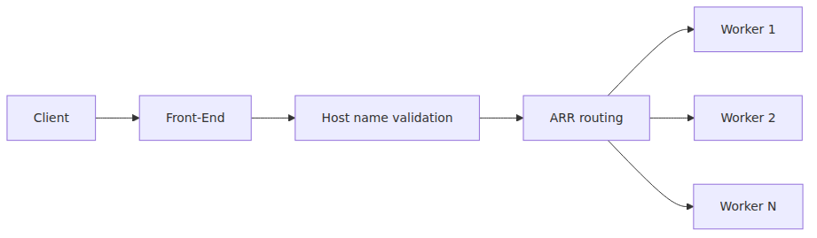
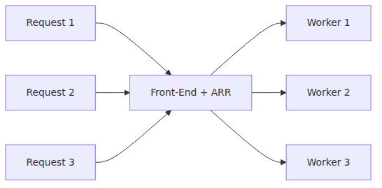
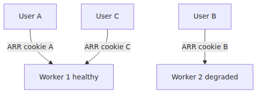
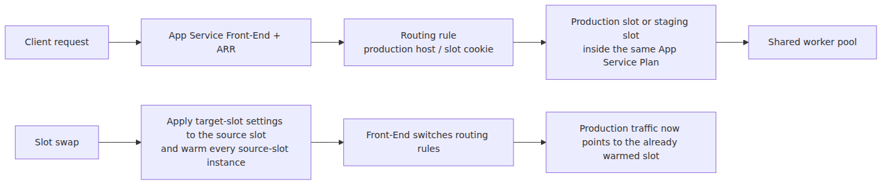

# Front-End and ARR — how a request reaches a worker

## Source Version

This post grounds its claims in the following public sources.

- Microsoft Learn — Azure App Service documentation (https://learn.microsoft.com/azure/app-service)
- Project Kudu (https://github.com/projectkudu/kudu) — only for deployment-engine and Windows-sandbox context

Microsoft doesn't publicly document the full implementation details of the App Service Front-End, Worker, and File Server layers.
In this series, Learn is the primary source of truth, and Kudu material is used only as supporting evidence where it is actually public.

> Azure App Service Deep Dive series (2/6)

Episode 1 split App Service into Front-End, Worker, File Server, Kudu, and observability boxes.
This post zooms into the left edge of that map.

The question is simple.
**How does one HTTP request end up on one specific worker?**

If you understand that path precisely,
you understand when ARR Affinity should be turned off,
why only some users keep hitting a bad instance,
and why App Service keeps pushing you toward stateless design.

---

## Questions this chapter answers

- What does a Front-End node actually do, and where does ARR (Application Request Routing) sit inside it?
- Is the ARR Affinity cookie just a sticky session, or more than that?
- How do TLS termination and SNI handling flow through the Front End?
- How do custom domains and hostname bindings change Front-End routing?
- From the user's perspective, how does a Front-End failure look different from a Worker failure?

## The routing path in three stages



*Three-stage path from ingress to worker*
At the public-documentation level, this is the safe mental model.

1. The request enters the Front-End.
2. The Front-End resolves the app and slot.
3. ARR selects a worker and forwards the request.

Step 2 and step 3 are not the same question.
“Which app does this request belong to?” and “which worker should run it?” are different routing decisions.

---

## What the Front-End decides first

Calling the Front-End a “load balancer” is not wrong.
It is just incomplete.

These decisions happen before your code runs:

- which app the host name maps to
- which slot the request belongs to
- which workers are eligible to receive traffic
- whether an affinity cookie should keep the client on the same worker


*Front-End filtering workers by host, slot, affinity*
This post avoids inventing undocumented selection algorithms.
But the public facts are clear enough.
**When ARR Affinity is enabled, follow-up requests from the same client can keep landing on the same worker.**

---

## Why ARR is here at all

ARR is IIS Application Request Routing.
The IIS ARR documentation describes it as a proxy-based HTTP routing module.
It also supports client affinity through cookies.

App Service uses that ARR capability in the Front-End path.

That means the `ARRAffinity` cookie is not an application session cookie.
It is a platform routing hint.

That distinction matters.

- an app session cookie represents application state
- an ARR Affinity cookie represents worker stickiness

They both look like “session” behavior from the outside.
They are not the same thing.

---

## Request flow with ARR Affinity enabled


*Affinity cookie keeping a client on one worker*
This is not inherently bad.
It is often convenient for legacy apps.

- apps that keep session state in process memory
- apps that depend on per-instance in-memory cache
- apps that are more stable if a login flow stays on one instance

The problem is that this convenience fights App Service's horizontal scaling model.

---

## Request flow with ARR Affinity disabled



*Requests spreading across workers without affinity*
With affinity disabled,
the platform stops assuming that the same client must keep returning to the same worker.
That is why stateless apps fit App Service so well.

The benefits are straightforward.

- load spreads more evenly
- one bad worker is less likely to trap the same users repeatedly
- scale-in and worker replacement become less visible

The price is also straightforward.
**Any worker must be able to produce the same result.**

---

## Why stateless design keeps coming up

App Service guidance and Well-Architected guidance keep nudging you to disable ARR Affinity for a reason.
The platform is built to scale horizontally.

Workers can be replaced,
added,
removed,
or restarted.
There is no promise that one specific instance remains alive long enough to hold durable user state.

That is why these patterns fit App Service cleanly:

- sessions in Redis or a database
- upload state in Blob Storage
- in-memory cache as optimization, not source of truth
- any worker can handle any request

And these patterns tend to fight the platform:

- login session stored only in process memory
- task state written only to a worker-local file
- a critical cache that exists on only one worker

---

## Why only some users fail sometimes

One of the most confusing production symptoms is this one.

“The whole app is not down,
but a subset of users keep seeing latency or errors.”

ARR Affinity is a strong suspect in that situation.



*ARR stickiness creating a partial outage*
If Worker 2 is degraded because of memory pressure,
slow dependencies,
or restart churn,
and some users stay pinned there,
the incident looks like a partial outage instead of a full outage.

That is one of the most practical reasons to understand ARR.

---

## Reverse proxies in front make the story more layered

When Front Door or Application Gateway sits in front of App Service,
stickiness can exist at two layers.

1. the external proxy deciding which origin to use
2. App Service deciding which worker to use inside the origin

The App Service team has explicitly documented this point in its blog posts.
Cookie affinity at the upstream proxy does not replace worker stickiness inside App Service.
App Service still owns the worker selection step.

The inverse is useful too.
If you do not want internal worker stickiness,
the cleaner design is to make the app stateless and not need App Service affinity in the first place.

---

## Slots are also part of request routing

Slots belong in this picture too.
But this is also where one of the most common slot misconceptions appears.
Production and staging do **not** mean two separate App Service Plan worker pools.
Slots share the same plan capacity.
The Front-End resolves host and slot context,
then routes into the correct slot on that shared plan.



*Slot routing inside one shared plan*
The Learn slot-swap flow is more precise than “swap the workers.”

1. App Service applies target-slot settings to the source slot.
2. It waits for every source-slot instance to restart and warm successfully.
3. Only then does the Front-End switch the routing rules that define which slot receives production traffic.

So slot swap is not a naming trick,
but it is also not “production workers replaced by staging workers.”
It is **warm the target app instances first, then flip the Front-End routing rule inside the same plan**.
Warm-up matters precisely because of that sequence.

---

## When to keep ARR Affinity and when to turn it off

### Reasons to keep it for now

- the app still depends heavily on in-process session state
- externalizing that state is not yet practical
- you are in an interim migration stage

### Reasons to turn it off

- the app is already stateless
- you want more even load distribution
- you want to reduce per-user trapping on one worker
- you want horizontal scaling to behave more naturally

This is not a taste decision.
It is a state-management decision.

---

## Episode 2 wrap

The core point of this episode is simple.

> Requests enter the App Service Front-End, and ARR selects the worker. When ARRAffinity is enabled, the platform can keep the same client on the same worker. That is convenient for stateful legacy apps, but it works against App Service's horizontal scaling model. Partial outages that affect only some users often make more sense once you remember that those users may be pinned to one degraded worker.

At this point the request path is clear up to worker selection.
The remaining operational questions now live inside the worker boundary itself:
where user code actually runs,
what the sandbox restricts on Windows,
and why container boundaries matter on Linux.

---

## Where this fits in the series

Episode 1 drew the whole map, and this post zoomed into the Front-End and ARR box on that map. Together they explain the handoff from public ingress to worker selection inside the App Service Plan.

---

## Call Path Summary

Client → App Service Front-End → host/slot resolution → ARR worker selection inside the shared App Service Plan → slot-specific app instance

Slot-swap path: apply target-slot settings to the source slot → warm every source-slot instance → switch Front-End routing rules

### Inspect Front-End routing, hostnames, and SSL

```bash
az webapp config show -n my-app -g my-rg \
  --query "{httpsOnly:httpsOnly, http20:http20Enabled, alwaysOn:alwaysOn, ftpsState:ftpsState, clientCertEnabled:clientCertEnabled}"

az webapp config hostname list -n my-app -g my-rg -o table
az webapp config ssl list -g my-rg -o table
```

## Operational checklist

- [ ] Documented whether ARR Affinity is on and what failure patterns that creates
- [ ] Verified automated TLS certificate renewal and alerting
- [ ] Monitor Front-End 5xx and Worker 5xx as separate signals
- [ ] Catalogued routing priority and redirect rules per custom domain
- [ ] Separated paths that require client-cert auth from those that do not

<!-- toc:begin -->
## In this series

- [App Service platform architecture — Front-End, Worker, File Server](./01-platform-architecture.md)
- **Front-End and ARR — how a request reaches a worker (current)**
- Workers and the sandbox — where user code actually runs (upcoming)
- Deployment and Kudu — build, sync, release from the inside (upcoming)
- Scaling internals — how Scale Out decisions become new workers (upcoming)
- Cold start and warmup — why the first request is expensive (upcoming)

<!-- toc:end -->

---

## References

### Primary sources
- [Using the Application Request Routing Module](https://learn.microsoft.com/iis/extensions/planning-for-arr/using-the-application-request-routing-module)
- [Configure ARRAffinity cookie when accessing Azure App Service behind Azure Application Gateway](https://techcommunity.microsoft.com/blog/appsonazureblog/configure-arraffinity-cookie-when-accessing-azure-app-service-behind-azure-appli/3842511)

### Secondary sources
- [Overview of Azure App Service](https://learn.microsoft.com/azure/app-service/overview)
- [Architecture best practices for Azure App Service web apps](https://learn.microsoft.com/azure/well-architected/service-guides/app-service-web-apps)
- [Deployment slots in Azure App Service](https://learn.microsoft.com/azure/app-service/deploy-staging-slots)

### Related Series
- [Azure App Service 101 — Request Lifecycle](../../azure-app-service-101/en/02-request-lifecycle.md)
- [Azure Functions Deep Dive](../../azure-functions-deep-dive/en/04-dispatcher-and-invocation.md)

Tags: Azure, App Service, Distributed Systems, Platform Engineering
