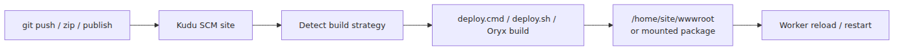
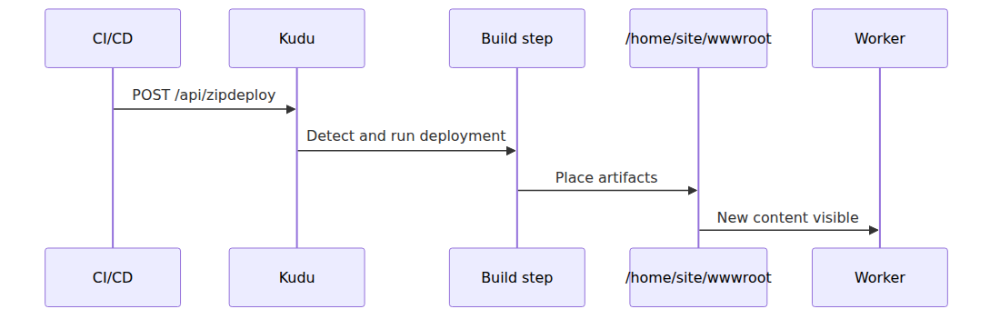
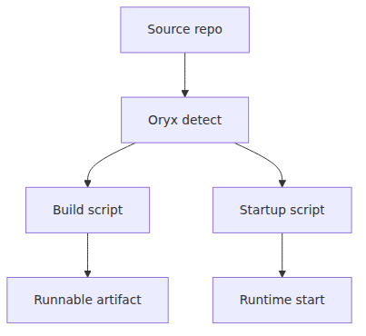
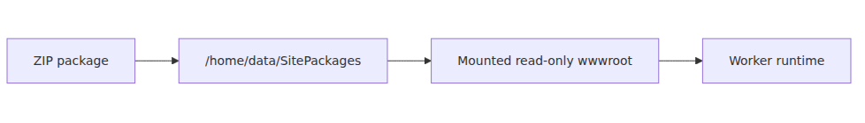
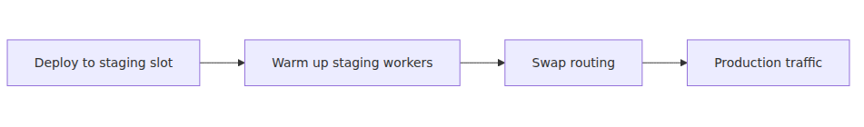

# Deployment and Kudu — build, sync, release from the inside

## Source Version

This post grounds its claims in the following public sources.

- Microsoft Learn — Azure App Service documentation (https://learn.microsoft.com/azure/app-service)
- Project Kudu (https://github.com/projectkudu/kudu) — only for deployment-engine and Windows-sandbox context

Microsoft doesn't publicly document the full implementation details of the App Service Front-End, Worker, and File Server layers.
In this series, Learn is the primary source of truth, and Kudu material is used only as supporting evidence where it is actually public.

> Azure App Service Deep Dive series (4/6)

“Deploying code to App Service” is too broad to be useful.
Some component has to receive the artifact,
optionally build it,
place the result,
and make workers see the new content.

On Windows App Service,
the public deployment engine at the center of that path is **Kudu**.
On Linux code apps,
the build stage is tightly connected to **Oryx**.

This post follows that path end to end.

---

## The deployment pipeline in one picture

Read deployment incidents through these four stages.

1. artifact upload failed
2. build failed
3. file placement failed
4. placement succeeded but runtime startup failed

That is the main reason to understand Kudu.
It lets you separate those stages instead of treating “deployment failed” as one blob.

---

## What Kudu exposes publicly

Kudu is the SCM site for App Service.
The Learn documentation describes it as the companion site for deployment and diagnostics.

The public repository exposes two especially useful entry points.

- `PushDeploymentController.cs` — ZipDeploy and publish-style endpoints
- `NinjectServices.cs` — route registration and service wiring

The route registration file shows routes such as these.

- `zipdeploy`
- `publish`
- `vfs`
- `deployments`

So Kudu is not an abstract concept.
It is the concrete SCM API surface that receives deployment requests.

---

## What ZipDeploy actually means

In the public Kudu code,
the method name `ZipPushDeploy` is almost self-documenting.
It accepts a zip artifact,
turns it into deployment metadata,
and feeds it into the deployment flow.

ZipDeploy is not always the same as “unzip and run.”
Build automation,
startup behavior,
and final placement depend on settings and deployment mode.

---

## The classic Windows code path

In the traditional Kudu flow,
the picture usually looks like this.

1. a Git push or zipdeploy request arrives
2. Kudu detects app type and deployment settings
3. Kudu runs deployment logic if needed
4. artifacts are synchronized into `wwwroot`
5. workers see the new content

That is the long-standing model behind Kudu documentation and Kudu behavior.

The deployment script can be generated automatically,
or it can be user-supplied.
That is why `deploy.cmd` and `deploy.sh` keep appearing in App Service deployment discussions.

---

## Where Oryx enters for Linux code apps

The Oryx README defines Oryx as a build system that compiles source repos into runnable artifacts.
It also explicitly says that Oryx analyzes the codebase,
generates a build script,
and generates a startup script.

Translated into App Service terms,
that means:

- Kudu or the App Service build service can invoke Oryx
- Oryx detects language and repository shape
- Oryx installs dependencies and builds artifacts
- Oryx can also generate runtime startup behavior

That is why “deployment succeeded but startup failed” on Linux App Service is often a joint Kudu-plus-Oryx problem rather than a pure Kudu problem.

---

## What `SCM_DO_BUILD_DURING_DEPLOYMENT` changes

The Learn zip-deployment docs are very explicit here.
By default,
zip deployment assumes the artifact is already ready to run.
If you want the same build automation used by Git deployment,
set `SCM_DO_BUILD_DURING_DEPLOYMENT=true`.

That one setting changes the nature of the deployment path.

- off: the platform mainly places prepared artifacts
- on: server-side build and dependency restore enter the path

So the same zipdeploy request can mean two very different things depending on configuration.

---

## Run-from-package turns `wwwroot` into a mounted package

The run-from-package documentation states the critical fact very clearly.

**The ZIP contents are not copied into `wwwroot`; the ZIP package itself is mounted as the read-only `wwwroot`.**

The benefits are real.

- fewer file-lock conflicts
- more atomic deployment behavior
- less file-copy churn

But the meaning of the runtime filesystem changes.

- `wwwroot` is no longer a writable working directory
- runtime-generated content needs another location
- path assumptions for add-on workloads need to be rechecked

---

## Why slot deployment feels safer

Slots keep deployment off the production URL until the new version is already running.

The key is routing,
not just file copy.
If the new code is already running on staging workers,
and those workers are already warmed,
users are less likely to experience the cold-start cost directly.

That is why deployment and warm-up are one story, not two separate topics.

---

## Kudu success is not runtime success

One of the most common traps in App Service operations is this one.

“Kudu says deployment success,
but the app still returns 502.”

That is not a contradiction.

Kudu success usually means things like these happened.

- the artifact was accepted
- build or copy completed
- files were placed in the target path

Runtime success is a different question.

- did the app process start
- did it bind the correct port
- did the warm-up endpoint return readiness at the right time
- were dependencies healthy during startup

If you search for both meanings in the same log stream,
you lose time.

---

## Episode 4 wrap

Compressed into one paragraph,
the core idea is this.

> App Service deployment is a path where the Kudu SCM site receives the artifact, optionally runs build automation, and places the result in either `wwwroot` or a mounted package path that workers consume. On Linux code apps, Oryx can supply detect-build-startup behavior in the middle of that flow. With run-from-package enabled, `wwwroot` is no longer an extracted folder but a read-only mounted ZIP package. Kudu success means deployment success, not necessarily runtime startup success.

The key model to keep from this post is that deployment success and runtime readiness are separate boundaries.
Kudu can receive and place an artifact correctly,
while startup behavior, mounted-package semantics,
and worker replacement still decide whether the app is actually ready.

---

## Where this fits in the series

The previous posts explained request routing and worker execution boundaries. This post explained how code reaches those workers and why that path must be debugged separately from request routing or startup behavior.

---

## Call Path Summary

Push (zip, git, publish profile, container image reference) → Kudu SCM endpoint → optional build automation (`SCM_DO_BUILD_DURING_DEPLOYMENT`, Oryx on Linux code apps) → content placement in `wwwroot` or mounted package path → app restart / worker process recycle → worker serves the new artifact

<!-- toc:begin -->
## In this series

- [App Service platform architecture — Front-End, Worker, File Server](./01-platform-architecture.md)
- [Front-End and ARR — how a request reaches a worker](./02-front-end-and-arr.md)
- [Workers and the sandbox — where user code actually runs](./03-worker-and-sandbox.md)
- **Deployment and Kudu — build, sync, release from the inside (current)**
- Scaling internals — how Scale Out decisions become new workers (upcoming)
- Cold start and warmup — why the first request is expensive (upcoming)

<!-- toc:end -->

---

## References

### Primary sources
- [PushDeploymentController.cs @ S62](https://github.com/projectkudu/kudu/blob/S62/Kudu.Services/Deployment/PushDeploymentController.cs)
- [NinjectServices.cs @ S62](https://github.com/projectkudu/kudu/blob/S62/Kudu.Services.Web/App_Start/NinjectServices.cs)
- [Oryx README @ 20240408.1](https://github.com/microsoft/Oryx/blob/20240408.1/README.md)
- [Oryx BuildScriptGeneratorCli directory @ 20240408.1](https://github.com/microsoft/Oryx/tree/20240408.1/src/BuildScriptGeneratorCli)
- [Oryx startupscriptgenerator directory @ 20240408.1](https://github.com/microsoft/Oryx/tree/20240408.1/src/startupscriptgenerator/src)

### Secondary sources
- [Kudu service overview](https://learn.microsoft.com/azure/app-service/resources-kudu)
- [Deploy files to Azure App Service](https://learn.microsoft.com/azure/app-service/deploy-zip)
- [Run your app directly from a ZIP package](https://learn.microsoft.com/azure/app-service/deploy-run-package)
- [Deployment slots in Azure App Service](https://learn.microsoft.com/azure/app-service/deploy-staging-slots)

### Related Series
- [Azure App Service 101 — First Deployment](../../azure-app-service-101/en/04-first-deploy.md)
- [Azure Functions Deep Dive](../../azure-functions-deep-dive/en/03-grpc-event-stream.md)

Tags: Azure, App Service, Distributed Systems, Platform Engineering
