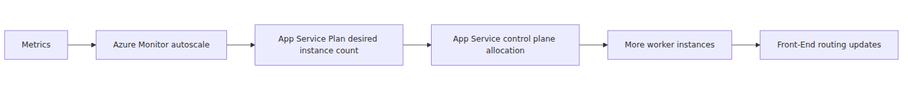
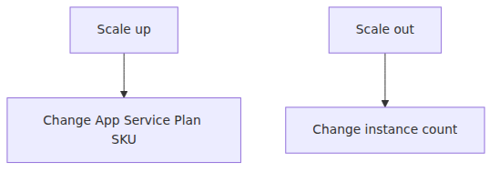
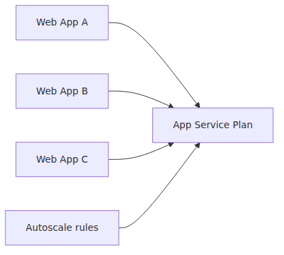

# Scaling internals — how Scale Out decisions become new workers

> Azure App Service Deep Dive series (5/6)

The intro series covered how to choose Scale Up versus Scale Out.
This post asks the next question.

**After the platform decides to scale out,
how does that decision become more real worker capacity?**

At the public-documentation level,
the safe facts are clear.

- scale up changes the App Service Plan SKU
- scale out changes instance count
- Azure Monitor autoscale evaluates autoscale rules
- the target is the App Service Plan, not an individual app

This episode turns those facts into a usable worker-pool mental model.

---

## The control path in one diagram

Two things matter here.

1. separate the decision engine from the execution substrate
2. stop imagining that the app directly “creates VMs” for itself

Scale-out is better understood as a control-plane change to desired instance count,
followed by App Service making more worker capacity available to that plan.

---

## What scale up and scale out actually change

The Learn documentation states the difference plainly.

- **Scale up**: move to a larger tier or SKU with more CPU, memory, or features
- **Scale out**: increase the number of VM instances running the app

Translated into runtime terms:

- scale up changes the size of a worker
- scale out changes how many workers the app can run across

That is why a memory bottleneck and a concurrency bottleneck can both look like “slowness” but still require different expansion paths.

---

## Autoscale attaches to the plan, not the app

This is one of the most common App Service misunderstandings.
Even if you enter autoscale from an app-centric portal experience,
the real target resource is the **App Service Plan**.

That structure has consequences.
If several apps share the same plan,
one app's burst can drive plan-level scaling,
and the added capacity becomes shared plan capacity.

That is one reason noisy-neighbor thinking still matters inside a shared plan.

---

## What Azure Monitor autoscale actually does

The Azure Monitor autoscale documentation is explicit about the rule engine.

- metrics or schedules are evaluated
- minimum, default, and maximum counts are enforced
- scale-out can trigger when any scale-out rule is met
- scale-in requires all scale-in rules to be met

That logic matters operationally.
Scale-out behaves like OR.
Scale-in behaves like AND.
Expansion therefore tends to be faster,
while contraction should remain more conservative.

---

## What “adding a worker” means in practice

The public docs do not expose every low-level placement detail.
They still support a sound mental model.

1. autoscale or a manual action raises the plan's desired count
2. the App Service control plane applies that desired state
3. the plan gains more worker capacity
4. the Front-End starts sending traffic to the new healthy workers

That is as far as you need to go without drifting into undocumented internals.

---

## Why autoscale should be read as a feedback loop

Autoscale is reactive,
not predictive.

That is why predictable spikes are safer with pre-scaling.
Metrics need time to accumulate.
Rules need time to evaluate.
New workers still need time to become ready.

Ignore that lag,
and you get the familiar complaint:
“autoscale was enabled,
but the first few minutes still hurt.”

---

## Health and readiness are the real end of scale-out

Adding a worker does not mean that worker can instantly receive user traffic.
From the Front-End's perspective,
the worker must first become eligible.

So the real end of scale-out is not the new instance count on paper.
It is the moment the new worker enters the healthy routing pool.

That is the bridge to episode 6.

---

## What shared plans do to scaling behavior

A shared App Service Plan can be cost-efficient.
It also changes how you should read scaling.

- autoscale reacts to plan-level resource signals
- workers are plan-level capacity
- apps with different traffic patterns can interfere with each other

That means one app's scale event can reshape the resource curve of the whole plan.
From a deep-dive perspective,
“my app scales” is less accurate than,
“my plan scales and my app expands inside that plan.”

---

## Why scale-in is the riskier half

Scale-out adds capacity.
Scale-in removes active capacity.

That makes scale-in inherently riskier.

- users may still be pinned through affinity
- long requests may still be running
- burst traffic may not have fully cooled down

That is why autoscale best-practice guidance treats scale-in more conservatively.

---

## Episode 5 wrap

Compressed into one paragraph,
the core idea is this.

> In App Service, scale-out is not an app directly spinning up servers. Azure Monitor autoscale or a manual change updates the App Service Plan's desired instance count, the App Service control plane applies that desired state, and additional worker capacity becomes available to the plan. Only after the new worker finishes startup and passes readiness checks does the Front-End begin routing real traffic to it. Scale up changes SKU; scale out changes worker count; both are best understood at plan scope.

Episode 6 now takes the final step.
What happens in that expensive window before the new worker can handle the first organic request?
That is the cold-start and warm-up story.

---

## Where this fits in the series

This post translates the intro-series scaling guidance into the internal App Service control path.
The next and final episode zooms into the startup window after a worker is allocated and explains how Always On, warm-up paths, and startup time limits change the first-request cost.

---

<!-- toc:begin -->
## In this series

- [App Service platform architecture — Front-End, Worker, File Server](./01-platform-architecture.md)
- [Front-End and ARR — how a request reaches a worker](./02-front-end-and-arr.md)
- [Workers and the sandbox — where user code actually runs](./03-worker-and-sandbox.md)
- [Deployment and Kudu — build, sync, release from the inside](./04-deployment-and-kudu.md)
- **Scaling internals — how Scale Out decisions become new workers (current)**
- Cold start and warmup — why the first request is expensive (upcoming)

<!-- toc:end -->

---

## References

### Primary sources
- [Oryx README @ 20240408.1](https://github.com/microsoft/Oryx/blob/20240408.1/README.md)

### Secondary sources
- [Scale up an app in Azure App Service](https://learn.microsoft.com/azure/app-service/manage-scale-up)
- [Get started with autoscale in Azure](https://learn.microsoft.com/azure/azure-monitor/autoscale/autoscale-get-started)
- [Autoscale in Azure Monitor](https://learn.microsoft.com/azure/azure-monitor/autoscale/autoscale-overview)
- [Best practices for autoscale](https://learn.microsoft.com/azure/azure-monitor/autoscale/autoscale-best-practices)
- [Architecture best practices for Azure App Service web apps](https://learn.microsoft.com/azure/well-architected/service-guides/app-service-web-apps)

### Related Series
- [Azure App Service 101 — Scaling 101](../../azure-app-service-101/en/07-scaling-101.md)
- [Azure Functions Deep Dive — Scaling internals](../../azure-functions-deep-dive/en/05-scaling-internals.md)

Tags: Azure, App Service, Distributed Systems, Platform Engineering
