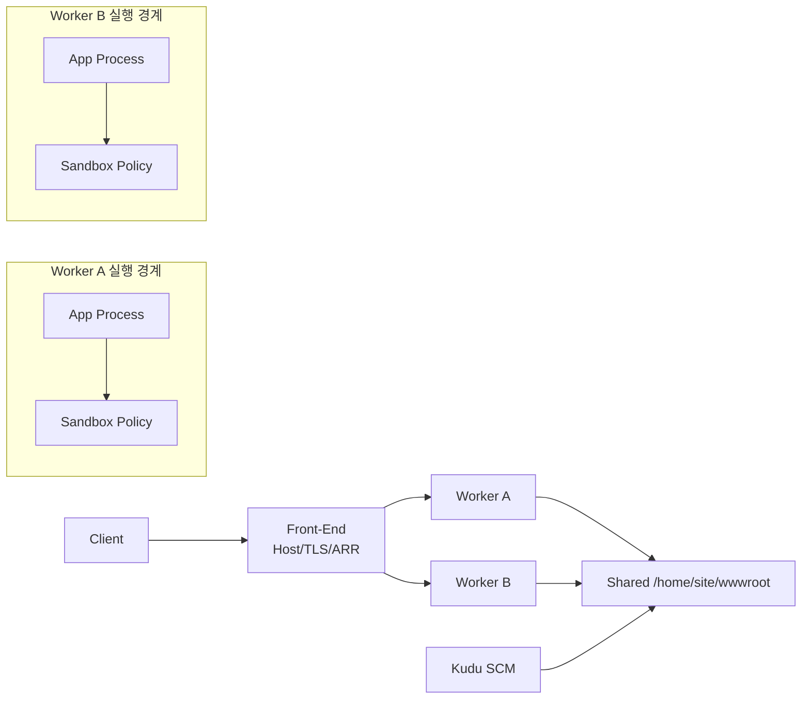

# Azure App Service Deep Dive (1/6): App Service 플랫폼 아키텍처 — Front-End·Worker·File Server

App Service를 오래 운영할수록 가장 자주 듣는 말은 의외로 비슷합니다. "플랫폼이 뭔가 이상합니다." 그런데 이 문장은 원인을 설명하지 못합니다. 재시작이 반복되는 것인지, 첫 요청이 느린 것인지, 특정 사용자만 한 인스턴스에 붙는 것인지, 배포는 성공했는데 런타임이 준비되지 않은 것인지가 모두 같은 문장 안에 섞여 있기 때문입니다.

이 시리즈를 제대로 읽으려면 먼저 App Service를 하나의 서비스 이름이 아니라 몇 개의 물리적 박스로 다시 그려야 합니다. 요청이 들어오는 위치, 실제 사용자 코드가 실행되는 위치, 여러 인스턴스가 함께 보는 파일 기준점, 그리고 배포를 실행하는 SCM buddy site를 나눠 놓아야 이후의 세부 동작이 한 줄로 연결됩니다.

이번 글의 목적은 기능 목록을 다시 소개하는 데 있지 않습니다. 대신 이후 다섯 편을 읽을 수 있게 만드는 공통 지도를 먼저 깔아 두겠습니다. 여기서 지도가 선명해지면 Front-End, ARR, Worker, Kudu, 스케일링, warm-up이 서로 다른 주제가 아니라 하나의 운영 모델로 읽히기 시작합니다.

이제 App Service를 추상적인 PaaS가 아니라 요청·실행·파일·배포 경계가 분리된 플랫폼으로 보겠습니다.


*Azure App Service Deep Dive 1장 흐름 개요*
> App Service 플랫폼 아키텍처 — Front-End·Worker·File Server의 핵심은 기능 이름이 아니라, 어떤 경계에서 무엇을 검증하고 어떤 신호를 남길지 정하는 데 있습니다.

## 먼저 던지는 질문

- App Service의 "플랫폼"은 실제로 어떤 박스들로 나눠서 이해해야 할까요?
- App Service Plan은 단순한 과금 단위가 아니라 어떤 격리와 용량의 의미를 가질까요?
- Front-End, Worker, shared storage는 각자 어떤 책임을 맡고 어디서 서로 연결될까요?

## 왜 이 글이 중요한가

App Service를 잘못 이해하면 거의 모든 운영 증상이 "플랫폼 문제"라는 한 단어로 뭉개집니다. 그러면 배포 문제를 런타임 문제처럼 보고, 런타임 준비 지연을 Front-End 문제처럼 보고, sticky routing을 애플리케이션 버그처럼 해석하게 됩니다. 반대로 아키텍처 박스를 먼저 분리해 두면 증상이 붙는 위치가 빠르게 좁혀집니다.

특히 이 시리즈는 문서에 공개된 사실만으로 운영 가능한 멘탈 모델을 세우는 데 집중합니다. App Service는 완전한 오픈소스 플랫폼이 아니므로, 공개되지 않은 내부 배치 알고리즘을 상상으로 메우기 시작하면 deep dive가 금방 허구가 됩니다. 실전에서 중요한 것은 모르는 내부를 추측하는 능력이 아니라, 공개된 표면만으로도 어디까지 설명할 수 있는지 아는 능력입니다.

또 하나 중요한 이유는 이후 글 다섯 편이 모두 이 지도 위에 서 있기 때문입니다. 2화는 Front-End와 ARR이 worker를 어떻게 고르는지, 3화는 worker 안에서 어떤 실행 경계가 적용되는지, 4화는 Kudu와 Oryx가 파일을 어떻게 배치하는지, 5화는 scale-out 결정이 어떻게 worker 증가로 이어지는지, 6화는 새 worker가 언제 traffic-eligible 상태가 되는지를 이 구조 위에서 설명합니다.

## 핵심 관점

App Service를 깊게 이해할 때 가장 도움이 되는 문장은 이것입니다. **App Service는 단일 서버도, 단일 프로세스도, 단일 배포 엔드포인트도 아닙니다. Front-End, ARR 기반 라우팅, Worker, shared file server, Kudu라는 다섯 개의 박스가 서로 연결된 플랫폼입니다.** 이 관점을 먼저 잡아야 "요청은 들어오는데 앱이 아직 준비되지 않았다" 같은 문장이 정확히 어느 층을 가리키는지 보입니다.

이 멘탈 모델이 유용한 이유는 요청·실행·파일·배포를 같은 선 위에 올려 주기 때문입니다. 사용자는 Front-End를 통해 들어오고, ARR은 적절한 worker를 고르고, worker는 shared content를 읽으며, Kudu는 그 shared content 경로에 배포를 집어넣습니다. 다시 말해 요청이 흐르는 경로와 코드가 배치되는 경로가 완전히 별개가 아니라, 같은 substrate 위에서 만납니다.

또 하나 중요한 점은 이 시리즈가 비공개 내부를 추정하지 않는다는 사실입니다. Learn 문서가 말하는 구조, Kudu 공개 저장소가 보여 주는 API와 배포 경로, Oryx 공개 자료가 설명하는 detect-build-startup 계약만으로도 운영 판단에 필요한 지도는 충분히 만들 수 있습니다.

> 이 시리즈에서 deep dive란 닫힌 내부를 상상으로 채우는 일이 아니라, 공개된 구조를 끝까지 정확하게 따라가서 어디서 문제가 붙는지 설명 가능한 지도로 바꾸는 일입니다.

## 핵심 개념

### 시리즈 전체 지도를 먼저 머리에 넣어야 합니다

아래 그림은 이 시리즈 전체를 관통하는 기본 지도입니다. 각 화는 이 그림의 한 박스를 확대하는 방식으로 이어집니다.

왼쪽의 외부 클라이언트와 진입점은 요청 유입부입니다. 가운데의 Front-End와 ARR은 사용자 요청을 어떤 앱과 어떤 worker로 보낼지 결정합니다. 오른쪽의 Worker는 실제 사용자 코드가 실행되는 경계입니다. 옆의 Kudu는 배포와 진단을 담당하는 SCM buddy site이며, 파일 배치와 앱 재기동 흐름에 연결됩니다. 마지막의 스케일링과 warm-up은 새 worker가 실제로 traffic-eligible 상태가 되는 시점을 결정합니다.

### 공개 문서가 반복해서 보여 주는 표준 구조는 Front-End, Worker, shared storage입니다

Microsoft가 공개적으로 설명하는 App Service 아키텍처의 핵심은 복잡하지 않습니다. HTTP/HTTPS 진입점인 Front-End, 실제 앱 실행을 담당하는 Worker, 그리고 여러 인스턴스가 같은 앱 콘텐츠를 보게 하는 shared storage가 기본 뼈대입니다. 이 모델을 먼저 받아들이면 App Service를 VM 여러 대에 각각 파일을 복사하는 구조로 오해할 가능성이 크게 줄어듭니다.


*Front-End, worker, shared storage의 연결 구조*

중요한 것은 속도가 아니라 성질입니다. 기본 모델에서 storage는 공유되고, 재시작 뒤에도 남고, 여러 worker가 같은 mounted path를 봅니다. 그래서 `/home/site/wwwroot` 아래의 배포 결과는 scale-out 뒤에도 worker마다 따로 갈라진 복사본이라기보다 공통 기준점에 가깝게 동작합니다.

다만 Linux custom container에는 예외가 있습니다. `WEBSITES_ENABLE_APP_SERVICE_STORAGE=false`이면 `/home`이 공유 영속 스토리지로 마운트되지 않으므로, 그 경로를 여러 인스턴스가 함께 보는 안정적인 기준점으로 일반화하면 안 됩니다. 이 차이는 3화에서 다시 자세히 봅니다.

### Front-End는 단순한 네트워크 홉이 아니라 요청을 worker로 넘기는 첫 번째 판단 지점입니다

Front-End를 로드밸런서 한 단어로만 이해하면 절반만 본 셈입니다. Front-End는 먼저 요청이 어느 앱과 슬롯에 속하는지 해석하고, 그다음 ARR을 통해 어떤 worker가 그 요청을 받을지 결정하는 진입부입니다. 이 진입부를 분리해 보지 않으면, 일부 사용자만 특정 인스턴스에 계속 붙는 현상이나 affinity 때문에 생기는 partial outage를 이해하기 어렵습니다.

### worker는 포털의 인스턴스 수가 실제 실행 용량으로 풀리는 자리입니다

포털에서 인스턴스를 3개로 늘렸다는 말은, 앱이 사용할 수 있는 실행 용량이 worker pool 안에서 세 개의 실행 단위로 물질화된다는 뜻에 가깝습니다. 이것을 "앱 하나가 VM 하나를 가진다"로 이해하면 App Service Plan과 app instance 사이의 관계를 계속 오해하게 됩니다.


*인스턴스 수가 worker 수로 풀리는 구조*

Windows code app에서는 IIS-hosted `w3wp.exe` 계열 프로세스가 핵심 실행 단위이고, Linux 앱에서는 컨테이너가 핵심 실행 단위입니다. 같은 App Service라는 이름 아래에서도 운영자가 먼저 던져야 할 질문이 OS와 호스팅 모드에 따라 달라지는 이유가 여기에 있습니다.

### Kudu는 배포와 진단을 수행하는 SCM buddy site입니다

Kudu를 단순한 보조 콘솔로 이해하면 배포 문제를 너무 좁게 보게 됩니다. 공개된 Kudu 아키텍처 자료는 Kudu를 실사이트 옆에 붙은 single-tenant SCM buddy site로 설명합니다. 이 buddy site는 배포 요청을 받고, 배포 이력을 남기고, 파일과 로그를 노출하고, 필요한 경우 배포 로직을 실행합니다.


*Kudu SCM 사이트와 실사이트의 배포 관계*

이 구분은 운영에서 결정적입니다. Kudu success는 artifact 수신과 파일 배치 측면의 성공일 수 있지만, 그것이 곧 앱 startup success를 의미하지는 않습니다. 따라서 배포 문제와 런타임 문제를 같은 스트림으로 읽지 않는 습관이 중요합니다.

### Azure Functions는 이 substrate 위에 올라가는 별도 런타임입니다

Functions Deep Dive를 이미 읽었다면 자연스럽게 질문이 생깁니다. Functions host는 이 지도에서 어디에 있을까요. 답은 worker 안쪽입니다. App Service가 worker, filesystem, request substrate를 제공하고, 그 위에서 Functions host가 올라오며, 다시 그 host가 language worker와 gRPC 채널을 엽니다.


*App Service worker 위에 Functions host가 놓인 구조*

따라서 두 시리즈는 경쟁 관계가 아닙니다. Functions 시리즈는 App Service 위에서 살아가는 특정 런타임의 내부를 보고, 이번 시리즈는 그 런타임을 떠받치는 범용 웹 플랫폼의 구조를 봅니다. 이 경계가 잡히면 두 시리즈의 설명이 서로 충돌하지 않고 정확히 맞물립니다.

### 이 구조는 CLI로도 빠르게 확인할 수 있습니다

아래 명령은 plan의 SKU, worker 수, per-site scaling 여부, 그리고 같은 plan에 붙은 앱들을 빠르게 확인할 때 유용합니다. 아키텍처 그림을 운영 표면과 연결하는 가장 쉬운 출발점 중 하나입니다.

```bash
az appservice plan show -n my-plan -g my-rg \
  --query "{sku:sku.name, tier:sku.tier, workers:numberOfWorkers, perSite:perSiteScaling, kind:kind, reserved:reserved}"

az webapp list --plan my-plan -g my-rg \
  --query "[].{name:name, state:state, hostNames:defaultHostName}" -o table
```

이 명령이 보여 주는 값은 단순한 인벤토리가 아닙니다. plan이 실제로 어떤 체급을 갖는지, worker capacity가 몇 개인지, 같은 substrate를 공유하는 앱이 무엇인지가 드러나므로 noisy-neighbour 가능성과 격리 수준을 점검하는 기본 재료가 됩니다.

### 공개 표면을 JSON으로 읽으면 구조가 더 또렷해집니다

아키텍처 멘탈 모델이 실제 운영 표면과 맞는지 확인하려면, 포털 화면보다 JSON 출력을 먼저 보는 편이 좋습니다. 아래 두 명령은 "plan이 capacity를 들고 있고, app은 그 capacity 위에 놓인다"는 사실을 눈으로 확인하게 해 줍니다.

```bash
PLAN_ID=$(az appservice plan show -n my-plan -g my-rg --query id -o tsv)

az resource show --ids "$PLAN_ID" \
  --query "{name:name, sku:sku.name, reserved:properties.reserved, workers:properties.numberOfWorkers, perSiteScaling:properties.perSiteScaling}"

az webapp show -n my-app -g my-rg \
  --query "{serverFarmId:serverFarmId, state:state, hostNames:hostNames, kind:kind}"
```

**Expected output:** 첫 번째 결과에서는 plan의 worker 수와 Linux 여부(`reserved`)가 보이고, 두 번째 결과에서는 app이 어느 `serverFarmId`에 매달려 있는지 드러납니다. 즉 plan이 capacity의 주체이고 app은 그 위에 얹힌 소비자라는 구조가 그대로 노출됩니다.

```json
{
  "name": "my-plan",
  "sku": "P1v3",
  "reserved": true,
  "workers": 3,
  "perSiteScaling": false
}
```

이 정도 출력만 있어도 "앱이 VM 하나를 독점한다"는 오해를 바로 걷어 낼 수 있습니다. 운영 문서에 이 JSON 예시를 붙여 두면 신규 팀원이 plan, worker, app 관계를 훨씬 빨리 이해합니다.

### Front-End, Worker, Sandbox를 한 화면에서 읽는 운영 다이어그램

아키텍처를 외우는 가장 빠른 방법은 요청 평면과 실행 평면, 격리 평면을 동시에 그려 보는 것입니다. Front-End는 host, TLS, affinity라는 라우팅 판단을 수행하고, Worker는 실제 사용자 코드를 실행하며, Sandbox는 그 코드가 접근할 수 있는 OS 기능 경계를 제한합니다. 이 세 레이어를 한 도표에 올려 두면 502, 503, startup 지연, 라이브러리 호환성 문제를 같은 범주로 섞지 않게 됩니다.



이 그림의 실전 포인트는 단순합니다. Front-End 로그는 "어디로 보냈는가"를 설명하고, Worker 로그는 "무엇을 실행했는가"를 설명하며, Sandbox 관련 실패는 "무엇을 실행하지 못했는가"를 설명합니다. 장애 분석 중에 이 세 질문을 분리하면 원인 후보가 급격히 줄어듭니다.

### 네트워크 트레이스로 경계를 검증하는 방법

문서만 읽어서는 경계 감각이 약할 수 있으므로 간단한 네트워크 트레이스를 같이 남기는 편이 좋습니다. Front-End 경계에서는 hostname 해석과 TLS, 응답 헤더를 확인하고, 앱 경계에서는 인스턴스 식별자를 반환하는 진단 엔드포인트를 호출해 실제 worker 매핑을 확인합니다.

```bash
# Front-End 경계 확인: 호스트, TLS, 응답 헤더
curl -I -s https://my-app.azurewebsites.net

# 같은 요청에 대해 DNS와 TLS 핸드셰이크 시간 분해
curl -o /dev/null -s -w "dns=%{time_namelookup} tls=%{time_appconnect} ttfb=%{time_starttransfer} total=%{time_total}
"   https://my-app.azurewebsites.net/diag/worker

# 다회 호출로 worker 분산 감지
for i in $(seq 1 10); do
  curl -s https://my-app.azurewebsites.net/diag/worker
  echo
done
```

**Expected output:** 첫 번째 명령은 App Service Front-End의 표준 응답 헤더를 보여 주고, 두 번째 명령은 네트워크 구간과 서버 처리 구간의 시간을 분리해 줍니다. 세 번째 반복 호출은 worker 식별자가 어떻게 바뀌는지 보여 주며, 분산과 stickiness를 판단하는 기준이 됩니다.

### 성능 프로파일링으로 아키텍처 병목 위치를 찾기

아키텍처 이해의 마지막 단계는 성능 병목을 레이어별로 분해하는 것입니다. Front-End, Worker, 외부 의존성 가운데 어디가 병목인지 구분하려면 요청 시간 분해와 플랫폼 메트릭을 같이 수집해야 합니다.

```bash
# 요청 시간 분해
for i in $(seq 1 25); do
  curl -o /dev/null -s -w "code=%{http_code} dns=%{time_namelookup} connect=%{time_connect} tls=%{time_appconnect} ttfb=%{time_starttransfer} total=%{time_total}
"     https://my-app.azurewebsites.net/api/ping
done

# plan 리소스 지표
PLAN_ID=$(az appservice plan show -n my-plan -g my-rg --query id -o tsv)
az monitor metrics list --resource "$PLAN_ID" --metric "CpuPercentage,MemoryPercentage,HttpQueueLength" --interval PT1M -o table
```

DNS/TLS 구간이 길면 네트워크 경계 이슈를 먼저 보고, TTFB만 길면 worker 또는 앱 실행 구간을 우선 점검합니다. 이 식으로 계층별 해석을 고정하면 운영 대화가 훨씬 짧아집니다.

### 운영 문서에 남겨야 할 최소 관찰값

팀 런북에는 `instance_id`, `slot`, `status`, `ttfb`, `total` 다섯 값을 공통 포맷으로 남기는 규칙을 두는 것이 좋습니다. 이 값만 있어도 라우팅 문제와 실행 문제를 빠르게 분리할 수 있습니다.

운영 회고에서는 위 다섯 값을 사건 타임라인에 붙여 두면, 다음 장애에서 동일한 분류 기준을 재사용할 수 있습니다.

## 흔히 헷갈리는 지점

- **App Service Plan은 단순한 과금 바구니가 아닙니다.** worker capacity와 격리 수준을 함께 정의하는 실행 단위입니다.
- **scale-out은 앱이 VM을 직접 늘리는 과정이 아닙니다.** plan의 원하는 인스턴스 수가 바뀌고, 그 결과 worker capacity가 더 배정되는 과정으로 보는 편이 정확합니다.
- **`/home/site/wwwroot`는 항상 로컬 디스크 복사본이 아닙니다.** 기본 모델에서는 shared content path이고, Linux custom container에서는 storage 설정에 따라 의미가 달라질 수 있습니다.
- **Kudu는 런타임 그 자체가 아닙니다.** SCM buddy site로서 배포와 진단을 담당하며, Kudu success와 runtime success는 서로 다른 판정입니다.
- **Functions를 이해했다고 App Service substrate를 자동으로 이해한 것은 아닙니다.** Functions host는 worker 위에 올라가는 런타임일 뿐, Front-End·storage·Kudu 구조를 대신 설명하지는 않습니다.

## 운영 체크리스트

- [ ] App Service Plan을 비용 항목이 아니라 격리 단위와 worker capacity 단위로 문서화했습니다.
- [ ] Linux와 Windows 중 어떤 호스팅 경로를 선택했는지와 그 이유를 ADR에 남겼습니다.
- [ ] 같은 plan에 여러 앱을 올릴 때 noisy-neighbour 시나리오를 검토했습니다.
- [ ] shared `/home` 경로와 local state의 차이를 팀 운영 문서에 반영했습니다.
- [ ] Kudu 성공과 런타임 성공을 분리해서 보는 로그 확인 절차를 정했습니다.

## 정리

1화의 목적은 세부 동작을 모두 설명하는 것이 아니라, 시리즈 전체를 읽을 수 있는 기본 지도를 머리에 넣는 것입니다. App Service 요청은 Front-End로 들어오고, ARR은 worker를 고르며, worker는 shared content를 읽고, Kudu는 그 shared content 경로에 배포를 밀어 넣습니다. 이 선이 잡히면 "플랫폼이 이상하다"는 말이 훨씬 구체적인 질문으로 바뀝니다.

운영적으로 가장 큰 수확은 문제를 박스별로 자를 수 있게 된다는 점입니다. 일부 사용자만 계속 문제를 겪는다면 Front-End와 affinity를 먼저 보고, 배포 직후 앱이 안 뜬다면 Kudu와 startup readiness를 분리해서 보고, 여러 인스턴스에서 파일이 어긋나게 보인다면 shared storage semantics를 먼저 확인할 수 있습니다. deep dive의 가치는 이처럼 증상을 물리적 경계에 붙여 읽게 만드는 데 있습니다.

다음 글부터는 이 큰 그림을 하나씩 확대합니다. 2화에서는 Front-End와 ARR이 실제로 어떻게 worker를 고르는지 보고, 그다음 worker 내부 실행 경계, 배포 경로, scale-out 제어 루프, warm-up 순서로 내려가겠습니다.

## 처음 질문으로 돌아가기

- **App Service의 "플랫폼"은 실제로 어떤 박스들로 나눠서 이해해야 할까요?**
  - App Service는 "웹앱 하나를 올리는 곳"이 아니라 Front-End, ARR, Worker, shared storage, Kudu가 이어진 플랫폼으로 보는 편이 정확합니다. 이 다섯 박스를 분리해 두어야 일부 사용자만 실패하는 문제를 라우팅에서 읽을지, 배포 성공 뒤 startup 실패를 Kudu와 runtime 경계에서 읽을지 바로 판단할 수 있습니다.
- **App Service Plan은 단순한 과금 단위가 아니라 어떤 격리와 용량의 의미를 가질까요?**
  - App Service Plan은 비용 태그보다 먼저 worker capacity와 격리 경계를 들고 있는 실행 단위입니다. `numberOfWorkers`, `serverFarmId`, per-site scaling을 보면 앱이 각자 VM을 하나씩 갖는 구조가 아니라, 같은 plan 위에서 용량을 소비하고 필요하면 같은 substrate를 공유한다는 점이 드러납니다.
- **Front-End, Worker, shared storage는 각자 어떤 책임을 맡고 어디서 서로 연결될까요?**
  - Front-End는 host와 affinity를 바탕으로 요청을 어느 worker로 보낼지 결정하고, Worker는 그 요청을 실제 프로세스나 컨테이너에서 실행합니다. shared storage는 여러 worker가 같은 `/home/site/wwwroot`를 보게 만드는 파일 기준점이며, Kudu가 여기에 artifact를 배치하므로 요청 경로와 배포 경로가 바로 이 지점에서 만납니다.

<!-- toc:begin -->
## 시리즈 목차

- **Azure App Service Deep Dive (1/6): App Service 플랫폼 아키텍처 — Front-End·Worker·File Server (현재 글)**
- Azure App Service Deep Dive (2/6): Front-End과 ARR — 요청은 어떻게 워커에 도달하는가 (예정)
- Azure App Service Deep Dive (3/6): Worker 인스턴스와 샌드박스 — 사용자 코드를 어디에 가두는가 (예정)
- Azure App Service Deep Dive (4/6): 배포와 Kudu — 빌드·동기화·릴리스의 안쪽 (예정)
- Azure App Service Deep Dive (5/6): 스케일링 내부 동작 — Scale Out 결정과 워커 추가 경로 (예정)
- Azure App Service Deep Dive (6/6): 콜드 스타트와 Warmup — 첫 요청이 비싼 이유 (예정)

<!-- toc:end -->

## 참고 자료

### 공식 문서
- [Overview of Azure App Service](https://learn.microsoft.com/azure/app-service/overview)
- [Local Cache in Azure App Service](https://learn.microsoft.com/azure/app-service/overview-local-cache)
- [Run your app in Azure App Service directly from a ZIP package](https://learn.microsoft.com/azure/app-service/deploy-run-package)
- [Kudu service overview](https://learn.microsoft.com/azure/app-service/resources-kudu)
- [Kudu architecture](https://github.com/projectkudu/kudu/wiki/Kudu-architecture/863125fba81e8b30950676bf495c7b7d74c00b92)
- [Oryx README @ 20240408.1](https://github.com/microsoft/Oryx/blob/20240408.1/README.md)

### 관련 시리즈
- [Azure App Service 101](../../azure-app-service-101/ko/01-what-is-app-service.md)
- [Azure Functions Deep Dive](../../azure-functions-deep-dive/ko/01-host-bootstrap.md)

- [이 글의 예제 코드 (book-examples)](https://github.com/yeongseon-books/book-examples/tree/main/azure-app-service-deep-dive/ko/01-platform-architecture)

Tags: Azure, App Service, Distributed Systems, Platform Engineering
