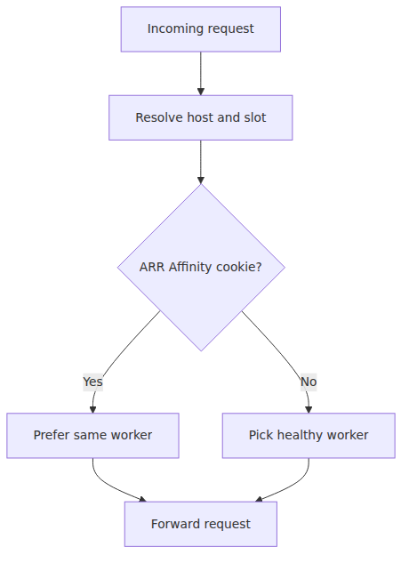
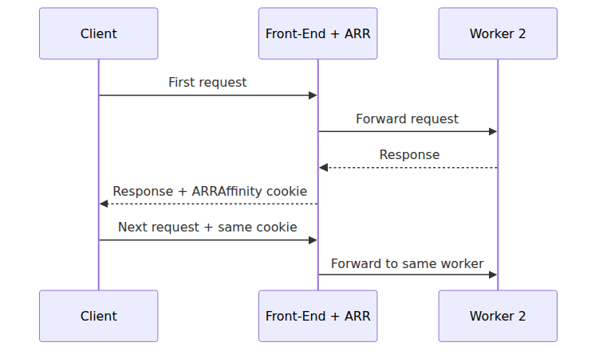
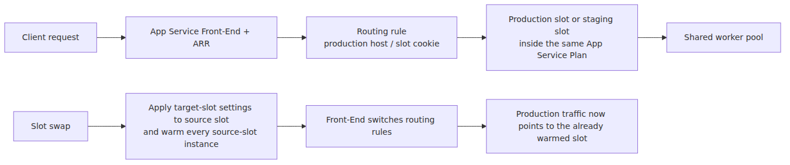

# Front-End과 ARR — 요청은 어떻게 워커에 도달하는가

## Source Version

이 글의 인용과 판단은 다음 공개 출처를 기준으로 합니다.

- Microsoft Learn — Azure App Service 문서 (https://learn.microsoft.com/azure/app-service)
- Project Kudu (https://github.com/projectkudu/kudu) — 배포 엔진과 Windows 샌드박스 문맥에 한해

App Service의 Front-End, Worker, File Server 구현 세부사항은 Microsoft가 공개하지 않았습니다.
따라서 이 시리즈에서는 Learn 문서가 1차 출처이고, Kudu 공개 자료는 보조 출처로만 사용합니다.

> Azure App Service Deep Dive 시리즈 (2/6)

1화에서는 App Service를 Front-End, Worker, File Server, Kudu, 관측성 박스로 나눠 봤습니다.
이번 화는 그중 가장 왼쪽의 진입부를 확대합니다.

질문은 하나입니다.
**HTTP 요청 하나가 어떤 기준으로 특정 worker에 도달하는가.**

이 질문을 정확히 이해하면,
ARR Affinity를 언제 꺼야 하는지,
왜 어떤 사용자만 특정 인스턴스에서 계속 문제를 겪는지,
왜 stateless 설계가 App Service에서 유난히 중요하게 반복되는지 한 번에 연결됩니다.

---

## 이 글에서 답할 질문

- Front End 노드는 정확히 어떤 역할을 하고, ARR(Application Request Routing)은 그 안 어디에 있는가?
- ARR Affinity 쿠키는 sticky session인가, 그 이상인가?
- TLS 종단과 SNI 처리는 Front End에서 어떻게 흘러가는가?
- Custom domain과 hostname binding이 Front End 라우팅에 미치는 영향은 무엇인가?
- Front End 장애와 Worker 장애는 사용자 입장에서 어떻게 다르게 보이는가?

## 큰 그림 — 요청 라우팅의 세 단계


*Front-End, 앱 식별, worker 선택의 세 단계*
공개 문서 기준으로 요약하면 App Service 진입부는 이렇게 이해하는 편이 안전합니다.

1. 요청이 Front-End에 들어옵니다.
2. Front-End가 앱과 슬롯을 식별합니다.
3. ARR이 worker를 선택해 요청을 전달합니다.

여기서 2단계와 3단계를 분리해서 보는 것이 중요합니다.
어느 앱으로 갈지와,
그 앱의 어느 worker로 갈지는 같은 질문이 아니기 때문입니다.

---

## Front-End가 먼저 결정하는 것들

Front-End를 “로드밸런서” 한 단어로만 이해하면 자주 놓치는 부분이 있습니다.
실제로는 다음 성질이 먼저 작동합니다.

- 들어온 호스트 이름이 어느 앱에 대응되는가
- 어떤 슬롯 URL인지
- 현재 요청을 받을 수 있는 worker 후보가 무엇인가
- affinity cookie가 있다면 기존 worker를 유지할 것인가



*호스트, 슬롯, affinity로 worker 후보를 거르는 흐름*
이 글에서 세부 알고리즘을 추측하지는 않습니다.
다만 공개 문서와 Microsoft 블로그가 일관되게 말하는 사실은 명확합니다.
**ARR Affinity가 켜져 있으면 같은 사용자의 후속 요청이 같은 worker로 계속 붙을 수 있습니다.**

---

## ARR이 왜 여기 있는가

ARR은 IIS의 Application Request Routing입니다.
IIS ARR 자체 문서는 이것을 프록시 기반 HTTP 라우팅 모듈로 설명합니다.
그리고 cookie를 사용한 client affinity 기능을 지원합니다.

App Service는 이 ARR 기능을 Front-End 경로에서 활용합니다.

즉,
사용자가 받는 `ARRAffinity` 쿠키는 애플리케이션 프레임워크가 만든 세션 쿠키가 아니라,
플랫폼 라우팅 힌트에 가깝습니다.

이 차이를 이해해야 운영 판단이 쉬워집니다.

- 앱 세션 쿠키는 애플리케이션 상태를 의미합니다.
- ARR Affinity 쿠키는 worker stickiness를 의미합니다.

둘은 이름이 비슷한 “세션”처럼 보이지만 성격이 다릅니다.

---

## ARR Affinity가 켜져 있을 때의 요청 경로



*Affinity 쿠키가 같은 worker를 다시 고르는 경로*
이 동작은 전혀 이상한 것이 아닙니다.
오히려 legacy app에는 편리합니다.

- 프로세스 메모리에 세션을 들고 있는 앱
- 특정 인스턴스 로컬 캐시에 의존하는 앱
- 로그인 직후 같은 인스턴스로 묶이면 덜 흔들리는 앱

문제는 이것이 App Service의 scale-out 모델과 긴장 관계에 있다는 점입니다.

---

## ARR Affinity가 꺼져 있을 때의 요청 경로


*쿠키 고정 없이 worker가 분산 선택되는 경로*
Affinity를 끄면 같은 클라이언트의 요청이 항상 같은 worker로 돌아간다는 가정이 사라집니다.
이게 바로 stateless 앱에 더 유리한 이유입니다.

장점은 분명합니다.

- 부하가 더 고르게 퍼집니다.
- 특정 worker 하나가 일부 사용자만 계속 붙잡는 현상이 줄어듭니다.
- scale-in이나 worker 교체 때 체감 불안정성이 낮아집니다.

대신 전제가 하나 붙습니다.
**어느 worker가 받든 같은 결과가 나와야 합니다.**

---

## 왜 stateless가 반복해서 나오는가

App Service 문서와 Well-Architected 가이드가 ARR Affinity 비활성화를 자주 권장하는 이유는 단순합니다.
platform이 수평 확장에 유리하게 설계되어 있기 때문입니다.

worker는 교체될 수 있고,
늘어날 수 있고,
줄어들 수 있고,
항상 같은 인스턴스가 살아 있다는 보장은 없습니다.

그래서 다음 설계가 App Service와 잘 맞습니다.

- 세션은 Redis나 DB에 저장
- 업로드 상태는 Blob Storage에 저장
- in-memory cache는 최적화일 뿐 진실 원천이 아님
- 요청은 어느 worker가 처리해도 안전

반대로 이런 구조는 scale-out에서 흔들립니다.

- 로그인 세션을 프로세스 메모리에 저장
- 마지막 작업 상태를 worker 로컬 파일에 저장
- 특정 worker 로컬 캐시에만 데이터가 존재

---

## 일부 사용자만 문제를 겪는 이유

운영에서 제일 헷갈리는 장면 중 하나가 이것입니다.

“전체 장애는 아닌데,
특정 사용자만 계속 느리거나 에러를 본다.”

이때 ARR Affinity는 아주 강한 후보입니다.


*ARR 고정이 부분 장애를 만드는 경로*
Worker 2가 메모리 압박,
느린 dependency,
비정상 재시작 루프를 겪고 있는데,
일부 사용자가 그 worker에 계속 붙어 있다면,
문제는 전역 장애가 아니라 “sticky partial outage”처럼 보입니다.

이것이 ARR Affinity를 이해해야 하는 가장 실전적인 이유입니다.

---

## reverse proxy 앞단이 있으면 더 복잡해지는 이유

Front Door나 Application Gateway가 App Service 앞에 있으면,
세션 고정은 두 층으로 나뉠 수 있습니다.

1. 글로벌/외부 프록시가 어느 origin으로 보낼지
2. App Service Front-End가 어느 worker로 보낼지

App Service 팀 블로그가 반복해서 설명하듯,
앞단 프록시의 cookie affinity만으로는 App Service 내부 worker stickiness를 대신하지 못합니다.
App Service 내부의 worker 선택은 여전히 App Service Front-End와 ARR의 책임이기 때문입니다.

이 말은 반대로도 중요합니다.
App Service 내부 stickiness를 원하지 않는다면,
앱 자체를 stateless하게 만들고,
App Service의 affinity도 필요 없게 가져가는 편이 구조가 단순합니다.

---

## 요청 라우팅과 deployment slot

slot도 이 흐름에 들어갑니다.
다만 여기서 가장 흔한 오해를 바로잡아야 합니다.
production slot과 staging slot은 **서로 다른 App Service Plan worker pool**을 갖는 것이 아닙니다.
같은 plan 안의 같은 compute를 공유하고,
Front-End가 host와 slot 문맥에 따라 어느 slot 설정으로 라우팅할지 결정합니다.



*같은 plan 안에서 slot만 바꾸는 라우팅 경로*
Learn 문서가 설명하는 slot swap의 핵심은 이렇습니다.

1. source slot 인스턴스에 target slot 설정을 적용합니다.
2. source slot의 각 인스턴스가 restart와 warm-up을 마칠 때까지 기다립니다.
3. 그 뒤 Front-End가 라우팅 규칙을 바꿔 production 트래픽의 목적 slot을 뒤집습니다.

그래서 slot swap은 “production worker 집합 ↔ staging worker 집합 교체”가 아니라,
**같은 plan 안에서 준비를 먼저 끝낸 slot으로 Front-End 라우팅 기준을 바꾸는 작업**으로 이해해야 맞습니다.
warm-up이 중요한 이유도 바로 여기에 있습니다.

---

## ARR를 켤 때와 끌 때의 판단 기준

### 켜 둘 이유가 남아 있는 경우

- 레거시 앱이 프로세스 메모리 세션에 강하게 의존
- 외부 세션 저장소로 바로 옮기기 어렵다
- 단기 이행 단계에서만 stickiness가 필요하다

### 끄는 편이 좋은 경우

- 이미 stateless 설계다
- scale-out 효율을 높이고 싶다
- 특정 worker 편중을 줄이고 싶다
- 일부 사용자만 느린 현상을 구조적으로 없애고 싶다

이 결정은 취향 문제가 아닙니다.
애플리케이션의 상태 저장 전략과 직결됩니다.

---

## 2화 정리

이번 화의 요지는 단순합니다.

> App Service 요청은 Front-End로 들어오고, ARR이 worker를 선택합니다. ARRAffinity 쿠키가 있으면 같은 사용자를 같은 worker에 붙일 수 있습니다. 이 기능은 stateful 레거시 앱에는 편하지만, 수평 확장과 worker 교체 관점에서는 stateless 설계보다 불리합니다. 특정 사용자만 문제를 겪는 partial outage도 이 구조에서 자주 발생합니다.

여기까지 오면 요청이 worker에 도달하기까지의 경로가 분명해집니다.
이제 남는 질문은 worker 내부입니다.
Windows 코드 앱에서는 무엇이 `w3wp.exe` 안에서 제한되는지,
Linux 앱에서는 왜 container 경계가 핵심인지가 그 실행 경계에서 갈립니다.

---

## 이 시리즈에서의 위치

1화가 전체 지도를 펼쳤다면 이번 글은 그중 Front-End와 ARR 박스를 확대합니다. 두 글을 함께 보면 공개 진입점에서 worker selection까지의 handoff가 한 흐름으로 이어집니다.

---

## Call Path Summary

Client → App Service Front-End → host/slot resolution → ARR worker selection inside the shared App Service Plan → slot-specific app instance

Slot swap path: apply target-slot settings to the source slot → warm every source-slot instance → switch Front-End routing rules

### Front End 라우팅과 hostname/SSL 점검

```bash
az webapp config show -n my-app -g my-rg \
  --query "{httpsOnly:httpsOnly, http20:http20Enabled, alwaysOn:alwaysOn, ftpsState:ftpsState, clientCertEnabled:clientCertEnabled}"

az webapp config hostname list -n my-app -g my-rg -o table
az webapp config ssl list -g my-rg -o table
```

## 운영 체크리스트

- [ ] ARR Affinity 사용 여부와 그것이 만드는 장애 패턴을 문서화했다
- [ ] TLS 인증서 갱신 자동화와 알림을 점검했다
- [ ] Front End 5xx와 Worker 5xx를 서로 분리해 모니터링한다
- [ ] custom domain별 라우팅 우선순위와 redirect 규칙을 정리했다
- [ ] client cert 인증을 쓰는 경로와 그렇지 않은 경로를 분리했다

<!-- toc:begin -->
## 시리즈 목차

- [App Service 플랫폼 아키텍처 — Front-End·Worker·File Server](./01-platform-architecture.md)
- **Front-End과 ARR — 요청은 어떻게 워커에 도달하는가 (현재 글)**
- Worker 인스턴스와 샌드박스 — 사용자 코드를 어디에 가두는가 (예정)
- 배포와 Kudu — 빌드·동기화·릴리스의 안쪽 (예정)
- 스케일링 내부 동작 — Scale Out 결정과 워커 추가 경로 (예정)
- 콜드 스타트와 Warmup — 첫 요청이 비싼 이유 (예정)

<!-- toc:end -->

---

## 참고 자료

### 1차 출처
- [Using the Application Request Routing Module](https://learn.microsoft.com/iis/extensions/planning-for-arr/using-the-application-request-routing-module)
- [Configure ARRAffinity cookie when accessing Azure App Service behind Azure Application Gateway](https://techcommunity.microsoft.com/blog/appsonazureblog/configure-arraffinity-cookie-when-accessing-azure-app-service-behind-azure-appli/3842511)

### 2차 출처
- [Overview of Azure App Service](https://learn.microsoft.com/azure/app-service/overview)
- [Architecture best practices for Azure App Service web apps](https://learn.microsoft.com/azure/well-architected/service-guides/app-service-web-apps)
- [Deployment slots in Azure App Service](https://learn.microsoft.com/azure/app-service/deploy-staging-slots)

### 관련 시리즈
- [Azure App Service 101 — Request Lifecycle](../../azure-app-service-101/ko/02-request-lifecycle.md)
- [Azure Functions Deep Dive](../../azure-functions-deep-dive/ko/04-dispatcher-and-invocation.md)

Tags: Azure, App Service, Distributed Systems, Platform Engineering
