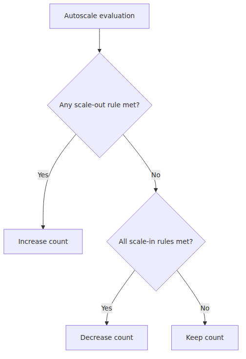
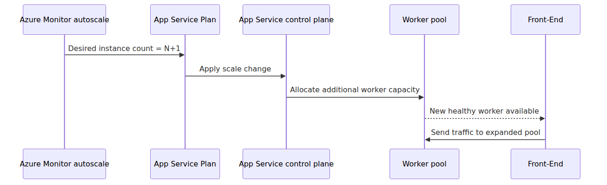
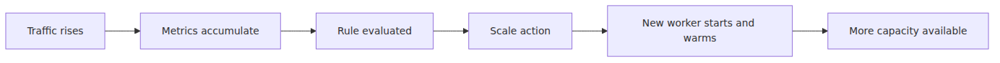
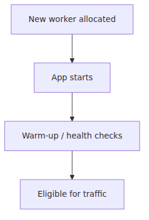

# 스케일링 내부 동작 — Scale Out 결정과 워커 추가 경로

autoscale은 다이어그램 안에서는 거의 즉시 반응하는 것처럼 보입니다. 하지만 실제 운영에서는 임계치가 한 번 넘었다고 곧바로 새 worker가 traffic을 받기 시작하지 않습니다. 메트릭이 쌓이고, autoscale rule이 평가되고, cooldown이 적용되고, App Service Plan의 desired count가 바뀌고, 새 worker가 startup과 readiness를 마쳐야 비로소 Front-End가 그 worker를 healthy pool에 넣습니다.

그래서 운영팀이 자주 묻는 질문도 비슷합니다. "autoscale은 켰는데 왜 첫 몇 분이 여전히 아프지?" 이 질문은 대개 설정 실수만을 뜻하지 않습니다. 제어 루프 자체가 주기적이고 보수적으로 설계되어 있기 때문에, threshold crossing과 traffic-ready worker 사이에는 원래 시간차가 존재합니다.

이 글은 Azure App Service Deep Dive 시리즈의 다섯 번째 글입니다.

이번 글에서는 scale-up과 scale-out의 차이, autoscale rule이 실제로 plan에 붙는 방식, Azure Monitor autoscale의 평가 루프, cooldown과 anti-flapping, 그리고 새 worker가 ready pool에 들어오는 마지막 순간까지를 공개 문서가 허용하는 범위 안에서 정리하겠습니다.

이제 "스케일링이 일어난다"는 문장을 control loop 관점으로 다시 풀어 보겠습니다.

## 이 글에서 다룰 문제

- scale-up과 scale-out은 App Service에서 실제로 무엇을 바꿀까요?
- autoscale rule은 앱이 아니라 왜 App Service Plan에 붙는다고 봐야 할까요?
- Azure Monitor autoscale은 어떤 cadence와 observation window로 규칙을 평가할까요?
- threshold가 넘은 뒤 새 worker가 traffic-eligible 상태가 되기까지 어떤 단계가 남아 있을까요?
- scale-in은 왜 scale-out보다 더 보수적이고 더 위험한 동작으로 다뤄질까요?

## 왜 이 글이 중요한가

스케일링을 한 줄 버튼으로 이해하면 사용자 체감 지연을 설명할 수 없게 됩니다. CPU가 높아졌는데 왜 바로 capacity가 늘지 않았는지, metrics는 이미 올라갔는데 왜 요청 큐가 여전히 길었는지, 인스턴스 수가 늘었는데 왜 첫 요청 지연은 남았는지를 설명하려면 scale-out을 제어 루프로 읽어야 합니다.

또한 App Service는 app 단위보다 plan 단위에서 scaling이 이루어진다는 점이 운영상 매우 중요합니다. 같은 plan에 여러 앱이 있으면 한 앱의 burst가 plan-level scale event를 일으키고, 추가된 worker capacity를 다른 앱도 함께 사용합니다. 이 구조를 놓치면 noisy-neighbour 현상을 앱 버그나 메트릭 설정 문제로 잘못 읽기 쉽습니다.

마지막으로 이 글은 6화와 직접 이어집니다. 5화가 desired instance count가 worker capacity로 바뀌는 control-plane 경로를 설명한다면, 6화는 그 새 worker가 실제 traffic-eligible 상태가 되기까지의 startup and warm-up window를 설명합니다. 둘을 나눠 이해해야 instance allocation과 traffic readiness를 같은 일로 뭉개지 않게 됩니다.

## 스케일링을 이해하는 가장 좋은 방법: autoscale 판단 루프와 worker readiness 루프를 분리해서 보는 것입니다

이 주제를 이해할 때 가장 중요한 문장은 이것입니다. **App Service scale-out은 앱이 서버를 직접 띄우는 과정이 아니라, autoscale 또는 수동 조작이 App Service Plan의 desired instance count를 바꾸고, 플랫폼이 그 desired state를 worker capacity로 반영한 뒤, 새 worker가 readiness를 통과해야 비로소 라우팅 대상이 되는 과정입니다.**

이렇게 보면 사용자 체감 지연이 어디서 생기는지도 자연스럽게 나뉩니다. 앞 절반은 제어 루프의 지연이고, 뒤 절반은 startup과 warm-up의 지연입니다. 같은 "확장이 늦다"는 불만도 실제로는 어느 단계가 병목인지 다를 수 있습니다.

그리고 이 구분은 운영 대응에도 직접 도움이 됩니다. predictable spike라면 metrics가 쌓이기를 기다리는 것보다 pre-scaling이 더 안전할 수 있고, shared plan이라면 app-level 현상처럼 보이는 문제도 plan-level resource curve로 읽어야 할 수 있습니다.

> scale-out의 진짜 끝은 포털의 숫자가 늘어나는 순간이 아니라, 새 worker가 healthy routing pool에 들어와 실제 사용자 요청을 받을 수 있게 되는 순간입니다.

## 핵심 개념

### autoscale에서 worker 추가까지의 큰 그림을 먼저 봐야 합니다

scale-out을 한 장으로 보면 control-plane decision과 execution substrate가 분리되어 있다는 사실이 먼저 보입니다. 앱이 직접 VM을 만든다고 상상하는 대신, plan의 desired count가 바뀌고 App Service가 그만큼의 worker capacity를 반영한다고 이해하는 편이 맞습니다.


이 그림이 중요한 이유는 앱 관점의 요구와 플랫폼 관점의 실행을 분리해 주기 때문입니다. autoscale rule은 메트릭을 읽고 결정을 내리지만, 실제 사용자 경험은 그 결정 뒤에 따라오는 worker allocation과 readiness에 의해 마감됩니다.

### scale-up과 scale-out은 같은 "확장"이지만 바꾸는 대상이 다릅니다

Learn 문서가 설명하듯 scale-up은 더 큰 CPU, memory, features를 가진 tier 또는 SKU로 이동하는 일이고, scale-out은 앱을 실행하는 VM instance count를 늘리는 일입니다. 이를 runtime 관점으로 바꾸면 scale-up은 worker 한 대의 체급을 키우는 일이고, scale-out은 앱이 더 많은 worker를 사용할 수 있게 하는 일입니다.


이 구분은 느림의 원인을 읽을 때 특히 중요합니다. memory bottleneck과 concurrency bottleneck은 모두 "느리다"로 보일 수 있지만, 전자는 scale-up이 더 적절할 수 있고 후자는 scale-out이 더 적절할 수 있습니다. 확장 방향이 다르다는 뜻입니다.

### autoscale rule은 app이 아니라 plan에 붙습니다

이 부분은 현업에서 반복해서 헷갈립니다. 포털에서는 앱 중심으로 들어가 autoscale을 설정하는 것처럼 보일 수 있지만, 실제 대상 리소스는 App Service Plan입니다. 즉 scale event는 "내 앱만의 일"이 아니라 plan-level capacity 변화입니다.


이 구조 때문에 같은 plan에 여러 앱이 있으면 서로 영향을 줍니다. 한 앱의 급격한 부하가 plan 전체 확장을 유도하고, 추가된 capacity는 같은 plan의 다른 앱도 공유합니다. 따라서 scaling behavior를 이해할 때는 앱의 메트릭뿐 아니라 plan의 resource curve를 같이 봐야 합니다.

### Azure Monitor autoscale은 주기적 rule engine입니다

Azure Monitor autoscale 문서는 역할을 꽤 명확하게 설명합니다. 메트릭 또는 스케줄 기반으로 규칙을 평가하고, minimum, default, maximum instance count를 유지하며, scale-out은 조건 중 하나만 만족해도 실행될 수 있고, scale-in은 모든 scale-in rule이 만족되어야 합니다.



운영적으로 이 말은 매우 중요합니다. scale-out은 OR처럼, scale-in은 AND처럼 행동합니다. 그래서 확장은 상대적으로 빠르게, 축소는 더 보수적으로 설계됩니다. 여기에 autoscale job은 리소스 종류에 따라 대략 30~60초마다 실행되고, scale action 뒤에는 cooldown 동안 다시 같은 종류의 판단을 서두르지 않습니다.

### observation window와 cooldown이 반응 속도를 결정합니다

autoscale rule은 단순 threshold만 보지 않습니다. `timeGrain`, `timeWindow`, `statistic`, `timeAggregation`을 함께 읽어야 합니다. 즉 같은 CPU 80% rule이라도 1분 샘플을 10분 창으로 보느냐, 더 짧은 창으로 보느냐에 따라 반응 속도는 완전히 달라집니다.

그리고 cooldown은 속도를 늦추기 위한 부작용이 아니라 안정성을 위한 장치입니다. worker를 하나 추가한 직후 metrics가 안정될 시간을 주고, 막 줄인 capacity를 다시 바로 늘리는 oscillation을 줄이며, App Service 특유의 startup and warm-up 지연을 고려하도록 만듭니다. 그래서 실제 scale latency는 threshold crossing 시점 하나가 아니라 `timeWindow + evaluation cadence + cooldown + worker readiness` 전체로 봐야 정확합니다.

### 새 worker가 추가된다는 말은 desired count가 실제 capacity로 반영된다는 뜻입니다

공개 문서는 내부 배치 알고리즘을 모두 드러내지 않지만, 운영에 필요한 멘탈 모델은 충분히 제공합니다. autoscale 또는 수동 설정이 plan의 desired instance count를 올리고, App Service control plane이 그 상태를 반영하며, 해당 plan은 더 많은 worker capacity를 얻게 되고, Front-End는 새 worker가 healthy 상태에 들어온 뒤에야 그쪽으로 요청을 보내기 시작합니다.



중요한 것은 포털 숫자와 traffic eligibility를 분리해서 보는 태도입니다. 인스턴스 수가 늘었다고 바로 사용자 요청이 그 worker로 들어가는 것은 아닙니다. startup과 health gate를 통과해야 비로소 routing 대상이 됩니다.

### autoscale은 예측기가 아니라 feedback loop입니다

autoscale은 예언이 아니라 반응입니다. metrics가 쌓이고, rules가 평가되고, cooldown이 비워지고, 새 worker가 준비되기까지 시간이 필요합니다. 따라서 predictable spike는 autoscale에만 맡기는 것보다 미리 scale-out하는 편이 더 안전할 수 있습니다.



이 사실을 무시하면 "autoscale은 켰는데도 첫 5분이 아프다"는 불만이 반복됩니다. autoscale은 트래픽 급등의 첫 순간을 막는 마법이 아니라, 이미 관측된 신호를 바탕으로 capacity를 조정하는 제어 루프입니다.

### scale-out의 진짜 끝은 readiness입니다

새 worker를 하나 더 확보했다고 바로 요청을 보내면 안 됩니다. Front-End 입장에서는 그 worker가 실제로 받아도 되는 상태여야 합니다. 결국 scale-out의 마지막 마감선은 인스턴스 count 자체가 아니라 그 worker가 healthy routing pool에 들어오는 시점입니다.



이 지점에서 5화와 6화가 연결됩니다. 공개 문서가 보여 주는 scale-out 설명은 여기까지이고, 그다음 사용자 체감 지연은 새 worker가 startup과 warm-up을 끝내 traffic-eligible 상태가 되는 readiness window에 남아 있습니다.

### scale-in은 scale-out의 반대말이 아니라 더 방어적인 경로입니다

scale-out은 부족한 capacity를 더하는 일입니다. scale-in은 active capacity를 제거하는 일입니다. 그래서 scale-in은 항상 더 위험합니다. 아직 affinity로 pinned 된 사용자가 있을 수 있고, 긴 요청이 처리 중일 수 있으며, burst traffic이 충분히 식지 않았을 수 있습니다. autoscale best practice가 scale-in을 더 보수적으로 다루는 이유가 여기에 있습니다.

또한 autoscale engine은 flapping도 확인합니다. scale-in 결과가 곧바로 반대 scale-out rule을 다시 만족하게 만들 것 같으면, scale-in을 미루거나 덜 공격적으로 줄일 수 있습니다. 즉 scale-in은 단순히 scale-out의 반대 방향 계산이 아니라, 훨씬 방어적인 action path입니다.

### 실제 근거는 autoscale 로그에 남습니다

scale event를 추측하지 않아도 되는 이유는 진단 표면이 공개되어 있기 때문입니다. Microsoft는 autoscale 설정에 대해 `AutoscaleEvaluationsLog`와 `AutoscaleScaleActionsLog`라는 두 log category를 문서화합니다. 또한 activity log에는 scale-up과 scale-down initiated/completed 이벤트가 남습니다.

아래 명령은 autoscale 설정과 plan metrics를 빠르게 확인하는 기본 출발점입니다.

```bash
az monitor autoscale show -g my-rg -n my-app-autoscale

az monitor metrics list \
  --resource $(az appservice plan show -n my-plan -g my-rg --query id -o tsv) \
  --metric "CpuPercentage,HttpQueueLength" --interval PT1M -o table
```

이 표면을 통해 운영자는 왜 확장이 일어났는지, 어떤 rule이 평가됐는지, 어떤 action이 실제로 시작되고 끝났는지를 문서 기반으로 추적할 수 있습니다. deep dive에서 중요한 것은 보이지 않는 배치 엔진을 상상하는 일이 아니라, 보이는 decision trail을 정확히 읽는 일입니다.

## 흔히 헷갈리는 지점

- **autoscale은 앱이 아니라 plan을 확장합니다.** 앱 화면에서 시작했더라도 실제 타깃 리소스는 App Service Plan입니다.
- **threshold를 넘었다고 바로 worker가 traffic을 받는 것은 아닙니다.** evaluation cadence, cooldown, startup, readiness가 뒤에 남아 있습니다.
- **scale-up과 scale-out은 같은 느림에 대해 같은 답이 아닙니다.** 체급 부족과 worker 수 부족을 구분해야 합니다.
- **scale-in은 scale-out의 단순 역연산이 아닙니다.** active capacity 제거이므로 더 보수적이고 anti-flapping도 고려됩니다.
- **공유 plan에서는 "내 앱이 확장된다"보다 "내 plan이 확장되고 내 앱이 그 안에서 더 많은 capacity를 쓴다"가 더 정확한 설명입니다.**

## 운영 체크리스트

- [ ] steady-state 기준선과 autoscale threshold를 실측 기반으로 정했습니다.
- [ ] per-site scaling 사용 여부와 그 이유를 ADR에 남겼습니다.
- [ ] scale event 알림과 instance-count 그래프를 운영 대시보드에 올렸습니다.
- [ ] scale-in 시 graceful drain을 위한 종료 처리와 런북을 점검했습니다.
- [ ] scale-up runbook과 scale-out runbook을 서로 다른 절차로 분리했습니다.

## 정리

5화의 핵심은 App Service scale-out을 앱이 서버를 직접 늘리는 장면으로 상상하지 않는 것입니다. Azure Monitor autoscale 또는 수동 조작이 App Service Plan의 desired instance count를 바꾸고, App Service control plane이 그 상태를 worker capacity로 반영하며, 새 worker가 startup과 readiness를 마친 뒤에야 Front-End가 실제 요청을 보내기 시작합니다. 이 선이 잡히면 확장 지연을 훨씬 정확하게 설명할 수 있습니다.

운영적으로 가장 중요한 교훈은 plan scope와 feedback-loop 감각입니다. autoscale은 periodic evaluation, observation window, cooldown, anti-flapping을 가진 rule engine이며, shared plan에서는 여러 앱이 같은 resource curve를 공유합니다. 따라서 scale event를 읽을 때는 앱 메트릭 하나만이 아니라 plan-level capacity와 decision log를 함께 봐야 합니다.

다음 글에서는 이 control-plane 이야기를 사용자 체감 이야기로 마무리하겠습니다. 새 worker가 실제로 warm 상태가 되어 첫 요청을 감당하기까지의 cold start와 warm-up 경로를 이어서 보겠습니다.

<!-- toc:begin -->
## 시리즈 목차

- [App Service 플랫폼 아키텍처 — Front-End·Worker·File Server](./01-platform-architecture.md)
- [Front-End과 ARR — 요청은 어떻게 워커에 도달하는가](./02-front-end-and-arr.md)
- [Worker 인스턴스와 샌드박스 — 사용자 코드를 어디에 가두는가](./03-worker-and-sandbox.md)
- [배포와 Kudu — 빌드·동기화·릴리스의 안쪽](./04-deployment-and-kudu.md)
- **스케일링 내부 동작 — Scale Out 결정과 워커 추가 경로 (현재 글)**
- 콜드 스타트와 Warmup — 첫 요청이 비싼 이유 (예정)

<!-- toc:end -->

## 참고 자료

### 공식 문서
- [Understand autoscale settings in Azure Monitor](https://learn.microsoft.com/azure/azure-monitor/autoscale/autoscale-understanding-settings)
- [Diagnostic settings in autoscale](https://learn.microsoft.com/azure/azure-monitor/autoscale/autoscale-diagnostics)
- [Scale up an app in Azure App Service](https://learn.microsoft.com/azure/app-service/manage-scale-up)
- [Get started with autoscale in Azure](https://learn.microsoft.com/azure/azure-monitor/autoscale/autoscale-get-started)
- [Autoscale in Azure Monitor](https://learn.microsoft.com/azure/azure-monitor/autoscale/autoscale-overview)
- [Best practices for autoscale](https://learn.microsoft.com/azure/azure-monitor/autoscale/autoscale-best-practices)
- [Monitoring data reference for Azure Monitor](https://learn.microsoft.com/azure/azure-monitor/monitor-reference)
- [Architecture best practices for Azure App Service web apps](https://learn.microsoft.com/azure/well-architected/service-guides/app-service-web-apps)

### 관련 시리즈
- [Azure App Service 101 — Scaling 101](../../azure-app-service-101/ko/07-scaling-101.md)
- [Azure Functions Deep Dive — Scaling internals](../../azure-functions-deep-dive/ko/05-scaling-internals.md)

Tags: Azure, App Service, Distributed Systems, Platform Engineering
