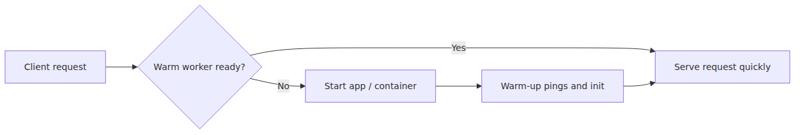
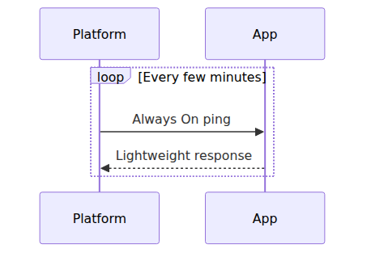
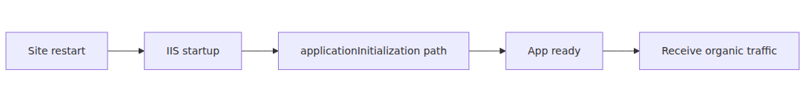
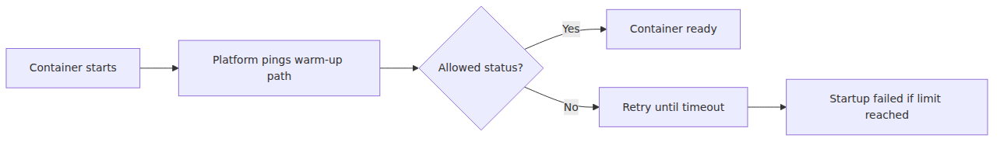
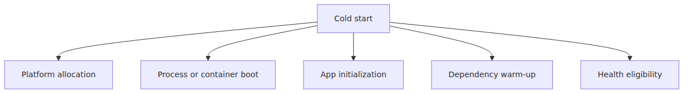
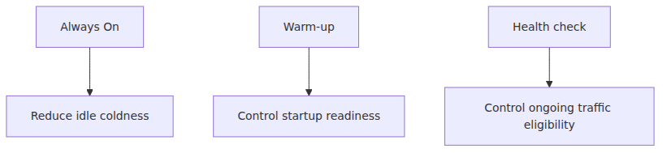

# 콜드 스타트와 Warmup — 첫 요청이 비싼 이유

첫 요청이 느리다는 말은 보통 그냥 latency가 컸다는 뜻이 아닙니다. 더 정확히 말하면 아직 준비되지 않은 실행 단위가 사용자 요청을 받기 직전에 급히 준비되었다는 뜻입니다. worker가 막 할당되었을 수도 있고, 프로세스나 컨테이너가 막 올라오고 있을 수도 있으며, readiness를 판정하는 warm-up 경로가 아직 끝나지 않았을 수도 있습니다.

그래서 Always On, warm-up path, health check를 모두 켰는데도 기대한 만큼 빨라지지 않는 장면이 자주 나옵니다. 이 셋은 관련은 있지만 같은 기능이 아니기 때문입니다. idle coldness를 줄이는 일, startup 직후 readiness를 여는 일, 이미 서비스 중인 인스턴스가 계속 traffic을 받을 자격이 있는지 판단하는 일은 각기 다른 질문입니다.

이 글은 Azure App Service Deep Dive 시리즈의 마지막 글입니다.

이번 글에서는 Windows와 Linux에서 warm-up 신호가 어떻게 다른지, Always On이 실제로 줄여 주는 비용과 줄여 주지 못하는 비용이 무엇인지, 좋은 warm-up endpoint는 어떤 성질을 가져야 하는지, 그리고 deployment slot이 왜 cold-start 비용을 production URL 밖으로 밀어내는지 정리하겠습니다.

이제 새 worker가 실제 사용자 요청을 안전하게 받을 수 있기까지의 마지막 준비 시간을 보겠습니다.

## 이 글에서 다룰 문제

- App Service에서 cold start 비용은 실제로 어떤 준비 단계들의 합일까요?
- Always On은 어떤 종류의 coldness를 줄이고, 어떤 종류의 startup cost에는 거의 도움을 주지 못할까요?
- Windows와 Linux는 warm-up readiness를 어떤 다른 도구와 설정으로 표현할까요?
- 좋은 warm-up endpoint는 health endpoint와 무엇이 같고 무엇이 다를까요?
- deployment slot warm-up은 왜 production 사용자 앞에서 cold start를 덜 보이게 만들까요?

## 왜 이 글이 중요한가

cold start를 정확히 이해하지 못하면 운영 설정이 전부 감각 의존이 됩니다. Always On을 켜면 다 해결될 것처럼 기대하거나, health endpoint를 warm-up endpoint 대신 사용하거나, Linux에서 `WEBSITE_WARMUP_STATUSES`를 좁히지 않아 아직 준비되지 않은 응답이 readiness로 받아들여지는 실수가 반복됩니다. 이런 문제는 앱이 나빠서가 아니라 startup contract를 잘못 이해해서 생깁니다.

또한 scale-out과 deployment는 결국 warm-up으로 닫힙니다. 새 worker를 하나 더 배정받았다고 곧바로 traffic을 보내면 안 되고, 새 코드가 staging에 배포됐다고 바로 production에서 안전해지는 것도 아닙니다. worker 또는 새 artifact가 실제로 traffic-eligible 상태가 되어야 비로소 사용자 체감이 좋아집니다.

마지막으로 이 글은 시리즈 전체를 하나의 운영 모델로 묶는 역할을 합니다. 1화에서 박스를 나눴고, 2화에서 요청이 worker에 도달하는 길을 봤고, 3화에서 실행 경계를 봤고, 4화에서 배포 경로를 봤고, 5화에서 scale-out control loop를 봤습니다. 6화는 그 마지막 박스, 즉 traffic readiness를 설명합니다.

## cold start를 이해하는 가장 좋은 방법: not ready 상태의 실행 단위를 ready 상태로 바꾸는 비용으로 보는 것입니다

이 주제를 가장 정확하게 보는 문장은 이것입니다. **App Service의 cold start는 "첫 요청이 느리다"는 추상적 현상이 아니라, 아직 not ready인 worker·process·container를 ready 상태로 바꾸는 비용이 사용자의 요청 경로에 노출된 상황입니다.**

이 관점이 중요한 이유는 startup cost를 한 항목으로 보지 않게 만들기 때문입니다. worker allocation, process startup, framework bootstrap, dependency connection warm-up, cache or JIT priming, health 또는 warm-up gate 통과가 각각 따로 비용을 가질 수 있습니다. 첫 요청 지연은 대개 이 비용들의 합입니다.

그리고 이 구분은 운영 선택에도 직접 연결됩니다. Always On은 idle coldness를 줄여 줄 수 있지만 redeploy, restart, scale-out 직후의 startup readiness를 대신하지는 못합니다. 반대로 좋은 warm-up endpoint와 slot warm-up은 그 이후 경계를 훨씬 더 안전하게 만들어 줍니다.

> cold start 최적화는 설정 하나를 찾는 일이 아니라, 플랫폼이 readiness를 판단하는 방식과 애플리케이션이 실제 준비 완료를 선언하는 시점을 맞추는 일입니다.

## 핵심 개념

### cold path와 warm path를 먼저 구분해야 합니다

사용자가 느끼는 첫 요청 비용은 사실상 ready worker를 바로 쓰는 warm path와, 아직 ready하지 않은 실행 단위를 깨워서 준비시키는 cold path의 차이입니다. 이 차이를 그림으로 보면 시리즈 전체에서 가장 체감적인 주제가 무엇인지 바로 보입니다.



첫 요청 지연은 단순 네트워크 지연이 아닙니다. 사용자는 앱 로직보다 앞서, 준비되지 않은 실행 단위가 ready 상태가 될 때까지 걸리는 시간을 먼저 기다립니다.

### Windows와 Linux는 warm-up 신호를 같은 방식으로 표현하지 않습니다

목표는 같지만 수단은 다릅니다. Windows code app에서는 IIS `applicationInitialization`을 쓸 수 있고, Always On이 idle unload를 줄이는 역할을 합니다. Linux app에서는 플랫폼이 `WEBSITE_WARMUP_PATH`를 반복 호출할 수 있고, startup timeout은 `WEBSITES_CONTAINER_START_TIME_LIMIT`의 영향을 받습니다.


이 차이를 먼저 머리에 넣어야 warm-up 전략이 플랫폼과 맞습니다. Windows에서는 root ping만으로는 준비가 끝나지 않는 경우 `applicationInitialization`을 통해 추가 준비 경로를 열어야 할 수 있고, Linux에서는 readiness를 어떤 응답 코드로 인정할지까지 명시적으로 조정해야 할 수 있습니다.

### Always On은 idle coldness를 줄이지만 모든 startup cost를 없애지는 못합니다

Microsoft 문서와 App Service 팀 블로그는 Always On을 비슷한 언어로 설명합니다. idle 상태로 앱이 식는 빈도를 줄이기 위해 주기적으로 ping을 보내는 기능입니다. 운영적으로 번역하면 앱이 idle cold path로 다시 떨어질 가능성을 줄이고, app-pool unload 또는 유사한 idle behavior가 덜 보이게 하며, 최악의 first-request latency를 낮추는 기능입니다.



하지만 Always On은 redeploy, restart, 새로운 scale-out worker, container recycle에 따른 startup cost까지 없애 주지는 못합니다. 따라서 Always On만 켜고 warm-up 설계를 생략하면 배포 직후나 scale-out 직후의 느림은 여전히 남을 수 있습니다.

### Windows에서는 root ping 외에 `applicationInitialization`이 필요할 수 있습니다

루트 URL을 한 번 치는 것만으로 앱이 완전히 준비되지 않는 경우가 많습니다. 첫 데이터베이스 connection pool 열기, 큰 cache priming, template compilation, JIT 또는 무거운 초기화 경로가 대표적입니다. 이런 경우 IIS `applicationInitialization`은 별도의 warm-up endpoint를 명시적으로 호출하게 해 줍니다.



여기서 중요한 것은 endpoint design입니다. 성공을 너무 빨리 반환하면 아직 준비가 덜 된 인스턴스가 traffic pool에 들어가고, 반대로 endpoint가 지나치게 무거우면 warm-up 자체가 병목이 됩니다. warm-up은 느려도 안 되고, 성급해도 안 됩니다.

### Linux에서는 warm-up path와 accepted status code가 startup contract를 만듭니다

App settings reference는 Linux startup 계약을 꽤 명확하게 설명합니다. 플랫폼은 `WEBSITE_WARMUP_PATH`에 반복 요청을 보낼 수 있고, `WEBSITE_WARMUP_STATUSES`를 지정하지 않으면 거의 어떤 응답이든 readiness로 받아들일 수 있습니다. 또한 `WEBSITES_CONTAINER_START_TIME_LIMIT` 안에 ready 상태가 되지 않으면 startup failure로 간주될 수 있습니다.



이 모델은 Linux App Service에서 아주 흔한 두 실수를 만듭니다. 아직 준비되지 않았는데도 permissive response가 readiness로 취급되는 경우, 그리고 startup limit이 너무 짧아 앱이 initialization 중 restart loop에 빠지는 경우입니다. Linux에서는 status code contract를 느슨하게 두지 않는 습관이 중요합니다.

### cold start는 여러 비용의 합으로 읽어야 합니다

첫 요청 비용은 보통 하나의 병목이 아니라 여러 준비 비용의 합입니다. worker 또는 container allocation, app process startup, framework bootstrap, dependency connection warm-up, cache·module import·JIT 작업, 그리고 health 또는 warm-up eligibility gate까지 겹쳐질 수 있습니다.



그래서 cold start 최적화는 magic setting 하나를 찾는 일이 아닙니다. 앱이 실제로 무엇을 준비해야 하는지와, 플랫폼이 readiness를 언제 열어 줄지를 함께 설계하는 작업입니다.

### 좋은 warm-up endpoint는 "정말 준비됐는가"를 정확히 말해야 합니다

warm-up endpoint는 health endpoint와 겹치는 부분이 있지만 완전히 같지는 않습니다. 목적이 다르기 때문입니다. warm-up endpoint의 역할은 traffic eligibility를 열기 전에 앱이 실제로 준비됐는지 판단하는 것입니다.

좋은 warm-up endpoint는 보통 인증 없이 플랫폼이 호출할 수 있고, 핵심 dependency readiness를 포함하며, startup이 끝나기 전에는 성공을 반환하지 않고, 필요 이상으로 무거운 작업을 매번 반복하지 않습니다. 너무 빨리 성공하면 미완성 worker가 traffic을 받고, 너무 늦게 성공하면 scale-out과 slot swap이 불필요하게 늦어집니다.

### deployment slot은 cold-start 비용을 production URL 밖으로 밀어냅니다

slot이 강력한 이유는 새 버전의 startup cost를 production 사용자 대신 staging 쪽에서 먼저 치를 수 있기 때문입니다. staging worker가 이미 boot와 warm-up을 끝냈다면, production traffic이 새 버전에 넘어갈 때 사용자는 그 비용을 덜 직접적으로 느낍니다.


이 때문에 4화의 deployment slot 설명과 이번 화의 warm-up 설명은 사실 같은 이야기의 앞뒤입니다. 배포를 production URL 밖에서 끝내는 것만으로는 부족하고, startup readiness까지 그 바깥에서 끝내야 slot의 가치가 완성됩니다.

### Always On, warm-up, health check는 서로 다른 역할을 합니다

이 셋을 같은 기능으로 섞어 생각하면 설정은 켰는데 체감은 어긋납니다. Always On은 idle coldness를 줄이고, warm-up path는 startup 직후 readiness를 판단하며, health check는 이미 서비스 중인 인스턴스가 계속 traffic을 받을 자격이 있는지 판정합니다.



그래서 "Always On을 켰는데 왜 배포 직후는 여전히 느리지"라는 질문이 자연스럽게 나옵니다. idle warmness와 new-start readiness는 서로 다른 문제이기 때문입니다.

### cold-start 분포는 실제로 측정해야 합니다

아래 명령은 앱을 재시작한 뒤 warm-up 경로의 응답 시간과 상태 코드를 여러 번 찍어 분포를 보는 간단한 출발점입니다. 운영자가 cold path를 추측만 하지 않고 실측 기반으로 보기 위한 최소 도구입니다.

```bash
az webapp restart -n my-app -g my-rg

for i in $(seq 1 50); do
  curl -o /dev/null -s -w "%{http_code} %{time_total}s\n" \
    https://my-app.azurewebsites.net/healthz
done | sort -k2 -n | tail -10
```

이 측정은 평균값보다 tail latency를 보는 데 더 유용합니다. cold start는 드물어 보여도 사용자 경험에는 p99 형태로 남기 쉽기 때문입니다. 운영 문서에 cold-start SLO를 넣을 때 평균이 아니라 tail을 같이 보는 이유가 여기에 있습니다.

## 흔히 헷갈리는 지점

- **Always On이 모든 startup cost를 없애 주는 것은 아닙니다.** idle coldness를 줄여 줄 뿐 redeploy·restart·new worker startup까지 대체하지는 못합니다.
- **warm-up endpoint와 health endpoint는 목적이 같습니다가 아니라 겹칩니다입니다.** 하나는 startup readiness, 다른 하나는 ongoing traffic eligibility를 더 강하게 담당합니다.
- **Linux에서 아무 응답이나 readiness로 받아들이게 두면 위험합니다.** `WEBSITE_WARMUP_STATUSES`를 좁히지 않으면 false readiness가 생길 수 있습니다.
- **slot swap의 가치는 단순 파일 교체가 아닙니다.** warm-up이 끝난 인스턴스로 routing을 넘겨 production 사용자가 cold start를 덜 보게 만드는 데 있습니다.
- **cold start는 한 원인의 문제가 아닙니다.** worker allocation, process bootstrap, dependency warm-up, readiness gate가 누적된 결과일 수 있습니다.

## 운영 체크리스트

- [ ] warm-up ping이 실제 핵심 dependency readiness까지 깨우는지 검증했습니다.
- [ ] Always On의 비용 대비 지연 개선 효과를 팀 기준으로 정했습니다.
- [ ] 런타임별 cold-start profile을 실측해 문서화했습니다.
- [ ] cold-start p99를 SLO 문서에 별도 항목으로 반영했습니다.
- [ ] scale-out 직후 사용자가 cold start를 맞는 시나리오를 부하 테스트로 검증했습니다.

## 정리

6화의 핵심은 cold start를 막연한 "느린 첫 요청"으로 보지 않는 것입니다. App Service에서 cold start는 warm worker가 아직 없거나 새 process·container가 readiness를 통과하지 못한 상태에서 사용자의 요청이 들어올 때 생기는 비용입니다. Windows에서는 `applicationInitialization`과 Always On이 중요한 도구이고, Linux에서는 `WEBSITE_WARMUP_PATH`, `WEBSITE_WARMUP_STATUSES`, `WEBSITES_CONTAINER_START_TIME_LIMIT`이 startup 계약을 강하게 좌우합니다.

운영적으로는 Always On, warm-up, health check의 역할을 정확히 나누는 감각이 가장 중요합니다. idle coldness를 줄이는 기능과 startup readiness를 여는 기능, 그리고 서비스 중 인스턴스의 지속 건강 상태를 보는 기능은 서로 다릅니다. 이 셋을 구분해야 배포 직후 느림, scale-out 직후 느림, 장시간 유휴 후 느림을 각각 다른 처방으로 다룰 수 있습니다.

이 글로 시리즈를 마무리합니다. 이제 App Service는 더 이상 "코드 올리는 곳"이 아니라 Front-End, ARR, worker, sandbox, Kudu, shared storage, autoscale, warm-up이 연결된 하나의 운영 체계로 보일 것입니다. 그 관점이 잡히면 App Service 운영 문제는 훨씬 덜 추상적이고 훨씬 더 설명 가능해집니다.

<!-- toc:begin -->
## 시리즈 목차

- [App Service 플랫폼 아키텍처 — Front-End·Worker·File Server](./01-platform-architecture.md)
- [Front-End과 ARR — 요청은 어떻게 워커에 도달하는가](./02-front-end-and-arr.md)
- [Worker 인스턴스와 샌드박스 — 사용자 코드를 어디에 가두는가](./03-worker-and-sandbox.md)
- [배포와 Kudu — 빌드·동기화·릴리스의 안쪽](./04-deployment-and-kudu.md)
- [스케일링 내부 동작 — Scale Out 결정과 워커 추가 경로](./05-scaling-internals.md)
- **콜드 스타트와 Warmup — 첫 요청이 비싼 이유 (현재 글)**

<!-- toc:end -->

## 참고 자료

### 공식 문서
- [Environment variables and app settings reference](https://learn.microsoft.com/azure/app-service/reference-app-settings)
- [Deploy staging slots in Azure App Service](https://learn.microsoft.com/azure/app-service/deploy-staging-slots)
- [IIS 8.0 Application Initialization](https://learn.microsoft.com/iis/get-started/whats-new-in-iis-8/iis-80-application-initialization)
- [Robust Apps for the Cloud — App Service team blog](https://azure.github.io/AppService/2020/05/15/Robust-Apps-for-the-cloud.html)

### 관련 시리즈
- [Azure App Service 101 — Request Lifecycle](../../azure-app-service-101/ko/02-request-lifecycle.md)
- [Azure Functions Deep Dive — Cold start and Placeholder Mode](../../azure-functions-deep-dive/ko/06-cold-start-placeholder.md)

Tags: Azure, App Service, Distributed Systems, Platform Engineering
