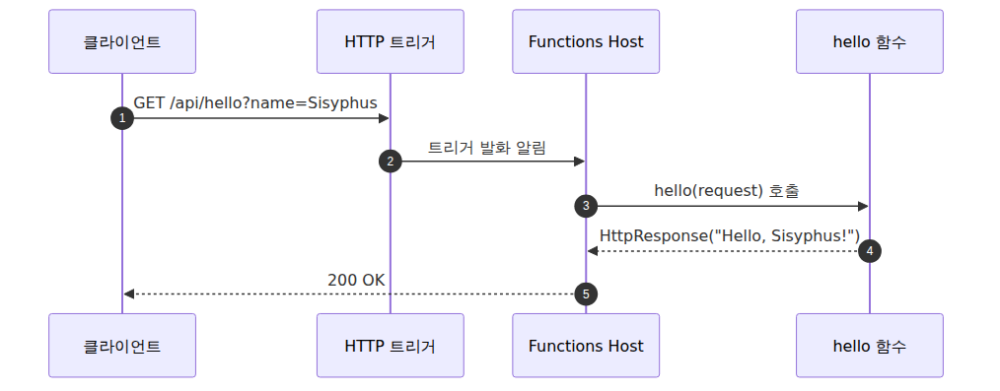
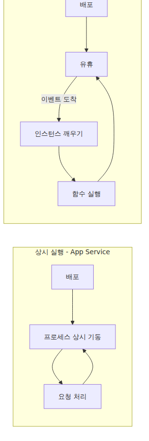
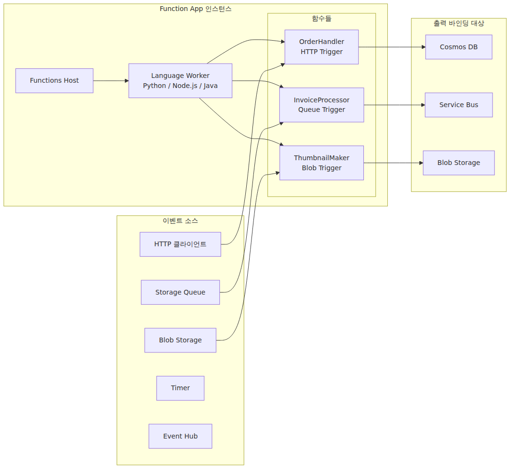

# Azure Functions란? — 이벤트가 함수를 호출하는 세상

서버리스라는 말을 처음 들었을 때 가장 흔한 반응은 둘 중 하나입니다. “서버가 없다는 게 무슨 뜻이야?” 아니면 “결국 클라우드가 서버 돌리는 건데 그게 그거 아닌가?” 둘 다 절반은 맞고 절반은 틀립니다. 서버는 있습니다. 다만 **여러분이 서버를 의식할 필요가 없도록 만든 모델**이 서버리스입니다. Azure Functions는 그 모델의 Azure 측 답변입니다.

이 시리즈는 Azure Functions를 처음 다뤄 보는 개발자를 위한 입문 가이드입니다. 가장 기본적인 질문부터 시작합니다. **Azure Functions는 정확히 무엇이고, 왜 이 모델이 의미가 있는가.** 멘탈 모델을 먼저 잡아두면 뒤에 나오는 트리거, 바인딩, 스케일링, 배포 이야기가 훨씬 쉽게 들어옵니다.

---

<!-- a-grade-intro:begin -->
## 핵심 질문

Azure Functions는 다른 컴퓨트 옵션과 비교해 언제 선택해야 하고, 무엇을 포기해야 할까요?

이 글은 그 질문에 답하기 위해 Azure Functions의 위치의 핵심 결정과 운영 함정을 살펴봅니다.

<!-- a-grade-intro:end -->

## 이 글에서 답할 질문

- Azure Functions는 기존 웹 앱(App Service)과 무엇이 다른가?
- Trigger, Binding, Host, Function App은 각각 어떤 역할을 하는가?
- 어떤 워크로드에서 Functions가 잘 맞고, 어떤 경우에는 피해야 하는가?
- 콜드 스타트는 왜 생기고, 어디에 영향을 주는가?

## 한 문장 정의 — “이벤트가 들어오면 내 함수가 실행되고, 끝나면 사라진다”

Azure Functions를 한 줄로 요약하면 이렇습니다.

> 어떤 이벤트가 발생하면, 그 이벤트에 연결된 작은 함수가 호출되어 실행되고, 작업이 끝나면 인스턴스는 회수됩니다.

이 한 줄에 이 플랫폼의 거의 모든 특성이 담겨 있습니다. 핵심 단어 셋만 짚으면 됩니다.

- **이벤트** — HTTP 요청, 큐 메시지, 파일 업로드, 타이머, 데이터베이스 변경 등 “함수를 깨우는 사건”
- **함수** — 여러분이 작성하는 코드. 보통 수십 줄 단위, 단일 책임
- **사라진다** — 평소엔 인스턴스가 떠 있지 않을 수도 있고, 트래픽에 맞춰 늘었다 줄었다 한다

기존 웹 앱이 “식당이 아침부터 밤까지 문을 열어 두고 손님을 기다리는” 모델이라면, Functions는 **호출벨을 누르는 순간 출장 요리사가 출동하는** 모델에 가깝습니다. 손님이 없을 땐 요리사가 대기실에서 다른 일을 하다가 벨이 울리면 그제야 옵니다.

---

## 가장 작은 예시부터 — Hello, Function

말로 설명하는 것보다 짧은 코드 한 조각이 빠릅니다. 아래는 HTTP 요청이 들어오면 인사말을 돌려주는 가장 단순한 함수입니다. Azure Functions Python v2 프로그래밍 모델 기준입니다.

```python
import azure.functions as func

app = func.FunctionApp(http_auth_level=func.AuthLevel.ANONYMOUS)

@app.function_name(name="hello")
@app.route(route="hello", methods=["GET"])
def hello(request: func.HttpRequest) -> func.HttpResponse:
    name = request.params.get("name", "world")
    return func.HttpResponse(f"Hello, {name}!")
```

코드는 짧지만 안에는 Azure Functions의 핵심이 다 들어 있습니다.

- `@app.route(...)` — **이 함수는 HTTP 트리거에 묶여 있다**는 선언
- `def hello(...)` — 트리거가 발화했을 때 실행될 본체
- `func.HttpResponse(...)` — 결과는 이렇게 돌려 보낸다

서버를 띄우는 코드, 포트를 여는 코드, 라우터를 설정하는 코드, 그 어느 것도 없습니다. **“언제 깨우는지”와 “무엇을 할지”만 적으면 끝**입니다. 나머지는 Functions Host가 책임집니다.

요청이 들어와서 응답이 나가기까지 무슨 일이 벌어지는지 가장 단순하게 그리면 다음과 같습니다.



*HTTP 요청이 함수를 깨우는 흐름*
뒤에 나올 모든 이야기는 이 그림을 점점 정교하게 만드는 과정이라고 보면 됩니다. 이후 장에서는 HTTP가 아닌 트리거, Host와 함수 본체의 실행 경계, 인스턴스가 늘어나는 스케일링 동작을 차례로 이 그림 위에 얹습니다.

---

## 기존 웹 앱과 뭐가 다른가

App Service나 VM에 웹 앱을 올려 본 적이 있다면, 다음 비교가 가장 빠르게 와닿을 겁니다.

| 항목 | 상시 실행형 (App Service / VM) | 이벤트 호출형 (Functions) |
|---|---|---|
| 배포 단위 | 애플리케이션 (전체) | 함수 단위 (Function App에 모음) |
| 실행 시점 | 항상 켜져 있음 | 이벤트가 들어올 때만 |
| 스케일 단위 | 인스턴스(VM) 수 | 함수 실행 동시성 |
| 과금 모델 | 시간 단위 (인스턴스 띄워 둔 시간) | 실행 시간 + 실행 횟수 (또는 혼합) |

핵심 차이는 **무엇을 단위로 비용을 매기는가**입니다. App Service는 “인스턴스를 켜 둔 시간”에 돈을 받고, Functions(특히 Consumption 계열)는 “함수가 실제로 실행된 시간과 횟수”에 돈을 받습니다. 그래서 트래픽이 한산할 때 압도적으로 쌉니다. 반대로 트래픽이 일정하게 높다면 App Service가 더 쌀 수도 있습니다. 이 트레이드오프는 뒤의 호스팅 플랜 장에서 본격적으로 다룹니다.

두 모델의 라이프사이클을 그림으로 비교하면 차이가 더 명확합니다.



*상시 실행형과 이벤트 호출형의 차이*
오른쪽 그림에서 “유휴 → 깨우기 → 실행 → 다시 유휴”의 순환이 바로 서버리스의 본질입니다. 이 “깨우기” 구간이 바로 **콜드 스타트(cold start)** 의 정체입니다. 뒤의 스케일링 장에서 이 시간이 어디에 쓰이는지 자세히 다룹니다.

---

## Azure Functions의 4가지 핵심 개념

이 시리즈 전체를 관통할 네 단어가 있습니다. 여기서는 이름만 익히고, 뒤의 장에서 하나씩 깊이 들어가면 됩니다.

- **Trigger (트리거)** — 함수를 깨우는 이벤트의 종류. HTTP 요청, 타이머, 큐 메시지, Blob 업로드, Event Hub, Service Bus, Cosmos DB 변경 피드 등. **함수 하나에는 트리거 하나가 묶입니다.**
- **Binding (바인딩)** — 함수의 입출력을 “선언적으로” 외부 리소스에 연결하는 장치. 예를 들어 출력 바인딩으로 Cosmos DB를 묶어 두면, 함수가 객체를 반환하기만 해도 자동으로 DB에 저장됩니다. 보일러플레이트가 줄어듭니다.
- **Host** — 함수들을 실제로 띄우고 트리거를 감지하고 함수 코드를 호출하는 런타임 프로세스. 오픈소스이며, 코드는 [`Azure/azure-functions-host`](https://github.com/Azure/azure-functions-host) 레포에 있습니다.
- **Function App** — 배포·과금·스케일링의 단위입니다. 함수는 Function App 단위로 묶이지만, 실제 실행은 **인스턴스별**로 일어납니다. Function App이 스케일아웃되면 인스턴스가 여러 개 생기고, **각 인스턴스마다 자기 Host가 하나씩** 뜹니다. Node.js·Python·Java 함수는 그 Host 안에서 직접 도는 것이 아니라, **별도 Worker 프로세스**에서 실행됩니다.

이 네 개념의 관계를 한 장으로 그리면 다음과 같습니다.



*트리거와 바인딩, Host, 앱의 관계*
이 그림에서 기억할 것은 두 가지입니다. **(1) Host는 인스턴스마다 하나씩 뜨는 공통 런타임이고, 사용자 코드는 Worker 프로세스에서 실행된다는 점, (2) 트리거와 바인딩은 함수와 외부 세계를 잇는 인터페이스라는 점**입니다. 이 둘의 조합이 Functions를 이벤트 기반 서비스답게 만듭니다.

Host가 실제로 함수를 어떻게 띄우는지, 여러 언어 런타임을 어떻게 붙이는지는 별도의 심화 시리즈 **Azure Functions Deep Dive**에서 소스코드를 따라가며 다룹니다.

---

## 어떤 시나리오에서 빛나는가

추상적인 이야기를 길게 하면 와닿지 않습니다. 실무에서 Functions가 자주 쓰이는 5가지 패턴을 짧게 보여드리겠습니다.

- **이벤트 처리 파이프라인** — Event Hub로 들어오는 IoT 텔레메트리를 가공해서 데이터베이스에 적재. 트래픽이 시간대별로 들쭉날쭉할 때 압도적으로 효율적입니다.
- **예약 작업** — 매일 새벽 3시에 정산 배치를 돌리는 경우. Cron 서버를 별도로 운영할 필요가 없습니다.
- **파일 처리** — 사용자가 Blob Storage에 이미지를 업로드하면 자동으로 썸네일을 만들어 다른 컨테이너에 저장. 입력·출력이 모두 바인딩으로 끝납니다.
- **가벼운 HTTP API / Webhook** — 외부 SaaS의 Webhook을 받아 가공하거나, 마이크로서비스 한두 개를 가볍게 띄울 때.
- **비동기 큐 소비자** — 상시 켜진 워커 프로세스 대신 Queue Trigger로 메시지가 있을 때만 깨어나서 처리.

공통점은 “**일이 있을 때는 빠르게 처리해야 하지만 평소엔 트래픽이 적거나 불규칙하다**”는 점입니다. 이런 워크로드에 상시 실행형 인스턴스를 띄워 두는 건 명백히 낭비입니다.

---

## 안 어울리는 경우도 있다

Functions가 만능은 아닙니다. 도입 전에 다음 세 가지는 반드시 확인해야 합니다.

- **장기 실행 작업** — 타임아웃 한도는 플랜마다 다릅니다. Consumption은 기본 5분이고 최대 10분까지 늘릴 수 있습니다. Flex Consumption, Premium, Dedicated/App Service Plan은 기본 30분이며 동일한 하드 상한 없이 운영할 수 있습니다. 한 번 실행에 1시간 걸리는 작업은 Durable Functions로 쪼개거나 다른 컴퓨트(Container Apps, Batch 등)를 고려해야 합니다.
- **매우 일관된 고부하** — 트래픽이 24시간 균일하게 높다면, 같은 처리량 기준으로 App Service 또는 컨테이너가 더 저렴할 수 있습니다. 종량제는 트래픽이 들쭉날쭉할 때 빛납니다.
- **콜드 스타트가 치명적인 초저지연 API** — 첫 호출에 수백 ms가 추가되는 게 비즈니스적으로 허용되지 않는다면, Premium / Flex Consumption의 Always Ready 옵션을 쓰거나 다른 모델을 봐야 합니다(이 트레이드오프는 뒤의 스케일링과 콜드 스타트 장에서 다룹니다).

“서버리스를 쓰는 게 멋있다”가 아니라, **워크로드 특성과 비용 모델이 맞을 때** 쓰는 도구입니다.

---

## 한 줄 요약

여기서는 멘탈 모델을 잡는 데 집중했습니다. 한 줄로 요약하면 이렇습니다.

> Azure Functions = **이벤트(Trigger)** 가 들어오면 **Host**가 **함수**를 깨워서 실행하고, **바인딩**으로 외부 세계와 연결한다. 단위는 **Function App**.

이제 이어서 볼 핵심은 **트리거와 바인딩**입니다. 어떤 이벤트가 함수를 깨우는지, 입력·출력 바인딩이 코드를 얼마나 줄여 주는지, 그리고 그 선언적 모델이 어디까지 유효한지를 이해하면 Functions의 바깥 인터페이스가 분명해집니다.

---

## 시니어 엔지니어는 이렇게 생각합니다

- **이벤트 주도 워크로드의 1순위** — 트리거가 코드를 부르는 모델이 명확한 경우 가장 단순합니다.
- **서버리스의 본질은 운영 위임** — 인프라 책임을 줄이는 대신 제약을 받아들입니다.
- **실행 시간·메모리 제약을 의식한다** — 장기 작업·대용량 메모리에는 다른 옵션이 더 맞습니다.
- **콜드 스타트는 SLA의 변수다** — 사용자 체감 지연이 비즈니스 결정에 직접 영향을 줍니다.
- **플랜 선택이 아키텍처를 좌우** — Consumption·Premium·Dedicated의 트레이드오프를 처음에 결정합니다.

## 운영 체크리스트

- [ ] trigger 종류와 호출 빈도를 청구 단위와 같이 견적했다
- [ ] 콜드 스타트 허용 한도를 비기능 요구사항에 명시했다
- [ ] 동일 함수 그룹의 라이프사이클(배포, 권한)을 정리했다
- [ ] outbound 의존성(스토리지, DB)의 연결 풀링 정책을 결정했다
- [ ] Functions를 쓰지 말아야 할 케이스를 ADR로 기록했다

<!-- toc:begin -->
## 시리즈 목차

- **Azure Functions란? — 이벤트가 함수를 호출하는 세상 (현재 글)**
- 트리거와 바인딩 — 함수 입출력의 모든 것 (예정)
- Host와 Worker — 함수는 누가 실행하는가 (예정)
- 함수 하나 배포하기 — 로컬에서 Azure까지 (예정)
- 어떤 플랜을 선택해야 할까 — Consumption / Flex / Premium / Dedicated (예정)
- 스케일링과 콜드 스타트 — 서버리스가 빨라지는 순간과 느려지는 순간 (예정)
- 모니터링과 운영 기초 (예정)

<!-- toc:end -->

---

## 참고 자료

**공식 문서**
- [Azure Functions overview — Microsoft Learn](https://learn.microsoft.com/en-us/azure/azure-functions/functions-overview)
- [Azure Functions best practices — Microsoft Learn](https://learn.microsoft.com/en-us/azure/azure-functions/functions-best-practices)
- [Azure Functions triggers and bindings concepts](https://learn.microsoft.com/en-us/azure/azure-functions/functions-triggers-bindings)

**소스코드**
- [`Azure/azure-functions-host`](https://github.com/Azure/azure-functions-host) — Functions Host 본체

**관련 시리즈**
- [Azure Functions Deep Dive](../../azure-functions-deep-dive/ko/) — Host와 Worker 내부 동작을 코드 레벨에서 이어서 읽고 싶다면

Tags: Azure, Azure Functions, Serverless, Cloud
