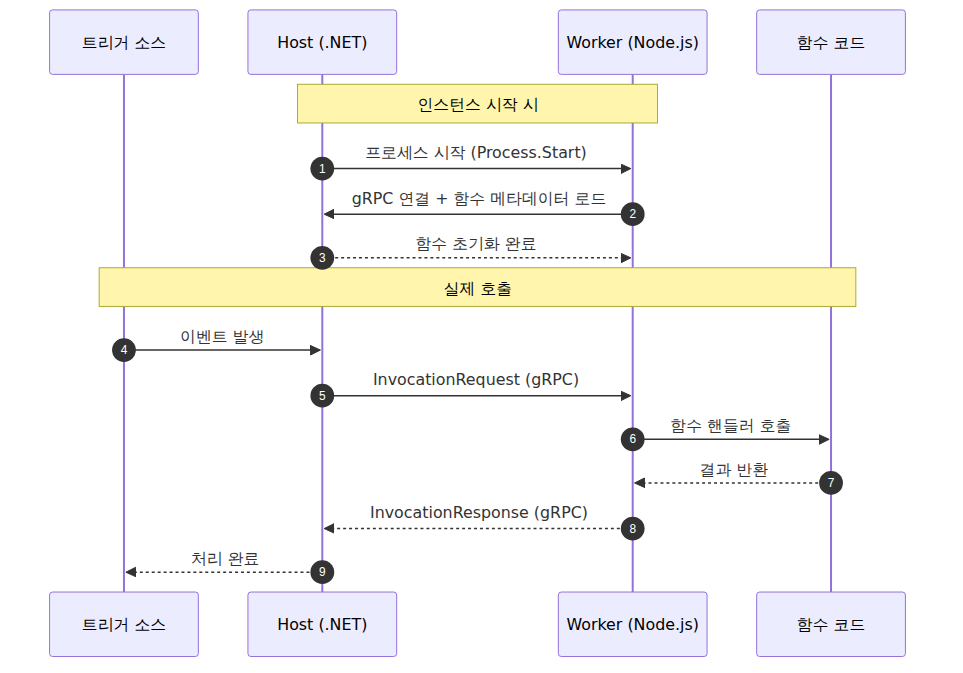
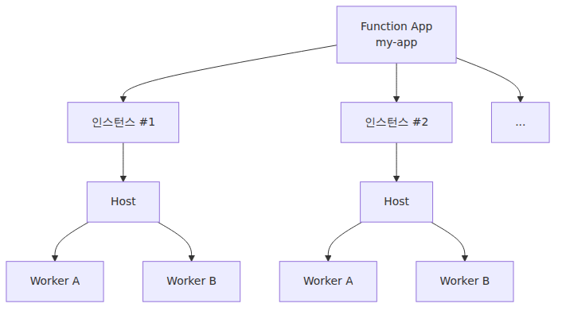

# Host와 Worker — 함수는 누가 실행하는가

지난 두 화에서 “함수는 트리거가 깨우고, 바인딩으로 입출력을 연결한다”는 멘탈 모델을 만들었습니다. 그런데 한 가지 큰 질문이 남아 있습니다. **여러분이 작성한 Node.js 코드, Python 코드, Java 코드는 도대체 누가 실행하는가?**

Azure Functions Host는 .NET으로 작성돼 있습니다. 그런데 우리는 Python으로도, Node.js로도, Java로도 함수를 씁니다. **다른 언어로 작성된 함수가 .NET 호스트 안에서 어떻게 실행되는 걸까요?** 이 질문의 답이 이 장의 주제입니다.

답을 한 줄로 미리 적습니다.

> Functions는 **Host 프로세스(.NET)** 와 **Worker 프로세스(여러분의 언어)** 를 분리해 띄우고, 둘은 **gRPC**로 대화합니다.

이 한 줄을 그림과 함께 풀어보겠습니다.

---

## 이 글에서 답할 질문

- Functions Host와 language worker는 왜 별도 프로세스로 분리되었는가?
- Host와 worker 사이의 gRPC 통신은 어떤 메시지 흐름을 따르는가?
- 한 worker는 동시에 몇 개의 함수 인스턴스를 실행하는가?
- Host 재시작과 worker 재시작은 각각 어떤 신호로 트리거되는가?
- out-of-process worker 모델은 in-process 대비 어떤 트레이드오프가 있는가?

## 가장 큰 그림 — 두 개의 프로세스

전통적인 웹 프레임워크는 보통 한 프로세스 안에서 모든 일이 일어납니다. 코드 로딩, HTTP 처리, DB 호출, 응답 생성. 한 덩어리입니다.

Functions는 다릅니다. **함수 실행을 위한 프로세스가 최소 두 개** 있습니다.

- **Host 프로세스** — .NET으로 작성된 런타임. 트리거 감지, 스케일 신호, 로깅, 바인딩 해석을 담당
- **Worker 프로세스** — 여러분의 언어(Node.js, Python, Java 등)로 띄워지는 별도 프로세스. **여기서 여러분의 함수 코드가 실제로 실행**됨


이 분리가 Functions의 가장 중요한 설계 결정입니다. 왜 이렇게 했을까요?

---

## 왜 분리했는가 — 한 호스트에서 여러 언어 런타임을 붙이는 방식

만약 Host와 Worker가 같은 프로세스라면, Host는 V8, CPython, JVM 같은 언어 런타임을 직접 품어야 합니다. 현실적으로 버거운 구조입니다. 언어마다 GC, 메모리 모델, 의존성 관리 방식이 달라서 한 프로세스에 몰아넣으면 충돌 가능성이 커집니다.

분리하면 답이 단순해집니다.

- Host는 **함수의 실행 자체에 관여하지 않습니다.** 언제 실행할지, 어떤 입력을 줄지, 어떤 출력을 받을지만 책임집니다.
- Worker는 **자기 언어의 표준 런타임에서 그대로 실행됩니다.** Node.js Worker는 그냥 평범한 Node.js 프로세스이고, Python Worker는 그냥 평범한 Python 프로세스입니다.
- 둘 사이는 **언어 중립적인 프로토콜(gRPC + Protobuf)** 로만 대화합니다.

새로운 언어를 추가하는 일도 “그 언어로 Worker를 구현하고 Host와 gRPC로 대화하게 만든다”는 문제로 바뀝니다. Host 쪽 프로세스 관리 코드는 [`azure-functions-host`](https://github.com/Azure/azure-functions-host)에서 확인할 수 있고, 언어별 `worker.config.json`은 각 language worker 레포에 있습니다. 어떤 실행 파일을 띄우고 어떤 인수를 넘길지는 그 설정 파일이 맡습니다.

> 참고: .NET in-process 모델은 Host와 같은 프로세스에서 실행됩니다. 역사적인 배경이 있는 예외이고, 신규 프로젝트는 isolated worker 모델을 기준으로 보는 편이 안전합니다.

---

## 한 인스턴스 안에서 일어나는 일

한 Function App 인스턴스가 트래픽을 처리하는 모습을 시퀀스로 그려보면 이렇습니다.


이 흐름에서 기억할 것은 두 가지입니다.

1. **Host는 함수 코드를 직접 호출하지 않습니다.** “Worker야, 이 입력으로 이 함수를 실행해줘”라고 gRPC로 요청할 뿐입니다.
2. **Worker는 트리거 이벤트를 직접 받지 않습니다.** Host가 받아서 가공한 뒤 Worker에게 넘깁니다.

이 두 사실은 운영 관점에서도 의미가 큽니다. 예를 들어 함수가 무한 루프에 빠져 Worker가 응답하지 않으면, Host는 Worker만 재시작하면 됩니다. Host 자체는 멀쩡합니다. 반대로 트리거 인프라(예: Service Bus 연결) 문제가 생기면 Host 로그에 흔적이 남고, Worker 로그는 깨끗합니다. **로그를 어디서 봐야 할지 결정할 때 이 분리가 도움이 됩니다.**

---

## Function App, Host, Worker — 세 단어의 위계

비슷한 단어가 세 개라 처음엔 헷갈립니다. 정리하면 이렇습니다.

| 단어 | 무엇 | 단위 |
|---|---|---|
| **Function App** | 배포·과금·스케일링의 단위. 여러 함수를 묶는 컨테이너 개념 | 사용자가 보는 Azure 리소스 |
| **Host** | Function App 인스턴스에서 돌아가는 .NET 런타임 프로세스 | 인스턴스당 1개 |
| **Worker** | Host가 띄운 언어 런타임 프로세스 | 인스턴스당 1개 이상 (`FUNCTIONS_WORKER_PROCESS_COUNT`로 조정 가능) |


Function App을 스케일아웃하면 인스턴스 수가 늘어나고, 각 인스턴스는 자기 Host와 Worker를 가집니다. **인스턴스 간에는 메모리를 공유하지 않습니다.** 함수 안에서 “전역 변수에 캐시해 두면 빠르겠지” 하는 코드는 같은 인스턴스 안에서만 의미가 있고, 다른 인스턴스에서는 그 캐시가 비어 있습니다. 이 점은 뒤의 스케일링 장에서 다시 짚습니다.

---

## 한 인스턴스에서 동시에 처리할 수 있는 함수 호출은 몇 개?

“Worker 프로세스가 1개면 함수 호출도 1개씩 순차 처리되나요?” — 좋은 질문이고, Python은 흔히 듣는 “단일 이벤트 루프” 한 줄로 설명하면 오해가 생깁니다. **동기 `def` 함수는 Python worker 내부의 thread pool에서 실행**되므로, worker 하나가 여러 동기 호출을 동시에 처리할 수 있습니다. 반면 **비동기 `async def` 함수는 worker 안의 단일 asyncio event loop를 공유**하므로 I/O 겹치기에는 유리하지만, CPU-바운드 작업을 만나면 다른 호출 진행 방식이 또 달라집니다.

그래서 Python Functions를 Node.js와 완전히 같은 모델로 보면 안 됩니다. Python worker는 여전히 **GIL 아래의 단일 Python 프로세스**이고, 동시성은 “모든 것이 한 이벤트 루프에서 돈다”기보다 동기 함수용 thread pool과 `async def`용 cooperative scheduling이 함께 만드는 결과입니다. 여기에 `FUNCTIONS_WORKER_PROCESS_COUNT`를 더하면 한 인스턴스 안에서 worker 프로세스를 여러 개 띄워 동시성을 넓힐 수 있습니다.

운영에서 특히 중요한 예외는 **Flex Consumption의 Python HTTP 동시성 기본값이 인스턴스당 1**이라는 점입니다. 즉 HTTP 요청은 인스턴스 수만으로 결정되지 않고, `PYTHON_THREADPOOL_THREAD_COUNT` 같은 Python worker 설정과 HTTP 관련 인스턴스당 동시성 설정을 어떻게 잡았는지도 같이 봐야 합니다. 결국 스케일업과 스케일아웃 사이에는 **인스턴스 하나를 얼마나 세게 몰아붙일지**라는 세 번째 축이 있는 셈입니다.

---

## 코드를 어떻게 검증하는가 — 오픈소스로 확인할 수 있는 구조

지금까지 한 이야기는 추측이 아닙니다. Functions Host는 [`Azure/azure-functions-host`](https://github.com/Azure/azure-functions-host) 레포에 공개돼 있어서 누구나 코드를 읽어볼 수 있습니다. Host와 Worker 사이의 메시지 계약은 별도 레포인 [`Azure/azure-functions-language-worker-protobuf`](https://github.com/Azure/azure-functions-language-worker-protobuf)에 정의돼 있습니다. 이 장의 핵심 주장들은 모두 코드로 확인할 수 있습니다.

이 시리즈의 형제 시리즈인 **Azure Functions Deep Dive**에서는 그 코드를 직접 따라가면서 다음 질문들에 답합니다.

- Host가 Worker 프로세스를 어떻게 띄우는가? (`Process.Start`까지 따라가기)
- gRPC EventStream의 정확한 핸드셰이크는 어떻게 생겼는가?
- 트리거가 발화하면 Dispatcher가 어떤 워커를 고르고, InvocationRequest는 어떻게 만들어지는가?
- 콜드 스타트를 줄이는 Placeholder 모드의 코드는 어떻게 되어 있는가?

입문편을 다 읽고 “더 안쪽이 궁금하다”는 분은 그 시리즈로 넘어가시면 됩니다.

---

## 이 실행 경계가 운영에서 왜 중요한가

여기까지 “Functions의 구조”를 설명했습니다. 여기서 중요한 실무 포인트는, 로컬 실행과 Azure 배포가 결국 이 Host/Worker 경계 위에서 일어난다는 점입니다. 배포 장에서 CLI를 따라갈 때도 단순히 명령을 외우는 것이 아니라, 어떤 런타임 구조를 실제로 올리는지 함께 이해하는 편이 훨씬 오래 갑니다.

---

앞선 장에서 Trigger와 Binding까지 바깥 인터페이스를 정리했다면, 여기서는 그 뒤에서 Host와 Worker가 실행을 어떻게 나누는지 설명합니다. 이어지는 배포와 운영 장은 이 구조를 실제 동작으로 연결하는 역할을 합니다.

---

## host.json 핵심 설정

```json
{
  "version": "2.0",
  "functionTimeout": "00:05:00",
  "extensions": {
    "http": { "maxConcurrentRequests": 100 }
  }
}
```

## 운영 체크리스트

- [ ] 사용 언어가 in-process / out-of-process 중 어떤 모델인지 확인했다
- [ ] 동시 실행 한도(maxConcurrentRequests 등)를 워크로드 기준으로 튜닝했다
- [ ] Host와 worker 로그를 분리해서 확인할 수 있는 환경을 만들었다
- [ ] worker 충돌 시 자동 복구 동작을 테스트했다
- [ ] host.json의 주요 설정을 인프라 IaC로 관리했다

<!-- toc:begin -->
## 시리즈 목차

- [Azure Functions란? — 이벤트가 함수를 호출하는 세상](./01-what-is-azure-functions.md)
- [트리거와 바인딩 — 함수 입출력의 모든 것](./02-triggers-and-bindings.md)
- **Host와 Worker — 함수는 누가 실행하는가 (현재 글)**
- 함수 하나 배포하기 — 로컬에서 Azure까지 (예정)
- 어떤 플랜을 선택해야 할까 — Consumption / Flex / Premium / Dedicated (예정)
- 스케일링과 콜드 스타트 — 서버리스가 빨라지는 순간과 느려지는 순간 (예정)
- 모니터링과 운영 기초 (예정)

<!-- toc:end -->

---

## 참고 자료

**공식 문서**
- [Azure Functions runtime versions overview](https://learn.microsoft.com/en-us/azure/azure-functions/functions-versions)
- [Use multiple worker processes (`FUNCTIONS_WORKER_PROCESS_COUNT`)](https://learn.microsoft.com/en-us/azure/azure-functions/functions-app-settings)
- [.NET isolated worker model](https://learn.microsoft.com/en-us/azure/azure-functions/dotnet-isolated-process-guide)

**소스코드**
- [`Azure/azure-functions-host`](https://github.com/Azure/azure-functions-host) — Host 본체
- [`Azure/azure-functions-language-worker-protobuf`](https://github.com/Azure/azure-functions-language-worker-protobuf) — Host/Worker 메시지 계약
- [`Azure/azure-functions-nodejs-worker`](https://github.com/Azure/azure-functions-nodejs-worker)
- [`Azure/azure-functions-python-worker`](https://github.com/Azure/azure-functions-python-worker)
- [`Azure/azure-functions-java-worker`](https://github.com/Azure/azure-functions-java-worker)

**관련 시리즈**
- [Azure Functions Deep Dive](../../azure-functions-deep-dive/ko/) — Host/Worker 분리를 코드 레벨에서 따라가는 심화 시리즈

Tags: Azure, Azure Functions, Serverless, Cloud
