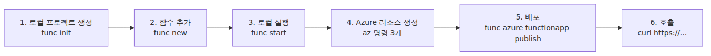
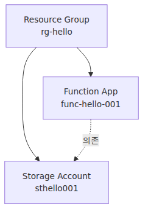
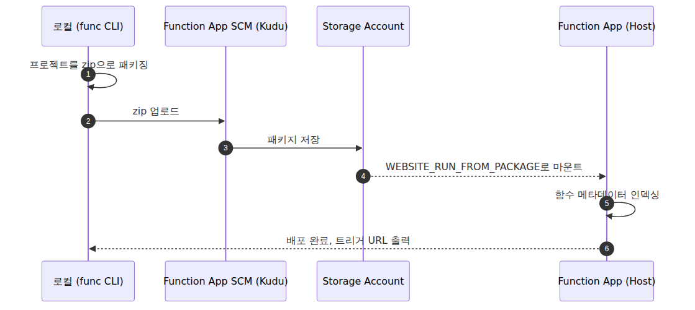

# 함수 하나 배포하기 — 로컬에서 Azure까지

> Azure Functions 101 시리즈 (4/7)

지금까지 세 화는 개념을 정리하는 단계였습니다. 이번 글에서는 **로컬에서 함수를 만들고, Azure에 배포하고, 실제 호출 가능한 URL을 받기까지의 가장 짧은 경로**를 끝까지 따라갑니다.

이 글이 끝나면 다음이 손에 남습니다.

- 로컬에서 함수를 실행해 볼 수 있는 환경
- Azure에 올라간 실제 Function App
- 인터넷에서 호출 가능한 HTTPS URL
- 재배포가 어떤 흐름으로 이뤄지는지에 대한 감각

예제 언어는 Python v2 프로그래밍 모델로 맞춥니다. 흐름 자체는 다른 런타임에서도 거의 같습니다.

또 하나 먼저 짚고 가겠습니다. 이 글의 배포 예제는 **가장 단순한 데모 경로**를 보여 주기 위해 classic Consumption 플랜을 사용합니다. 다만 2025년 기준으로 Consumption은 레거시 플랜이고, **새 서버리스 앱의 기본 선택지는 Flex Consumption**으로 보는 편이 맞습니다. Flex는 5화에서 비교하고, 여기서는 먼저 가장 짧은 배포 흐름을 익힙니다.

---

## 도구 준비 — 세 가지면 충분합니다

배포까지 가는 데 필요한 도구는 셋입니다.

| 도구 | 역할 | 설치 |
|---|---|---|
| **Azure Functions Core Tools** | 로컬 실행 + 배포 명령(`func`) | `npm i -g azure-functions-core-tools@4` |
| **Azure CLI** | Azure 리소스를 명령줄로 생성하고 관리 | OS별 설치 ([공식 문서](https://learn.microsoft.com/en-us/cli/azure/install-azure-cli)) |
| **Python 3.11+** | Worker 런타임 | pyenv, 공식 설치 프로그램 등 |

VS Code의 Azure Functions 확장을 써도 되지만, 이 글은 **CLI만으로** 진행합니다. 한 번 끝까지 직접 해 보면 IDE가 자동화하는 범위가 분명해집니다.

설치가 끝나면 버전을 확인합니다.

```bash
func --version       # 4.x
az --version         # 2.x
python --version     # 3.11+
```

---

## 전체 흐름 한 장


---

## 1. 프로젝트 만들기

빈 폴더에서 시작합니다.

```bash
mkdir hello-functions && cd hello-functions
func init . --worker-runtime python --model V2
```

이 명령으로 기본 골격이 만들어집니다. 먼저 눈에 들어오는 파일은 다음 셋입니다.

- `host.json` — Host 설정
- `local.settings.json` — 로컬 실행용 환경 변수
- `requirements.txt` — Python 의존성 목록

`local.settings.json`은 운영 환경의 **App Settings**와 같은 역할을 합니다. 로컬에서는 이 파일을 읽고, Azure에서는 Function App에 설정된 App Settings를 읽습니다. **로컬에서 운영으로 넘어갈 때 코드가 바뀌지 않는다**는 점이 중요합니다.

---

## 2. 함수 추가

가장 단순한 HTTP 트리거 함수를 추가합니다.

```bash
func new --template "Http Trigger" --name hello --authlevel anonymous
```

Python v2 모델에서는 함수 정의가 `function_app.py`에 모입니다. 생성 직후 구조는 대략 이런 형태입니다.

```python
import azure.functions as func

app = func.FunctionApp(http_auth_level=func.AuthLevel.ANONYMOUS)

@app.function_name(name="hello")
@app.route(route="hello")
def hello(req: func.HttpRequest) -> func.HttpResponse:
    name = req.params.get("name")

    if not name:
        name = req.get_body().decode("utf-8") if req.get_body() else "world"

    return func.HttpResponse(f"Hello, {name}!")
```

이 정도면 바로 실행해 볼 수 있습니다.

---

## 3. 로컬에서 실행

```bash
python -m venv .venv
source .venv/bin/activate
pip install -r requirements.txt
func start
```

출력 마지막에 다음 줄이 보이면 성공입니다.

```
Functions:
        hello: [GET,POST] http://localhost:7071/api/hello
```

다른 터미널에서 호출해 봅니다.

```bash
curl "http://localhost:7071/api/hello?name=Sisyphus"
# Hello, Sisyphus!
```

이 시점에서 `func start`는 **로컬에 Functions Host를 띄운 상태**입니다. 3화에서 본 Host와 Worker가 실제로 올라오고, 둘 사이에 gRPC 채널이 연결됩니다. 운영과 같은 구조를 노트북에서 그대로 보는 셈입니다.

---

## 4. Azure 리소스 만들기

Azure에 함수를 올리려면 세 개의 리소스가 필요합니다.

| 리소스 | 역할 |
|---|---|
| **Resource Group** | 관련 리소스를 묶는 단위 |
| **Storage Account** | Functions Host의 상태, 락, 큐 메타데이터를 저장하는 필수 저장소 |
| **Function App** | 함수를 담는 컴퓨트 리소스 |


> Note: Storage Account는 Functions가 자기 동작을 유지하는 데 쓰는 인프라 저장소입니다. 트리거 락, 호출 메타데이터, Timer 스케줄 상태 같은 값이 여기에 들어갑니다. 비즈니스 데이터는 별도 저장소를 두는 편이 안전합니다.

이제 리소스를 만듭니다. 이름은 전역 고유해야 하므로 적절히 바꿔서 쓰면 됩니다.

```bash
RG=rg-hello
LOC=koreacentral
SA=sthello$RANDOM
APP=func-hello-$RANDOM

# 1) Resource Group
az group create --name $RG --location $LOC

# 2) Storage Account
az storage account create \
    --name $SA --resource-group $RG \
    --location $LOC --sku Standard_LRS

# 3) Function App (classic Consumption, Python 3.11)
az functionapp create \
    --name $APP --resource-group $RG \
    --storage-account $SA \
    --consumption-plan-location $LOC \
    --runtime python --runtime-version 3.11 --functions-version 4
```

마지막 명령이 끝나면 Azure 포털에서 Function App이 보입니다. 아직 코드만 배포하지 않았을 뿐, 실행할 자리까지는 준비된 상태입니다.

`az functionapp create` 옵션은 플랜별로 다릅니다. 여기서 쓴 `--consumption-plan-location`은 classic Consumption용입니다. **Premium**이나 **Dedicated(App Service Plan)** 에서는 미리 만든 App Service Plan을 `--plan`으로 넘기고, **Flex Consumption**은 `--flexconsumption-location`과 `--flexconsumption-runtime`을 쓰는 별도 생성 경로를 사용합니다.

예를 들면 Flex Consumption은 이런 식입니다.

```bash
az functionapp create \
    --name $APP --resource-group $RG \
    --storage-account $SA \
    --runtime python --runtime-version 3.11 \
    --functions-version 4 \
    --flexconsumption-location $LOC \
    --flexconsumption-runtime python
```

실무에서 새 서버리스 앱을 만든다면 Flex Consumption부터 검토하는 편이 맞습니다. 이 글에서는 설명을 단순하게 유지하려고 Consumption을 예제로 썼습니다.

---

## 5. 배포

배포는 한 줄입니다.

```bash
func azure functionapp publish $APP
```

내부 흐름은 다음과 같습니다.


마지막에 다음과 비슷한 출력이 나옵니다.

```
Functions in func-hello-xxxxx:
    hello - [httpTrigger]
        Invoke url: https://func-hello-xxxxx.azurewebsites.net/api/hello
```

이 URL이 인터넷에서 호출 가능한 엔드포인트입니다.

---

## 6. 인터넷에서 호출

```bash
curl "https://func-hello-xxxxx.azurewebsites.net/api/hello?name=Sisyphus"
# Hello, Sisyphus!
```

여기까지가 로컬에서 클라우드까지 가는 가장 짧은 경로입니다. 같은 명령(`func azure functionapp publish $APP`)을 다시 실행하면 재배포됩니다.

---

## 운영 전에 알아둘 다섯 가지

위 흐름은 **가장 짧은 데모 경로**입니다. 운영으로 가져가려면 다음 항목을 따로 챙겨야 합니다.

1. **App Settings = 환경 변수** — `local.settings.json` 값은 운영에서 `az functionapp config appsettings set`으로 옮깁니다. 비밀값은 Key Vault 참조를 쓰는 편이 낫습니다.
2. **인증** — `anonymous`는 데모용입니다. 실제 환경에서는 함수 키, Microsoft Entra ID, API Management 같은 계층을 둡니다.
3. **CI/CD** — `func ... publish`는 로컬 데모에는 좋지만, 운영에서는 GitHub Actions나 Azure DevOps에서 같은 흐름을 자동화합니다.
4. **로그와 모니터링** — Application Insights를 붙이면 호출 로그, 예외, 성능 지표를 한곳에서 볼 수 있습니다.
5. **플랜 선택** — Consumption은 입문과 데모에는 편하지만, 새 서비스의 기본 선택지는 대개 Flex Consumption입니다.

---

## 자주 막히는 지점 세 가지

- **Storage Account 이름 충돌** — Storage 이름은 전역 고유입니다. `sthello$RANDOM` 같은 패턴이 편합니다.
- **`func` 명령이 예상과 다르게 동작함** — Core Tools v4인지 먼저 확인합니다.
- **배포는 됐는데 URL이 404를 반환함** — 함수 인덱싱 실패가 흔한 원인입니다. 포털의 Log stream에서 부팅 로그를 보면 원인을 찾기 쉽습니다.

---

## 다음 화에서

배포까지 끝냈다면 이제 질문은 하나입니다. **어떤 플랜에서 돌릴 것인가**입니다. 다음 글에서는 Consumption, Flex Consumption, Premium, Dedicated의 차이를 실제 선택 기준 중심으로 정리합니다.

---

## 시리즈 맥락

이 글은 Azure Functions 101의 4화입니다. 앞선 세 글에서 트리거와 바인딩, Host와 Worker 구조를 정리했다면, 이번 글은 그 개념을 실제 배포 흐름으로 연결하는 자리입니다. 다음 5화와 6화에서는 플랜 선택, 스케일링, 콜드 스타트처럼 운영 판단에 직접 영향을 주는 주제로 넘어갑니다.

---

<!-- toc:begin -->
## 시리즈 목차

- [Azure Functions란? — 이벤트가 함수를 호출하는 세상](./01-what-is-azure-functions.md)
- [트리거와 바인딩 — 함수 입출력의 모든 것](./02-triggers-and-bindings.md)
- [Host와 Worker — 함수는 누가 실행하는가](./03-host-and-worker.md)
- **함수 하나 배포하기 — 로컬에서 Azure까지 (현재 글)**
- 어떤 플랜을 선택해야 할까 — Consumption / Flex / Premium / Dedicated (예정)
- 스케일링과 콜드 스타트 — 서버리스가 빨라지는 순간과 느려지는 순간 (예정)
- 모니터링과 운영 기초 (예정)

<!-- toc:end -->

---

## 참고 자료

**공식 문서**
- [Azure Functions Core Tools](https://learn.microsoft.com/en-us/azure/azure-functions/functions-run-local)
- [`az functionapp` CLI reference](https://learn.microsoft.com/en-us/cli/azure/functionapp)
- [Azure Functions Flex Consumption plan hosting](https://learn.microsoft.com/en-us/azure/azure-functions/flex-consumption-plan)
- [Function scale and hosting options](https://learn.microsoft.com/en-us/azure/azure-functions/functions-scale)
- [Run from package deployment](https://learn.microsoft.com/en-us/azure/azure-functions/run-functions-from-deployment-package)

Tags: Azure, Azure Functions, Serverless, Cloud
