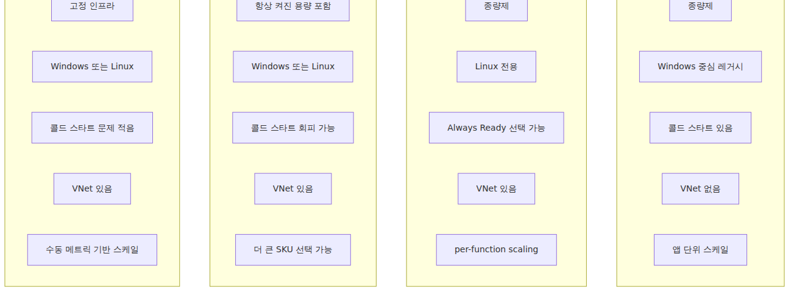
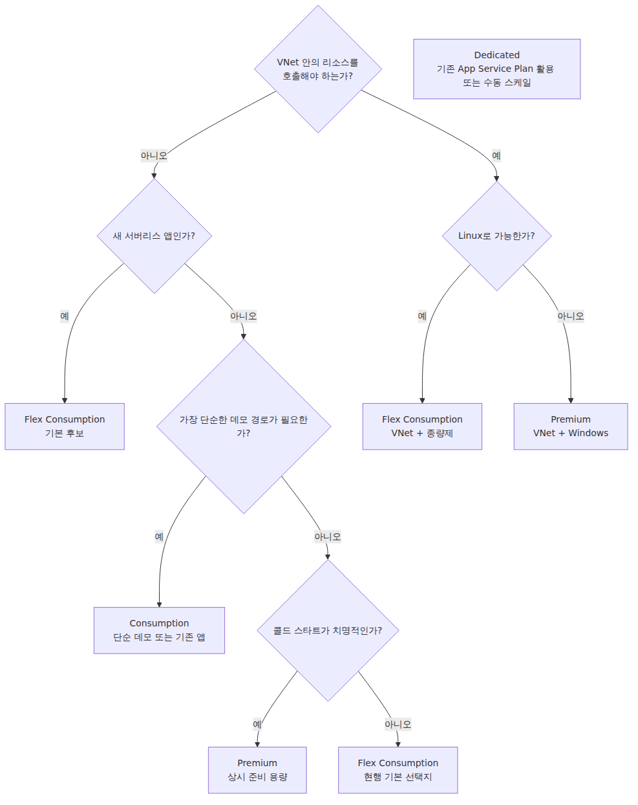

# 어떤 플랜을 선택해야 할까 — Consumption / Flex / Premium / Dedicated

배포 장에서는 함수를 Flex Consumption에 올렸습니다. 그 경로가 현재 새 서버리스 앱의 기본 후보에 가장 가깝기 때문입니다. classic Consumption도 역사적으로나 운영상 여전히 알아둘 필요는 있지만, 현재 Microsoft Learn 문서 기준으로는 **새 서버리스 앱의 기본 선택지로 Flex Consumption을 우선 검토**하도록 안내하고 있습니다.

그래도 Consumption을 빼고 설명하면 실제 선택을 이해하기 어렵습니다. 여기서는 **Consumption / Flex Consumption / Premium / Dedicated(App Service Plan)** 네 가지를 모두 다루되, 각 플랜의 현재 위치와 제약을 그대로 적겠습니다.

목표는 단순합니다. **각 플랜이 무엇을 주고 무엇을 포기하게 만드는지, 그리고 내 워크로드에 어떤 플랜이 맞는지**를 한 번에 판단할 수 있게 만드는 것입니다.

---

## 한 줄 정의 — 네 가지 플랜

| 플랜 | 한 줄 정의 |
|---|---|
| **Consumption** | 가장 단순한 종량제 서버리스. 오래된 경로이며, Windows 중심으로 생각하는 편이 맞습니다. |
| **Flex Consumption** | Microsoft가 새 서버리스 앱의 기본 선택지로 권장하는 Linux 기반 종량제 플랜. VNet, 메모리 선택, per-function scaling을 제공합니다. |
| **Premium** | Always Ready / Pre-warmed 인스턴스로 콜드 스타트를 줄이거나 피하는 고급 플랜. VNet과 더 큰 SKU를 쓸 수 있습니다. |
| **Dedicated (App Service Plan)** | Functions를 일반 App Service 인프라 위에서 돌리는 모델. 이벤트 기반 자동 스케일 대신 App Service 규칙을 직접 관리합니다. |

Azure Functions를 “자동으로 늘어나는 서버리스”라고만 기억하고 있었다면, 여기서 한 번 수정해야 합니다. **자동 스케일의 방식과 운영 모델이 플랜마다 꽤 다릅니다.**

---

## 큰 그림 — 무엇이 다른가



*플랜별 비용·예열·스케일 방식 비교*
이제 비교표로 세부 차이를 정리합니다.

---

## 비교표 — 한 화면에 정리

| 항목 | Consumption | Flex Consumption | Premium | Dedicated |
|---|---|---|---|---|
| **현재 위치** | 오래된 경로 | 새 서버리스 기본 선택지 | 고급 서버리스 | 일반 App Service 계열 |
| **과금 모델** | 실행 기준 종량제 | 실행 기준 종량제 + Always Ready가 있으면 그 용량도 과금 | 인스턴스 시간 + 실행 용량 | App Service Plan SKU 기준 |
| **트래픽 0일 때 비용** | 0 | Always Ready가 0이면 0 | 최소 인스턴스 비용 발생 | 항상 발생 |
| **콜드 스타트** | 있음 | 줄일 수 있음 (Always Ready 선택) | 대체로 회피 가능 | 상시 실행이면 사실상 없음 |
| **OS** | Windows 중심. Linux Consumption은 지역에 따라 가용성이 제한될 수 있음 | Linux only | Windows / Linux | Windows / Linux |
| **VNet 통합** | 없음 | 있음 | 있음 | 있음 |
| **최대 인스턴스 수** | 대략 200, OS와 제한 조건에 따라 더 낮을 수 있음 | 최대 1000, 지역별 250코어 기본 쿼터 영향 | 대략 20~100+, OS·지역·제한 조건에 따라 달라짐 | App Service Plan SKU와 autoscale 설정에 따름 |
| **이벤트 기반 자동 스케일** | 지원 (이벤트별 리스너 기반) | 지원 (per-function, target-based) | 지원 (target-based 옵션) | 직접 메트릭 룰 구성 |
| **Per-function scaling** | 없음 | 있음 | 없음 | 없음 |
| **인스턴스 메모리** | 1.5 GB 고정 | 512 / 2048 / 4096 MB 선택 | SKU별로 다름 | App Service Plan SKU에 따름 |
| **배포 슬롯** | 제한적 | 없음, rolling update 경로 사용 | 있음 | 있음 |
| **Warmup 트리거** | 없음 | 있음 | 있음 | 있음 |

> 출처: Microsoft Learn의 [Function scale and hosting options](https://learn.microsoft.com/en-us/azure/azure-functions/functions-scale), [Flex Consumption plan](https://learn.microsoft.com/en-us/azure/azure-functions/flex-consumption-plan), [Event-driven scaling](https://learn.microsoft.com/en-us/azure/azure-functions/event-driven-scaling), [Target-based scaling](https://learn.microsoft.com/en-us/azure/azure-functions/functions-target-based-scaling). 인스턴스 상한은 플랜, OS, 지역, 네트워크 제한 조건에 따라 달라질 수 있습니다.

이 표를 볼 때 가장 먼저 확인할 값은 세 가지입니다. **OS, VNet, 스케일 방식**입니다. 비용보다 먼저 이 세 조건에서 후보가 갈리는 경우가 많습니다.

---

## Consumption — 가장 단순하지만 새 서버리스 앱의 기본 후보는 아님

Consumption은 여전히 설명하기 쉬운 플랜입니다. 호출이 없으면 비용이 0이고, 준비 과정도 단순합니다. 다만 새 프로젝트의 기본 선택지로 보기는 어렵습니다.

**선택 기준**

- 가장 단순한 데모, 실험, PoC가 필요함
- Windows 기반 제약이 있음
- VNet 통합이 필요 없음
- 첫 호출 지연을 어느 정도 감수할 수 있음

**약점**

- 콜드 스타트
- VNet 통합 없음
- 1.5 GB 고정 메모리
- 장기적으로 Microsoft 권장 기준이 바뀔 경우 마이그레이션 부담이 생길 수 있음
- Linux Consumption은 지역에 따라 가용성이 제한될 수 있어 새 기준점으로 잡기 어려움

그래서 배포 장에서도 Consumption은 레거시 경로 참고용으로만 남겼습니다. 새 서버리스 서비스를 처음 설계한다면, 특별한 제약이 없는 한 Flex Consumption부터 검토하는 편이 좋습니다.

---

## Flex Consumption — 새 서버리스 앱의 기본 후보

Flex Consumption은 Microsoft가 공식적으로 권장하는 새 서버리스 호스팅 플랜입니다. Consumption의 장점을 유지하면서도, 실무에서 자주 걸리던 제약을 여러 개 풀어 줍니다.

**핵심 차별점**

- **VNet 통합** — private endpoint 뒤 리소스 접근이 가능합니다.
- **인스턴스 메모리 선택** — 512 MB, 2048 MB, 4096 MB 중에서 고를 수 있습니다.
- **Always Ready** — 특정 함수 그룹에 미리 떠 있는 인스턴스를 둘 수 있습니다. 기본값은 0입니다.
- **Per-function scaling** — 함수별 또는 함수 그룹별로 스케일이 갈립니다.
- **큰 스케일 범위** — 앱 기준 최대 1000 인스턴스까지 확장할 수 있지만, 지역별 코어 쿼터가 실제 상한을 먼저 만들 수 있습니다.

**중요한 제약**

- **Linux 전용**입니다.
- **Blob trigger는 Event Grid 소스만 지원**합니다. 예전 Consumption에서 익숙하던 polling 기반 blob trigger와 같은 전제로 보면 안 됩니다.
- **일부 바인딩과 기능이 Flex 전용 제약**을 가집니다. 배포 슬롯 미지원, 플랜 간 in-place 마이그레이션 불가 같은 차이도 있습니다.
- **Per-function scale group**으로 동작합니다. 즉, 모든 함수가 완전히 독립 인스턴스로 스케일하는 것은 아닙니다. HTTP끼리, Blob(Event Grid)끼리, Durable끼리 묶이는 그룹이 있습니다.

**선택 기준**

- 새 서버리스 프로젝트를 시작함
- VNet 안의 리소스를 호출해야 함
- Consumption보다 나은 스케일 유연성과 메모리 선택권이 필요함
- Linux 채택이 가능함

새 프로젝트라면 가장 먼저 검토할 후보가 맞습니다. 다만 “Consumption의 약점을 거의 다 고쳤다” 정도로 이해하는 선이 안전하지, 모든 제약이 사라졌다고 보면 설계 단계에서 다시 막힐 수 있습니다.

---

## Premium — 콜드 스타트와 Windows 요구사항까지 같이 풀 때

Premium은 **항상 준비된 용량을 두는 방식**으로 접근합니다. 호출이 없어도 비용은 들지만, 그만큼 콜드 스타트를 더 강하게 제어할 수 있습니다.

**선택 기준**

- 첫 호출 지연이 비즈니스적으로 허용되지 않음
- Windows를 유지해야 하는데 VNet도 필요함
- 더 큰 CPU/메모리 SKU가 필요함
- 여러 Function App을 같은 Premium 플랜에 묶어 운영하고 싶음

**약점**

- 최소 인스턴스 비용이 항상 발생
- Linux 새 프로젝트에서는 Flex Consumption과 비교 검토가 거의 필수
- 상한 인스턴스 수가 지역, OS, 네트워크 조건에 따라 달라져서 “무조건 100”처럼 외우면 틀리기 쉬움

Premium은 “서버리스 과금”보다 “서버리스 운영 모델 + 더 강한 성능 보장” 쪽에 가깝습니다.

---

## Dedicated — Functions를 App Service 방식으로 운영할 때

Dedicated(App Service Plan)는 이름보다 본질을 보는 편이 쉽습니다. **Functions를 일반 App Service Plan 위에서 돌리는 모델**입니다. 다른 웹 앱과 같은 플랜에 올릴 수 있고, 비용도 App Service 기준으로 계산됩니다.

**선택 기준**

- 이미 App Service Plan이 있고 여유 용량이 있음
- Functions를 다른 웹 앱과 같은 인프라에서 운영하고 싶음
- 비용을 완전히 고정적으로 보고 싶음
- 이벤트 기반 자동 스케일이 꼭 필요하지 않음

**가장 중요한 특징**

- **Consumption/Flex/Premium 같은 이벤트 기반 자동 스케일은 없습니다.** App Service autoscale 규칙을 메트릭 기반으로 직접 설계해야 합니다.

이 점을 모르고 Dedicated를 고르면 “Functions인데 왜 큐 길이에 따라 자동으로 안 늘지?” 같은 상황을 맞기 쉽습니다. Dedicated는 Functions의 프로그래밍 모델을 쓰되, 운영 모델은 App Service에 더 가깝습니다.

---

## 의사결정 트리



*요구사항별 호스팅 플랜 선택 경로*
이 트리에서 Dedicated가 기본 경로 바깥에 있는 이유가 중요합니다. Dedicated는 나쁜 플랜이 아니라, **Functions 고유의 이벤트 기반 스케일을 일부 포기해도 되는 경우에만 맞는 플랜**입니다.

---

## 새 프로젝트 시작 시 추천

세 줄로 요약하면 이렇습니다.

1. **새 서버리스 프로젝트라면 Flex Consumption을 먼저 봅니다.** 현재 공식 권장 경로입니다.
2. **Windows 제약이나 강한 콜드 스타트 제어가 필요하면 Premium을 봅니다.**
3. **Consumption은 가장 단순한 데모 경로이거나 기존 자산을 유지할 때만 제한적으로 선택합니다.**

여기에 단서가 하나 더 있습니다. Flex Consumption은 분명 강력하지만, **Blob trigger는 Event Grid 기반만 지원하고, 일부 바인딩과 기능에 Flex 전용 제약이 있으며, 스케일도 per-function scale group 단위로 이해해야 합니다.** 그래서 “무조건 Flex”가 아니라 “기본 후보는 Flex, 설계 제약은 반드시 확인”이 더 정확한 표현입니다.

---

## 이 선택이 이어지는 운영 질문

플랜을 골랐다면 다음 질문은 자연스럽게 이어집니다. **실제로 어떤 기준으로 인스턴스가 늘고 줄어드는가, 그리고 첫 호출은 왜 느린가**입니다. 이어지는 스케일링 장에서는 이벤트 기반 스케일, target-based scaling, 콜드 스타트를 한 장으로 묶어 설명합니다.

---

## 시리즈 맥락

배포 장에서 실제 경로를 한 번 끝까지 봤다면, 여기서는 그 배포 대상을 어떤 호스팅 플랜에 둘지 결정하는 기준을 정리하는 자리입니다. 이어지는 스케일링 장에서는 여기서 고른 플랜이 실제로 어떻게 스케일하고 왜 콜드 스타트 차이를 만드는지 다룹니다.

---

## 플랜 변경 예시

```bash
az functionapp plan create \
  --resource-group $RG --name $PLAN \
  --location koreacentral \
  --sku EP1 --is-linux
```

## 운영 체크리스트

- [ ] Consumption, Premium, Dedicated 플랜의 청구 단위를 표로 정리했다
- [ ] 콜드 스타트 허용 한도가 플랜 결정의 1차 기준임을 합의했다
- [ ] VNet 통합 등 플랫폼 기능 요구를 플랜 비교에 반영했다
- [ ] 스케일 한도(인스턴스 수)와 워크로드 피크를 비교했다
- [ ] 예상 비용을 월 단위 시나리오로 시뮬레이션했다

<!-- toc:begin -->
## 시리즈 목차

- [Azure Functions란? — 이벤트가 함수를 호출하는 세상](./01-what-is-azure-functions.md)
- [트리거와 바인딩 — 함수 입출력의 모든 것](./02-triggers-and-bindings.md)
- [Host와 Worker — 함수는 누가 실행하는가](./03-host-and-worker.md)
- [함수 하나 배포하기 — 로컬에서 Azure까지](./04-first-deploy.md)
- **어떤 플랜을 선택해야 할까 — Consumption / Flex / Premium / Dedicated (현재 글)**
- 스케일링과 콜드 스타트 — 서버리스가 빨라지는 순간과 느려지는 순간 (예정)
- 모니터링과 운영 기초 (예정)

<!-- toc:end -->

---

## 참고 자료

**공식 문서**
- [Azure Functions Flex Consumption plan hosting](https://learn.microsoft.com/en-us/azure/azure-functions/flex-consumption-plan)
- [Function scale and hosting options](https://learn.microsoft.com/en-us/azure/azure-functions/functions-scale)
- [Event-driven scaling in Azure Functions](https://learn.microsoft.com/en-us/azure/azure-functions/event-driven-scaling)
- [Target-based scaling](https://learn.microsoft.com/en-us/azure/azure-functions/functions-target-based-scaling)
- [Azure Functions Premium plan](https://learn.microsoft.com/en-us/azure/azure-functions/functions-premium-plan)
- [Dedicated hosting plans for Azure Functions](https://learn.microsoft.com/en-us/azure/azure-functions/dedicated-plan)
- [Migrate from Consumption to Flex Consumption](https://learn.microsoft.com/en-us/azure/azure-functions/migration/migrate-plan-consumption-to-flex)

Tags: Azure, Azure Functions, Serverless, Cloud
