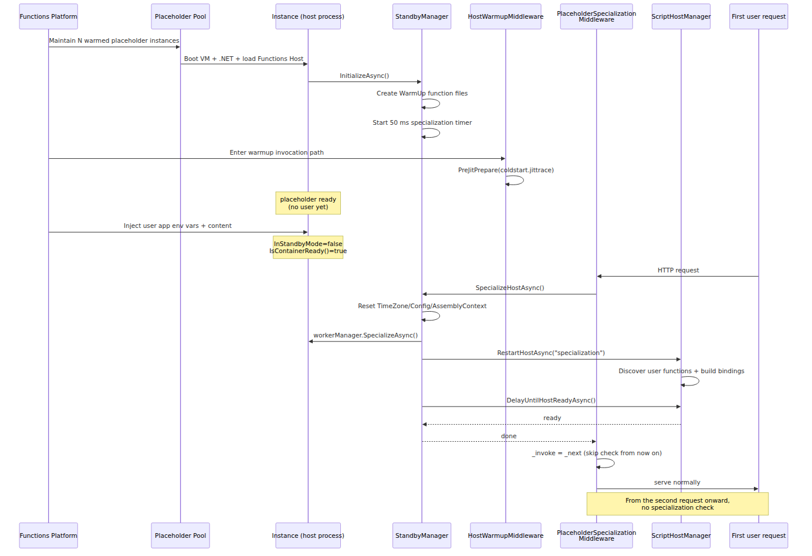

# Cold Start and Placeholder Mode — What Happens When a New Instance Is Born

> Azure Functions Deep Dive series (6/6)

## Source Version

All code citations in this post are based on [`Azure/azure-functions-host @ 5e59423`](https://github.com/Azure/azure-functions-host/tree/5e59423ba45491041d18224c3e72c168a4a5b7f7).

In Part 5, we watched the Scale Controller decide to grow the instance count. This part is about what happens next.

> When a new instance is added, what exactly goes on inside it? And why does one instance serve its first request in under a second while another takes more than five?

The answer to that question is **Placeholder Mode**. This part follows the code path the host takes from a placeholder start through specialization. We'll revisit the user-facing cold start problem from Part 6 of the introductory series, but this time at the host's code level.

> All code citations reference [`Azure/azure-functions-host` @ `5e59423`](https://github.com/Azure/azure-functions-host/tree/5e59423ba45491041d18224c3e72c168a4a5b7f7).

---

## Why Cold Start Is Expensive — Decomposing the Bootstrap Cost

Let's first lay out the steps a single new instance has to traverse before it's ready to run a function from scratch.


Steps 1 through 5 (VM allocation through DI container build) are **independent of user code**. Every customer's function goes through the same steps. Starting from step 6 (downloading code), things become user-specific.

Placeholder Mode's idea exploits exactly this separation.

> Do steps 1–5 **ahead of time, independent of any user**. When a user shows up, layer steps 6–9 on top — that's "specialization."

This is how the same host binary can shave off cold start time. The code makes the mechanism plain.

---

## What a Placeholder Has Already Done — `StandbyManager.InitializeAsync`

The Functions platform keeps a pool of warmed instances around even when no users are present. These instances don't start as real user apps; they start as **placeholder apps**. To see what the host actually gets done during the placeholder phase, you have to read [`StandbyManager.InitializeAsync`](https://github.com/Azure/azure-functions-host/blob/5e59423ba45491041d18224c3e72c168a4a5b7f7/src/WebJobs.Script.WebHost/Standby/StandbyManager.cs#L173-L190) together with the warmup request path in [`HostWarmupMiddleware.WarmupInvoke`](https://github.com/Azure/azure-functions-host/blob/5e59423ba45491041d18224c3e72c168a4a5b7f7/src/WebJobs.Script.WebHost/Middleware/HostWarmupMiddleware.cs#L66-L85).

```csharp
// src/WebJobs.Script.WebHost/Standby/StandbyManager.cs
public async Task InitializeAsync()
{
    using (_metricsLogger.LatencyEvent(MetricEventNames.SpecializationStandbyManagerInitialize))
    {
        if (await _semaphore.WaitAsync(timeout: TimeSpan.FromSeconds(30)))
        {
            try
            {
                // Flag to indicate a function was initialized from placeholder mode
                _environment.SetEnvironmentVariable(
                    EnvironmentSettingNames.InitializedFromPlaceholder, bool.TrueString);

                await CreateStandbyWarmupFunctions();

                // start a background timer to identify when specialization happens
                // specialization usually happens via an http request (e.g. scale controller
                // ping) but this timer is started as well to handle cases where we
                // might not receive a request
                _specializationTimer = new Timer(
                    OnSpecializationTimerTick, null,
                    _specializationTimerInterval, _specializationTimerInterval);
            }
            finally
            {
                _semaphore.Release();
            }
        }
    }
}
```

Spelling that out:

1. Set the `InitializedFromPlaceholder` environment variable — a flag used later, once a real app starts up, to indicate "this instance came out of a placeholder."
2. `CreateStandbyWarmupFunctions()` — provision the `WarmUp` function directory and files used only during the placeholder phase.
3. Start a 50 ms periodic timer — a fallback signal for detecting specialization if no request arrives.

What that fake function actually is becomes clear from `CreateStandbyWarmupFunctions` in the same file.

```csharp
private async Task CreateStandbyWarmupFunctions()
{
    // ...
    string functionPath = Path.Combine(scriptPath, WarmUpConstants.FunctionName);
    Directory.CreateDirectory(functionPath);

    content = FileUtility.ReadResourceString(
        $"{ScriptConstants.ResourcePath}.Functions.{WarmUpConstants.FunctionName}.function.json");
    File.WriteAllText(Path.Combine(functionPath, "function.json"), content);

    content = FileUtility.ReadResourceString(
        $"{ScriptConstants.ResourcePath}.Functions.{WarmUpConstants.FunctionName}.run.csx");
    File.WriteAllText(Path.Combine(functionPath, "run.csx"), content);
    // ...
}
```

Looking at `WarmUpConstants` makes the naming concrete.

```csharp
// src/WebJobs.Script.WebHost/Standby/WarmUpConstants.cs
public static class WarmUpConstants
{
    public const string FunctionName = "WarmUp";
    public const string AlternateRoute = "CSharpHttpWarmup";
    public const string PreJitFolderName = "PreJIT";
    public const string JitTraceFileName = "coldstart.jittrace";
    public const string LinuxJitTraceFileName = "linux.coldstart.jittrace";
}
```

The important detail is that **this constants file defines the JIT trace filenames, but it does not tell you who executes them**. `StandbyManager.InitializeAsync` stops after [`CreateStandbyWarmupFunctions`](https://github.com/Azure/azure-functions-host/blob/5e59423ba45491041d18224c3e72c168a4a5b7f7/src/WebJobs.Script.WebHost/Standby/StandbyManager.cs#L210-L242) creates the `WarmUp` files and the timer starts. The actual JIT preparation happens later on the warmup request path, where [`HostWarmupMiddleware.WarmupInvoke`](https://github.com/Azure/azure-functions-host/blob/5e59423ba45491041d18224c3e72c168a4a5b7f7/src/WebJobs.Script.WebHost/Middleware/HostWarmupMiddleware.cs#L66-L85) calls [`PreJitPrepare`](https://github.com/Azure/azure-functions-host/blob/5e59423ba45491041d18224c3e72c168a4a5b7f7/src/WebJobs.Script.WebHost/Middleware/HostWarmupMiddleware.cs#L136-L153) with `WarmUpConstants.JitTraceFileName`. On Linux Consumption, the same method also runs `WarmUpConstants.LinuxJitTraceFileName`.

So the placeholder story has two steps. First, `StandbyManager` lays down the `WarmUp` function and starts the specialization timer. Then, on the warmup invocation path, `HostWarmupMiddleware` runs `coldstart.jittrace` to PreJIT common runtime paths. From the outside this still looks like a generic "pool of warmed instances," but inside it's **a host process that finished the shared bootstrap work and pushed JIT prep onto the warmup path**.

---

## When the User Request Arrives — `PlaceholderSpecializationMiddleware`

When the Scale Controller decides to assign a placeholder instance to a user app, that instance gets the user app's environment variables and content injected. The host process, however, is still in placeholder state. The transition happens in the very first stage of the middleware pipeline.

```csharp
// src/WebJobs.Script.WebHost/Middleware/PlaceholderSpecializationMiddleware.cs
public class PlaceholderSpecializationMiddleware
{
    private readonly RequestDelegate _next;
    private readonly IScriptWebHostEnvironment _webHostEnvironment;
    private readonly IStandbyManager _standbyManager;
    private readonly IEnvironment _environment;
    private RequestDelegate _invoke;
    private double _specialized = 0;

    public async Task Invoke(HttpContext httpContext)
    {
        await _invoke(httpContext);
    }

    private async Task InvokeSpecializationCheck(HttpContext httpContext)
    {
        if (!_webHostEnvironment.InStandbyMode && _environment.IsContainerReady())
        {
            // We don't want AsyncLocal context (like Activity.Current) to flow
            // here as it will contain request details.
            Task specializeTask;
            using (System.Threading.ExecutionContext.SuppressFlow())
            {
                specializeTask = _standbyManager.SpecializeHostAsync();
            }
            await specializeTask;

            if (Interlocked.CompareExchange(ref _specialized, 1, 0) == 0)
            {
                Interlocked.Exchange(ref _invoke, _next);
            }
        }

        await _next(httpContext);
    }
}
```

[`PlaceholderSpecializationMiddleware.cs`](https://github.com/Azure/azure-functions-host/blob/5e59423ba45491041d18224c3e72c168a4a5b7f7/src/WebJobs.Script.WebHost/Middleware/PlaceholderSpecializationMiddleware.cs)

The intent is simple, but the mechanics are subtle.

1. When the first request arrives, `InvokeSpecializationCheck` runs.
2. If the container is ready and the instance is no longer in standby mode, it triggers specialization.
3. Once specialization completes, it swaps the `_invoke` delegate to point at `_next` directly — **from the second request onward, this check itself is skipped.** Zero hot-path cost.
4. `ExecutionContext.SuppressFlow()` prevents the current request's AsyncLocal context from leaking into host specialization. This detail is interesting — the host is essentially rebuilding itself in the middle of serving a user request, so it has to guard against context contamination.

The point of this middleware is unambiguous. **The user app's first request is what triggers specialization.** It's a different code path from the Scale Controller health pings we saw in Part 5, but they converge on the same outcome.

The 50 ms timer we saw in `StandbyManager.cs` does the same job. If the first signal doesn't come from a user request, the timer starts specialization once the container reports ready.

```csharp
// same file, OnSpecializationTimerTick
private async void OnSpecializationTimerTick(object state)
{
    if (!_webHostEnvironment.InStandbyMode && _environment.IsContainerReady())
    {
        _specializationTimer?.Dispose();
        _specializationTimer = null;

        await SpecializeHostAsync();
    }
}
```

So there are two specialization triggers — **the first HTTP request** or **the 50 ms timer's container-ready detection**. Whichever fires first, the result is the same.

---

## What Specialization Actually Does — `SpecializeHostCoreAsync`

Now for the body of specialization. `StandbyManager.SpecializeHostCoreAsync` is what transforms a placeholder host into a user app.

```csharp
// src/WebJobs.Script.WebHost/Standby/StandbyManager.cs
public async Task SpecializeHostCoreAsync()
{
    Activity activity = Activity.Current;
    activity.SetColdStartTag();

    // Go async immediately to ensure that any async context from
    // the PlaceholderSpecializationMiddleware is properly suppressed.
    await Task.Yield();

    using var initActivity = ActivityExtensions.StartSpecializationActivity();

    ApplyMcpCustomHandlerSettings();

    _logger.LogInformation(Resources.HostSpecializationTrace);

    // After specialization, we need to ensure that custom timezone
    // settings configured by the user (WEBSITE_TIME_ZONE) are honored.
    TimeZoneInfo.ClearCachedData();

    // Trigger a configuration reload to pick up all current settings
    _configuration?.Reload();

    _hostNameProvider.Reset();

    // Reset the shared load context to ensure we're reloading
    // user dependencies
    FunctionAssemblyLoadContext.ResetSharedContext();

    // Signals change of JobHost options from placeholder mode
    // (ex: ScriptPath is updated)
    NotifyChange();

    using (_metricsLogger.LatencyEvent(MetricEventNames.SpecializationLanguageWorkerChannelManagerSpecialize))
    {
        await _workerManager.SpecializeAsync();
    }

    using (_metricsLogger.LatencyEvent(MetricEventNames.SpecializationRestartHost))
    {
        await _scriptHostManager.RestartHostAsync("Host specialization.");
    }

    using (_metricsLogger.LatencyEvent(MetricEventNames.SpecializationDelayUntilHostReady))
    {
        await _scriptHostManager.DelayUntilHostReadyAsync();
    }
}
```

[`StandbyManager.cs#L88-L137`](https://github.com/Azure/azure-functions-host/blob/5e59423ba45491041d18224c3e72c168a4a5b7f7/src/WebJobs.Script.WebHost/Standby/StandbyManager.cs#L88-L137)

The full secret of cold start lives in this method. Let me unpack it step by step.

### 1. Cold start tagging

```csharp
activity.SetColdStartTag();
```

The host marks the metric to indicate it's in the middle of a cold start. This is why we can identify cold starts in Application Insights.

### 2. Resetting the environment

```csharp
TimeZoneInfo.ClearCachedData();
_configuration?.Reload();
_hostNameProvider.Reset();
FunctionAssemblyLoadContext.ResetSharedContext();
```

Any environment data cached during the placeholder phase (timezone, configuration, hostname, load context) gets flushed. The same process now has to switch to a different user's context.

### 3. Worker specialization

```csharp
await _workerManager.SpecializeAsync();
```

For OOP workers (Python, Node, Java), this is where specialization actually branches. But the accurate model is not “always throw away the placeholder worker and start a fresh one.” `StandbyManager` only knows about `_workerManager.SpecializeAsync()`. The real decision lives inside `WebHostRpcWorkerChannelManager.SpecializeAsync()`.

That method fetches the current runtime channel, evaluates `UsePlaceholderChannel(rpcWorkerChannel)`, and, if reuse is allowed, keeps the placeholder channel and calls `rpcWorkerChannel.SendFunctionEnvironmentReloadRequest()` to send a `FunctionEnvironmentReloadRequest` into the worker process. Only if reuse is disallowed, or the environment reload fails, does the host shut down that placeholder channel and fall back to the non-reuse path.

So the host-side specialization path is more accurately summarized as:

> `StandbyManager.SpecializeHostCoreAsync()` → `_workerManager.SpecializeAsync()` → `WebHostRpcWorkerChannelManager.SpecializeAsync()` → `UsePlaceholderChannel(...)` → `SendFunctionEnvironmentReloadRequest()` or placeholder-channel shutdown

### 4. When can the placeholder channel be reused?

`UsePlaceholderChannel(...)` is also more concrete than a vague “reuse it if compatible.”

- Shared gate: if custom `languageWorkers:<runtime>:arguments` are configured, the placeholder channel is not reused.
- `dotnet-isolated`: `UsePlaceholderDotNetIsolated()` must be enabled, the host must be 64-bit, and the site runtime version must match the placeholder worker's runtime version.
- `node` / `python` / `powershell`: the file system must be read-only, and the app must not be on the `~3` + v2-compatibility path.
- Final shared gate: `_profileManager.IsCorrectProfileLoaded(workerRuntime)` must return true.

So the branch is grounded in actual code checks for **runtime kind, bitness, runtime version, read-only filesystem, and profile compatibility**.

### 5. Host restart

```csharp
await _scriptHostManager.RestartHostAsync("Host specialization.");
await _scriptHostManager.DelayUntilHostReadyAsync();
```

The ScriptHost itself is reconfigured — effectively a second pass through the bootstrap process we saw in Part 1, except this time the .NET CLR, DI container, and assembly load context are already warm. **The cost of this restart accounts for most of the visible cold-start time.**

`RestartHostAsync` brings `ScriptHost` back up under the specialized configuration, and `DelayUntilHostReadyAsync` waits until the host can actually accept invocations. The important point is the host reconfiguration itself; this specialization path should not be reduced to a separate file-scanning phase.

---

## After Specialization — What the Middleware Does Next

Going back to `PlaceholderSpecializationMiddleware`, one more look reveals an interesting design.

```csharp
if (Interlocked.CompareExchange(ref _specialized, 1, 0) == 0)
{
    Interlocked.Exchange(ref _invoke, _next);
}
```

**Once specialization is done, `_invoke` is rewritten to point directly to the next middleware.** From the second request onward, the specialization-check branch isn't even there — one function-pointer comparison and it's straight on to the next middleware.

This is the code-level guarantee that **cold start cost is paid exactly once, on the very first request**. Every request after that walks the same hot path as any other. The claim from the introductory Part 6 — "cold start is only expensive on the first request" — is the consequence of this code.

---

## The Whole Picture — The Life of an Instance

Putting everything we've seen so far into a single sequence diagram:


---

## Why Cold Start Differs by Plan

With this mechanism in hand, the per-plan cold-start differences from introductory Parts 5 and 6 become explainable at the code level.

| Plan | Cold start frequency | Mechanism |
|---|---|---|
| Consumption | Frequent (scale 0 → 1, or every new instance) | placeholder → specialization every time |
| Flex Consumption (on-demand) | Frequent (scale 0 → 1) | placeholder → specialization every time |
| Flex Consumption (Always Ready) | Almost none | Always-specialized instances kept around |
| Premium (pre-warmed) | Almost none (small on scale-out) | Pre-warmed instances play a role similar to the placeholder pool |
| Dedicated | Only at instance boot | App Service always-on, no placeholders involved |

It's the same host code, but the user-perceived cold start changes depending on **how the placeholder pool is managed externally and how many always-ready instances are kept**. The host doesn't decide this on its own.

Flex Consumption's **Always Ready instances** are effectively "instances that are kept on with specialization already finished." A request routed to such an instance never goes through the specialization stage in the diagram above.

---

## Levers for Reducing Cold Start at the Code Level

Now that we've walked through the host code, the points where a user can intervene to reduce cold start become clear.

| Lever | Stage affected | Rationale |
|---|---|---|
| Always Ready instances | Skips specialization entirely | Flex Consumption docs + the code flow above |
| Premium pre-warmed | Owns a specialization pool directly | Same |
| Lighter dependencies | User-code load time during `RestartHostAsync` | `FunctionAssemblyLoadContext.ResetSharedContext` |
| Smaller deployment package | Content injection time | Outside this code; platform layer |
| Latest Functions runtime | Improved JIT trace | `WarmUpConstants.JitTraceFileName` |
| Application Initialization (Premium/Dedicated) | Time from host-ready to first request | App Service layer |

In particular, the fact that `FunctionAssemblyLoadContext.ResetSharedContext()` sits in the specialization step confirms at the code level that **the heavier the user's dependencies, the longer specialization takes**. A large .NET package or a fat Python venv directly inflates cold start.

---

## Summary — The Mental Model to Take Away

- Cold start isn't a single cost; it's the sum of **user-independent bootstrap** and **user-specific specialization**.
- The Functions platform pre-completes the user-independent part with a placeholder pool. `StandbyManager.InitializeAsync` prepares the `WarmUp` files and timer, while `HostWarmupMiddleware.WarmupInvoke` runs `coldstart.jittrace` on the warmup path.
- Once a user app gets assigned to the instance, either the first HTTP request (`PlaceholderSpecializationMiddleware`) or a 50 ms timer triggers specialization.
- Specialization is the sequence: environment reset, placeholder-channel reuse decision, `FunctionEnvironmentReloadRequest` when reuse is allowed, then ScriptHost restart. That elapsed time is what the user perceives as cold start.
- After specialization, the middleware rewrites itself out of the path so hot-path cost drops to zero.
- The host code is the same across plans, but each plan applies a different placeholder-pool policy and Always Ready setting — which is why **the cold start a user actually sees is determined by the plan**.

This part closes out the Azure Functions Deep Dive series. Part 1 covered host bootstrap, Part 2 the worker process, Parts 3–4 the gRPC channel and dispatcher, Part 5 scaling, and this Part 6 followed how the same host code, layered with a plan-specific placeholder policy, ends up deciding the cold start a user actually feels.

---

## Call Path Summary

- `StandbyManager.InitializeAsync()` → `CreateStandbyWarmupFunctions()` → specialization timer starts
- first-request `PlaceholderSpecializationMiddleware.Invoke(...)` or `OnSpecializationTimerTick(...)` → `StandbyManager.SpecializeHostAsync()` → `SpecializeHostCoreAsync()`
- `SpecializeHostCoreAsync()` → `_workerManager.SpecializeAsync()` → `WebHostRpcWorkerChannelManager.SpecializeAsync()` → `UsePlaceholderChannel()` → `SendFunctionEnvironmentReloadRequest()` → `RestartHostAsync()`

---

<!-- toc:begin -->
## In this series

- [Host Bootstrap — Following `WebJobsScriptHostService`](./01-host-bootstrap.md)
- [Worker Processes — How One Host Hosts Many Languages](./02-worker-process.md)
- [The gRPC Event Stream — What Do the Host and Worker Actually Exchange?](./03-grpc-event-stream.md)
- [Dispatcher and Invocation — How a Function Call Reaches the Worker](./04-dispatcher-and-invocation.md)
- [Scaling Internals — Scale Controller, ScaleMonitor, and What Differs Across Plans](./05-scaling-internals.md)
- **Cold Start and Placeholder Mode — What Happens When a New Instance Is Born (current)**

<!-- toc:end -->

---

## References

### Primary sources (host code, commit `5e59423`)

- [`src/WebJobs.Script.WebHost/Standby/IStandbyManager.cs`](https://github.com/Azure/azure-functions-host/blob/5e59423ba45491041d18224c3e72c168a4a5b7f7/src/WebJobs.Script.WebHost/Standby/IStandbyManager.cs)
- [`src/WebJobs.Script.WebHost/Standby/StandbyManager.cs`](https://github.com/Azure/azure-functions-host/blob/5e59423ba45491041d18224c3e72c168a4a5b7f7/src/WebJobs.Script.WebHost/Standby/StandbyManager.cs) — placeholder initialization, specialization body
- [`src/WebJobs.Script.WebHost/Standby/WarmUpConstants.cs`](https://github.com/Azure/azure-functions-host/blob/5e59423ba45491041d18224c3e72c168a4a5b7f7/src/WebJobs.Script.WebHost/Standby/WarmUpConstants.cs) — JIT trace file names
- [`src/WebJobs.Script.WebHost/Standby/StandbyChangeTokenSource.cs`](https://github.com/Azure/azure-functions-host/blob/5e59423ba45491041d18224c3e72c168a4a5b7f7/src/WebJobs.Script.WebHost/Standby/StandbyChangeTokenSource.cs)
- [`src/WebJobs.Script.WebHost/Standby/StandbyInitializationService.cs`](https://github.com/Azure/azure-functions-host/blob/5e59423ba45491041d18224c3e72c168a4a5b7f7/src/WebJobs.Script.WebHost/Standby/StandbyInitializationService.cs)
- [`src/WebJobs.Script.WebHost/Middleware/PlaceholderSpecializationMiddleware.cs`](https://github.com/Azure/azure-functions-host/blob/5e59423ba45491041d18224c3e72c168a4a5b7f7/src/WebJobs.Script.WebHost/Middleware/PlaceholderSpecializationMiddleware.cs)
- [`src/WebJobs.Script.WebHost/Middleware/HostWarmupMiddleware.cs`](https://github.com/Azure/azure-functions-host/blob/5e59423ba45491041d18224c3e72c168a4a5b7f7/src/WebJobs.Script.WebHost/Middleware/HostWarmupMiddleware.cs)

### Secondary sources

- [Azure Functions Flex Consumption — Always ready instances](https://learn.microsoft.com/en-us/azure/azure-functions/flex-consumption-plan#always-ready-instances)
- [Azure Functions cold starts](https://learn.microsoft.com/en-us/azure/azure-functions/event-driven-scaling#cold-start)

### Other parts in the series

- [Intro Part 6 — Scaling and Cold Start](../../azure-functions-101/en/06-scaling-and-cold-start.md)
- [Deep Dive Part 1 — Host Bootstrap](./01-host-bootstrap.md)
- [Deep Dive Part 5 — Scaling Internals](./05-scaling-internals.md)

Tags: Azure Functions, Serverless, Distributed Systems, gRPC
