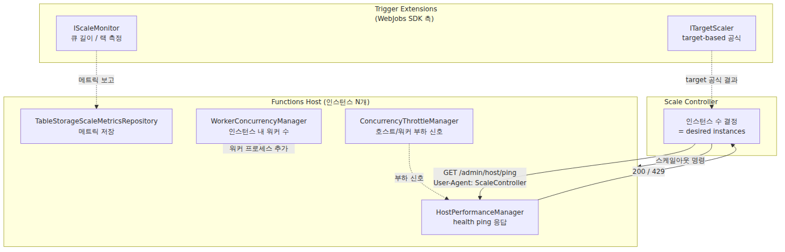
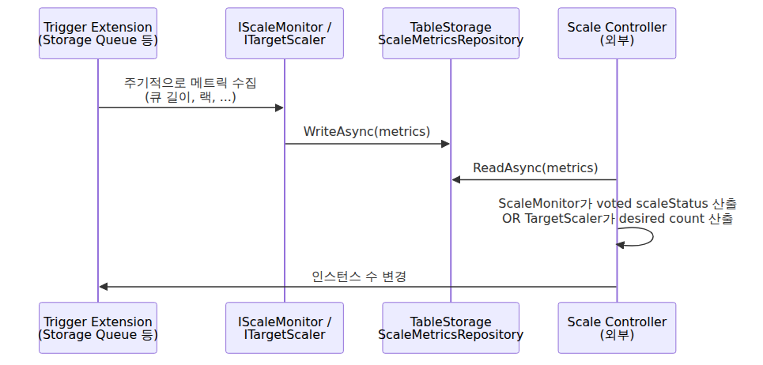
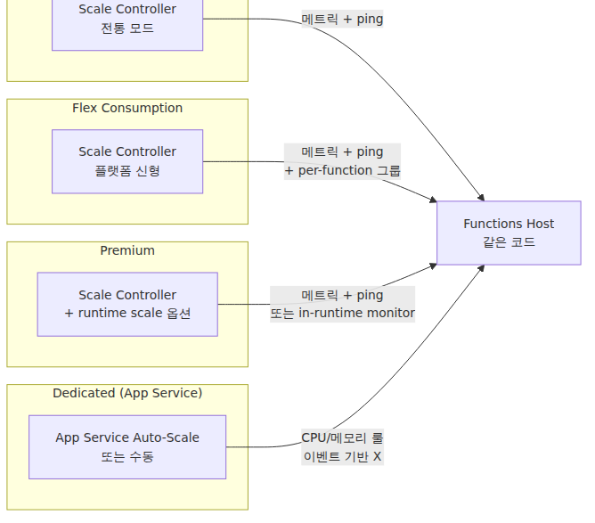

# 스케일링 내부 동작 — Scale Controller, ScaleMonitor, 그리고 플랜별 차이

> Azure Functions Deep Dive 시리즈 (5/7)

지금까지 4화 동안 인스턴스 **하나** 안에서 호스트와 워커가 어떻게 함수를 실행하는지 봤습니다. 이번 화는 한 단계 위로 올라갑니다.

> 인스턴스 자체는 **누가, 무엇을 보고, 언제 늘리고 줄이는가?**

이게 우리가 흔히 말하는 "스케일아웃"입니다. 그리고 이 결정은 **호스트 프로세스 안에서 일어나지 않습니다.** 호스트는 결정의 **재료**를 제공할 뿐이고, 실제 결정은 호스트 바깥의 **Scale Controller**가 합니다 — 단, 플랜에 따라 다른 방식으로요.

이 화의 목표는 세 가지입니다.

1. Scale Controller, ScaleMonitor, ITargetScaler가 각각 무엇이고 어디에 사는지 정리
2. 인스턴스 **수** 결정(스케일아웃)과 인스턴스 **내부** 워커 수 결정(워커 동시성)이 다른 메커니즘이라는 점 분리
3. Consumption / Flex Consumption / Premium / Dedicated 네 플랜에서 같은 코드가 어떻게 다르게 동작하는지 비교

> 모든 코드 인용은 [`Azure/azure-functions-host` @ `5e59423`](https://github.com/Azure/azure-functions-host/tree/5e59423ba45491041d18224c3e72c168a4a5b7f7) 기준입니다.

---

## 큰 그림 — 스케일링은 어디에서 결정되는가

코드를 보기 전에 한 장의 그림으로 정리하겠습니다.


눈여겨볼 점은 두 개의 다른 결정이 서로 다른 곳에서 일어난다는 것입니다.

| 결정 | 결정자 | 신호 | 결과 |
|---|---|---|---|
| **인스턴스 수**(스케일아웃) | Scale Controller (호스트 외부) | ScaleMonitor·TargetScaler 메트릭 + 호스트 health ping | 인스턴스를 N → N±k 로 |
| **인스턴스 내부 워커 수** | `WorkerConcurrencyManager` (호스트 내부) | 워커 상태 응답의 지연 시간 기록 | 같은 인스턴스에서 워커 프로세스 추가 |

이 둘을 섞어서 이해하면 "왜 Premium에서는 워커 수를 직접 못 늘리지?" 같은 질문에 답할 수 없습니다. 하나씩 보겠습니다.

---

## 호스트 안에 있는 코드 — 그리고 없는 코드

먼저 진실 하나를 짚고 가겠습니다. **`IScaleMonitor`와 `ITargetScaler`의 정의는 `azure-functions-host` 레포에 없습니다.** 이 인터페이스들은 [`Azure/azure-webjobs-sdk`](https://github.com/Azure/azure-webjobs-sdk) — WebJobs SDK 레포 — 에 있고, 각 트리거 확장(Storage Queue, Service Bus, Event Hubs 등)이 거기에 의존하면서 자기 트리거에 맞는 메트릭 수집기를 구현합니다.

호스트 레포의 [`src/WebJobs.Script/Scale/`](https://github.com/Azure/azure-functions-host/tree/5e59423ba45491041d18224c3e72c168a4a5b7f7/src/WebJobs.Script/Scale) 디렉토리에는 단 두 파일만 있습니다.

- `ApplicationPerformanceCounters.cs`: 샌드박스 카운터 DTO
- `HostPerformanceManager.cs`: 호스트 부하 판단 + Scale Controller health ping 처리

그리고 [`src/WebJobs.Script.WebHost/Scale/`](https://github.com/Azure/azure-functions-host/tree/5e59423ba45491041d18224c3e72c168a4a5b7f7/src/WebJobs.Script.WebHost/Scale)에는 두 파일이 더 있습니다.

- `TableStorageScaleMetricsRepository.cs`: ScaleMonitor가 보고한 메트릭을 Azure Table Storage에 저장
- `TableEntityConverter.cs`: 그 직렬화 헬퍼

즉 호스트의 역할은 **자기 부하를 보고**하고 **메트릭을 저장**하는 것뿐입니다. 결정은 외부 Scale Controller가 합니다. 이 그림이 잡히면 나머지가 쉬워집니다.

---

## Scale Controller가 호스트와 대화하는 법 — health ping

Scale Controller가 인스턴스 하나를 보고 "이거 더 늘려야 하나?"를 판단할 때 쓰는 가장 직접적인 신호는 **HTTP health ping**입니다. 호스트가 그 ping에 응답하는 코드가 `HostPerformanceManager.TryHandleHealthPingAsync`입니다.

```csharp
// src/WebJobs.Script/Scale/HostPerformanceManager.cs
public async Task<IActionResult> TryHandleHealthPingAsync(HttpRequest request, ILogger logger)
{
    var healthPingEnabled = _environment.GetEnvironmentVariableOrDefault(
        EnvironmentSettingNames.HealthPingEnabled, "1");
    if (healthPingEnabled.Equals("0"))
    {
        return null;
    }

    bool checkHealth = false;
    var userAgent = request.GetHeaderValueOrDefault("User-Agent");
    if (!string.IsNullOrEmpty(userAgent) &&
        (userAgent.IndexOf(ScriptConstants.HttpScaleUserAgent, StringComparison.OrdinalIgnoreCase) != -1 ||
         userAgent.IndexOf(ScriptConstants.ScaleControllerUserAgent, StringComparison.OrdinalIgnoreCase) != -1))
    {
        // for these user agents, we default to true
        checkHealth = true;
    }
    // ...
    if (checkHealth)
    {
        int statusCode = (int)HttpStatusCode.OK;
        if (await IsUnderHighLoadAsync(logger: logger))
        {
            statusCode = 429;
        }
        return new StatusCodeResult(statusCode);
    }
    return null;
}
```

[`HostPerformanceManager.cs#L67-103`](https://github.com/Azure/azure-functions-host/blob/5e59423ba45491041d18224c3e72c168a4a5b7f7/src/WebJobs.Script/Scale/HostPerformanceManager.cs#L67-L103)

코드의 의미를 풀어 쓰면 이렇습니다.

1. Scale Controller(또는 HTTP scale 컴포넌트)가 호스트의 admin 엔드포인트로 ping을 보냅니다. **User-Agent로 자기 정체를 알립니다.**
2. 호스트는 그 User-Agent를 보고 "이건 health 체크다"라고 판단합니다.
3. 현재 부하를 측정해서 임계치 미만이면 **200 OK**, 초과면 **429 Too Many Requests**를 돌려줍니다.
4. Scale Controller는 응답을 보고 이 인스턴스가 일을 더 받을 수 있는지 판단해 스케일 결정을 내립니다.

`IsUnderHighLoadAsync`가 보는 부하는 두 종류입니다.

```csharp
public virtual async Task<bool> IsUnderHighLoadAsync(ILogger logger = null)
{
    return PerformanceCountersExceeded(logger: logger) || await ProcessThresholdsExceeded(logger: logger);
}
```

- `PerformanceCountersExceeded`: 샌드박스 카운터(`ActiveConnections`, `Threads`, `NamedPipes`, …) 임계치 초과 여부
- `ProcessThresholdsExceeded`: 호스트/워커 CPU·ThreadPool·gRPC 채널 헬스를 종합한 throttle 상태

후자에서 호스트가 **자기 안에 있는 OOP 워커들에게 직접 ping을 돌리는** 코드가 보입니다.

```csharp
// 같은 파일, ProcessThresholdsExceeded 안
var workerManager = _serviceProvider.GetScriptHostServiceOrNull<IScriptHostWorkerManager>();
if (workerManager != null)
{
    // TEMP: This call pings all the OOP workers, to ensure we include any channel latency
    // in the upstream ping result.
    await workerManager.GetWorkerStatusesAsync();
}

var throttleManager = _serviceProvider.GetScriptHostServiceOrNull<IConcurrencyThrottleManager>();
if (throttleManager != null)
{
    var status = throttleManager.GetStatus();
    return status.State == ThrottleState.Enabled;
}
```

즉 **외부 Scale Controller의 단일 HTTP 호출 하나에 호스트는 자기와 모든 워커의 상태를 종합해서 답합니다.** 이게 인스턴스가 자기 한계에 다다랐다는 신호를 외부로 내보내는 메커니즘입니다.

---

## ScaleMonitor와 TargetScaler — 트리거가 직접 측정하는 신호

health ping이 호스트의 "지금 더 받을 수 있냐"라면, **ScaleMonitor / TargetScaler**는 트리거가 직접 측정하는 "지금 일이 얼마나 쌓였냐" 쪽입니다.

이 두 개념은 코드는 SDK에 있지만 호스트 입장에서 어떻게 흘러가는지는 명확합니다.


두 가지 모드가 있고, 각각 다른 시기에 도입됐습니다.

### Incremental scaling (`IScaleMonitor`)

원래 모델입니다. 각 ScaleMonitor가 자기 메트릭을 보고 `ScaleVote`(ScaleOut / ScaleIn / None)를 던집니다. 한 번에 **최대 1 인스턴스**만 추가/제거됩니다. 모든 트리거 타입이 지원합니다.

### Target-based scaling (`ITargetScaler`)

2022년부터 도입돼 지금은 일부 트리거의 **기본값**입니다. 단순한 공식을 씁니다.

> desired instances = event source length / target executions per instance

Microsoft의 공식 문서가 직접 인용하기에 이렇게 표현합니다.

> "target-based scaling allows scale up of **four instances at a time**, and the scaling decision is based on a simple target-based equation"
> — [Target-based scaling in Azure Functions](https://learn.microsoft.com/en-us/azure/azure-functions/functions-target-based-scaling)

지원 트리거는 정해져 있습니다.

| 트리거 | target executions per instance 설정 | 기본값 |
|---|---|---|
| Storage Queue | `extensions.queues.batchSize` | 16 |
| Service Bus (single dispatch, v5+) | `extensions.serviceBus.maxConcurrentCalls` | 16 |
| Service Bus (batch, v5+) | `extensions.serviceBus.maxMessageBatchSize` | 1000 |
| Event Hubs (v5+) | `extensions.eventHubs.maxEventBatchSize` | 100 |
| Cosmos DB | `MaxItemsPerInvocation` (function attribute) | 100 |
| Apache Kafka | `LagThreshold` (function attribute) | 1000 |

target-based scaling은 **Functions runtime 4.19.0 이상**에서 기본 활성화되며, `TARGET_BASED_SCALING_ENABLED=0`으로 비활성화하고 incremental로 돌아갈 수 있습니다.

> 출처: [Target-based scaling in Azure Functions](https://learn.microsoft.com/en-us/azure/azure-functions/functions-target-based-scaling)

### 호스트는 무엇을 하는가

호스트는 이 두 모델 중 어느 쪽이든 **메트릭의 보관소** 역할만 합니다. `TableStorageScaleMetricsRepository`가 그 역할을 합니다 ([`src/WebJobs.Script.WebHost/Scale/TableStorageScaleMetricsRepository.cs`](https://github.com/Azure/azure-functions-host/blob/5e59423ba45491041d18224c3e72c168a4a5b7f7/src/WebJobs.Script.WebHost/Scale/TableStorageScaleMetricsRepository.cs)). ScaleMonitor가 측정한 값을 저장하고, Scale Controller는 그 값을 읽어서 결정합니다.

즉 호스트는 결정에 **참여하지 않습니다.** 메트릭만 흘려보낼 뿐입니다.

---

## 인스턴스 내부 동시성 — `WorkerConcurrencyManager`

위까지가 "인스턴스 수"를 결정하는 흐름이었습니다. 이번엔 다른 결정 — **같은 인스턴스 안에서 워커 프로세스를 몇 개 돌릴지** — 를 봅니다.

OOP 워커(Python·Node·Java)에서 한 워커는 보통 단일 프로세스라 **같은 인스턴스 안에서 워커 프로세스를 여러 개 띄울 수 있습니다.** 이걸 결정하는 게 [`WorkerConcurrencyManager`](https://github.com/Azure/azure-functions-host/blob/5e59423ba45491041d18224c3e72c168a4a5b7f7/src/WebJobs.Script.Grpc/WorkerConcurrencyManager.cs)입니다.

이 로직은 생각보다 좁게 적용됩니다. `StartAsync`를 보면 동적 워커 동시성은 **Node / PowerShell / Python 런타임에서만** 켜집니다. `HttpFunctionInvocationDispatcher`를 쓰는 HTTP worker 경로에서는 건너뛰고, `FUNCTIONS_WORKER_PROCESS_COUNT`가 설정돼 있으면 아예 시작하지 않습니다. 이 환경 변수는 인스턴스당 워커 수를 **고정값으로 정하는 정적 설정**이기 때문입니다.

반대로 `WorkerConcurrencyOptions`는 **동적 추가 로직의 임계치**입니다. 둘은 같은 것이 아닙니다. `FUNCTIONS_WORKER_PROCESS_COUNT`는 "처음부터 몇 개를 띄울까"이고, `WorkerConcurrencyOptions`는 "지금 지연 시간이 계속 높으니 하나 더 띄울까"를 결정하는 기준입니다.

`IsOverloaded`는 큐 길이를 보지 않습니다. 워커 상태의 `LatencyHistory`가 `HistorySize` 이상 쌓였을 때, 그중 `LatencyThreshold` 이상인 샘플 비율을 구하고 그 비율이 `NewWorkerThreshold` 이상이면 overload로 판단합니다. 그리고 `NewWorkerIsRequired`는 overload인 워커가 하나 이상 있고 현재 워커 수가 `MaxWorkerCount`보다 작을 때만 새 워커를 추가합니다.

여기에는 대칭적인 scale-in 경로가 없습니다. 이 코드는 바쁜 워커를 보고 **새 워커를 추가하는 쪽만** 담당합니다. 그래서 이건 **외부 Scale Controller와 무관한 인스턴스 내부 병렬도 확장**으로 이해하는 편이 정확합니다.

이 둘을 한 표로 정리하면:

| 항목 | 인스턴스 스케일아웃 | 워커 동시성 |
|---|---|---|
| 결정자 | Scale Controller (외부) | `WorkerConcurrencyManager` (호스트 내부) |
| 단위 | VM 인스턴스 | 인스턴스 내 워커 프로세스 |
| 신호 | ScaleMonitor 메트릭 + health ping | 워커 상태의 `LatencyHistory` 비율 |
| 영향 | 청구액·시작 시간 | 인스턴스 내 처리량 |
| 적용 범위 | 플랜마다 다름 | Node·PowerShell·Python에서만, HTTP worker 제외, 정적 process count 설정 시 비활성화 |

---

## 플랜별 차이 — 같은 코드, 다른 동작

호스트 코드는 어디서 돌든 똑같습니다. 위에 본 `HostPerformanceManager.cs`도, `TableStorageScaleMetricsRepository.cs`도, `WorkerConcurrencyManager.cs`도 모두 한 코드베이스입니다. 다른 건 **누가 이 코드 바깥에서 결정을 내리느냐**입니다.


플랜별로 한 줄씩 정리하면:

### Consumption

- 전통적인 Scale Controller가 결정.
- 0으로 스케일 다운, 최대 200 인스턴스.
- target-based scaling 지원(4.19.0+).
- VNet 통합 없음.

### Flex Consumption — 가장 새로운 모델

Flex Consumption은 Consumption의 후속이면서 사실상 다른 플랫폼입니다. 호스트 코드는 같지만 위에 얹힌 결정 모델이 다릅니다.

- **Per-function scaling**: 함수 단위 또는 함수 그룹 단위로 인스턴스를 다르게 스케일합니다. 그룹은 정해져 있습니다.

| 스케일 그룹 | 포함 트리거 |
|---|---|
| `http` | HTTP trigger, SignalR trigger |
| `blob` | Blob storage trigger (Event Grid 기반) |
| `durable` | Orchestration / Activity / Entity trigger |
| `function:<NAMED_FUNCTION>` | 그 외 모든 함수 (개별) |

> 출처: [Flex Consumption per-function scaling](https://learn.microsoft.com/en-us/azure/azure-functions/flex-consumption-plan#per-function-scaling)

- **Always ready 인스턴스**: 0이 아닌 최소치를 둘 수 있습니다. 그룹별/함수별로 따로 설정 가능. 콜드 스타트를 줄이는 핵심 레버입니다.
- **최대 1000 인스턴스 / 250 cores per region 기본 쿼터**.
- **인스턴스 메모리 선택 가능**: 512 / 2048 / 4096 MB. 큰 인스턴스일수록 같은 함수 그룹 안에서 더 높은 동시성을 흡수합니다.
- VNet 통합·Azure Files 마운트 지원.

> 출처: [Azure Functions Flex Consumption plan hosting](https://learn.microsoft.com/en-us/azure/azure-functions/flex-consumption-plan)

### Premium (Elastic Premium)

- Pre-warmed 인스턴스가 있어 Always Ready의 옛 형태처럼 동작.
- VNet 트리거를 위해 **runtime scale monitoring**을 켤 수 있고, 켜면 ScaleMonitor 로직이 호스트 안에서 실행돼 외부 Scale Controller의 VNet 차단 문제를 우회합니다.
- target-based scaling 지원 (4.19.0+, runtime scale monitoring 시 확장 패키지 최소 버전 요구).

### Dedicated (App Service Plan)

- Functions의 이벤트 기반 스케일러가 **동작하지 않습니다.** App Service의 일반 Auto-Scale 룰(CPU·메모리 기반) 또는 수동 스케일을 씁니다.
- 호스트 코드는 같지만 외부에서 자기 인스턴스 수를 정해주지 않으니 ScaleMonitor가 보고하는 메트릭은 의미가 없어집니다.

> 출처: [Target-based scaling considerations](https://learn.microsoft.com/en-us/azure/azure-functions/functions-target-based-scaling#considerations) — "Event-driven scaling isn't supported when running on Dedicated (App Service) plans."

---

## 한 표로 정리

| 플랜 | 스케일 결정자 | 0으로 스케일 | 최대 인스턴스 | per-function | Always ready | VNet |
|---|---|---|---|---|---|---|
| Consumption | Scale Controller | 있음 | 200 | 없음 | 없음 | 없음 |
| Flex Consumption | Scale Controller (신형) | 있음 | 1000 | 있음 | 있음 | 있음 |
| Premium | Scale Controller(+옵션) | 없음 (최소 1) | SKU/리전별 상이 | 없음 | pre-warmed | 있음 |
| Dedicated | App Service Auto-Scale | 없음 | 플랜 따라 다름 | 없음 | Always On으로 운영 가능 | 있음 |

같은 호스트 바이너리 위에 얹힌 결정 레이어가 다를 뿐, 호스트가 일하는 방식은 같습니다.

---

## 정리 — 이 화에서 잡고 갈 모델

- 스케일 결정은 **호스트 바깥**에서 일어난다. 호스트는 메트릭을 보고하고 health ping에 응답할 뿐입니다.
- `IScaleMonitor`(점진)와 `ITargetScaler`(공식 기반)는 SDK·확장 측 인터페이스이고, 호스트는 그 메트릭을 Table Storage에 저장하는 역할만 합니다.
- 인스턴스 **수** 결정과 인스턴스 **내부 워커 수** 결정은 다른 메커니즘입니다. 후자는 `WorkerConcurrencyManager`가 호스트 안에서 담당하지만, 새 워커를 **추가**하는 쪽만 다룹니다.
- `FUNCTIONS_WORKER_PROCESS_COUNT`는 정적 워커 수 설정이고, `WorkerConcurrencyOptions`는 동적 추가 임계치입니다. 둘을 같은 설정으로 보면 흐름이 헷갈립니다.
- 같은 호스트 코드가 Consumption / Flex / Premium / Dedicated에서 다르게 보이는 이유는 외부 결정자의 모델이 다르기 때문입니다. 호스트 자체는 그대로입니다.
- Flex Consumption은 per-function scaling과 Always ready를 도입해 "어느 함수에 얼마나 인스턴스를 둘지"를 그룹 단위로 결정합니다.

다음 6화에서는 이 모든 결정의 결과로 **새 인스턴스가 만들어질 때** 일어나는 일 — Placeholder Mode와 specialization — 을 봅니다. Always ready와 콜드 스타트의 코드 레벨 메커니즘이 거기 있습니다.

---

<!-- toc:begin -->
## 시리즈 목차

- [호스트 부팅 — `WebJobsScriptHostService`부터 따라가기](./01-host-bootstrap.md)
- [Worker 프로세스 — 한 호스트에서 여러 언어 런타임이 같이 사는 법](./02-worker-process.md)
- [gRPC 이벤트 스트림 — 호스트와 워커는 무엇을 주고받는가](./03-grpc-event-stream.md)
- [Dispatcher와 Invocation — 함수 호출이 워커에 도달하기까지](./04-dispatcher-and-invocation.md)
- **스케일링 내부 동작 — Scale Controller, ScaleMonitor, 그리고 플랜별 차이 (현재 글)**
- 콜드 스타트와 Placeholder Mode — 새 인스턴스가 만들어질 때 (예정)

<!-- toc:end -->

---

## 참고 자료

### 1차 출처 (호스트 코드, commit `5e59423`)

- [`src/WebJobs.Script/Scale/HostPerformanceManager.cs`](https://github.com/Azure/azure-functions-host/blob/5e59423ba45491041d18224c3e72c168a4a5b7f7/src/WebJobs.Script/Scale/HostPerformanceManager.cs) — Scale Controller health ping 처리, throttle 종합
- [`src/WebJobs.Script/Scale/ApplicationPerformanceCounters.cs`](https://github.com/Azure/azure-functions-host/blob/5e59423ba45491041d18224c3e72c168a4a5b7f7/src/WebJobs.Script/Scale/ApplicationPerformanceCounters.cs) — 샌드박스 카운터 DTO
- [`src/WebJobs.Script.WebHost/Scale/TableStorageScaleMetricsRepository.cs`](https://github.com/Azure/azure-functions-host/blob/5e59423ba45491041d18224c3e72c168a4a5b7f7/src/WebJobs.Script.WebHost/Scale/TableStorageScaleMetricsRepository.cs) — ScaleMonitor 메트릭 영속화
- [`src/WebJobs.Script.Grpc/WorkerConcurrencyManager.cs`](https://github.com/Azure/azure-functions-host/blob/5e59423ba45491041d18224c3e72c168a4a5b7f7/src/WebJobs.Script.Grpc/WorkerConcurrencyManager.cs) — 인스턴스 내부 워커 동시성

### 2차 출처 (Microsoft Learn 공식 문서)

- [Azure Functions Flex Consumption plan hosting](https://learn.microsoft.com/en-us/azure/azure-functions/flex-consumption-plan)
- [Target-based scaling in Azure Functions](https://learn.microsoft.com/en-us/azure/azure-functions/functions-target-based-scaling)
- [Event-driven scaling in Azure Functions](https://learn.microsoft.com/en-us/azure/azure-functions/event-driven-scaling)
- [Azure Functions hosting options](https://learn.microsoft.com/en-us/azure/azure-functions/functions-scale)

### 관련 시리즈

이 글은 Deep Dive 시리즈 5화입니다. 앞선 4화에서 한 번의 호출이 워커까지 도달하는 경로를 따라왔고, 이번 화에서는 그런 호출이 많아졌을 때 바깥의 Scale Controller와 안쪽의 WorkerConcurrencyManager가 각각 무엇을 하는지 갈라서 봤습니다. 다음 6화는 새 인스턴스가 실제로 만들어질 때의 Placeholder Mode와 specialization으로 이어지고, 입문 시리즈 5·6화는 같은 주제를 운영자 관점에서 더 가볍게 정리해 둔 버전입니다.

Tags: Azure Functions, Serverless, Distributed Systems, gRPC
