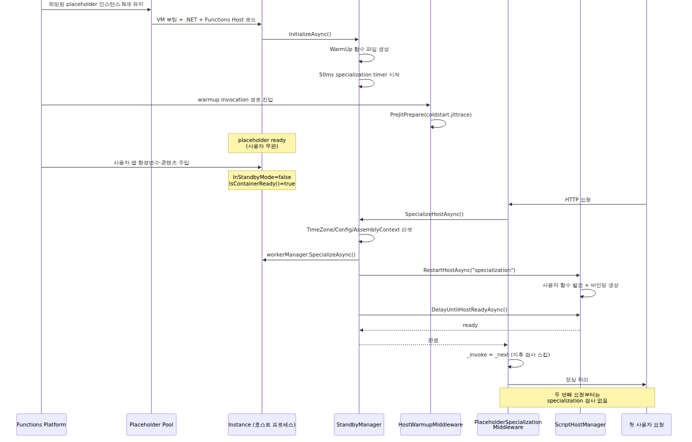

# 콜드 스타트와 Placeholder Mode — 새 인스턴스가 만들어질 때

> Azure Functions Deep Dive 시리즈 (6/6)

## Source Version

이 글의 모든 코드 인용은 [`Azure/azure-functions-host @ 5e59423`](https://github.com/Azure/azure-functions-host/tree/5e59423ba45491041d18224c3e72c168a4a5b7f7) 기준입니다.

5화에서 Scale Controller가 인스턴스 수를 늘리기로 결정하는 과정을 봤습니다. 이번 화는 그 다음에 일어나는 일입니다.

> 새 인스턴스가 추가될 때, 그 안에서는 정확히 무슨 일이 일어나는가? 그리고 왜 어떤 인스턴스는 1초 안에 첫 요청을 처리하고, 어떤 인스턴스는 5초 넘게 걸리는가?

이 차이의 정체가 **Placeholder Mode**입니다. 이 화는 호스트가 placeholder로 시작해서 specialization으로 넘어가는 코드 경로를 따라갑니다. 그리고 입문 6화에서 다룬 콜드 스타트라는 사용자 관점의 문제를 호스트의 코드 레벨에서 다시 봅니다.

> 모든 코드 인용은 [`Azure/azure-functions-host` @ `5e59423`](https://github.com/Azure/azure-functions-host/tree/5e59423ba45491041d18224c3e72c168a4a5b7f7) 기준입니다.

---

## 콜드 스타트가 왜 비싼가 — 부트스트랩 비용의 분해

먼저 새 인스턴스 하나가 처음부터 함수를 실행할 준비가 될 때까지 어떤 단계들을 거치는지 정리하겠습니다.


1번부터 5번까지(VM 할당 ~ DI 컨테이너 빌드)는 **사용자 코드와 무관**합니다. 누구의 함수든 똑같이 거치는 단계입니다. 6번부터(코드 다운로드)부터 사용자별로 달라집니다.

Placeholder Mode의 아이디어는 정확히 이 분리를 이용합니다.

> 1~5번까지를 **미리, 사용자와 무관하게** 만들어 둔다. 사용자가 도착하면 그 위에 6~9번만 입혀서 "특수화(specialization)"한다.

이게 같은 호스트 바이너리로 콜드 스타트를 줄이는 방법입니다. 코드를 보면 그 동작이 분명해집니다.

---

## Placeholder가 이미 해둔 것 — `StandbyManager.InitializeAsync`

Functions 플랫폼은 사용자가 없는 상태에서도 워밍된 인스턴스 풀을 미리 만들어 둡니다. 이 인스턴스들은 진짜 사용자 앱이 아니라 **placeholder 앱**으로 시작합니다. placeholder 상태에서 호스트가 무엇을 미리 해두는지는 [`StandbyManager.InitializeAsync`](https://github.com/Azure/azure-functions-host/blob/5e59423ba45491041d18224c3e72c168a4a5b7f7/src/WebJobs.Script.WebHost/Standby/StandbyManager.cs#L173-L190)와 그 뒤 warmup 요청을 처리하는 [`HostWarmupMiddleware.WarmupInvoke`](https://github.com/Azure/azure-functions-host/blob/5e59423ba45491041d18224c3e72c168a4a5b7f7/src/WebJobs.Script.WebHost/Middleware/HostWarmupMiddleware.cs#L66-L85)를 같이 봐야 보입니다.

```csharp
// src/WebJobs.Script.WebHost/Standby/StandbyManager.cs
public async Task InitializeAsync()
{
    using (_metricsLogger.LatencyEvent(MetricEventNames.SpecializationStandbyManagerInitialize))
    {
        if (await _semaphore.WaitAsync(timeout: TimeSpan.FromSeconds(30)))
        {
            try
            {
                // Flag to indicate a function was initialized from placeholder mode
                _environment.SetEnvironmentVariable(
                    EnvironmentSettingNames.InitializedFromPlaceholder, bool.TrueString);

                await CreateStandbyWarmupFunctions();

                // start a background timer to identify when specialization happens
                // specialization usually happens via an http request (e.g. scale controller
                // ping) but this timer is started as well to handle cases where we
                // might not receive a request
                _specializationTimer = new Timer(
                    OnSpecializationTimerTick, null,
                    _specializationTimerInterval, _specializationTimerInterval);
            }
            finally
            {
                _semaphore.Release();
            }
        }
    }
}
```

코드를 풀어 쓰면:

1. `InitializedFromPlaceholder` 환경변수를 세팅 — 이 플래그는 나중에 진짜 앱이 시작됐을 때 "이 인스턴스는 placeholder에서 출발했다"는 표시로 쓰입니다.
2. `CreateStandbyWarmupFunctions()` — placeholder 시점에서 쓸 `WarmUp` 함수 디렉토리와 파일을 만듭니다.
3. 50ms 주기 타이머를 시작 — 요청이 안 와도 specialization을 감지하기 위한 폴백 신호입니다.

가짜 함수가 무엇인지는 같은 파일의 `CreateStandbyWarmupFunctions`를 보면 분명해집니다.

```csharp
private async Task CreateStandbyWarmupFunctions()
{
    // ...
    string functionPath = Path.Combine(scriptPath, WarmUpConstants.FunctionName);
    Directory.CreateDirectory(functionPath);

    content = FileUtility.ReadResourceString(
        $"{ScriptConstants.ResourcePath}.Functions.{WarmUpConstants.FunctionName}.function.json");
    File.WriteAllText(Path.Combine(functionPath, "function.json"), content);

    content = FileUtility.ReadResourceString(
        $"{ScriptConstants.ResourcePath}.Functions.{WarmUpConstants.FunctionName}.run.csx");
    File.WriteAllText(Path.Combine(functionPath, "run.csx"), content);
    // ...
}
```

`WarmUpConstants`의 정의를 보면 이름이 정해져 있습니다.

```csharp
// src/WebJobs.Script.WebHost/Standby/WarmUpConstants.cs
public static class WarmUpConstants
{
    public const string FunctionName = "WarmUp";
    public const string AlternateRoute = "CSharpHttpWarmup";
    public const string PreJitFolderName = "PreJIT";
    public const string JitTraceFileName = "coldstart.jittrace";
    public const string LinuxJitTraceFileName = "linux.coldstart.jittrace";
}
```

여기서 중요한 건 **이 상수 파일이 JIT 트레이스 파일 이름을 정의할 뿐, 실행 주체는 아니라는 점**입니다. `StandbyManager.InitializeAsync`는 [`CreateStandbyWarmupFunctions`](https://github.com/Azure/azure-functions-host/blob/5e59423ba45491041d18224c3e72c168a4a5b7f7/src/WebJobs.Script.WebHost/Standby/StandbyManager.cs#L210-L242)로 `WarmUp` 함수 파일을 만들고 타이머를 시작한 뒤 끝납니다. JIT 준비는 warmup 요청 경로에서 [`HostWarmupMiddleware.WarmupInvoke`](https://github.com/Azure/azure-functions-host/blob/5e59423ba45491041d18224c3e72c168a4a5b7f7/src/WebJobs.Script.WebHost/Middleware/HostWarmupMiddleware.cs#L66-L85)가 맡고, 그 안에서 [`PreJitPrepare`](https://github.com/Azure/azure-functions-host/blob/5e59423ba45491041d18224c3e72c168a4a5b7f7/src/WebJobs.Script.WebHost/Middleware/HostWarmupMiddleware.cs#L136-L153)를 호출해 `WarmUpConstants.JitTraceFileName`을 읽습니다. Linux Consumption이면 같은 경로에서 `WarmUpConstants.LinuxJitTraceFileName`도 추가로 처리합니다.

즉 placeholder의 실체는 두 단계입니다. 먼저 `StandbyManager`가 `WarmUp` 함수와 타이머를 준비하고, 그다음 warmup invocation 경로에서 `HostWarmupMiddleware`가 `coldstart.jittrace`를 돌려 공통 메서드 경로를 PreJIT합니다. 외부에서 보면 그냥 "워밍된 인스턴스 풀"이지만, 내부에서는 **공통 부트스트랩을 끝낸 뒤 warmup 경로에서 JIT까지 앞당겨 놓은 호스트 프로세스**입니다.

---

## 사용자 요청이 도착했을 때 — `PlaceholderSpecializationMiddleware`

Scale Controller가 placeholder 인스턴스 하나를 사용자 앱에 할당하기로 결정하면, 그 인스턴스에 사용자 앱의 환경변수·콘텐츠가 주입됩니다. 그러나 호스트 프로세스는 아직 placeholder 상태입니다. 그 전환을 일으키는 코드가 미들웨어 파이프라인의 첫 단계에 있습니다.

```csharp
// src/WebJobs.Script.WebHost/Middleware/PlaceholderSpecializationMiddleware.cs
public class PlaceholderSpecializationMiddleware
{
    private readonly RequestDelegate _next;
    private readonly IScriptWebHostEnvironment _webHostEnvironment;
    private readonly IStandbyManager _standbyManager;
    private readonly IEnvironment _environment;
    private RequestDelegate _invoke;
    private double _specialized = 0;

    public async Task Invoke(HttpContext httpContext)
    {
        await _invoke(httpContext);
    }

    private async Task InvokeSpecializationCheck(HttpContext httpContext)
    {
        if (!_webHostEnvironment.InStandbyMode && _environment.IsContainerReady())
        {
            // We don't want AsyncLocal context (like Activity.Current) to flow
            // here as it will contain request details.
            Task specializeTask;
            using (System.Threading.ExecutionContext.SuppressFlow())
            {
                specializeTask = _standbyManager.SpecializeHostAsync();
            }
            await specializeTask;

            if (Interlocked.CompareExchange(ref _specialized, 1, 0) == 0)
            {
                Interlocked.Exchange(ref _invoke, _next);
            }
        }

        await _next(httpContext);
    }
}
```

[`PlaceholderSpecializationMiddleware.cs`](https://github.com/Azure/azure-functions-host/blob/5e59423ba45491041d18224c3e72c168a4a5b7f7/src/WebJobs.Script.WebHost/Middleware/PlaceholderSpecializationMiddleware.cs)

코드의 의미가 단순하지만 미묘합니다.

1. 첫 요청이 들어오면 `InvokeSpecializationCheck`가 실행됩니다.
2. 컨테이너가 준비되었고 더 이상 standby 모드가 아니라면 specialization을 트리거합니다.
3. specialization이 한 번 완료되고 나면 `_invoke` 델리게이트를 `_next`로 교체합니다 — **두 번째 요청부터는 이 검사 자체를 건너뜁니다.** Hot path 비용 0.
4. `ExecutionContext.SuppressFlow()`로 현재 요청의 AsyncLocal 컨텍스트가 호스트 specialization으로 흘러들어가지 않게 막습니다. 이 디테일이 흥미롭습니다 — 사용자 요청을 처리하는 도중에 호스트 자신을 다시 만들고 있는 셈이라 컨텍스트 오염을 막아야 합니다.

이 미들웨어의 존재 의미는 분명합니다. **사용자 앱의 첫 요청이 specialization의 트리거**입니다. 5화에서 본 Scale Controller의 health ping과는 다른 경로지만 같은 결과로 수렴합니다.

`StandbyManager.cs`에서 봤던 50ms 타이머도 같은 일을 합니다. 사용자 요청이 첫 신호로 안 와도 컨테이너가 ready 상태가 되면 타이머가 specialization을 시작합니다.

```csharp
// 같은 파일, OnSpecializationTimerTick
private async void OnSpecializationTimerTick(object state)
{
    if (!_webHostEnvironment.InStandbyMode && _environment.IsContainerReady())
    {
        _specializationTimer?.Dispose();
        _specializationTimer = null;

        await SpecializeHostAsync();
    }
}
```

specialization 트리거는 두 개입니다. **첫 HTTP 요청** 또는 **50ms 타이머의 컨테이너 ready 감지**입니다. 어느 쪽이 먼저 오든 결과는 같습니다.

---

## Specialization이 실제로 하는 일 — `SpecializeHostCoreAsync`

이제 specialization의 본체입니다. `StandbyManager.SpecializeHostCoreAsync`가 placeholder 상태의 호스트를 사용자 앱으로 변신시킵니다.

```csharp
// src/WebJobs.Script.WebHost/Standby/StandbyManager.cs
public async Task SpecializeHostCoreAsync()
{
    Activity activity = Activity.Current;
    activity.SetColdStartTag();

    // Go async immediately to ensure that any async context from
    // the PlaceholderSpecializationMiddleware is properly suppressed.
    await Task.Yield();

    using var initActivity = ActivityExtensions.StartSpecializationActivity();

    ApplyMcpCustomHandlerSettings();

    _logger.LogInformation(Resources.HostSpecializationTrace);

    // After specialization, we need to ensure that custom timezone
    // settings configured by the user (WEBSITE_TIME_ZONE) are honored.
    TimeZoneInfo.ClearCachedData();

    // Trigger a configuration reload to pick up all current settings
    _configuration?.Reload();

    _hostNameProvider.Reset();

    // Reset the shared load context to ensure we're reloading
    // user dependencies
    FunctionAssemblyLoadContext.ResetSharedContext();

    // Signals change of JobHost options from placeholder mode
    // (ex: ScriptPath is updated)
    NotifyChange();

    using (_metricsLogger.LatencyEvent(MetricEventNames.SpecializationLanguageWorkerChannelManagerSpecialize))
    {
        await _workerManager.SpecializeAsync();
    }

    using (_metricsLogger.LatencyEvent(MetricEventNames.SpecializationRestartHost))
    {
        await _scriptHostManager.RestartHostAsync("Host specialization.");
    }

    using (_metricsLogger.LatencyEvent(MetricEventNames.SpecializationDelayUntilHostReady))
    {
        await _scriptHostManager.DelayUntilHostReadyAsync();
    }
}
```

[`StandbyManager.cs#L88-L137`](https://github.com/Azure/azure-functions-host/blob/5e59423ba45491041d18224c3e72c168a4a5b7f7/src/WebJobs.Script.WebHost/Standby/StandbyManager.cs#L88-L137)

콜드 스타트의 동작은 사실상 이 메서드에 다 들어 있습니다. 단계별로 풀어 쓰겠습니다.

### 1. Cold start tagging

```csharp
activity.SetColdStartTag();
```

호스트는 자기가 콜드 스타트 중이라는 것을 메트릭에 표시합니다. 이게 Application Insights에서 우리가 콜드 스타트를 식별할 수 있는 이유입니다.

### 2. 환경 리셋

```csharp
TimeZoneInfo.ClearCachedData();
_configuration?.Reload();
_hostNameProvider.Reset();
FunctionAssemblyLoadContext.ResetSharedContext();
```

placeholder 시점에 캐시된 환경 정보(타임존·구성·호스트네임·로드 컨텍스트)를 모두 비웁니다. 같은 프로세스가 이제 다른 사용자의 컨텍스트로 바뀌어야 하기 때문입니다.

### 3. 워커 specialization

```csharp
await _workerManager.SpecializeAsync();
```

OOP 워커(Python·Node·Java)의 경우 이 호출이 실제 specialization 분기를 시작합니다. 다만 이 경로를 “placeholder worker를 무조건 버리고 새 워커를 띄운다”로 이해하면 정확하지 않습니다. `StandbyManager`는 `_workerManager.SpecializeAsync()`까지만 알고, 실제 판단은 `WebHostRpcWorkerChannelManager.SpecializeAsync()` 안에서 이뤄집니다.

이 메서드는 현재 runtime의 채널을 가져온 뒤 `UsePlaceholderChannel(rpcWorkerChannel)`을 평가합니다. 재사용 가능하면 기존 placeholder 채널을 유지한 채 `rpcWorkerChannel.SendFunctionEnvironmentReloadRequest()`를 호출해 `FunctionEnvironmentReloadRequest`를 워커 프로세스로 보냅니다. 반대로 재사용이 불가능하거나 reload가 실패하면, 그때 placeholder 채널을 종료하고 새 워커 경로로 넘어갑니다.

즉 specialization의 실제 호출 경로는 다음처럼 읽는 편이 정확합니다.

> `StandbyManager.SpecializeHostCoreAsync()` → `_workerManager.SpecializeAsync()` → `WebHostRpcWorkerChannelManager.SpecializeAsync()` → `UsePlaceholderChannel(...)` 판정 → `SendFunctionEnvironmentReloadRequest()` 또는 placeholder 채널 종료

### 4. placeholder 채널을 언제 재사용할 수 있나

`UsePlaceholderChannel(...)`의 분기 조건도 구체적입니다.

- 공통 전제: custom `languageWorkers:<runtime>:arguments`가 지정돼 있으면 재사용하지 않습니다.
- `dotnet-isolated`: `UsePlaceholderDotNetIsolated()`가 켜져 있어야 하고, 64비트 프로세스여야 하며, 사이트 runtime version과 placeholder worker runtime version이 일치해야 합니다.
- `node` / `python` / `powershell`: 파일 시스템이 read-only여야 하고, `~3` 확장의 v2 compatibility 경로가 아니어야 합니다.
- 마지막 공통 조건: `_profileManager.IsCorrectProfileLoaded(workerRuntime)`가 true여야 합니다.

즉 분기 조건은 막연한 “호환되면 재사용”이 아니라, **runtime 종류·bitness·runtime version·read-only 여부·profile 일치**를 모두 확인하는 코드입니다.

### 5. 호스트 재시작

```csharp
await _scriptHostManager.RestartHostAsync("Host specialization.");
await _scriptHostManager.DelayUntilHostReadyAsync();
```

ScriptHost 자체를 재구성합니다 — 1화에서 본 부트스트랩 과정을 한 번 더 도는 셈인데, 이번에는 .NET CLR·DI 컨테이너·assembly load context는 이미 워밍된 상태에서 시작합니다. **이 재시작 비용이 콜드 스타트의 가시적인 부분의 대부분**입니다.

`RestartHostAsync`는 specialization 이후의 설정과 환경으로 `ScriptHost`를 다시 올리고, `DelayUntilHostReadyAsync`는 그 결과 호스트가 invocation을 받을 수 있는 상태가 될 때까지 기다립니다. 이 시점의 핵심은 **placeholder 상태에서 specialized host 상태로 전환하는 재구성**이지, 별도의 파일 스캔 단계 하나로 specialization을 설명할 수 있다는 뜻은 아닙니다.

---

## Specialization 후, 미들웨어는 무슨 일을 하는가

`PlaceholderSpecializationMiddleware`로 다시 돌아가서 한 번 더 보면 흥미로운 디자인이 보입니다.

```csharp
if (Interlocked.CompareExchange(ref _specialized, 1, 0) == 0)
{
    Interlocked.Exchange(ref _invoke, _next);
}
```

**한 번 specialization이 끝나면 `_invoke`를 다음 미들웨어로 직접 가리키게 바꿉니다.** 그래서 두 번째 요청부터는 specialization 검사 분기 자체가 없습니다 — 함수 포인터 한 번 비교 후 곧장 다음 미들웨어로 갑니다.

이건 **콜드 스타트 비용이 첫 요청에 한 번만 발생**한다는 사실을 코드 레벨에서 보장합니다. 이후 모든 요청은 일반 요청과 동일한 hot path를 탑니다. 입문 6화에서 "콜드 스타트는 첫 요청에만 비싸다"라고 한 게 이 코드의 결과입니다.

---

## 전체 그림 — 한 인스턴스의 일생

지금까지 본 것을 한 장의 sequence diagram으로 정리하겠습니다.


---

## 플랜별로 콜드 스타트가 다른 이유

이 메커니즘이 분명해지면, 입문 5·6화에서 본 플랜별 콜드 스타트 차이가 코드 레벨에서 설명됩니다.

| 플랜 | 콜드 스타트 빈도 | 메커니즘 |
|---|---|---|
| Consumption | 자주 (스케일 0 → 1, 또는 새 인스턴스마다) | 매번 placeholder → specialization |
| Flex Consumption (on-demand) | 자주 (스케일 0 → 1) | 매번 placeholder → specialization |
| Flex Consumption (Always Ready) | 거의 없음 | 항상 specialized 인스턴스 유지 |
| Premium (pre-warmed) | 거의 없음 (스케일아웃 시는 적음) | pre-warmed 인스턴스가 placeholder 풀과 유사한 역할 |
| Dedicated | 인스턴스 부팅 시만 | App Service의 always-on, placeholder 무관 |

같은 호스트 코드지만 외부에서 **placeholder 풀을 어떻게 관리하느냐, always-ready 인스턴스를 몇 개 두느냐**에 따라 사용자가 체감하는 콜드 스타트가 달라집니다. 호스트가 직접 결정하는 게 아닙니다.

Flex Consumption의 **Always Ready 인스턴스**는 사실상 "이미 specialization이 끝난 상태로 항상 켜져 있는 인스턴스"입니다. 그래서 그 인스턴스로 라우팅된 요청은 위 다이어그램의 specialization 단계 자체를 거치지 않습니다.

---

## 코드 레벨에서 콜드 스타트를 줄이는 레버

호스트 코드를 다 본 지금, 사용자가 콜드 스타트를 줄이기 위해 손댈 수 있는 지점들이 어디인지가 분명해집니다.

| 레버 | 영향 단계 | 근거 |
|---|---|---|
| Always Ready 인스턴스 | specialization 자체를 회피 | Flex Consumption 문서 + 위 코드 흐름 |
| Premium pre-warmed | specialization 풀을 직접 보유 | 같음 |
| 가벼운 dependency | `RestartHostAsync` 시 사용자 코드 로딩 시간 | `FunctionAssemblyLoadContext.ResetSharedContext` |
| 작은 deployment package | 콘텐츠 주입 시간 | 코드 외부, 플랫폼 영역 |
| Functions runtime 최신 버전 | JIT 트레이스 개선 | `WarmUpConstants.JitTraceFileName` |
| Application Initialization (Premium/Dedicated) | 호스트 ready 후 첫 요청까지 시간 | App Service 영역 |

특히 `FunctionAssemblyLoadContext.ResetSharedContext()` 호출이 specialization 단계에 들어 있다는 사실은 **사용자가 무거운 의존성을 가진 만큼 specialization이 길어진다**는 점을 코드 레벨에서 확인해 줍니다. 큰 .NET 패키지나 큰 Python venv는 콜드 스타트를 직접 가중시킵니다.

---

## 정리 — 이 화에서 잡고 갈 모델

- 콜드 스타트는 단일 비용이 아니라 **사용자 무관 부트스트랩 + 사용자별 specialization**의 합이다.
- Functions 플랫폼은 placeholder 풀로 사용자 무관 부분을 미리 끝내 둔다. `StandbyManager.InitializeAsync`는 `WarmUp` 함수 파일과 타이머를 준비하고, `HostWarmupMiddleware.WarmupInvoke`가 warmup 경로에서 `coldstart.jittrace`를 실행한다.
- 사용자 앱이 인스턴스에 할당되면 첫 HTTP 요청(`PlaceholderSpecializationMiddleware`) 또는 50ms 타이머가 specialization을 트리거한다.
- specialization은 환경 리셋 + placeholder 채널 재사용 여부 판정 + 필요 시 `FunctionEnvironmentReloadRequest` 전송 + ScriptHost 재시작의 시퀀스다. 이 시간이 사용자가 체감하는 콜드 스타트다.
- 한 번 specialization이 끝나면 미들웨어가 자기 자신을 우회하도록 만들어 hot path 비용을 0으로 만든다.
- 같은 호스트 코드지만 placeholder 풀 관리 정책과 Always Ready 설정이 플랜마다 달라서, **사용자가 체감하는 콜드 스타트는 플랜에 의해 결정된다.**

이 글로 Azure Functions Deep Dive 시리즈를 마무리합니다. 1화에서 호스트 부팅, 2화에서 워커 프로세스, 3·4화에서 gRPC와 dispatcher, 5화에서 스케일링을 다뤘고, 이번 6화에서는 같은 호스트 코드 위에 플랜이 어떻게 placeholder 정책을 다르게 얹어 콜드 스타트가 결정되는지를 따라갔습니다.

---

## Call Path Summary

- `StandbyManager.InitializeAsync()` → `CreateStandbyWarmupFunctions()` → specialization timer 시작
- 첫 요청의 `PlaceholderSpecializationMiddleware.Invoke(...)` 또는 `OnSpecializationTimerTick(...)` → `StandbyManager.SpecializeHostAsync()` → `SpecializeHostCoreAsync()`
- `SpecializeHostCoreAsync()` → `_workerManager.SpecializeAsync()` → `WebHostRpcWorkerChannelManager.SpecializeAsync()` → `UsePlaceholderChannel()` → `SendFunctionEnvironmentReloadRequest()` → `RestartHostAsync()`

---

<!-- toc:begin -->
## 시리즈 목차

- [호스트 부팅 — `WebJobsScriptHostService`부터 따라가기](./01-host-bootstrap.md)
- [Worker 프로세스 — 한 호스트에서 여러 언어 런타임이 같이 사는 법](./02-worker-process.md)
- [gRPC 이벤트 스트림 — 호스트와 워커는 무엇을 주고받는가](./03-grpc-event-stream.md)
- [Dispatcher와 Invocation — 함수 호출이 워커에 도달하기까지](./04-dispatcher-and-invocation.md)
- [스케일링 내부 동작 — Scale Controller, ScaleMonitor, 그리고 플랜별 차이](./05-scaling-internals.md)
- **콜드 스타트와 Placeholder Mode — 새 인스턴스가 만들어질 때 (현재 글)**

<!-- toc:end -->

---

## 참고 자료

### 1차 출처 (호스트 코드, commit `5e59423`)

- [`src/WebJobs.Script.WebHost/Standby/IStandbyManager.cs`](https://github.com/Azure/azure-functions-host/blob/5e59423ba45491041d18224c3e72c168a4a5b7f7/src/WebJobs.Script.WebHost/Standby/IStandbyManager.cs)
- [`src/WebJobs.Script.WebHost/Standby/StandbyManager.cs`](https://github.com/Azure/azure-functions-host/blob/5e59423ba45491041d18224c3e72c168a4a5b7f7/src/WebJobs.Script.WebHost/Standby/StandbyManager.cs) — placeholder 초기화, specialization 본체
- [`src/WebJobs.Script.WebHost/Standby/WarmUpConstants.cs`](https://github.com/Azure/azure-functions-host/blob/5e59423ba45491041d18224c3e72c168a4a5b7f7/src/WebJobs.Script.WebHost/Standby/WarmUpConstants.cs) — JIT 트레이스 파일명
- [`src/WebJobs.Script.WebHost/Standby/StandbyChangeTokenSource.cs`](https://github.com/Azure/azure-functions-host/blob/5e59423ba45491041d18224c3e72c168a4a5b7f7/src/WebJobs.Script.WebHost/Standby/StandbyChangeTokenSource.cs)
- [`src/WebJobs.Script.WebHost/Standby/StandbyInitializationService.cs`](https://github.com/Azure/azure-functions-host/blob/5e59423ba45491041d18224c3e72c168a4a5b7f7/src/WebJobs.Script.WebHost/Standby/StandbyInitializationService.cs)
- [`src/WebJobs.Script.WebHost/Middleware/PlaceholderSpecializationMiddleware.cs`](https://github.com/Azure/azure-functions-host/blob/5e59423ba45491041d18224c3e72c168a4a5b7f7/src/WebJobs.Script.WebHost/Middleware/PlaceholderSpecializationMiddleware.cs)
- [`src/WebJobs.Script.WebHost/Middleware/HostWarmupMiddleware.cs`](https://github.com/Azure/azure-functions-host/blob/5e59423ba45491041d18224c3e72c168a4a5b7f7/src/WebJobs.Script.WebHost/Middleware/HostWarmupMiddleware.cs)

### 2차 출처

- [Azure Functions Flex Consumption — Always ready instances](https://learn.microsoft.com/en-us/azure/azure-functions/flex-consumption-plan#always-ready-instances)
- [Azure Functions cold starts](https://learn.microsoft.com/en-us/azure/azure-functions/event-driven-scaling#cold-start)

### 시리즈 다른 화

- [입문 6화 — 스케일링과 콜드 스타트](../../azure-functions-101/ko/06-scaling-and-cold-start.md)
- [심화 1화 — Host Bootstrap](./01-host-bootstrap.md)
- [심화 5화 — 스케일링 내부 동작](./05-scaling-internals.md)

Tags: Azure Functions, Serverless, Distributed Systems, gRPC
