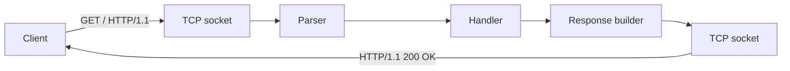

# Building an HTTP Server

> Backend Development 101 series (2/10)

<!-- a-grade-intro:begin -->

**Core question**: What does an HTTP server *actually do* under the hood?

> It reads text from a TCP socket, parses it as a request, and writes text back. An HTTP server is a *read-and-write* program.

This is post 2 in the Backend Development 101 series.

<!-- a-grade-intro:end -->

## What You Will Learn

- The actual shape of an HTTP request and response
- How HTTP rides on top of TCP
- The meaning of status codes and headers
- How to build a real server with FastAPI
- How to run a raw-socket server and watch the traffic

## Why It Matters

Once you have *seen* what frameworks hide, every future debugging session gets faster. Without it, you guess at why a status code looks wrong or why a header is missing.

> Frameworks are convenient, but seniors know what is *behind* the framework.

## Concept at a Glance



Both request and response are just *blocks of text*.

## Key Terms

- **Request line**: `GET /path HTTP/1.1` — method, path, version.
- **Status line**: `HTTP/1.1 200 OK` — the first line of the response.
- **Header**: `Key: Value` metadata.
- **Body**: actual data (JSON, HTML, files).
- **Method**: GET, POST, PUT, DELETE — kinds of action.

## Before/After

**Before (the library hides everything)**

```python
import requests
print(requests.get("https://example.com").status_code)
```

**After (you watch the bytes)**

```python
import socket
s = socket.create_connection(("example.com", 80))
s.sendall(b"GET / HTTP/1.1\r\nHost: example.com\r\n\r\n")
print(s.recv(4096).decode()[:200])
```

Same effect, but the *protocol text* is now visible.

## Hands-on: Five Steps to a Real Server

### Step 1 — Raw socket server

```python
# 1_socket_server.py
import socket
srv = socket.socket()
srv.bind(("127.0.0.1", 9000))
srv.listen()
conn, _ = srv.accept()
data = conn.recv(1024)
print(data.decode())
conn.sendall(b"HTTP/1.1 200 OK\r\nContent-Length: 5\r\n\r\nhello")
conn.close()
```

Open `http://127.0.0.1:9000/` in a browser to see `hello`.

### Step 2 — Same thing with FastAPI

```python
# 2_fastapi.py
from fastapi import FastAPI
app = FastAPI()

@app.get("/")
def root():
    return "hello"
```

```bash
uvicorn 2_fastapi:app --port 9000
```

### Step 3 — Choose your status code

```python
# 3_status.py
from fastapi import FastAPI, HTTPException
app = FastAPI()

@app.get("/items/{i}")
def get_item(i: int):
    if i < 0:
        raise HTTPException(400, "i must be >= 0")
    return {"i": i}
```

### Step 4 — Custom headers

```python
# 4_headers.py
from fastapi import FastAPI
from fastapi.responses import JSONResponse
app = FastAPI()

@app.get("/")
def root():
    return JSONResponse({"ok": True}, headers={"X-App": "demo"})
```

### Step 5 — Inspect with curl

```bash
curl -i http://127.0.0.1:9000/
```

`-i` shows the *headers and status line* alongside the body.

## What to Notice in This Code

- Without `Content-Length`, the client cannot know where the body ends.
- HTTP requires `\r\n` line endings — plain `\n` will break parsers.
- Same URL plus a different method means a *different action*.

## Five Common Mistakes

1. **Returning 200 even on errors.** Your monitoring breaks.
2. **Forgetting `Content-Type`.** Clients cannot decode JSON.
3. **Never closing the body.** Connections leak forever.
4. **Sending a body with GET.** Caches and proxies will drop it.
5. **Using only 200 and 500.** You lose the meaning of all the 4xx codes.

## How This Shows Up in Production

In production, FastAPI handles the socket plumbing for you. But when an outage hits — responses missing, connections truncated — you still have to drop down to sockets and headers. tcpdump, Wireshark, and curl are the basic backend debugger trio.

## How a Senior Engineer Thinks

- Status codes are a *contract*, not decoration.
- Headers communicate intent — set them on purpose.
- Timeouts and keep-alive are configured, not assumed.
- Responses have a maximum size.
- Reading raw HTTP regularly pays off when the real outage hits.

## Checklist

- [ ] You can read the first line of an HTTP request.
- [ ] You can tell 4xx from 5xx.
- [ ] You can use `curl -i` to see headers.
- [ ] You can set a status code in FastAPI.
- [ ] You have run a raw-socket server at least once.

## Practice Problems

1. Modify the raw-socket server to return JSON with a `Content-Type: application/json` header.
2. In FastAPI, add a `/error` route that returns 503.
3. Use `curl -v` against your server and capture the entire request and response text.

## Wrap-up and Next Steps

An HTTP server is a *text-protocol program*. Next, we add the layer that decides *which function handles which path* — the router.

<!-- toc:begin -->
- [What Is Backend Development?](./01-what-is-backend-development.md)
- **Building an HTTP Server (current)**
- Routing and Controllers (upcoming)
- The Service Layer (upcoming)
- The Database Layer (upcoming)
- Authentication and Authorization (upcoming)
- Logging and Error Handling (upcoming)
- Testing the Backend (upcoming)
- Deploying the Backend (upcoming)
- A Production-Ready Backend Structure (upcoming)
<!-- toc:end -->

## References

- [HTTP messages (MDN)](https://developer.mozilla.org/en-US/docs/Web/HTTP/Messages)
- [HTTP status codes (MDN)](https://developer.mozilla.org/en-US/docs/Web/HTTP/Status)
- [FastAPI responses](https://fastapi.tiangolo.com/advanced/response-directly/)
- [curl manual](https://curl.se/docs/manual.html)

Tags: Backend, HTTP, Python, FastAPI, Networking
