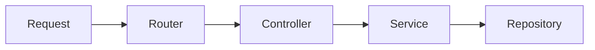

# Routing and Controllers

> Backend Development 101 series (3/10)

<!-- a-grade-intro:begin -->

**Core question**: When a server has a hundred endpoints, how do you keep the code *clean*?

> The router decides *the address*; the controller *receives input and delegates to the next layer*. Splitting these two responsibilities lets the code organize itself.

This is post 3 in the Backend Development 101 series.

<!-- a-grade-intro:end -->

## What You Will Learn

- The difference between routers and controllers
- The difference between path, query, and body parameters
- How to design REST-style endpoints
- How to split a FastAPI app with `APIRouter`
- What controllers should and should *not* do

## Why It Matters

In a tiny project, a single file works. As endpoints grow, that single file *becomes hell*. Splitting layers from day one makes "where does this code go?" obvious for every new feature.

> Good structure removes the question of *where to put code*.

## Concept at a Glance



Routers are the *map*, controllers are the *front desk*, services are the *experts*.

## Key Terms

- **Router**: maps URL patterns to handlers.
- **Controller**: receives the request, validates it, calls a service.
- **Path parameter**: `{id}` in `/users/{id}`.
- **Query parameter**: `active` in `/users?active=true`.
- **Body**: the JSON payload of a POST or PUT request.

## Before/After

**Before (everything in one file)**

```python
# main.py
from fastapi import FastAPI
app = FastAPI()

@app.get("/users")
def list_users(): ...

@app.get("/orders")
def list_orders(): ...

@app.get("/products")
def list_products(): ...
```

**After (one router per module)**

```python
# routers/users.py
from fastapi import APIRouter
router = APIRouter(prefix="/users", tags=["users"])

@router.get("")
def list_users():
    return []

# main.py
from fastapi import FastAPI
from routers import users, orders
app = FastAPI()
app.include_router(users.router)
app.include_router(orders.router)
```

Each feature gets its own file, so it is obvious *where to make a change*.

## Hands-on: Five Steps to Tidy Routing

### Step 1 — Path parameters

```python
# 1_path.py
from fastapi import FastAPI
app = FastAPI()

@app.get("/users/{user_id}")
def get_user(user_id: int):
    return {"id": user_id}
```

### Step 2 — Query parameters

```python
# 2_query.py
from fastapi import FastAPI
app = FastAPI()

@app.get("/users")
def list_users(active: bool = True, limit: int = 10):
    return {"active": active, "limit": limit}
```

### Step 3 — JSON body

```python
# 3_body.py
from fastapi import FastAPI
from pydantic import BaseModel

app = FastAPI()

class UserIn(BaseModel):
    name: str
    age: int

@app.post("/users")
def create_user(payload: UserIn):
    return {"id": 1, **payload.model_dump()}
```

### Step 4 — Split the router

```python
# routers/products.py
from fastapi import APIRouter
router = APIRouter(prefix="/products", tags=["products"])

@router.get("")
def list_products():
    return []

@router.get("/{pid}")
def get_product(pid: int):
    return {"id": pid}
```

### Step 5 — Controller calls the service

```python
# controllers/user_controller.py
from services.user_service import UserService

class UserController:
    def __init__(self, svc: UserService):
        self.svc = svc

    def create(self, payload):
        return self.svc.register(payload.name, payload.age)
```

Controllers stay *thin* — validate, then delegate.

## What to Notice in This Code

- Use path for *identity*, query for *filtering*.
- Body is meaningful only for POST, PUT, and PATCH.
- `tags` *groups* endpoints in the OpenAPI docs.

## Five Common Mistakes

1. **Stuffing everything into the query string.** Filters use query; new resources use body.
2. **Putting business logic in controllers.** Move it to services for reuse and testing.
3. **Using verbs in URLs like `/getUsers`.** REST uses *nouns plus HTTP methods*.
4. **Sending unvalidated input straight to the database.** Always model with Pydantic.
5. **Mutating state with GET.** GET must be *safe*.

## How This Shows Up in Production

Large backends have one router directory per domain (`routers/orders.py`, `routers/payments.py`). When a new feature lands, you only decide *which router* gains *which path*. That single rule extends the lifespan of a codebase by years.

## How a Senior Engineer Thinks

- URLs are *nouns*; actions are HTTP *methods*.
- A controller fits on one screen.
- Inputs are *always* modeled with Pydantic.
- Auth and logging middleware attach at the router level.
- Before adding a new endpoint, ask whether an existing one can be extended.

## Checklist

- [ ] You can distinguish path, query, and body parameters.
- [ ] You can split routes with APIRouter.
- [ ] You can design noun-based REST URLs.
- [ ] You understand the controller-to-service flow.
- [ ] You have opened the OpenAPI docs at `/docs`.

## Practice Problems

1. Build an `/orders` router with `GET /orders`, `GET /orders/{id}`, and `POST /orders`.
2. Add a `?role=admin` filter to `GET /users`.
3. Define a Pydantic `OrderIn` model and verify a bad payload returns `422`.

## Wrap-up and Next Steps

Routers are the *map*; controllers are the *front desk*. Next, we open the door behind the desk — the Service Layer that holds the *business rules*.

<!-- toc:begin -->
- [What Is Backend Development?](./01-what-is-backend-development.md)
- [Building an HTTP Server](./02-building-an-http-server.md)
- **Routing and Controllers (current)**
- The Service Layer (upcoming)
- The Database Layer (upcoming)
- Authentication and Authorization (upcoming)
- Logging and Error Handling (upcoming)
- Testing the Backend (upcoming)
- Deploying the Backend (upcoming)
- A Production-Ready Backend Structure (upcoming)
<!-- toc:end -->

## References

- [FastAPI Path operations](https://fastapi.tiangolo.com/tutorial/path-params/)
- [FastAPI APIRouter](https://fastapi.tiangolo.com/tutorial/bigger-applications/)
- [REST API Tutorial](https://restfulapi.net/)
- [Pydantic Models](https://docs.pydantic.dev/latest/concepts/models/)

Tags: Backend, FastAPI, Architecture, REST, Python
