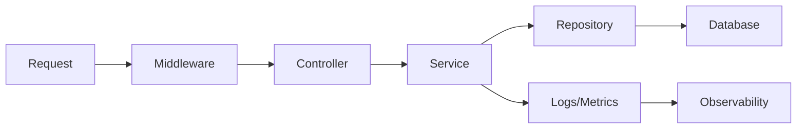

# A Production-Ready Backend Structure

> Backend Development 101 series (10/10)

<!-- a-grade-intro:begin -->

**Core question**: How do you combine the nine layers you have learned into *one coherent project*?

> Writing code that works and writing a backend that *runs in production* are different jobs. Production-readiness starts with structure.

<!-- a-grade-intro:end -->

## What You Will Learn

- A *project directory layout* that hosts all nine layers
- A strategy for splitting config across dev/staging/prod
- The three pillars of observability on one page
- A baseline for performance and cost
- A roadmap for what to learn next

## Why It Matters

A good structure lets *a new teammate find anything in 30 minutes*. A bad structure makes *future-you* unable to find your own code three months later. Structure is the biggest gift you give your future self.

> Production-grade code is *easy to read*.

## Concept at a Glance



Each arrow should align with a *directory boundary*.

## Key Terms

- **Project layout**: rules for the physical location of code.
- **Config layering**: a way to *override* settings per environment.
- **Secret manager**: a system that holds secrets *outside the code*.
- **SLO**: the performance/availability target you *promise to hold*.
- **Capacity plan**: a plan for surviving N times the current traffic.

## Before/After

**Before (everything in one file)**

```text
app.py   # routing, business, DB, auth, logging — all together
```

**After (layers visible as directories)**

```text
src/
├── api/            # routers, middleware
├── services/       # business rules
├── repositories/   # DB access
├── db/             # models, migrations
├── auth/           # authn/authz
├── observability/  # logging, metrics, tracing
├── config/         # per-environment settings
└── main.py         # wiring only
tests/
deploy/
```

## Hands-on: Five Steps to a Production-Ready Layout

### Step 1 — Directory layout

```bash
mkdir -p src/{api,services,repositories,db,auth,observability,config}
mkdir -p tests deploy
touch src/main.py
```

### Step 2 — Layered configuration

```python
# src/config/settings.py
import os
from pydantic_settings import BaseSettings

class Settings(BaseSettings):
    env: str = "dev"
    db_url: str
    jwt_secret: str
    log_level: str = "INFO"

    class Config:
        env_file = ".env"

settings = Settings()
```

In production, a *secret manager* injects environment variables instead of `.env`.

### Step 3 — main.py is wiring only

```python
# src/main.py
from fastapi import FastAPI
from src.api import users, orders
from src.observability import setup_logging, setup_metrics

def create_app() -> FastAPI:
    app = FastAPI()
    setup_logging()
    setup_metrics(app)
    app.include_router(users.router)
    app.include_router(orders.router)
    return app

app = create_app()
```

Not a single line of business logic lives here.

### Step 4 — Observability on one page

```python
# src/observability/__init__.py
import logging, time
from prometheus_client import Counter, Histogram

REQUESTS = Counter("http_requests_total", "Total requests", ["route", "status"])
LATENCY = Histogram("http_request_seconds", "Latency", ["route"])

def setup_logging():
    logging.basicConfig(level="INFO", format="%(asctime)s %(levelname)s %(message)s")

def setup_metrics(app):
    @app.middleware("http")
    async def observe(request, call_next):
        start = time.time()
        response = await call_next(request)
        LATENCY.labels(request.url.path).observe(time.time() - start)
        REQUESTS.labels(request.url.path, response.status_code).inc()
        return response
```

### Step 5 — SLO and capacity baseline

```text
- Availability: 99.9% (43 minutes downtime per month)
- p95 latency: under 300 ms
- Error rate: under 0.1%
- 1 instance = 200 RPS (capacity baseline)
```

Once written down, alerts and capacity planning *follow naturally*.

## What to Notice in This Code

- The thinner `main.py` is, the easier testing becomes.
- Configuration lives in *the environment*, not in code.
- Observability must be present *from day one* to debug fast later.

## Five Common Mistakes

1. **Letting layer boundaries slide in code review.** A *little* SQL in a router today becomes *normal* tomorrow.
2. **Hardcoding configuration in code.** Per-environment behavior creates *unreproducible* bugs.
3. **Postponing observability.** You only add it after an incident — and during the incident there is no time.
4. **Not writing SLOs as numbers.** "Make it fast" is *not a target*.
5. **Putting business logic in `main.py`.** Tests now require the *entire app to boot*.

## How This Shows Up in Production

Most companies maintain a *standard template* with layered directories, configuration layering, and the three observability pillars baked in. New services start by *cloning the template*. A senior engineer's job often includes *maintaining that template*.

## How a Senior Engineer Thinks

- Pick the structure that is comfortable *six months from now*, not today.
- Every new layer must have a *clear name and responsibility*.
- "*Where should this code live?*" being unclear is a sign the structure is wrong.
- Operating without observability is *driving with your eyes closed*.
- Good structure is measured by *the speed of a new teammate's first PR*.

## Checklist

- [ ] All nine layers are *visible as directories*.
- [ ] `main.py` performs *only wiring*.
- [ ] Configuration is split per environment.
- [ ] No secret lives in code.
- [ ] Logs and metrics are on from day one.
- [ ] SLOs are written down.

## Practice Problems

1. Reorganize one of your toy projects into the directory layout above.
2. Build a `Settings` class so a single `.env` injects every environment variable.
3. Expose a `/metrics` endpoint and verify Prometheus-formatted output.

## Wrap-up and Next Steps

A production-ready backend *starts from structure*. Split the nine layers into directories, bake in config and observability from day one, and the *future-you* will happily revisit the code six months later.

Recommended next series:

- *Testing 101* — design test strategy like a factory line.
- *DevOps 101* — turn CI/CD into an automation vault.
- *Observability 101* — connect logs, metrics, and traces into one chart.

Thank you for staying with this series. The ability to *take a small backend and make it production-ready* is a *core skill* that travels with you to any company.

<!-- toc:begin -->
- [What Is Backend Development?](./01-what-is-backend-development.md)
- [Building an HTTP Server](./02-building-an-http-server.md)
- [Routing and Controllers](./03-routing-and-controllers.md)
- [Service Layer](./04-service-layer.md)
- [Database Layer](./05-database-layer.md)
- [Authentication and Authorization](./06-auth-and-authorization.md)
- [Logging and Error Handling](./07-logging-and-error-handling.md)
- [Testing the Backend](./08-testing-the-backend.md)
- [Deploying the Backend](./09-deploying-the-backend.md)
- **A Production-Ready Backend Structure (current)**
<!-- toc:end -->

## References

- [Twelve-Factor App](https://12factor.net/)
- [Google SRE Book](https://sre.google/books/)
- [FastAPI Bigger Applications](https://fastapi.tiangolo.com/tutorial/bigger-applications/)
- [Prometheus Python client](https://github.com/prometheus/client_python)

Tags: Backend, Architecture, BestPractices, Python, Production
