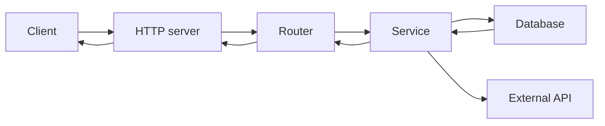

# 백엔드 개발이란 무엇인가?

이 글은 Backend Development 101 시리즈의 첫 번째 글입니다. 사용자는 화면만 보지만, 실제 서비스가 오래 버티는지는 화면 뒤에 있는 백엔드가 결정합니다. 여기서는 백엔드를 하나의 기술이 아니라 요청을 받고, 규칙을 적용하고, 데이터를 다루고, 응답을 돌려주는 책임의 집합으로 이해해 보겠습니다.

## 이 글에서 다룰 문제

- 백엔드는 정확히 어떤 역할과 경계를 가지는 계층일까요?
- 하나의 요청은 HTTP 서버, 라우터, 서비스, 데이터베이스를 어떻게 통과할까요?
- 왜 백엔드를 한 덩어리가 아니라 여러 레이어로 나눠 이해해야 할까요?
- 이 시리즈의 다음 글들은 각각 어떤 문제를 풀기 위해 존재할까요?
- 프론트엔드와 백엔드의 책임은 어디에서 갈릴까요?

## 왜 중요한가

프론트엔드만 만들면 사용자가 보는 화면은 빠르게 만들 수 있습니다. 하지만 데이터, 인증, 정합성, 운영 같은 문제는 모두 화면 뒤에서 처리됩니다. 결국 시스템이 오래 살아남으려면 백엔드가 어떤 책임을 지는지부터 분명히 이해해야 합니다.

백엔드는 눈에 잘 보이지 않지만, 실제로는 가장 많은 운영 판단이 모이는 곳입니다. 어떤 입력을 믿을 수 있는지, 어떤 데이터를 저장해야 하는지, 오류를 어떻게 남기고 복구할지 같은 결정이 모두 여기서 내려집니다. 그래서 입문 단계일수록 기능 이름보다 책임의 지도를 먼저 잡는 편이 훨씬 중요합니다.

> 백엔드는 하나의 기능이 아니라, 요청을 받아 규칙을 적용하고 데이터를 다루는 책임의 집합입니다.

## 한눈에 보는 개념



요청은 왼쪽에서 오른쪽으로 흘러가고, 응답은 같은 길을 되짚어 돌아옵니다. 이 그림만 이해해도 이후 글에서 배우는 HTTP, 라우팅, 서비스, 데이터베이스, 인증, 로깅, 테스트, 배포가 모두 하나의 구조 안에 들어간다는 감각을 잡을 수 있습니다.

## 핵심 용어

- **HTTP server**: 요청이 가장 먼저 도착하는 입구입니다.
- **Router**: 어떤 경로를 어떤 함수가 처리할지 정합니다.
- **Service**: 비즈니스 규칙이 머무는 계층입니다.
- **Repository**: 데이터베이스와 대화하는 계층입니다.
- **Middleware**: 모든 요청에 공통으로 적용되는 동작입니다.

이 용어들이 중요한 이유는, 백엔드 코드를 읽을 때 결국 “이 책임이 어느 층에 있어야 하는가”를 계속 판단하게 되기 때문입니다. 용어가 곧 구조의 경계라고 생각하면 훨씬 덜 헷갈립니다.

## Before/After

**Before (the frontend does everything)**

```python
# A password check inside the browser
if password == "admin123":
    show_dashboard()
```

**After (the backend owns the rule)**

```python
# server.py
@app.post("/login")
def login(body):
    if not auth.verify(body["email"], body["password"]):
        return 401, {"error": "invalid"}
    return 200, {"token": auth.token(body["email"])}
```

비밀번호 검증은 클라이언트가 아니라 서버가 책임져야 합니다. 클라이언트는 결과를 소비하는 쪽이고, 규칙을 집행하는 쪽은 백엔드입니다. 이 구분이 흐려지면 보안과 운영 품질이 한 번에 무너집니다.

## 실습: 다섯 단계로 보는 첫 번째 백엔드

### Step 1 — The smallest server

```python
# 1_app.py
from fastapi import FastAPI
app = FastAPI()

@app.get("/")
def hello():
    return {"message": "hello"}
```

이 예제는 가장 작은 형태의 백엔드입니다. 경로 하나와 함수 하나만 있어도 이미 서버는 요청을 받고 응답을 돌려줄 수 있습니다.

### Step 2 — Run it

```bash
uvicorn 1_app:app --reload
```

`http://127.0.0.1:8000/`를 열면 JSON 응답이 보입니다. 이 순간부터 백엔드는 화면을 그리는 프로그램이 아니라 데이터를 반환하는 프로그램이라는 사실이 분명해집니다.

### Step 3 — Add a route

```python
# 2_routes.py
from fastapi import FastAPI
app = FastAPI()

USERS = [{"id": 1, "name": "Alice"}]

@app.get("/users")
def list_users():
    return USERS
```

경로를 하나 더 추가하면 서버는 다른 주소를 다른 함수로 연결하기 시작합니다. 백엔드 구조가 복잡해지는 출발점이 바로 여기입니다.

### Step 4 — Accept input

```python
# 3_input.py
from fastapi import FastAPI
from pydantic import BaseModel

app = FastAPI()

class UserIn(BaseModel):
    name: str

@app.post("/users")
def create_user(payload: UserIn):
    return {"id": 99, "name": payload.name}
```

입력을 받는 순간부터 검증이 중요해집니다. 백엔드는 사용자가 보낸 값을 그대로 믿지 않고, 먼저 형태와 타입을 확인해야 합니다.

### Step 5 — Call it

```bash
curl -X POST -H "Content-Type: application/json" \
     -d '{"name":"Bob"}' http://127.0.0.1:8000/users
```

요청을 보내고 JSON을 돌려받으면, 백엔드의 가장 기본적인 책임이 모두 한 바퀴 연결됩니다. 경로를 고르고, 입력을 검증하고, 데이터를 만들고, 응답을 반환하는 흐름입니다.

## 이 코드에서 먼저 볼 점

- 서버는 결국 경로를 함수에 연결하는 구조입니다.
- 입력은 함수에 도달하기 전에 검증됩니다.
- 응답은 화면이 아니라 JSON 같은 데이터입니다.

이 세 가지를 먼저 이해하면 이후의 모든 세부 주제가 어디에 붙는지 자연스럽게 보입니다. 인증은 입력과 권한 검증에 붙고, 데이터베이스는 서비스 뒤쪽에 붙고, 로깅은 전체 흐름을 따라갑니다.

## 자주 하는 실수 5가지

1. **백엔드를 데이터베이스 코드와 동일시하는 실수**입니다. 실제로는 라우팅, 인증, 검증, 로깅, 배포까지 모두 포함합니다.
2. **모든 로직을 라우트 핸들러에 넣는 실수**입니다. 파일 하나가 금방 통제 불가능해집니다.
3. **클라이언트 검증만 믿는 실수**입니다. 서버는 항상 다시 검증해야 합니다.
4. **모든 오류를 500으로 돌려주는 실수**입니다. 400, 404, 409 같은 의미 있는 상태 코드를 써야 합니다.
5. **로그를 남기지 않는 실수**입니다. 운영에서 무슨 일이 있었는지 알 방법이 사라집니다.

## 운영에서는 이렇게 드러납니다

스타트업이든 큰 회사든 백엔드의 큰 형태는 크게 다르지 않습니다. Router, Service, Repository, Middleware라는 분리가 유지되고, 팀은 그 경계를 기준으로 기능을 추가합니다. 이 지도를 한 번 익혀 두면 처음 보는 코드베이스도 훨씬 빨리 읽을 수 있습니다.

반대로 이 구조를 건너뛰면 새 프로젝트를 볼 때마다 파일 배치와 책임 분리가 모두 낯설게 느껴집니다. 결국 백엔드 입문의 핵심은 프레임워크 문법보다 구조 감각을 먼저 얻는 데 있습니다.

## 시니어 엔지니어는 이렇게 생각합니다

- 비즈니스 규칙은 라우트가 아니라 서비스에 둡니다.
- 모든 입력은 항상 다시 검증합니다.
- 모든 의존성은 테스트 가능하도록 주입할 수 있어야 합니다.
- 로그와 메트릭은 코드와 함께 설계합니다.
- 기준은 “내 컴퓨터에서 동작한다”가 아니라 “운영 가능하다”입니다.

## 체크리스트

- [ ] 백엔드의 다섯 레이어를 말할 수 있습니다.
- [ ] 가장 작은 FastAPI 서버를 실행할 수 있습니다.
- [ ] GET과 POST의 차이를 설명할 수 있습니다.
- [ ] 입력 검증이 왜 중요한지 설명할 수 있습니다.
- [ ] 다음 글이 무엇을 다루는지 알고 있습니다.

## 연습 문제

1. `/health` 경로를 추가하고 `{"status": "ok"}`를 반환해 보세요.
2. `GET /users/{user_id}`를 추가하고 path parameter를 그대로 돌려줘 보세요.
3. `POST /login`에서 비밀번호가 틀리면 `401`을 반환하도록 바꿔 보세요.

## 정리와 다음 글

백엔드는 하나의 기능이 아니라 여러 책임이 모인 구조입니다. 다음 글에서는 그중 가장 아래쪽 입구를 열어, HTTP 서버가 실제로 어떻게 요청을 읽고 응답을 쓰는지 직접 살펴보겠습니다.

<!-- toc:begin -->
- **백엔드 개발이란 무엇인가? (현재 글)**
- HTTP 서버 만들기 (예정)
- Routing과 Controller (예정)
- Service Layer (예정)
- Database Layer (예정)
- 인증과 권한 (예정)
- Logging과 Error Handling (예정)
- 백엔드 테스트 (예정)
- 백엔드 배포 (예정)
- 운영 가능한 백엔드 구조 (예정)
<!-- toc:end -->

## 참고 자료

- [FastAPI Tutorial](https://fastapi.tiangolo.com/tutorial/)
- [HTTP overview (MDN)](https://developer.mozilla.org/en-US/docs/Web/HTTP/Overview)
- [The Twelve-Factor App](https://12factor.net/)
- [Backend roadmap](https://roadmap.sh/backend)

Tags: Backend, WebDevelopment, HTTP, Architecture, Python
