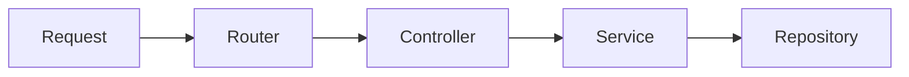

# Routing과 Controller

> Backend Development 101 시리즈 (3/10)


## 이 글에서 다룰 문제

작은 프로젝트에서는 한 파일에 모두 넣어도 동작합니다. 하지만 endpoint가 늘어나면 파일 하나가 금방 감당하기 어려워집니다. 처음부터 레이어를 나눠 두면 새 기능을 추가할 때마다 어디에 둘지 바로 판단할 수 있습니다.

> 좋은 구조는 코드를 어디에 둘지 두고 매번 고민하지 않게 해줍니다.

## 전체 흐름


Router는 지도, Controller는 접수창구, Service는 실제 규칙을 다루는 계층이라고 생각하면 이해하기 쉽습니다.

## Before/After

**Before (한 파일에 다 넣기)**

```python
# main.py
from fastapi import FastAPI
app = FastAPI()

@app.get("/users")
def list_users(): ...

@app.get("/orders")
def list_orders(): ...

@app.get("/products")
def list_products(): ...
```

**After (모듈별 router)**

```python
# 파일: routers/users.py
from fastapi import APIRouter
router = APIRouter(prefix="/users", tags=["users"])

@router.get("")
def list_users():
    return []

# main.py
from fastapi import FastAPI
from routers import users, orders
app = FastAPI()
app.include_router(users.router)
app.include_router(orders.router)
```

기능별로 파일이 나뉘면 어디를 고쳐야 할지 바로 보입니다.

## 5단계로 라우팅 정돈하기

### 1단계 — Path 파라미터

```python
# 1_path.py
from fastapi import FastAPI
app = FastAPI()

@app.get("/users/{user_id}")
def get_user(user_id: int):
    return {"id": user_id}
```

### 2단계 — Query 파라미터

```python
# 2_query.py
from fastapi import FastAPI
app = FastAPI()

@app.get("/users")
def list_users(active: bool = True, limit: int = 10):
    return {"active": active, "limit": limit}
```

### 3단계 — Body로 JSON 받기

```python
# 3_body.py
from fastapi import FastAPI
from pydantic import BaseModel

app = FastAPI()

class UserIn(BaseModel):
    name: str
    age: int

@app.post("/users")
def create_user(payload: UserIn):
    return {"id": 1, **payload.model_dump()}
```

### 4단계 — Router 분리

```python
# 파일: routers/products.py
from fastapi import APIRouter
router = APIRouter(prefix="/products", tags=["products"])

@router.get("")
def list_products():
    return []

@router.get("/{pid}")
def get_product(pid: int):
    return {"id": pid}
```

### 5단계 — Controller에서 service 호출

```python
# 파일: controllers/user_controller.py
from services.user_service import UserService

class UserController:
    def __init__(self, svc: UserService):
        self.svc = svc

    def create(self, payload):
        return self.svc.register(payload.name, payload.age)
```

Controller는 최대한 얇게 유지합니다. 입력을 받고 검증한 뒤 service에 위임하는 데 집중합니다.

## 이 코드에서 주목할 점

- Path는 식별에, query는 필터에 씁니다.
- Body는 POST, PUT, PATCH에서 주로 의미를 가집니다.
- `tags`는 OpenAPI 문서를 그룹화할 때 씁니다.

## 자주 하는 실수 5가지

1. **모든 데이터를 query string에 넣는다.** 검색 조건은 query, 새 자원은 body가 맞습니다.
2. **Controller에 비즈니스 로직을 쓴다.** Service로 옮겨야 재사용·테스트가 쉽습니다.
3. **`/getUsers`, `/createUser`처럼 동사 path를 쓴다.** REST는 명사와 HTTP method 조합으로 표현하는 편이 자연스럽습니다.
4. **검증 없이 받은 값을 DB에 직접 넣는다.** Pydantic으로 항상 모델링한 뒤 다뤄야 합니다.
5. **상태 변경을 GET으로 한다.** GET은 안전(safe)한 조회에만 써야 합니다.

## 실무에서는 이렇게 쓰입니다

큰 백엔드는 도메인별로 router 디렉터리(`routers/orders.py`, `routers/payments.py`)를 둡니다. 새 기능이 들어오면 어떤 router에 어떤 path를 추가할지만 정하면 됩니다. 이런 단순한 규칙이 코드베이스를 오래 버티게 합니다.

## 체크리스트

- [ ] Path / query / body 파라미터를 구분할 수 있다.
- [ ] APIRouter로 router를 분리할 수 있다.
- [ ] REST 명사 path를 설계할 수 있다.
- [ ] Controller에서 service를 호출하는 흐름을 안다.
- [ ] OpenAPI 문서(`/docs`)를 열어 봤다.

## 정리 및 다음 단계

Router는 요청 경로를 나누고, Controller는 그 요청을 받아 다음 계층으로 넘깁니다. 다음 글에서는 안쪽에서 비즈니스 규칙을 다루는 Service Layer를 봅니다.

<!-- toc:begin -->
- [백엔드 개발이란 무엇인가?](./01-what-is-backend-development.md)
- [HTTP 서버 만들기](./02-building-an-http-server.md)
- **Routing과 Controller (현재 글)**
- Service Layer (예정)
- Database Layer (예정)
- 인증과 권한 (예정)
- Logging과 Error Handling (예정)
- 백엔드 테스트 (예정)
- 백엔드 배포 (예정)
- 운영 가능한 백엔드 구조 (예정)
<!-- toc:end -->

## 참고 자료

- [FastAPI Path operations](https://fastapi.tiangolo.com/tutorial/path-params/)
- [FastAPI APIRouter](https://fastapi.tiangolo.com/tutorial/bigger-applications/)
- [REST API Tutorial](https://restfulapi.net/)
- [Pydantic Models](https://docs.pydantic.dev/latest/concepts/models/)

Tags: Backend, FastAPI, Architecture, REST, Python
