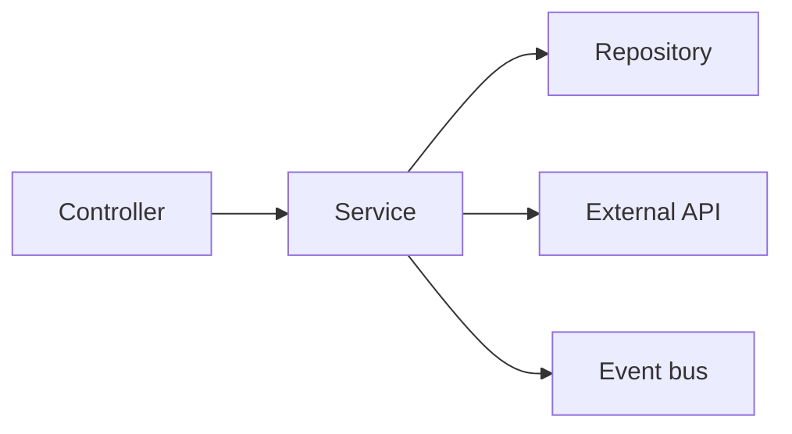

# Service Layer

이 글은 Backend Development 101 시리즈의 네 번째 글입니다. controller가 너무 많은 일을 하기 시작하면 같은 비즈니스 규칙이 REST, 배치, 다른 인터페이스에 중복되기 쉽습니다. 여기서는 비즈니스 로직이 왜 service layer에 모여야 하는지, 그리고 그 경계가 왜 운영 수명을 좌우하는지 살펴보겠습니다.

## 이 글에서 다룰 문제

- 비즈니스 로직은 왜 controller도 repository도 아닌 service에 있어야 할까요?
- controller, service, repository는 각각 어디까지 책임져야 할까요?
- 트랜잭션 경계는 어느 층에서 시작하는 편이 자연스러울까요?
- service에 의존성을 주입하는 방식은 왜 테스트성과 직결될까요?
- domain event는 service layer 안에서 어떤 자리에 놓일까요?

## 왜 중요한가

비즈니스 로직을 controller에 넣으면 같은 규칙이 여러 입구에 흩어집니다. REST API, gRPC, 배치 작업이 모두 같은 규칙을 써야 하는데, 각 입구마다 중복 구현이 생기기 쉽습니다. 반대로 service에 규칙을 모아 두면 어떤 경로로 들어오든 같은 판단을 하게 만들 수 있습니다.

결국 service layer는 코드 정리용 장식이 아니라, 비즈니스 규칙의 단일 출처를 만드는 장치입니다. 이 원칙 하나가 서비스의 유지보수성과 테스트 가능성을 크게 갈라놓습니다.

> 비즈니스 규칙은 입구가 아니라 service에 모여야 오래 버티는 구조가 됩니다.

## 한눈에 보는 개념



service는 오케스트레이터입니다. repository, 외부 API, 이벤트 버스를 연결하고 실행 순서를 조율합니다. 비즈니스 행위 하나가 service 메서드 하나로 드러나는 구조가 가장 읽기 쉽습니다.

## 핵심 용어

- **Service**: 하나의 비즈니스 use case를 책임지는 객체입니다.
- **Use case**: 주문 생성, 송금, 환불처럼 의미 있는 업무 시나리오입니다.
- **Transaction boundary**: 함께 commit되거나 rollback되는 작업 단위입니다.
- **Domain event**: 어떤 비즈니스 행위가 일어났음을 알리는 메시지입니다.
- **Dependency injection**: 협력 객체를 생성자나 인자로 전달받는 방식입니다.

## Before/After

**Before (controller does everything)**

```python
@app.post("/orders")
def create_order(payload, db, mail):
    if payload.amount <= 0:
        raise HTTPException(400)
    order = db.insert("orders", payload.dict())
    mail.send(payload.email, "ordered")
    return order
```

**After (service owns the rule)**

```python
# services/order_service.py
class OrderService:
    def __init__(self, repo, mailer):
        self.repo = repo
        self.mailer = mailer

    def create(self, payload):
        if payload.amount <= 0:
            raise ValueError("amount must be > 0")
        order = self.repo.save(payload)
        self.mailer.send(payload.email, "ordered")
        return order

# routers/orders.py
@router.post("")
def create_order(payload, svc: OrderService = Depends(get_order_service)):
    return svc.create(payload)
```

controller가 얇아지면 같은 service를 배치 작업이나 다른 인터페이스에서도 그대로 재사용할 수 있습니다. 입구가 바뀌어도 규칙이 바뀌지 않는다는 점이 핵심입니다.

## 실습: 다섯 단계로 보는 Service Layer

### Step 1 — The smallest service

```python
# 1_service.py
class GreetService:
    def hello(self, name: str) -> str:
        return f"hello, {name}"
```

가장 작은 service는 입력을 받아 의미 있는 결과를 돌려주는 함수형 구조를 가집니다. 중요한 것은 파일 크기가 아니라 책임 이름이 분명한가입니다.

### Step 2 — Inject dependencies

```python
# 2_di.py
class UserService:
    def __init__(self, repo):
        self.repo = repo

    def register(self, name: str):
        return self.repo.insert({"name": name})
```

service가 의존성을 직접 만들지 않고 전달받으면 테스트가 쉬워집니다. 실제 repository 대신 mock이나 fake를 넣어도 같은 규칙을 검증할 수 있기 때문입니다.

### Step 3 — Transaction boundary

```python
# 3_tx.py
class TransferService:
    def __init__(self, accounts, tx):
        self.accounts = accounts
        self.tx = tx

    def transfer(self, src, dst, amount):
        with self.tx.begin():
            self.accounts.debit(src, amount)
            self.accounts.credit(dst, amount)
```

트랜잭션은 repository가 아니라 service 안에서 시작하는 편이 자연스럽습니다. 하나의 use case가 여러 저장 작업을 묶어야 할 때, 그 경계를 service만이 알고 있기 때문입니다.

### Step 4 — Integrate an external call

```python
# 4_external.py
class CheckoutService:
    def __init__(self, repo, payment_gw):
        self.repo = repo
        self.gw = payment_gw

    def checkout(self, cart):
        receipt = self.gw.charge(cart.total)
        return self.repo.save_order(cart, receipt.id)
```

외부 결제 게이트웨이 같은 의존성이 끼어드는 순간 service의 조율 역할이 더 선명해집니다. 어느 순서로 검증하고 저장하고 호출할지 결정하는 곳이 바로 여기입니다.

### Step 5 — Publish a domain event

```python
# 5_event.py
class OrderService:
    def __init__(self, repo, bus):
        self.repo = repo
        self.bus = bus

    def place(self, payload):
        order = self.repo.save(payload)
        self.bus.publish("OrderPlaced", {"id": order.id})
        return order
```

domain event를 발행하면 다른 기능이 service를 직접 호출하지 않고도 비즈니스 변화를 감지할 수 있습니다. 서비스 간 결합을 줄이는 데 도움이 되는 이유가 여기에 있습니다.

## 이 코드에서 먼저 볼 점

- service는 의존성을 직접 생성하지 않고 전달받습니다.
- 트랜잭션은 repository가 아니라 service 안에서 시작합니다.
- 외부 호출은 다음 단계로 넘어가기 전에 검증되어야 합니다.

이 세 가지를 지키면 service 파일만 읽어도 비즈니스 규칙의 핵심 흐름이 보입니다. 반대로 경계가 흐려지면 규칙이 controller, repository, 외부 모듈로 흩어져 읽기 어려워집니다.

## 자주 하는 실수 5가지

1. **HTTP request 객체를 service에 그대로 넘기는 실수**입니다. service는 plain input을 받는 편이 좋습니다.
2. **service에서 `HTTPException`을 던지는 실수**입니다. 도메인 오류는 controller에서 HTTP로 번역하는 편이 낫습니다.
3. **repository에서 트랜잭션을 여는 실수**입니다. 하나의 use case가 둘 이상의 트랜잭션으로 쪼개질 수 있습니다.
4. **service끼리 서로 직접 import하는 실수**입니다. 순환 의존성이 생기기 쉽고, event bus 같은 다른 연결 방식이 더 낫습니다.
5. **모든 메서드를 하나의 service에 몰아넣는 실수**입니다. 도메인별로 나눌수록 읽기 쉽습니다.

## 운영에서는 이렇게 드러납니다

큰 백엔드에서는 보통 `services/orders/`, `services/payments/`처럼 도메인별 service 디렉터리를 둡니다. use case 하나가 service 메서드 하나와 대응되도록 유지하면, 새 팀원이 들어와도 흐름을 빠르게 이해할 수 있습니다.

DDD를 엄격하게 적용하지 않더라도 이 분리는 거의 언제나 도움이 됩니다. service layer는 과한 추상이 아니라, 중복 규칙과 엉킨 책임을 막는 가장 실용적인 경계이기 때문입니다.

## 시니어 엔지니어는 이렇게 생각합니다

- 하나의 use case는 하나의 메서드로 읽혀야 합니다.
- service는 입력에서 결과로 이어지는 흐름으로 설계합니다.
- 트랜잭션 경계는 명시적으로 드러냅니다.
- 재시도 정책은 호출 지점이 아니라 service 안에서 결정합니다.
- service 파일만 읽어도 비즈니스 규칙이 설명되어야 합니다.

## 체크리스트

- [ ] controller / service / repository의 역할을 구분할 수 있습니다.
- [ ] service에 의존성을 주입할 수 있습니다.
- [ ] service 안에서 트랜잭션을 시작할 수 있습니다.
- [ ] HTTP 예외와 도메인 예외를 구분할 수 있습니다.
- [ ] domain event가 무엇인지 설명할 수 있습니다.

## 연습 문제

1. `RefundService.refund(order_id)`를 만들고 잘못된 ID에 `RefundError`를 던져 보세요.
2. `TransferService`에 잔액 부족 검사를 추가해 보세요.
3. service 메서드가 길어졌다면 새로운 service로 분리해 보세요.

## 정리와 다음 글

Service Layer는 비즈니스 규칙의 집입니다. 다음 글에서는 한 층 더 내려가, 데이터가 실제로 머무는 Database Layer를 살펴보겠습니다.

<!-- toc:begin -->
- [백엔드 개발이란 무엇인가?](./01-what-is-backend-development.md)
- [HTTP 서버 만들기](./02-building-an-http-server.md)
- [Routing과 Controller](./03-routing-and-controllers.md)
- **Service Layer (현재 글)**
- Database Layer (예정)
- 인증과 권한 (예정)
- Logging과 Error Handling (예정)
- 백엔드 테스트 (예정)
- 백엔드 배포 (예정)
- 운영 가능한 백엔드 구조 (예정)
<!-- toc:end -->

## 참고 자료

- [Service Layer pattern (Martin Fowler)](https://martinfowler.com/eaaCatalog/serviceLayer.html)
- [DDD reference (Eric Evans)](https://www.domainlanguage.com/ddd/reference/)
- [Architecture Patterns with Python](https://www.cosmicpython.com/)
- [FastAPI dependencies](https://fastapi.tiangolo.com/tutorial/dependencies/)

Tags: Backend, Architecture, DesignPatterns, Python, DDD
