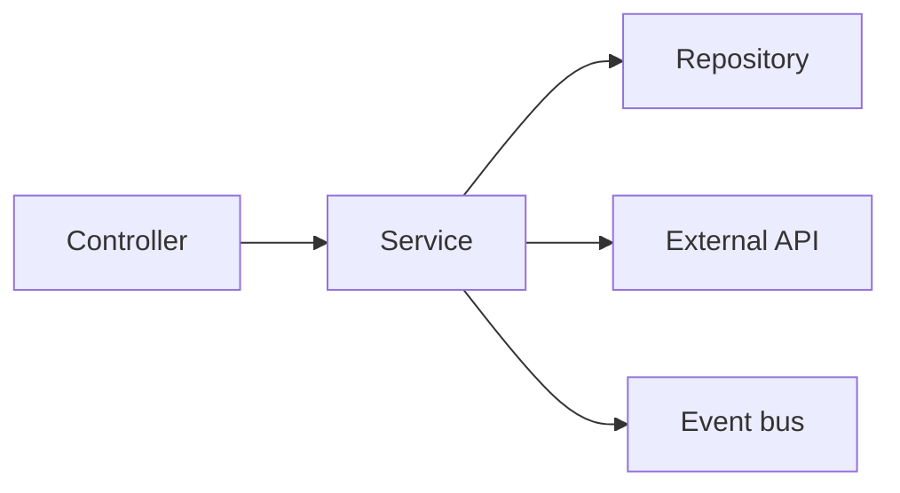

# Service Layer

> Backend Development 101 시리즈 (4/10)


## 이 글에서 다룰 문제

Controller에 비즈니스 로직을 넣으면 같은 규칙이 REST, gRPC, 배치 작업에 흩어집니다. Service에 모아 두면 어느 입구로 들어와도 같은 규칙을 적용할 수 있습니다. 이 원칙이 서비스의 유지보수성을 크게 좌우합니다.

> 비즈니스 규칙은 요청이 어디서 들어오든 한곳에서 관리해야 합니다.

## 전체 흐름


Service는 오케스트레이터 역할을 맡습니다. Repository, 외부 API, 이벤트 버스를 연결하고 실행 순서를 조율합니다.

## Before/After

**Before (Controller가 모든 일을 함)**

```python
@app.post("/orders")
def create_order(payload, db, mail):
    if payload.amount <= 0:
        raise HTTPException(400)
    order = db.insert("orders", payload.dict())
    mail.send(payload.email, "ordered")
    return order
```

**After (Service가 책임)**

```python
# 파일: services/order_service.py
class OrderService:
    def __init__(self, repo, mailer):
        self.repo = repo
        self.mailer = mailer

    def create(self, payload):
        if payload.amount <= 0:
            raise ValueError("amount must be > 0")
        order = self.repo.save(payload)
        self.mailer.send(payload.email, "ordered")
        return order

# 파일: routers/orders.py
@router.post("")
def create_order(payload, svc: OrderService = Depends(get_order_service)):
    return svc.create(payload)
```

Controller는 얇아지고, 같은 service를 배치 작업에서도 재사용할 수 있습니다.

## Service 설계 5단계

### 1단계 — 가장 작은 service

```python
# 1_service.py
class GreetService:
    def hello(self, name: str) -> str:
        return f"hello, {name}"
```

### 2단계 — 의존성 주입

```python
# 2_di.py
class UserService:
    def __init__(self, repo):
        self.repo = repo

    def register(self, name: str):
        return self.repo.insert({"name": name})
```

### 3단계 — 트랜잭션 경계

```python
# 3_tx.py
class TransferService:
    def __init__(self, accounts, tx):
        self.accounts = accounts
        self.tx = tx

    def transfer(self, src, dst, amount):
        with self.tx.begin():
            self.accounts.debit(src, amount)
            self.accounts.credit(dst, amount)
```

### 4단계 — 외부 호출 통합

```python
# 4_external.py
class CheckoutService:
    def __init__(self, repo, payment_gw):
        self.repo = repo
        self.gw = payment_gw

    def checkout(self, cart):
        receipt = self.gw.charge(cart.total)
        return self.repo.save_order(cart, receipt.id)
```

### 5단계 — 도메인 이벤트 발행

```python
# 5_event.py
class OrderService:
    def __init__(self, repo, bus):
        self.repo = repo
        self.bus = bus

    def place(self, payload):
        order = self.repo.save(payload)
        self.bus.publish("OrderPlaced", {"id": order.id})
        return order
```

## 이 코드에서 주목할 점

- Service는 의존성을 직접 만들지 않고 주입받습니다.
- 트랜잭션은 Service 안에서 시작하는 편이 흐름을 이해하기 쉽습니다.
- 외부 호출은 결과를 확인한 뒤 다음 단계로 넘겨야 합니다.

## 자주 하는 실수 5가지

1. **Service에서 Request 객체를 직접 받는다.** Service는 프레임워크 객체보다 plain input을 다루는 편이 좋습니다.
2. **Service에서 HTTP 예외(`HTTPException`)를 던진다.** Controller에서 변환해야 합니다.
3. **트랜잭션을 Repository에서 연다.** 한 use case가 두 개의 트랜잭션으로 쪼개집니다.
4. **Service가 다른 Service를 직접 import한다.** 순환 의존이 생깁니다 — 이벤트 버스로 분리합니다.
5. **모든 함수를 한 service에 넣는다.** 서비스 하나가 한 도메인 책임을 맡도록 쪼개는 편이 낫습니다.

## 실무에서는 이렇게 쓰입니다

큰 백엔드는 도메인 단위로 service 디렉터리를 둡니다(`services/orders/`, `services/payments/`). 한 use case를 한 service의 한 메서드에 대응시키면 새 팀원도 구조를 금방 이해합니다. DDD를 본격적으로 도입하지 않더라도 이 정도 분리는 대부분의 백엔드에 도움이 됩니다.

## 체크리스트

- [ ] Controller / Service / Repository의 책임을 말할 수 있다.
- [ ] Service에 의존성을 주입할 수 있다.
- [ ] 트랜잭션을 Service에서 열 수 있다.
- [ ] HTTP 예외와 도메인 예외를 구분한다.
- [ ] 도메인 이벤트가 무엇인지 안다.

## 정리 및 다음 단계

Service는 비즈니스 규칙이 모이는 곳입니다. 다음 글에서는 그 아래에서 데이터를 다루는 Database Layer를 봅니다.

<!-- toc:begin -->
- [백엔드 개발이란 무엇인가?](./01-what-is-backend-development.md)
- [HTTP 서버 만들기](./02-building-an-http-server.md)
- [Routing과 Controller](./03-routing-and-controllers.md)
- **Service Layer (현재 글)**
- Database Layer (예정)
- 인증과 권한 (예정)
- Logging과 Error Handling (예정)
- 백엔드 테스트 (예정)
- 백엔드 배포 (예정)
- 운영 가능한 백엔드 구조 (예정)
<!-- toc:end -->

## 참고 자료

- [Service Layer pattern (Martin Fowler)](https://martinfowler.com/eaaCatalog/serviceLayer.html)
- [DDD reference (Eric Evans)](https://www.domainlanguage.com/ddd/reference/)
- [Architecture Patterns with Python](https://www.cosmicpython.com/)
- [FastAPI dependencies](https://fastapi.tiangolo.com/tutorial/dependencies/)

Tags: Backend, Architecture, DesignPatterns, Python, DDD
