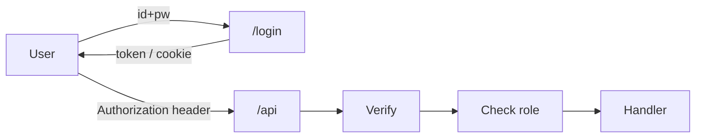

# 인증과 권한

> Backend Development 101 시리즈 (6/10)


## 이 글에서 다룰 문제

인증 코드는 잘못 작성했을 때 피해가 가장 큰 영역 중 하나입니다. 평문 비밀번호를 저장한 한 줄, 토큰 검증을 빠뜨린 한 줄이 몇 년 뒤 큰 사고로 돌아올 수 있습니다.

> 인증 코드는 가능하면 짧고, 검증된 표준 위에서 작성하는 편이 안전합니다.

## 전체 흐름


인증은 "너 누구야?"를 묻고, 권한은 "그 행동을 해도 되나?"를 판단합니다.

## Before/After

**Before (평문 비밀번호 저장)**

```python
def register(name, password):
    db.execute("INSERT INTO users(name, pw) VALUES(?, ?)", (name, password))
```

**After (해시 + 검증)**

```python
from passlib.hash import bcrypt
def register(name, password):
    pw_hash = bcrypt.hash(password)
    db.execute("INSERT INTO users(name, pw_hash) VALUES(?, ?)", (name, pw_hash))

def verify(name, password):
    row = db.fetchone("SELECT pw_hash FROM users WHERE name=?", (name,))
    return row and bcrypt.verify(password, row["pw_hash"])
```

DB가 유출돼도 비밀번호 원문이 바로 드러나지는 않습니다.

## 인증 흐름 5단계

### 1단계 — 비밀번호 해시

```python
# 1_hash.py
from passlib.hash import bcrypt
hashed = bcrypt.hash("mySecret123")
print(bcrypt.verify("mySecret123", hashed))  # True
```

### 2단계 — JWT 발급

```python
# 2_jwt.py
import jwt, time
SECRET = "change-me"
token = jwt.encode({"sub": "alice", "exp": time.time() + 3600}, SECRET, algorithm="HS256")
print(token)
```

### 3단계 — JWT 검증

```python
# 3_verify.py
import jwt
data = jwt.decode(token, SECRET, algorithms=["HS256"])
print(data["sub"])
```

### 4단계 — 보호된 endpoint

```python
# 4_protected.py
from fastapi import FastAPI, Depends, HTTPException, Header

app = FastAPI()

def current_user(authorization: str = Header(...)):
    try:
        token = authorization.removeprefix("Bearer ")
        data = jwt.decode(token, SECRET, algorithms=["HS256"])
        return data["sub"]
    except Exception:
        raise HTTPException(401)

@app.get("/me")
def me(user: str = Depends(current_user)):
    return {"user": user}
```

### 5단계 — 역할 기반 권한

```python
# 5_role.py
def require_role(role: str):
    def _dep(user: dict = Depends(current_user_with_role)):
        if user["role"] != role:
            raise HTTPException(403)
        return user
    return _dep

@app.delete("/admin/users/{uid}")
def delete_user(uid: int, _: dict = Depends(require_role("admin"))):
    return {"deleted": uid}
```

## 이 코드에서 주목할 점

- 비밀번호는 절대 평문으로 저장하지 않습니다.
- JWT secret은 코드에 직접 넣지 말고 환경 변수나 비밀 저장소로 관리합니다.
- 401(미인증)과 403(권한 부족)은 의미가 다릅니다.

## 자주 하는 실수 5가지

1. **MD5 / SHA-1로 비밀번호를 해시한다.** bcrypt / argon2를 씁니다.
2. **JWT의 `exp`를 두지 않는다.** 토큰이 끝없이 유효해집니다.
3. **JWT를 localStorage에만 저장하고 끝낸다.** XSS에 노출될 수 있으니 httpOnly 쿠키도 함께 검토해야 합니다.
4. **권한 체크를 프론트에서만 한다.** 서버에서 항상 다시 확인해야 합니다.
5. **모든 endpoint를 다 인증으로 막는다.** 공개 endpoint(`/healthz`, `/login`)는 명시적으로 분리해야 합니다.

## 실무에서는 이렇게 쓰입니다

대부분의 SaaS는 bcrypt, JWT, role-based access 조합으로 시작합니다. 규모가 커지면 OAuth2, MFA, permission matrix가 추가되지만 핵심은 같습니다. 인증과 권한을 분리해 둔 코드만 무리 없이 확장됩니다.

## 체크리스트

- [ ] bcrypt로 해시하고 검증할 수 있다.
- [ ] JWT를 발급하고 만료 시간을 설정할 수 있다.
- [ ] FastAPI에서 보호된 endpoint를 만들 수 있다.
- [ ] 401과 403의 차이를 안다.
- [ ] role 기반 권한 검사를 작성할 수 있다.

## 정리 및 다음 단계

인증은 신원을 확인하고, 권한은 허용된 행동 범위를 정합니다. 다음 글에서는 운영에서 문제를 읽어내는 Logging과 Error Handling을 봅니다.

<!-- toc:begin -->
- [백엔드 개발이란 무엇인가?](./01-what-is-backend-development.md)
- [HTTP 서버 만들기](./02-building-an-http-server.md)
- [Routing과 Controller](./03-routing-and-controllers.md)
- [Service Layer](./04-service-layer.md)
- [Database Layer](./05-database-layer.md)
- **인증과 권한 (현재 글)**
- Logging과 Error Handling (예정)
- 백엔드 테스트 (예정)
- 백엔드 배포 (예정)
- 운영 가능한 백엔드 구조 (예정)
<!-- toc:end -->

## 참고 자료

- [OWASP Authentication Cheat Sheet](https://cheatsheetseries.owasp.org/cheatsheets/Authentication_Cheat_Sheet.html)
- [FastAPI Security](https://fastapi.tiangolo.com/tutorial/security/)
- [JWT Introduction](https://jwt.io/introduction)
- [Passlib bcrypt docs](https://passlib.readthedocs.io/en/stable/lib/passlib.hash.bcrypt.html)

Tags: Backend, Auth, Security, JWT, Python
