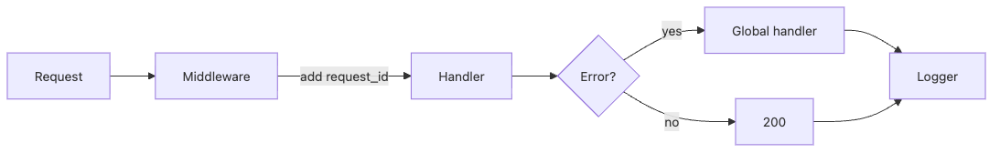

# Logging과 Error Handling

새벽에 장애 알림이 왔을 때 코드를 처음부터 다시 읽는 것만으로는 원인을 빨리 찾기 어렵습니다. 운영에서 중요한 것은 실패를 다시 실행하는 능력보다, 이미 일어난 요청을 로그와 오류 응답만으로 설명하는 능력입니다.

이 글은 Backend Development 101 시리즈의 일곱 번째 글입니다. 여기서는 구조화 로그, request_id, 글로벌 예외 처리라는 세 가지 축을 중심으로 운영에서 읽히는 백엔드를 만드는 방법을 정리해 보겠습니다.

## 이 글에서 다룰 문제

- 왜 `print` 대신 logger를 써야 할까요?
- 구조화 로그는 어떤 모양이어야 운영에서 쓸모가 있을까요?
- 글로벌 예외 처리는 왜 응답 일관성을 지켜 줄까요?
- `request_id`는 어떻게 한 요청을 끝까지 추적하게 해 줄까요?
- 로그 레벨은 어떤 기준으로 나눠야 할까요?

## 왜 중요한가

코드는 한 번 작성하고 수년 동안 운영합니다. 운영의 대부분은 새로운 코드를 쓰는 일이 아니라, 이미 돌아가는 시스템의 상태를 읽는 일입니다. 그때 가장 자주 읽는 것이 로그입니다.

처음부터 구조화 로그를 남겨 두면 장애 대응 시간은 체감상 차원이 다르게 줄어듭니다. 반대로 `print` 조각과 일관성 없는 에러 응답만 쌓이면, 실제 장애보다 로그 해석에 더 많은 시간을 쓰게 됩니다.

> 좋은 운영은 결국 로그를 읽어 원인을 설명할 수 있는 구조에서 시작합니다.

## 한눈에 보는 개념



*request_id middleware와 글로벌 예외 처리가 로그로 모이는 흐름*
정상 경로든 오류 경로든 결국 모두 로그로 모입니다. 운영 가능한 시스템은 이 흐름이 일관되게 설계되어 있습니다.

## 핵심 용어

- **Logger**: 로그 레코드를 내보내는 객체입니다.
- **Log level**: DEBUG / INFO / WARNING / ERROR / CRITICAL 같은 심각도 구분입니다.
- **Structured log**: 보통 JSON처럼 기계가 읽기 쉬운 형식의 로그입니다.
- **request_id**: 하나의 요청을 모든 레이어에서 추적하기 위한 식별자입니다.
- **Global exception handler**: 예외를 응답으로 바꾸는 단일 진입점입니다.

## Before/After

**Before (print debugging)**

```python
print("user=", user_id, "error", e)
```

**After (structured log)**

```python
import logging, json
log = logging.getLogger("app")

log.error(json.dumps({
    "event": "order_failed",
    "user_id": user_id,
    "error": str(e),
}))
```

`event` 같은 필드 하나만 있어도 집계와 검색이 훨씬 쉬워집니다. 운영에서 중요한 것은 사람이 한 줄씩 읽는 편의보다, 시스템이 대량 로그를 묶어 해석할 수 있느냐입니다.

## 실습: 다섯 단계로 보는 로그와 예외 처리

### Step 1 — Standard logger setup

```python
# 1_setup.py
import logging
logging.basicConfig(
    level=logging.INFO,
    format='%(asctime)s %(levelname)s %(name)s %(message)s',
)
log = logging.getLogger("app")
log.info("server started")
```

표준 logger 설정만 잘해도 print보다 훨씬 나은 출발점이 됩니다. 최소한 시간, 레벨, 로거 이름 정도는 항상 남겨야 합니다.

### Step 2 — JSON structured log

```python
# 2_json_log.py
import logging, json, sys
class JsonFmt(logging.Formatter):
    def format(self, r):
        return json.dumps({"level": r.levelname, "msg": r.getMessage()})
h = logging.StreamHandler(sys.stdout)
h.setFormatter(JsonFmt())
logging.basicConfig(handlers=[h], level=logging.INFO)
logging.info("hello")
```

구조화 로그는 한 줄짜리 JSON이어야 검색과 집계가 쉬워집니다. 사람이 보기에 예쁘지 않아도 운영에서는 이 형식이 훨씬 강합니다.

### Step 3 — request_id middleware

```python
# 3_request_id.py
from fastapi import FastAPI, Request
import uuid, logging

app = FastAPI()
log = logging.getLogger("app")

@app.middleware("http")
async def add_request_id(request: Request, call_next):
    rid = str(uuid.uuid4())
    request.state.rid = rid
    response = await call_next(request)
    response.headers["X-Request-ID"] = rid
    log.info(f"req rid={rid} path={request.url.path}")
    return response
```

request_id가 있으면 하나의 요청이 router, service, repository, 외부 API 호출을 어떻게 통과했는지 끝까지 따라갈 수 있습니다. 운영에서는 이 식별자 하나가 디버깅 시간을 크게 줄입니다.

### Step 4 — Global exception handler

```python
# 4_global_handler.py
from fastapi import FastAPI, Request
from fastapi.responses import JSONResponse

app = FastAPI()

class DomainError(Exception):
    def __init__(self, code: str, message: str):
        self.code, self.message = code, message

@app.exception_handler(DomainError)
async def handle_domain(_: Request, exc: DomainError):
    return JSONResponse(
        status_code=400,
        content={"code": exc.code, "message": exc.message},
    )
```

예외를 한곳에서 응답으로 바꾸면 클라이언트가 항상 같은 형태의 오류 응답을 받게 됩니다. 운영자 입장에서도 어떤 종류의 실패인지 더 빠르게 읽을 수 있습니다.

### Step 5 — Picking log levels

```python
# 5_levels.py
log.debug("trace data")
log.info("user logged in")
log.warning("retrying upstream call")
log.error("payment failed")
log.critical("database is down")
```

모든 것을 ERROR로 찍으면 알람은 금방 소음이 됩니다. 레벨은 중요도의 차이를 전달하기 위해 존재합니다.

## 검증 포인트

**Expected output:** 같은 요청에서 남은 로그 라인은 모두 같은 `request_id`를 가져야 하고, `DomainError`는 일관된 JSON 오류 응답으로 바뀌어야 합니다.

### 먼저 확인할 실패 지점

- 로그를 검색하기 어렵다면 한 줄 JSON 형식이 깨졌는지 먼저 봅니다.
- `request_id`가 응답 헤더에 없으면 middleware에서 response에 넣는 부분을 확인합니다.
- stack trace가 전혀 남지 않으면 예외를 잡고 버리고 있지 않은지 점검합니다.

## 이 코드에서 먼저 볼 점

- 로그 한 줄은 한 줄로 끝나야 검색이 잘 됩니다.
- 모든 로그에 request_id가 들어가야 추적이 가능합니다.
- domain error는 안정적인 코드로 비즈니스 의미를 담아야 합니다.

특히 domain error와 infra error를 구분하는 감각이 중요합니다. 비즈니스 규칙 위반과 데이터베이스 장애는 전혀 다른 문제이기 때문입니다.

## 자주 하는 실수 5가지

1. **print 디버깅에 머무는 실수**입니다. 운영 환경에서는 print가 사라지거나 맥락 없이 흩어집니다.
2. **모든 로그를 ERROR로 남기는 실수**입니다. 알람 피로도만 높아지고 진짜 장애를 놓칩니다.
3. **비밀번호나 토큰을 로그에 남기는 실수**입니다. 즉시 보안 사고가 됩니다.
4. **예외를 모두 잡고 무시하는 실수**입니다. 오류가 조용히 사라집니다.
5. **stack trace를 버리고 메시지만 남기는 실수**입니다. 디버깅이 추측 게임이 됩니다.

## 운영에서는 이렇게 드러납니다

운영 로그는 보통 CloudWatch, Loki, Datadog 같은 수집기로 흘러갑니다. 이때 `event=order_failed` 같은 필드는 곧바로 대시보드와 알람의 기준이 됩니다. 구조화 로그를 초기에 도입하면 관측성의 절반은 이미 준비된 셈입니다.

좋은 운영 팀은 코드보다 로그를 먼저 믿습니다. 왜 실패했는지, 어디서 느려졌는지, 어떤 요청이 문제였는지를 로그만으로 상당 부분 답할 수 있어야 하기 때문입니다.

## 시니어 엔지니어는 이렇게 생각합니다

- 로그는 사람이 읽는 메모가 아니라 집계 가능한 데이터입니다.
- request_id는 응답 헤더에도 항상 되돌려줍니다.
- domain error와 infra error를 분리합니다.
- 누군가를 깨우는 로그는 반드시 행동 가능한 정보여야 합니다.
- “왜 실패했는가”를 로그만으로 설명할 수 있어야 합니다.

## 체크리스트

- [ ] 표준 logger를 설정할 수 있습니다.
- [ ] JSON 구조화 로그를 남길 수 있습니다.
- [ ] request_id middleware를 작성할 수 있습니다.
- [ ] 글로벌 예외 처리기를 등록할 수 있습니다.
- [ ] 의도를 가지고 로그 레벨을 고를 수 있습니다.

## 연습 문제

1. 모든 JSON 로그 라인에 request_id가 자동으로 들어가도록 만들어 보세요.
2. `DomainError`와 `InfraError`를 분리해 각각 다르게 처리해 보세요.
3. route에 가짜 예외를 넣고 stack trace가 로그에 남는지 확인해 보세요.

## 정리와 다음 글

좋은 로그와 일관된 예외 처리는 운영의 눈입니다. 다음 글에서는 백엔드를 안전하게 바꿀 수 있게 해 주는 테스트 전략을 살펴보겠습니다.

<!-- toc:begin -->
- [백엔드 개발이란 무엇인가?](./01-what-is-backend-development.md)
- [HTTP 서버 만들기](./02-building-an-http-server.md)
- [Routing과 Controller](./03-routing-and-controllers.md)
- [Service Layer](./04-service-layer.md)
- [Database Layer](./05-database-layer.md)
- [인증과 권한](./06-auth-and-authorization.md)
- **Logging과 Error Handling (현재 글)**
- 백엔드 테스트 (예정)
- 백엔드 배포 (예정)
- 운영 가능한 백엔드 구조 (예정)
<!-- toc:end -->

## 참고 자료

### 공식 문서

- [Python logging HOWTO](https://docs.python.org/3/howto/logging.html)
- [FastAPI exception handlers](https://fastapi.tiangolo.com/tutorial/handling-errors/)
- [Twelve-Factor logs](https://12factor.net/logs)

### 추가 읽을거리

- [structlog docs](https://www.structlog.org/en/stable/)

Tags: Backend, Logging, Observability, Python, ErrorHandling
