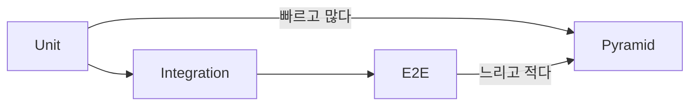

# 백엔드 테스트

> Backend Development 101 시리즈 (8/10)

<!-- a-grade-intro:begin -->

**핵심 질문**: "테스트를 짤 시간이 없다"는 말이 *왜* 결국 가장 큰 시간 낭비가 되나요?

> 테스트가 없으면 모든 변경이 *도박* 이 됩니다. 작은 단위 테스트 한 줄이 *수백 시간의 디버깅* 을 막아줍니다.

<!-- a-grade-intro:end -->

## 이 글에서 배울 것

- 단위 / 통합 / E2E 테스트의 차이
- pytest로 service를 테스트하는 법
- FastAPI `TestClient` 로 endpoint 테스트
- DB를 *진짜* 안 띄우고 테스트하는 방법
- 픽스처와 mocking의 사용 시점

## 왜 중요한가

테스트 없는 코드는 *읽을 수는 있어도 바꿀 수 없습니다.* 좋은 백엔드의 표지는 *얼마나 안전하게 바꿀 수 있는가* 이며, 그 안전을 만들어주는 것이 자동화된 테스트입니다.

> 테스트는 *코드의 보험* 입니다 — 평소엔 보이지 않지만, 사고 때 차이가 납니다.

## 개념 한눈에 보기



테스트 피라미드 — *아래는 많이* , *위는 적게*.

## 핵심 용어 정리

- **Unit test**: 함수 / 클래스 *한 단위* 만 검증.
- **Integration test**: 여러 모듈이 *함께* 동작하는지 검증.
- **E2E test**: 실제 사용자처럼 *전체 시스템* 호출.
- **Fixture**: 테스트 준비 코드 — 한 번 짜고 *재사용*.
- **Mock**: 외부 의존성을 *가짜로 대체*.

## Before/After

**Before (수동 확인)**

```python
# 매번 브라우저에서 직접 눌러본다
```

**After (자동 검증)**

```python
def test_create_user(client):
    r = client.post("/users", json={"name": "Alice"})
    assert r.status_code == 200
    assert r.json()["name"] == "Alice"
```

배포 전 *모든 케이스* 가 자동으로 검증됩니다.

## 실습: 테스트 5단계

### 1단계 — pytest 첫 테스트

```python
# tests/test_basic.py
def add(a, b): return a + b

def test_add():
    assert add(2, 3) == 5
```

```bash
pytest -q
```

### 2단계 — Service 단위 테스트 (mock 사용)

```python
# tests/test_user_service.py
from unittest.mock import MagicMock
from services.user_service import UserService

def test_register():
    repo = MagicMock()
    repo.insert.return_value = {"id": 1, "name": "A"}
    svc = UserService(repo)
    result = svc.register("A")
    repo.insert.assert_called_once()
    assert result["id"] == 1
```

### 3단계 — FastAPI TestClient

```python
# tests/test_api.py
from fastapi.testclient import TestClient
from main import app

client = TestClient(app)

def test_health():
    assert client.get("/health").status_code == 200
```

### 4단계 — Fixture로 in-memory DB

```python
# tests/conftest.py
import pytest
from sqlalchemy import create_engine
from db import Base

@pytest.fixture
def engine():
    e = create_engine("sqlite:///:memory:")
    Base.metadata.create_all(e)
    return e
```

### 5단계 — 의존성 오버라이드

```python
# tests/test_with_db.py
def test_create_user(client, engine):
    app.dependency_overrides[get_engine] = lambda: engine
    r = client.post("/users", json={"name": "Bob"})
    assert r.status_code == 200
```

FastAPI는 `dependency_overrides` 로 *진짜 DB 없이* 테스트할 수 있습니다.

## 이 코드에서 주목할 점

- 단위 테스트는 *외부* 를 mock으로 끊습니다.
- 통합 테스트는 *real session* 으로 묶습니다.
- 픽스처는 *동일한 준비* 를 반복하지 않게 만듭니다.

## 자주 하는 실수 5가지

1. **모든 테스트를 E2E로 한다.** 느려서 *아무도 안 돌립니다.*
2. **테스트 안에서 `time.sleep` 으로 기다린다.** 불안정해집니다 — 폴링이나 mock으로 대체합니다.
3. **DB를 공유 상태로 둔다.** 테스트 간섭 — *항상* 격리합니다.
4. **mock으로 너무 많은 것을 가짜로 만든다.** *진짜 동작* 을 검증하지 못합니다.
5. **assert 없이 호출만 한다.** 그건 *실행* 일 뿐 *검증* 이 아닙니다.

## 실무에서는 이렇게 쓰입니다

CI(GitHub Actions 등)는 PR마다 `pytest` 를 자동 실행합니다. 단위 테스트는 *수초* , 통합은 *수십 초* , E2E는 *수분* — 이 시간 분포가 깨지면 개발 속도가 멈춥니다. 시니어는 *피라미드* 모양을 의식해 테스트 비율을 조정합니다.

## 시니어 엔지니어는 이렇게 생각합니다

- 새 기능은 *테스트와 함께* 들어온다.
- 버그를 고치기 전에 *그 버그를 재현하는 테스트* 를 먼저 쓴다.
- 테스트 이름이 *문장* 이 되도록 짓는다 (`test_user_with_zero_age_returns_422`).
- mock은 *외부 경계* 에서만 쓴다.
- 커버리지 숫자보다 *위험 영역* 우선.

## 체크리스트

- [ ] pytest로 첫 테스트를 실행할 수 있다.
- [ ] mock을 써서 service를 단위 테스트할 수 있다.
- [ ] TestClient로 endpoint를 호출할 수 있다.
- [ ] in-memory DB 픽스처를 만들 수 있다.
- [ ] dependency_overrides를 활용할 수 있다.

## 연습 문제

1. `OrderService.create` 를 mock repository로 단위 테스트하세요.
2. `POST /login` 에 잘못된 비밀번호를 보내 401이 떨어지는지 검증하세요.
3. 같은 endpoint를 in-memory DB와 함께 통합 테스트로도 작성하세요.

## 정리 및 다음 단계

테스트는 *변경의 안전망* 입니다. 다음 글에서는 그 코드를 외부 사용자에게 도달시키는 *백엔드 배포* 를 봅니다.

<!-- toc:begin -->
- [백엔드 개발이란 무엇인가?](./01-what-is-backend-development.md)
- [HTTP 서버 만들기](./02-building-an-http-server.md)
- [Routing과 Controller](./03-routing-and-controllers.md)
- [Service Layer](./04-service-layer.md)
- [Database Layer](./05-database-layer.md)
- [인증과 권한](./06-auth-and-authorization.md)
- [Logging과 Error Handling](./07-logging-and-error-handling.md)
- **백엔드 테스트 (현재 글)**
- 백엔드 배포 (예정)
- 운영 가능한 백엔드 구조 (예정)
<!-- toc:end -->

## 참고 자료

- [pytest documentation](https://docs.pytest.org/en/stable/)
- [FastAPI testing](https://fastapi.tiangolo.com/tutorial/testing/)
- [Testing pyramid (Martin Fowler)](https://martinfowler.com/articles/practical-test-pyramid.html)
- [unittest.mock](https://docs.python.org/3/library/unittest.mock.html)

Tags: Backend, Testing, Pytest, Python, QualityAssurance
