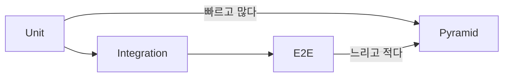

# 백엔드 테스트

> Backend Development 101 시리즈 (8/10)

단위, 통합, E2E 테스트를 나눠 보고 pytest와 TestClient로 안전한 변경 환경을 만드는 방법을 다룹니다.

이 글은 Backend Development 101 시리즈의 8번째 글입니다.

## 이 글에서 다룰 문제

테스트 없는 코드는 읽을 수는 있어도 자신 있게 바꾸기 어렵습니다. 좋은 백엔드는 얼마나 안전하게 변경할 수 있는지가 중요하고, 그 안전을 만들어 주는 것이 자동화된 테스트입니다.

> 테스트는 평소에는 조용하지만 문제가 생겼을 때 차이를 만드는 안전장치입니다.

## 전체 흐름


테스트 피라미드는 아래를 두껍게, 위를 얇게 가져가는 구조입니다.

## Before/After

**Before (수동 확인)**

```python
# 매번 브라우저에서 직접 눌러 확인한다
```

**After (자동 검증)**

```python
def test_create_user(client):
    r = client.post("/users", json={"name": "Alice"})
    assert r.status_code == 200
    assert r.json()["name"] == "Alice"
```

배포 전에 주요 케이스를 자동으로 검증할 수 있습니다.

## 테스트 5단계

### 1단계 — pytest 첫 테스트

```python
# 파일: tests/test_basic.py
def add(a, b): return a + b

def test_add():
    assert add(2, 3) == 5
```

```bash
pytest -q
```

### 2단계 — Service 단위 테스트 (mock 사용)

```python
# 파일: tests/test_user_service.py
from unittest.mock import MagicMock
from services.user_service import UserService

def test_register():
    repo = MagicMock()
    repo.insert.return_value = {"id": 1, "name": "A"}
    svc = UserService(repo)
    result = svc.register("A")
    repo.insert.assert_called_once()
    assert result["id"] == 1
```

### 3단계 — FastAPI TestClient

```python
# 파일: tests/test_api.py
from fastapi.testclient import TestClient
from main import app

client = TestClient(app)

def test_health():
    assert client.get("/health").status_code == 200
```

### 4단계 — Fixture로 인메모리 DB

```python
# 파일: tests/conftest.py
import pytest
from sqlalchemy import create_engine
from db import Base

@pytest.fixture
def engine():
    e = create_engine("sqlite:///:memory:")
    Base.metadata.create_all(e)
    return e
```

### 5단계 — 의존성 오버라이드

```python
# 파일: tests/test_with_db.py
def test_create_user(client, engine):
    app.dependency_overrides[get_engine] = lambda: engine
    r = client.post("/users", json={"name": "Bob"})
    assert r.status_code == 200
```

FastAPI는 `dependency_overrides`로 실제 DB 없이 테스트할 수 있습니다.

## 이 코드에서 주목할 점

- 단위 테스트는 외부 의존성을 mock으로 끊습니다.
- 통합 테스트는 실제 session을 엮어 흐름을 확인합니다.
- 픽스처는 같은 준비 코드를 반복하지 않게 도와줍니다.

## 자주 하는 실수 5가지

1. **모든 테스트를 E2E로 한다.** 너무 느려져서 아무도 자주 돌리지 않게 됩니다.
2. **테스트 안에서 `time.sleep` 으로 기다린다.** 불안정해집니다 — 폴링이나 mock으로 대체합니다.
3. **DB를 공유 상태로 둔다.** 테스트가 서로 간섭하므로 항상 격리해야 합니다.
4. **mock으로 너무 많은 것을 가짜로 만든다.** 실제 동작을 검증하지 못하게 됩니다.
5. **assert 없이 호출만 한다.** 그것은 실행일 뿐 검증이 아닙니다.

## 실무에서는 이렇게 쓰입니다

CI(GitHub Actions 등)는 PR마다 `pytest`를 자동 실행합니다. 단위 테스트는 수초, 통합 테스트는 수십 초, E2E는 수분 안쪽에 들어오도록 관리하는 경우가 많습니다. 이 시간 분포가 무너지면 개발 속도도 함께 느려집니다. 시니어는 테스트 피라미드 비율을 의식하면서 범위를 조정합니다.

## 체크리스트

- [ ] pytest로 첫 테스트를 실행할 수 있다.
- [ ] mock을 써서 service를 단위 테스트할 수 있다.
- [ ] TestClient로 endpoint를 호출할 수 있다.
- [ ] in-memory DB 픽스처를 만들 수 있다.
- [ ] dependency_overrides를 활용할 수 있다.

## 정리 및 다음 단계

테스트는 변경의 안전망입니다. 다음 글에서는 그 코드를 실제 사용자에게 전달하는 백엔드 배포를 봅니다.

<!-- toc:begin -->
- [백엔드 개발이란 무엇인가?](./01-what-is-backend-development.md)
- [HTTP 서버 만들기](./02-building-an-http-server.md)
- [Routing과 Controller](./03-routing-and-controllers.md)
- [Service Layer](./04-service-layer.md)
- [Database Layer](./05-database-layer.md)
- [인증과 권한](./06-auth-and-authorization.md)
- [Logging과 Error Handling](./07-logging-and-error-handling.md)
- **백엔드 테스트 (현재 글)**
- 백엔드 배포 (예정)
- 운영 가능한 백엔드 구조 (예정)
<!-- toc:end -->

## 참고 자료

- [pytest documentation](https://docs.pytest.org/en/stable/)
- [FastAPI testing](https://fastapi.tiangolo.com/tutorial/testing/)
- [Testing pyramid (Martin Fowler)](https://martinfowler.com/articles/practical-test-pyramid.html)
- [unittest.mock](https://docs.python.org/3/library/unittest.mock.html)

Tags: Backend, Testing, Pytest, Python, QualityAssurance
