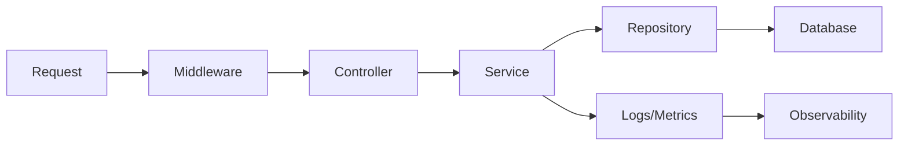

# 운영 가능한 백엔드 구조

> Backend Development 101 시리즈 (10/10)


## 이 글에서 다룰 문제

좋은 구조는 새로 합류한 동료가 30분 안에 어디에 무엇이 있는지 파악하게 만듭니다. 반대로 나쁜 구조는 몇 달 뒤의 자기 자신도 길을 잃게 만듭니다. 구조는 결국 미래의 자신과 팀을 위한 투자입니다.

> 운영 가능한 코드는 읽기 쉬운 코드에서 출발합니다.

## 전체 흐름


각 화살표가 실제 디렉터리 경계와 맞아떨어질수록 구조를 이해하기 쉬워집니다.

## Before/After

**Before (한 파일에 다 있음)**

```text
app.py   # 라우팅 + 비즈니스 + DB + 인증 + 로깅이 모두 한곳
```

**After (layer가 디렉터리로 보임)**

```text
src/
├── api/            # routers, middleware
├── services/       # 비즈니스 규칙
├── repositories/   # DB 접근
├── db/             # 모델, 마이그레이션
├── auth/           # 인증/인가
├── observability/  # 로깅, 메트릭, 트레이싱
├── config/         # 환경별 설정
└── main.py         # 조립만 담당
tests/
deploy/
```

## 운영 가능한 구조 5단계

### 1단계 — 디렉터리 구조

```bash
mkdir -p src/{api,services,repositories,db,auth,observability,config}
mkdir -p tests deploy
touch src/main.py
```

### 2단계 — 설정 레이어링

```python
# 파일: src/config/settings.py
import os
from pydantic_settings import BaseSettings

class Settings(BaseSettings):
    env: str = "dev"
    db_url: str
    jwt_secret: str
    log_level: str = "INFO"

    class Config:
        env_file = ".env"

settings = Settings()
```

운영에서는 `.env` 대신 secret manager가 환경 변수를 주입하는 경우가 많습니다.

### 3단계 — main.py는 조립만 맡기기

```python
# 파일: src/main.py
from fastapi import FastAPI
from src.api import users, orders
from src.observability import setup_logging, setup_metrics

def create_app() -> FastAPI:
    app = FastAPI()
    setup_logging()
    setup_metrics(app)
    app.include_router(users.router)
    app.include_router(orders.router)
    return app

app = create_app()
```

비즈니스 로직은 넣지 않는 편이 좋습니다.

### 4단계 — 관측 한 페이지

```python
# 파일: src/observability/__init__.py
import logging, time
from prometheus_client import Counter, Histogram

REQUESTS = Counter("http_requests_total", "Total requests", ["route", "status"])
LATENCY = Histogram("http_request_seconds", "Latency", ["route"])

def setup_logging():
    logging.basicConfig(level="INFO", format="%(asctime)s %(levelname)s %(message)s")

def setup_metrics(app):
    @app.middleware("http")
    async def observe(request, call_next):
        start = time.time()
        response = await call_next(request)
        LATENCY.labels(request.url.path).observe(time.time() - start)
        REQUESTS.labels(request.url.path, response.status_code).inc()
        return response
```

### 5단계 — SLO와 baseline

```text
- 가용성: 99.9% (월 43분 다운타임 허용)
- p95 latency: 300ms 이하
- error rate: 0.1% 이하
- 1 인스턴스 = 200 RPS 처리 (capacity baseline)
```

이 기준을 문서로 적어 두면 알람과 capacity plan을 세우기 쉬워집니다.

## 이 코드에서 주목할 점

- `main.py`가 얇을수록 테스트와 부팅 흐름을 이해하기 쉽습니다.
- 설정은 코드보다 환경에서 관리하는 편이 안전합니다.
- 관측은 처음부터 넣어야 나중에 빠르게 디버깅할 수 있습니다.

## 자주 하는 실수 5가지

1. **layer 경계를 코드 리뷰에서 지키지 않는다.** 한 PR에서 router에 SQL이 조금 들어가면 다음 PR에서는 그 경계가 더 쉽게 무너집니다.
2. **설정을 코드에 hardcode한다.** 환경별 동작이 달라질 때 재현하기 어려운 버그가 생깁니다.
3. **관측을 나중에 추가하기로 미룬다.** 사고가 난 뒤에는 넣을 시간도, 여유도 부족합니다.
4. **SLO를 수치로 적지 않는다.** "빠르게 만들자"는 운영 목표가 아닙니다.
5. **`main.py`에 비즈니스 로직을 넣는다.** 테스트가 전체 앱 부팅에 묶이게 됩니다.

## 실무에서는 이렇게 쓰입니다

대부분의 회사는 layer 디렉터리, config 레이어링, observability 세 요소를 표준 템플릿으로 잡아 둡니다. 새 서비스를 만들 때는 그 틀을 복제해서 시작합니다. 시니어 엔지니어의 중요한 일 가운데 하나가 바로 이 템플릿을 계속 다듬는 것입니다.

## 체크리스트

- [ ] 9개 layer가 디렉터리 구조에서 바로 보인다.
- [ ] `main.py`는 조립만 한다.
- [ ] 환경별 설정이 분리되어 있다.
- [ ] secret이 코드에 들어가 있지 않다.
- [ ] 로그/메트릭이 처음부터 켜져 있다.
- [ ] SLO가 문서로 적혀 있다.

## 정리 및 다음 단계

운영 가능한 백엔드는 구조에서 시작합니다. 9개 layer를 디렉터리로 분리하고 설정과 관측을 처음부터 넣어 두면, 몇 달 뒤에도 같은 코드를 훨씬 편하게 다시 다룰 수 있습니다.

다음 학습으로 권하는 시리즈:

- Testing 101 — 테스트 전략을 체계적으로 설계하기
- DevOps 101 — CI/CD 자동화 흐름 익히기
- Observability 101 — 로그, 메트릭, 트레이스를 함께 읽기

여기까지 읽으셨다면 작은 백엔드를 운영 가능한 구조로 만드는 기본기를 이미 잡은 것입니다. 이런 감각은 어떤 팀에 가더라도 오래 쓰이는 핵심 역량입니다.

<!-- toc:begin -->
- [백엔드 개발이란 무엇인가?](./01-what-is-backend-development.md)
- [HTTP 서버 만들기](./02-building-an-http-server.md)
- [Routing과 Controller](./03-routing-and-controllers.md)
- [Service Layer](./04-service-layer.md)
- [Database Layer](./05-database-layer.md)
- [인증과 권한](./06-auth-and-authorization.md)
- [Logging과 Error Handling](./07-logging-and-error-handling.md)
- [백엔드 테스트](./08-testing-the-backend.md)
- [백엔드 배포](./09-deploying-the-backend.md)
- **운영 가능한 백엔드 구조 (현재 글)**
<!-- toc:end -->

## 참고 자료

- [Twelve-Factor App](https://12factor.net/)
- [Google SRE Book](https://sre.google/books/)
- [FastAPI Project structure](https://fastapi.tiangolo.com/tutorial/bigger-applications/)
- [Prometheus Python client](https://github.com/prometheus/client_python)

Tags: Backend, Architecture, BestPractices, Python, Production
