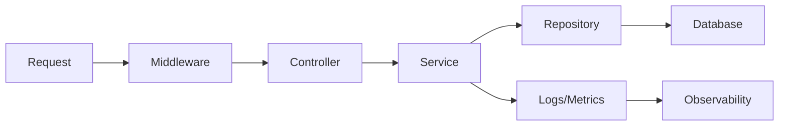

# 운영 가능한 백엔드 구조

> Backend Development 101 시리즈 (10/10)


## 이 글에서 다룰 문제

좋은 구조는 *새로 합류한 동료가 30분 안에 어디에 무엇이 있는지 이해* 하게 만듭니다. 나쁜 구조는 *3개월 차 본인조차* 자기 코드를 못 찾게 만듭니다. 구조는 미래의 자신을 위한 가장 큰 선물입니다.

> 운영 가능한 코드는 *읽기 쉬운* 코드입니다.

## 개념 한눈에 보기



각 화살표는 *디렉터리 경계* 와 일치해야 합니다.

## Before/After

**Before (한 파일에 다 있음)**

```text
app.py   # 라우팅 + 비즈니스 + DB + 인증 + 로깅이 모두 한곳
```

**After (layer가 디렉터리로 보임)**

```text
src/
├── api/            # routers, middleware
├── services/       # 비즈니스 규칙
├── repositories/   # DB 접근
├── db/             # 모델, 마이그레이션
├── auth/           # 인증/인가
├── observability/  # 로깅, 메트릭, 트레이싱
├── config/         # 환경별 설정
└── main.py         # 조립만 담당
tests/
deploy/
```

## 실습: 운영 가능한 구조 5단계

### 1단계 — 디렉터리 구조

```bash
mkdir -p src/{api,services,repositories,db,auth,observability,config}
mkdir -p tests deploy
touch src/main.py
```

### 2단계 — 설정 layering

```python
# src/config/settings.py
import os
from pydantic_settings import BaseSettings

class Settings(BaseSettings):
    env: str = "dev"
    db_url: str
    jwt_secret: str
    log_level: str = "INFO"

    class Config:
        env_file = ".env"

settings = Settings()
```

운영에서는 `.env` 대신 *secret manager* 가 환경 변수를 주입합니다.

### 3단계 — main.py는 *조립만*

```python
# src/main.py
from fastapi import FastAPI
from src.api import users, orders
from src.observability import setup_logging, setup_metrics

def create_app() -> FastAPI:
    app = FastAPI()
    setup_logging()
    setup_metrics(app)
    app.include_router(users.router)
    app.include_router(orders.router)
    return app

app = create_app()
```

비즈니스 로직은 *한 줄도* 들어가지 않습니다.

### 4단계 — 관측 한 페이지

```python
# src/observability/__init__.py
import logging, time
from prometheus_client import Counter, Histogram

REQUESTS = Counter("http_requests_total", "Total requests", ["route", "status"])
LATENCY = Histogram("http_request_seconds", "Latency", ["route"])

def setup_logging():
    logging.basicConfig(level="INFO", format="%(asctime)s %(levelname)s %(message)s")

def setup_metrics(app):
    @app.middleware("http")
    async def observe(request, call_next):
        start = time.time()
        response = await call_next(request)
        LATENCY.labels(request.url.path).observe(time.time() - start)
        REQUESTS.labels(request.url.path, response.status_code).inc()
        return response
```

### 5단계 — SLO와 baseline

```text
- 가용성: 99.9% (월 43분 다운타임 허용)
- p95 latency: 300ms 이하
- error rate: 0.1% 이하
- 1 인스턴스 = 200 RPS 처리 (capacity baseline)
```

문서로 *적어두면* 알람과 capacity plan이 자동으로 따라옵니다.

## 이 코드에서 주목할 점

- `main.py`가 *얇을수록* 테스트가 쉬워집니다.
- 설정은 *코드가 아닌 환경* 으로 관리합니다.
- 관측은 *처음부터* 들어가야 나중에 빠르게 디버깅됩니다.

## 자주 하는 실수 5가지

1. **layer 경계를 코드 리뷰에서 지키지 않는다.** 한 PR에서 router에 SQL이 *살짝* 들어가면 다음 PR에서는 *당연해집니다*.
2. **설정을 코드에 hardcode한다.** 환경별 동작이 갈리면 *재현 불가능* 한 버그가 생깁니다.
3. **관측을 *나중에* 추가하기로 미룬다.** 사고가 나야 추가하게 되고, 사고 중에는 추가할 시간이 없습니다.
4. **SLO를 *수치로* 적지 않는다.** "빠르게 만들자"는 *목표가 아닙니다*.
5. **`main.py`에 비즈니스 로직을 넣는다.** 테스트가 *전체 앱 부팅* 을 요구하게 됩니다.

## 실무에서는 이렇게 쓰입니다

대부분의 회사는 *layer 디렉터리 + config layering + observability 3대 요소* 를 표준 템플릿으로 가지고 있습니다. 새 서비스를 만들 때는 이 템플릿을 *복제* 해서 시작합니다. 시니어 엔지니어의 큰 일 중 하나는 *이 템플릿을 유지보수* 하는 것입니다.

## 체크리스트

- [ ] 9개 layer가 디렉터리로 *보인다.*
- [ ] `main.py`는 *조립만* 한다.
- [ ] 환경별 설정이 분리되어 있다.
- [ ] secret이 코드에 들어가 있지 않다.
- [ ] 로그/메트릭이 처음부터 켜져 있다.
- [ ] SLO가 문서로 적혀 있다.

## 정리 및 다음 단계

운영 가능한 백엔드는 *구조에서 시작* 됩니다. 9개 layer를 디렉터리로 분리하고, 설정과 관측을 처음부터 넣으면 6개월 뒤의 자신이 *그 코드를 즐겁게* 다시 만질 수 있습니다.

다음 학습으로 권하는 시리즈:

- *Testing 101* — 테스트 전략을 *공장 라인* 처럼 설계하기
- *DevOps 101* — CI/CD를 자동화 vault로 만들기
- *Observability 101* — 로그/메트릭/트레이스를 한 그래프에 붙이기

여기까지 함께해주신 것을 진심으로 감사드립니다. *작은 백엔드를 운영 가능하게 만드는 능력* 은 어떤 회사에서도 통용되는 *핵심 기술* 입니다.

<!-- toc:begin -->
- [백엔드 개발이란 무엇인가?](./01-what-is-backend-development.md)
- [HTTP 서버 만들기](./02-building-an-http-server.md)
- [Routing과 Controller](./03-routing-and-controllers.md)
- [Service Layer](./04-service-layer.md)
- [Database Layer](./05-database-layer.md)
- [인증과 권한](./06-auth-and-authorization.md)
- [Logging과 Error Handling](./07-logging-and-error-handling.md)
- [백엔드 테스트](./08-testing-the-backend.md)
- [백엔드 배포](./09-deploying-the-backend.md)
- **운영 가능한 백엔드 구조 (현재 글)**
<!-- toc:end -->

## 참고 자료

- [Twelve-Factor App](https://12factor.net/)
- [Google SRE Book](https://sre.google/books/)
- [FastAPI Project structure](https://fastapi.tiangolo.com/tutorial/bigger-applications/)
- [Prometheus Python client](https://github.com/prometheus/client_python)

Tags: Backend, Architecture, BestPractices, Python, Production
