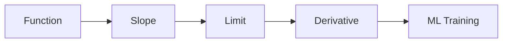

# What Is a Derivative

> Calculus for ML 101 series (1/10)

<!-- a-grade-intro:begin -->

**Core question**: When we say an ML model *learns*, what *exactly* is happening through *calculus*?

> A *derivative* is a *rate of change*, and *training* uses derivatives of *loss* to pick a *direction*.

This is post 1 in the Calculus for ML 101 series.

<!-- a-grade-intro:end -->

## What You Will Learn

- The *intuition* behind a derivative
- *Rate of change* and the *tangent line*
- The role of *limits*
- *Numerical differentiation*
- The *link to ML*

## Why It Matters

*Gradient descent*, *backprop*, and *learning rate* are all defined on top of derivatives.

## Concept at a Glance



## Key Terms

- **derivative**: *instantaneous rate of change*.
- **slope**: *rise over run* between two points.
- **limit**: the value being *approached*.
- **tangent**: a line touching at *one point*.
- **numerical**: an *approximate* computation.

## Before/After

**Before**: it is unclear *why* the loss goes down.

**After**: the *slope of the loss* tells you the *direction*.

## Hands-on: Mini Derivative Kit

### Step 1 — Define a Function

```python
def f(x):
    return x ** 2
```

### Step 2 — Average Rate

```python
def avg_rate(f, a, b):
    return (f(b) - f(a)) / (b - a)
```

### Step 3 — Numerical Derivative

```python
def deriv(f, x, h=1e-5):
    return (f(x + h) - f(x - h)) / (2 * h)
```

### Step 4 — Tangent Slope

```python
slope = deriv(f, 2.0)  # about 4.0
```

### Step 5 — Loss Intuition

```python
def loss(w):
    return (w - 3) ** 2

g = deriv(loss, 0.0)   # negative -> increase w to reduce loss
```

## What to Notice in This Code

- The numerical derivative uses a *centered difference*.
- The *tangent slope* equals the *derivative*.
- The *sign of the loss gradient* gives the *direction*.

## Five Common Mistakes

1. **Picking *h* so tiny that *floating point* breaks.**
2. **Mixing up *average rate* and *instantaneous rate*.**
3. **Confusing the *derivative* with the *function value*.**
4. **Ignoring the *sign* and only watching *magnitude*.**
5. **Assuming a *limit* exists at a *discontinuity*.**

## How This Shows Up in Production

Updating *model weights* using the *loss gradient* is the *core loop* of every ML training process.

## How a Senior Engineer Thinks

- A derivative is a *direction*.
- A gradient is a *training signal*.
- Numerical derivatives are for *debugging*.
- Analytical derivatives are for *production*.
- *Intuition* about limits is enough.

## Checklist

- [ ] State the *function*.
- [ ] Compute the *gradient*.
- [ ] Interpret the *sign*.
- [ ] Inspect *numerical stability*.

## Practice Problems

1. Define a *derivative* in one line.
2. Define *average rate of change* in one line.
3. Explain what the *loss gradient* means in one line.

## Wrap-up and Next Steps

Next post: *Functions and Slope*.

<!-- toc:begin -->
- **What Is a Derivative (current)**
- Functions and Slope (upcoming)
- Partial Derivatives (upcoming)
- Gradient (upcoming)
- Chain Rule (upcoming)
- Loss Function (upcoming)
- Gradient Descent (upcoming)
- Optimization (upcoming)
- Backpropagation Intuition (upcoming)
- Calculus in Deep Learning (upcoming)
<!-- toc:end -->

## References

- [Calculus - Khan Academy](https://www.khanacademy.org/math/calculus-1)
- [Essence of Calculus - 3Blue1Brown](https://www.3blue1brown.com/topics/calculus)
- [Deep Learning Book - Numerical Computation](https://www.deeplearningbook.org/contents/numerical.html)
- [NumPy Numerical Differentiation](https://numpy.org/doc/stable/reference/generated/numpy.gradient.html)

Tags: Calculus, ML, Derivative, Math, Beginner
