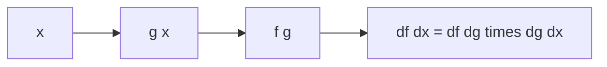

# Chain Rule

> Calculus for ML 101 series (5/10)

<!-- a-grade-intro:begin -->

**Core question**: When a function is *inside another*, how do we *propagate* the gradient?

> The *chain rule* is *outer derivative times inner derivative*, and it is the *math foundation of backprop*.

This is post 5 in the Calculus for ML 101 series.

<!-- a-grade-intro:end -->

## What You Will Learn

- *Function composition*
- The *chain rule formula*
- *Outer / inner* intuition
- *Gradient products*
- The link to *backpropagation*

## Why It Matters

A *neural network* is a *long composition* of functions, and only the chain rule computes the full gradient *efficiently*.

## Concept at a Glance



## Key Terms

- **composition**: a *function of a function*.
- **outer**: the *outer* function.
- **inner**: the *inner* function.
- **chain**: connection by *multiplication*.
- **propagation**: passing *gradients along*.

## Before/After

**Before**: differentiating composites is hard.

**After**: differentiate each stage and *multiply*.

## Hands-on: Mini Chain Rule Kit

### Step 1 — Composition

```python
def g(x):
    return 2 * x + 1

def f(u):
    return u ** 2

def h(x):
    return f(g(x))
```

### Step 2 — Inner and Outer Derivatives

```python
def dg(x):
    return 2.0

def df(u):
    return 2 * u
```

### Step 3 — Chain Rule

```python
def dh(x):
    return df(g(x)) * dg(x)
```

### Step 4 — Numerical Check

```python
def deriv(f, x, h=1e-5):
    return (f(x + h) - f(x - h)) / (2 * h)

assert abs(dh(1.0) - deriv(h, 1.0)) < 1e-3
```

### Step 5 — Multi-Stage Composition

```python
def chain(*derivs):
    p = 1.0
    for d in derivs:
        p *= d
    return p
```

## What to Notice in This Code

- The chain rule is *one product*.
- Validate via *numerical derivative*.
- *Multi-stage* uses the same rule.

## Five Common Mistakes

1. **Reversing the *order*.**
2. **Evaluating the *inner* derivative at *raw x*.**
3. **Forgetting that one *zero gradient* zeroes the chain.**
4. **Forgetting it becomes *matrix multiplication* in many dims.**
5. **Dropping a *sign*.**

## How This Shows Up in Production

*Backpropagation* applies the chain rule *backward* to compute every weight's gradient in a single pass.

## How a Senior Engineer Thinks

- The chain rule is the *essence of backprop*.
- *Order* is *fixed*.
- Watch out for *zero-gradient* stages.
- Use *numerical checks* for *debugging*.
- Generalize via *matrix multiplication*.

## Checklist

- [ ] Mark the *composition order*.
- [ ] Differentiate *each stage*.
- [ ] *Numerically verify*.
- [ ] Inspect *zero-gradient* paths.

## Practice Problems

1. State the *chain rule* in one line.
2. State the meaning of *outer/inner* in one line.
3. State the risk of a *zero-gradient* stage in one line.

## Wrap-up and Next Steps

Next post: *Loss Function*.

<!-- toc:begin -->
- [What Is a Derivative](./01-what-is-derivative.md)
- [Functions and Slope](./02-functions-and-slope.md)
- [Partial Derivatives](./03-partial-derivatives.md)
- [Gradient](./04-gradient.md)
- **Chain Rule (current)**
- Loss Function (upcoming)
- Gradient Descent (upcoming)
- Optimization (upcoming)
- Backpropagation Intuition (upcoming)
- Calculus in Deep Learning (upcoming)
<!-- toc:end -->

## References

- [Chain Rule - Khan Academy](https://www.khanacademy.org/math/ap-calculus-ab/ab-differentiation-2-new/ab-3-1a/v/chain-rule-introduction)
- [Backpropagation - CS231n](https://cs231n.github.io/optimization-2/)
- [Deep Learning Book - Backprop](https://www.deeplearningbook.org/contents/mlp.html)
- [Automatic Differentiation - Baydin et al.](https://arxiv.org/abs/1502.05767)

Tags: Calculus, ML, ChainRule, Backprop, Beginner
