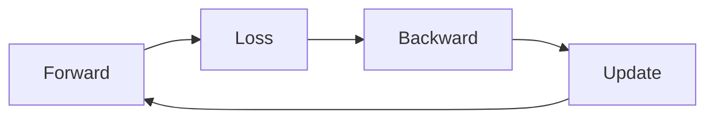

# Calculus in Deep Learning

> Calculus for ML 101 series (10/10)

<!-- a-grade-intro:begin -->

**Core question**: How does the *calculus* from this series come together in the *deep learning training loop*?

> *Networks*, *losses*, *backprop*, and *optimizers* all run on calculus inside *one cycle*.

This is post 10 in the Calculus for ML 101 series.

<!-- a-grade-intro:end -->

## What You Will Learn

- The *5 stages* of the training loop
- *Forward pass*
- *Loss computation*
- *Backward pass*
- *Weight update*

## Why It Matters

This *capstone* synthesizes the series and lets you implement the *common skeleton* shared by every ML training run.

## Concept at a Glance



## Key Terms

- **forward**: produce a *prediction*.
- **loss**: measure the *error*.
- **backward**: compute *gradients*.
- **update**: adjust *weights*.
- **epoch**: *one full pass* over the data.

## Before/After

**Before**: use the framework as a *black box*.

**After**: know *why* each stage of the loop exists.

## Hands-on: Mini Training Loop

### Step 1 — Model

```python
import math

def model(x, w, b):
    return sigmoid(w * x + b)

def sigmoid(z):
    return 1 / (1 + math.exp(-z))
```

### Step 2 — Loss (BCE)

```python
def bce(y, p, eps=1e-7):
    return -(y * math.log(p + eps) + (1 - y) * math.log(1 - p + eps))
```

### Step 3 — Analytical Gradients

```python
def grads(x, y, w, b):
    p = model(x, w, b)
    err = p - y
    return err * x, err
```

### Step 4 — One Update Step

```python
def step(x, y, w, b, lr=0.1):
    dw, db = grads(x, y, w, b)
    return w - lr * dw, b - lr * db
```

### Step 5 — Training Loop

```python
def train(data, epochs=100, lr=0.1):
    w, b = 0.0, 0.0
    for _ in range(epochs):
        for x, y in data:
            w, b = step(x, y, w, b, lr)
    return w, b
```

## What to Notice in This Code

- The *forward pass* yields a *prediction*.
- The *loss* gives a *direction*.
- *Backprop* allocates *responsibility*.
- The *optimizer* applies the *update*.
- *Iteration* is *learning*.

## Five Common Mistakes

1. **Skipping *learning rate* tuning.**
2. **Forgetting *zero_grad*.**
3. **Computing gradients during *evaluation*.**
4. **Mixing *eval/train* modes (Dropout, BN).**
5. **Forgetting to *seed* for reproducibility.**

## How This Shows Up in Production

*Image classification*, *language models*, *recommenders*, and *RL* all share the *same skeleton*.

## How a Senior Engineer Thinks

- The training loop fits in *5 lines*.
- *Frameworks* are convenience; *principles* are essence.
- *Monitoring* is *debugging*.
- *Reproducibility* is *productivity*.
- *Numerical stability* is the last line of defense.

## Checklist

- [ ] *Forward* pass correct.
- [ ] *Loss* appropriate.
- [ ] *zero_grad* called.
- [ ] One *backward* pass.
- [ ] *Optimizer* update applied.

## Practice Problems

1. State the *5 stages* of the training loop in one line each.
2. State where *zero_grad* belongs in one line.
3. State the meaning of *eval mode* in one line.

## Wrap-up and Next Steps

This post wraps the *Calculus for ML 101* series. *Calculus* is the *mathematical essence* of what we mean by *deep learning learns*.

<!-- toc:begin -->
- [What Is a Derivative](./01-what-is-derivative.md)
- [Functions and Slope](./02-functions-and-slope.md)
- [Partial Derivatives](./03-partial-derivatives.md)
- [Gradient](./04-gradient.md)
- [Chain Rule](./05-chain-rule.md)
- [Loss Function](./06-loss-function.md)
- [Gradient Descent](./07-gradient-descent.md)
- [Optimization](./08-optimization.md)
- [Backpropagation Intuition](./09-backpropagation-intuition.md)
- **Calculus in Deep Learning (current)**
<!-- toc:end -->

## References

- [Deep Learning Book - Goodfellow et al.](https://www.deeplearningbook.org/)
- [PyTorch Tutorials](https://pytorch.org/tutorials/)
- [CS231n - Convolutional Neural Networks](https://cs231n.stanford.edu/)
- [Reproducibility - PyTorch](https://pytorch.org/docs/stable/notes/randomness.html)

Tags: Calculus, ML, DeepLearning, Capstone, Beginner
