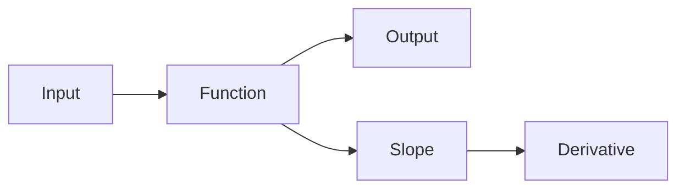

# 함수와 기울기

> Calculus for ML 101 시리즈 (2/10)


## 이 글에서 다룰 문제

ML 모델은 여러 함수를 이어 붙인 구조로 볼 수 있고, 학습은 그 안에서 각 함수의 기울기가 어떻게 바뀌는지 따라가는 과정입니다.

## 전체 흐름


## Before/After

**Before**: 함수를 식 하나로만 봅니다.

**After**: 함수를 그래프와 기울기까지 함께 봅니다.

## 미니 함수 키트

### 1단계 — 일차함수

```python
def linear(x, a=2, b=1):
    return a * x + b
```

### 2단계 — 일차함수 기울기

```python
def linear_slope(a):
    return a
```

### 3단계 — 비선형 함수

```python
def relu(x):
    return max(0.0, x)
```

### 4단계 — ReLU 국소 기울기

```python
def relu_grad(x):
    return 1.0 if x > 0 else 0.0
```

### 5단계 — 시그모이드

```python
import math

def sigmoid(x):
    return 1 / (1 + math.exp(-x))
```

## 이 코드에서 주목할 점

- 일차함수의 기울기는 항상 상수입니다.
- ReLU의 기울기는 입력 구간에 따라 0 또는 1이 됩니다.
- 시그모이드는 계단 함수처럼 갑자기 꺾이지 않고 부드럽게 변합니다.

## 자주 하는 실수 5가지

1. 일차함수와 비선형 함수를 같은 감각으로 이해합니다.
2. ReLU가 0에서 미분 불가능하다는 점을 대수롭지 않게 넘깁니다.
3. 시그모이드의 포화 구간에서 기울기가 매우 작아진다는 점을 놓칩니다.
4. 활성화 함수에서 기울기가 0이면 학습 신호가 끊길 수 있다는 점을 무시합니다.
5. 스케일이 다른 입력을 그대로 비교해 그래프 해석을 왜곡합니다.

## 실무에서는 이렇게 쓰입니다

활성화 함수를 고르거나, 그래프 모양을 해석하거나, 그래디언트 소실을 진단할 때도 출발점은 함수와 기울기에 대한 감각입니다.

## 체크리스트

- [ ] 함수를 직접 그려 봤습니다.
- [ ] 기울기 분포가 어떻게 생기는지 확인했습니다.
- [ ] 포화 구간이 어디서 나타나는지 점검했습니다.
- [ ] 입력 스케일을 맞춘 뒤 다시 비교했습니다.

## 정리 및 다음 단계

함수는 입력을 출력으로 바꾸는 규칙이고, 기울기는 그 출력이 얼마나 빠르게 변하는지를 보여 주는 값입니다. ML에서는 이 기울기 정보가 학습 신호의 기본 재료가 됩니다. 다음 글에서는 입력 변수가 여러 개일 때 기울기를 어떻게 다뤄야 하는지 보기 위해 편미분으로 넘어가겠습니다.

<!-- toc:begin -->
- [미분이란 무엇인가](./01-what-is-derivative.md)
- **함수와 기울기 (현재 글)**
- 편미분 (예정)
- Gradient (예정)
- 연쇄 법칙 (예정)
- 손실 함수 (예정)
- 경사하강법 (예정)
- 최적화 (예정)
- 역전파 직관 (예정)
- 딥러닝에서의 미분 (예정)
<!-- toc:end -->

## 참고 자료

- [Functions - Khan Academy](https://www.khanacademy.org/math/algebra/x2f8bb11595b61c86:functions)
- [Activation Functions - Stanford CS231n](https://cs231n.github.io/neural-networks-1/)
- [Deep Learning Book - MLP](https://www.deeplearningbook.org/contents/mlp.html)
- [PyTorch Activations](https://pytorch.org/docs/stable/nn.html#non-linear-activations-weighted-sum-nonlinearity)

Tags: Calculus, ML, Functions, Slope, Beginner
