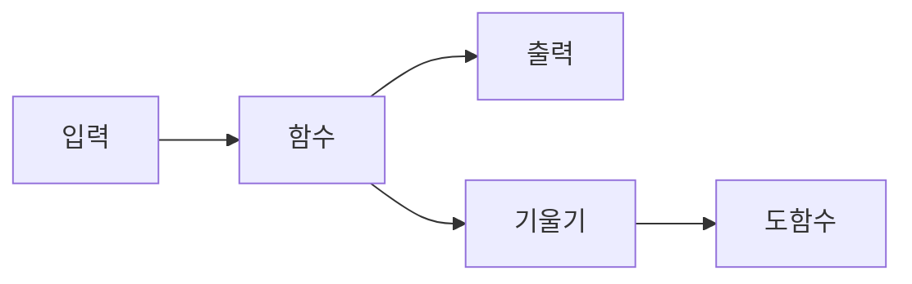

# 함수와 기울기

머신러닝 모델은 본질적으로 입력을 출력으로 보내는 함수들의 조합입니다. 선형층도 함수이고, 활성화 함수도 함수이며, 마지막 예측값도 결국 여러 함수를 거쳐 나온 결과입니다. 그래서 모델 학습을 이해하려면 먼저 함수가 무엇을 하는지, 그리고 그 함수의 기울기가 왜 중요한지 분명히 알아야 합니다.

기울기는 직선에서만 등장하는 개념처럼 보이지만, 실제로는 비선형 함수에서도 각 지점마다 국소적으로 정의됩니다. 이때 기울기는 함수의 모양을 읽는 언어가 됩니다. 어디서 빠르게 증가하는지, 어디서 평평해지는지, 어디서 gradient가 사라질 위험이 있는지가 모두 기울기로 드러납니다.

이 글은 Calculus for ML 101 시리즈의 두 번째 글입니다.

이 글에서는 함수를 단순한 식이 아니라 입력-출력 계약과 그래프의 모양을 함께 가진 대상으로 보고, 선형 함수와 비선형 함수의 기울기 차이가 ML에서 왜 중요한지 설명하겠습니다.

끝까지 읽고 나면 함수의 그래프를 보는 것만으로도 학습이 쉬운 구간과 어려운 구간을 어느 정도 짐작할 수 있게 됩니다.

## 이 글에서 다룰 문제

- 함수는 왜 단순한 수식이 아니라 입력과 출력의 계약으로 이해해야 할까요?
- 선형 함수의 기울기와 비선형 함수의 국소 기울기는 어떻게 다를까요?
- ReLU와 sigmoid의 기울기 차이는 학습 과정에 어떤 영향을 줄까요?
- 도함수의 그래프 의미를 이해하면 activation 설계가 왜 쉬워질까요?
- 입력 스케일과 함수의 모양은 gradient 해석에 어떤 영향을 줄까요?

## 왜 이 글이 중요한가

신경망은 함수 합성입니다. 선형 변환이 입력을 새로운 표현으로 바꾸고, 비선형 활성화 함수가 표현력을 추가하며, 마지막 출력 함수가 예측값을 만듭니다. 이 모든 단계에서 학습이 일어나려면 각 함수가 기울기를 통해 자신의 변화 가능성을 뒤로 전달해야 합니다.

실무에서 activation을 선택하거나, vanishing gradient를 진단하거나, 입력 정규화의 필요성을 설명할 때 결국 다시 함수와 기울기로 돌아오게 됩니다. 예를 들어 sigmoid가 포화 구간에서 왜 학습을 느리게 만드는지, ReLU가 왜 실용적이지만 0 근처에서 미분 가능성 이슈를 갖는지 모두 함수의 모양과 기울기를 보면 설명됩니다.

즉, 함수와 기울기를 이해하는 일은 미분의 기초 복습이 아니라 모델 구성 요소를 읽는 능력을 키우는 일입니다. 이 관점이 있어야 이후 편미분과 gradient를 벡터 수준으로 확장할 때도 개념이 흔들리지 않습니다.

## 함수와 기울기를 이해하는 가장 좋은 방법: 식보다 그래프와 국소 반응을 함께 보는 것입니다

함수를 가장 잘 이해하는 방법은 식만 보지 않고 그래프를 함께 보는 것입니다. 식은 계산 규칙을 알려 주고, 그래프는 입력이 변할 때 출력이 어떤 모양으로 반응하는지 보여 줍니다. 기울기는 이 둘 사이를 연결하는 다리입니다.

선형 함수에서는 기울기가 항상 일정하므로 해석이 단순합니다. 반대로 비선형 함수는 지점마다 기울기가 달라지므로, 모델이 어느 구간에서 쉽게 학습하고 어느 구간에서 신호를 잃는지가 함수의 모양에 직접 드러납니다. ML에서 activation을 선택할 때 함수 그래프를 반드시 함께 봐야 하는 이유입니다.

> 함수는 입력을 출력으로 보내는 계약이고, 기울기는 그 계약이 현재 지점에서 얼마나 민감하게 반응하는지 보여 주는 운영 지표입니다.

## 핵심 개념

함수와 기울기의 관계를 한 화면에 놓으면 아래처럼 정리할 수 있습니다.



### 함수는 입력을 출력으로 보내는 계약입니다

함수는 어떤 입력이 들어오면 어떤 출력이 나오는지를 일관되게 정의합니다. 이 단순한 정의가 ML에서 중요한 이유는 모델 전체가 결국 작은 함수들의 조합이기 때문입니다. 각 함수는 자기 입력 범위에서 어떤 응답을 보이는지, 그리고 그 응답이 얼마나 민감한지 기울기로 드러냅니다.

### 선형 함수에서는 기울기가 상수입니다

```python
def linear(x, a=2, b=1):
    return a * x + b
```

선형 함수는 입력이 일정하게 늘면 출력도 일정한 비율로 늘어납니다. 그래서 그래프는 직선이고, 기울기는 어느 지점에서나 동일합니다. 모델 관점에서는 해석이 쉽지만 표현력은 제한적입니다.

```python
def linear_slope(a):
    return a
```

기울기가 상수라는 사실은 선형 함수의 장점이자 한계입니다. 계산과 해석은 단순하지만, 복잡한 패턴을 표현하려면 비선형성이 반드시 추가되어야 합니다.

### 비선형 함수는 위치에 따라 다른 기울기를 가집니다

```python
def relu(x):
    return max(0.0, x)
```

ReLU는 음수 구간을 0으로 자르고 양수 구간을 그대로 통과시킵니다. 함수 형태가 단순해서 널리 쓰이지만, 이 단순함이 곧 기울기 구조를 결정합니다.

```python
def relu_grad(x):
    return 1.0 if x > 0 else 0.0
```

ReLU의 핵심은 gradient가 0 아니면 1이라는 점입니다. 양수 구간에서는 신호가 잘 흐르지만, 음수 구간에서는 gradient가 0이어서 업데이트 신호가 끊길 수 있습니다. “dying ReLU” 같은 문제가 왜 생기는지 여기서 출발합니다.

### sigmoid는 매끄럽지만 포화 구간이 있습니다

```python
import math

def sigmoid(x):
    return 1 / (1 + math.exp(-x))
```

sigmoid는 0과 1 사이로 값을 압축하는 부드러운 함수입니다. 출력 해석은 직관적이지만, 입력 절댓값이 커질수록 곡선이 평평해지는 포화 구간이 생깁니다. 이 구간에서는 기울기가 작아져 학습 신호가 약해집니다.

그래서 함수의 “좋아 보이는 모양”만 보면 안 됩니다. 실무에서는 출력 범위, 미분 가능성, 포화 구간, 계산 안정성을 함께 봅니다. 함수의 기울기 분포를 보지 않고 activation을 고르면 학습 성능을 설명하기 어려워집니다.

### 도함수의 그래프 의미를 읽어야 합니다

선형 함수의 도함수는 상수이고, ReLU의 도함수는 0 또는 1이며, sigmoid의 도함수는 가운데에서 크고 양끝에서 작습니다. 이 도함수의 모양은 곧 “어디서 학습이 잘 되는가”를 말해 줍니다. 입력 스케일 정렬과 정규화가 중요한 이유도, 모델을 더 많은 유효 기울기 구간에 머무르게 하기 위해서입니다.

## 흔히 헷갈리는 지점

- 함수의 식만 이해하고 그래프를 보지 않으면 기울기와 포화 구간을 놓치기 쉽습니다.
- ReLU가 단순하다고 해서 항상 문제없다고 보면 안 됩니다. $x=0$에서 미분 가능성 이슈가 있고, 음수 구간에서는 gradient가 0입니다.
- sigmoid가 매끄럽다는 이유만으로 학습에 항상 유리한 것은 아닙니다. 포화 구간에서는 gradient가 매우 작아집니다.
- 서로 다른 입력 스케일을 그대로 비교하면 함수의 민감도를 잘못 해석할 수 있습니다.
- 선형 기울기와 비선형의 국소 기울기를 같은 방식으로 생각하면 activation이 왜 필요한지 설명이 약해집니다.

## 운영 체크리스트

- [ ] 모델의 주요 activation 함수 그래프와 기울기 특성을 함께 설명할 수 있다
- [ ] ReLU의 0 구간과 sigmoid의 포화 구간이 학습에 주는 영향을 구분한다
- [ ] 입력 스케일 정렬이 기울기 해석과 연결된다는 점을 기억한다
- [ ] 함수값뿐 아니라 도함수의 모양까지 함께 본다
- [ ] vanishing gradient 의심 시 활성화 함수의 국소 기울기부터 점검한다

## 정리

함수는 입력을 출력으로 보내는 계약이고, 기울기는 그 계약이 현재 지점에서 얼마나 민감하게 반응하는지 보여 줍니다. 선형 함수는 일정한 기울기를 가지지만, 비선형 함수는 위치마다 다른 기울기를 가지므로 학습 난이도와 신호 흐름이 달라집니다.

ML에서는 이 차이가 매우 실용적입니다. activation 함수 하나를 고르는 일도 결국 함수의 모양과 gradient 흐름을 고르는 일입니다. ReLU, sigmoid, tanh 같은 함수가 왜 각기 다른 장단점을 갖는지 이해하려면 출력 범위보다 먼저 기울기 구조를 봐야 합니다.

다음 글에서는 입력이 하나가 아니라 여러 개인 함수로 시야를 넓히겠습니다. 그러면 기울기를 변수별로 나눠 읽는 편미분 개념이 왜 필요한지 자연스럽게 드러납니다.

<!-- toc:begin -->
## 시리즈 목차

- [미분이란 무엇인가](./01-what-is-derivative.md)
- **함수와 기울기 (현재 글)**
- 편미분 (예정)
- Gradient (예정)
- 연쇄 법칙 (예정)
- 손실 함수 (예정)
- 경사하강법 (예정)
- 최적화 (예정)
- 역전파 직관 (예정)
- 딥러닝에서의 미분 (예정)

<!-- toc:end -->

## 참고 자료

### 공식 문서
- [Functions - Khan Academy](https://www.khanacademy.org/math/algebra/x2f8bb11595b61c86:functions)
- [Activation Functions - Stanford CS231n](https://cs231n.github.io/neural-networks-1/)
- [Deep Learning Book - MLP](https://www.deeplearningbook.org/contents/mlp.html)
- [PyTorch Activations](https://pytorch.org/docs/stable/nn.html#non-linear-activations-weighted-sum-nonlinearity)

### 관련 시리즈
- [Linear Algebra 101](../../linear-algebra-101/ko/)
- [MLOps 101](../../mlops-101/ko/)

Tags: Calculus, ML, Functions, Slope, Beginner
