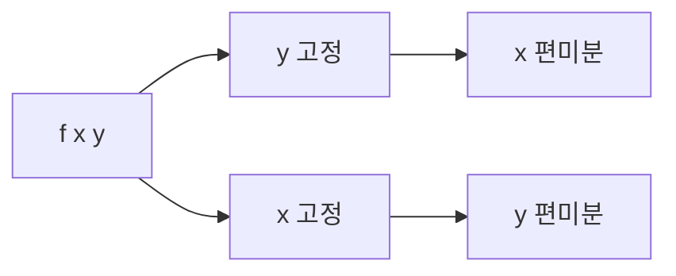

# 편미분

## 이 글에서 다룰 문제

- 입력이 여러 개인 함수에서 변수 하나의 영향만 어떻게 떼어 볼까요?
- "다른 변수는 고정한다"는 말은 정확히 무슨 뜻일까요?
- 편미분은 왜 각 가중치의 책임을 나누는 도구가 될까요?
- gradient 벡터를 만들기 전에 무엇을 먼저 이해해야 할까요?

> 편미분은 여러 입력이 있는 함수에서 하나의 변수만 움직이고 나머지는 그대로 둔 채 변화율을 재는 약속입니다. 역전파는 이 약속을 바탕으로 각 파라미터의 책임을 계산합니다.

> Calculus for ML 101 시리즈 (3/10)

## 이 글에서 배울 것

- 다변수 함수의 기본 형태를 이해합니다.
- 편미분의 정의를 직관적으로 설명할 수 있습니다.
- 고정된 변수의 의미를 놓치지 않고 읽는 법을 익힙니다.
- 머신러닝 가중치와 편미분의 연결을 봅니다.

## 왜 중요한가

머신러닝 모델은 보통 변수 하나가 아니라 수천, 수만 개의 가중치를 가집니다. 이때 "어느 가중치가 손실 증가에 얼마나 기여했는가"를 따로 계산해야 업데이트가 가능합니다. 편미분은 바로 그 질문에 답하는 도구입니다.

## 개념 한눈에 보기



## 핵심 용어

- **다변수 함수**: 입력이 둘 이상인 함수입니다.
- **편미분**: 다른 변수는 고정하고 하나만 바꾸며 본 변화율입니다.
- **단면**: 여러 변수 공간을 한 축만 따라 자른 관점입니다.
- **변수별 기울기**: 각 입력마다 따로 계산한 변화율입니다.
- **가중치**: 학습 과정에서 조정되는 모델 내부 변수입니다.

## Before / After

**Before**: 모든 입력이 한꺼번에 섞여 보여서 원인을 분리하지 못합니다.

**After**: 한 변수씩 떼어 보며 각 입력의 책임을 읽을 수 있습니다.

## 단계별 실습: 미니 편미분 키트

### Step 1 — 다변수 함수

```python
def f(x, y):
    return x ** 2 + 3 * y
```

이 함수는 x와 y 두 입력을 받습니다. x는 제곱으로, y는 선형으로 영향을 줍니다.

### Step 2 — x에 대한 편미분

```python
def partial_x(f, x, y, h=1e-5):
    return (f(x + h, y) - f(x - h, y)) / (2 * h)
```

y는 그대로 두고 x만 좌우로 조금 움직입니다. 편미분의 핵심은 바로 이 고정입니다.

### Step 3 — y에 대한 편미분

```python
def partial_y(f, x, y, h=1e-5):
    return (f(x, y + h) - f(x, y - h)) / (2 * h)
```

이번에는 반대로 x를 고정하고 y만 움직입니다. 같은 함수라도 보는 축이 달라지면 변화율도 달라집니다.

### Step 4 — 두 편미분 한 번에

```python
def partials(f, x, y):
    return partial_x(f, x, y), partial_y(f, x, y)
```

변수별 기울기를 나란히 놓으면 이제 gradient로 갈 준비가 됩니다.

### Step 5 — ML 가중치 직관

```python
def loss(w1, w2):
    return (w1 - 1) ** 2 + (w2 + 2) ** 2

g1, g2 = partials(loss, 0.0, 0.0)  # 각 가중치의 책임
```

각 편미분 값은 손실이 각 가중치에 얼마나 민감한지 보여 줍니다.

## 이 코드에서 주목할 점

- 편미분은 변수 하나만 움직입니다.
- 고정된 변수도 결과에 영향을 주므로 무시하면 안 됩니다.
- 변수별 기울기를 모아야 전체 방향을 볼 수 있습니다.

## 자주 하는 실수 5가지

1. 모든 변수를 동시에 바꿔 놓고 편미분이라고 부릅니다.
2. 변수마다 정의 순서를 다르게 써서 해석을 꼬이게 만듭니다.
3. 고정된 변수의 현재 값을 중요하지 않다고 생각합니다.
4. 편미분과 전미분을 섞어 씁니다.
5. gradient 벡터의 좌표 순서를 가중치 순서와 다르게 둡니다.

## 실무에서는 이렇게 생각합니다

편미분은 책임 분배의 시작점입니다. 모델이 커질수록 "각 파라미터가 손실에 얼마나 기여했는가"를 빨리 계산하는 일이 중요해집니다. 자동 미분 프레임워크는 이 계산을 대신해 주지만, 그 안에서 실제로 벌어지는 일은 결국 변수별 변화율 계산입니다.

## 체크리스트

- [ ] 어떤 변수를 움직이고 어떤 변수를 고정하는지 적었습니다.
- [ ] 변수 순서를 일관되게 유지했습니다.
- [ ] 고정된 변수의 값이 결과에 미치는 영향을 고려했습니다.
- [ ] 변수별 기울기를 벡터로 묶을 준비가 되었습니다.

## 정리 및 다음 글

편미분은 다변수 함수의 복잡함을 한 축씩 나눠 보는 도구입니다. 이 감각이 있어야 여러 편미분을 묶은 gradient를 자연스럽게 이해할 수 있습니다. 다음 글에서는 바로 그 gradient를 벡터 관점에서 보겠습니다.

<!-- toc:begin -->
- [미분이란 무엇인가](./01-what-is-derivative.md)
- [함수와 기울기](./02-functions-and-slope.md)
- **편미분 (현재 글)**
- Gradient (예정)
- 연쇄 법칙 (예정)
- 손실 함수 (예정)
- 경사하강법 (예정)
- 최적화 (예정)
- 역전파 직관 (예정)
- 딥러닝에서의 미분 (예정)
<!-- toc:end -->

## 참고 자료

- [Partial Derivatives - Khan Academy](https://www.khanacademy.org/math/multivariable-calculus/multivariable-derivatives)
- [Multivariable Calculus - MIT OCW](https://ocw.mit.edu/courses/18-02-multivariable-calculus-fall-2007/)
- [Deep Learning Book - Chapter 4](https://www.deeplearningbook.org/contents/numerical.html)
- [JAX Automatic Differentiation](https://jax.readthedocs.io/en/latest/notebooks/autodiff_cookbook.html)

Tags: Calculus, ML, PartialDerivative, MultiVariable, Beginner
